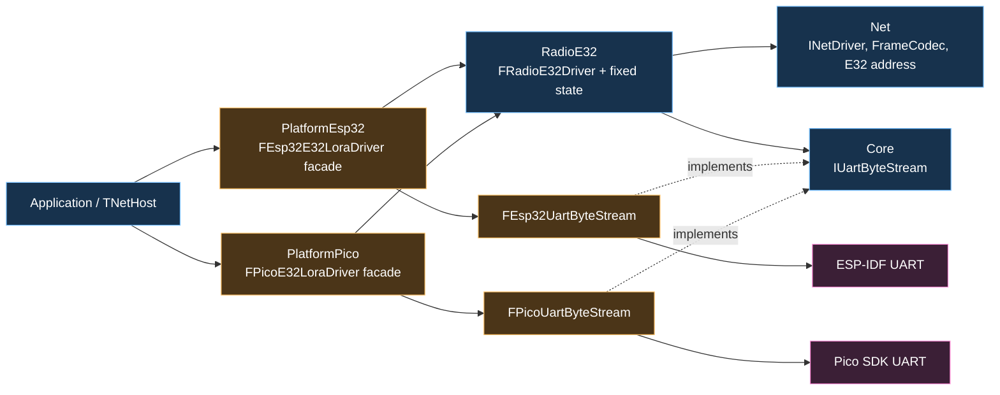
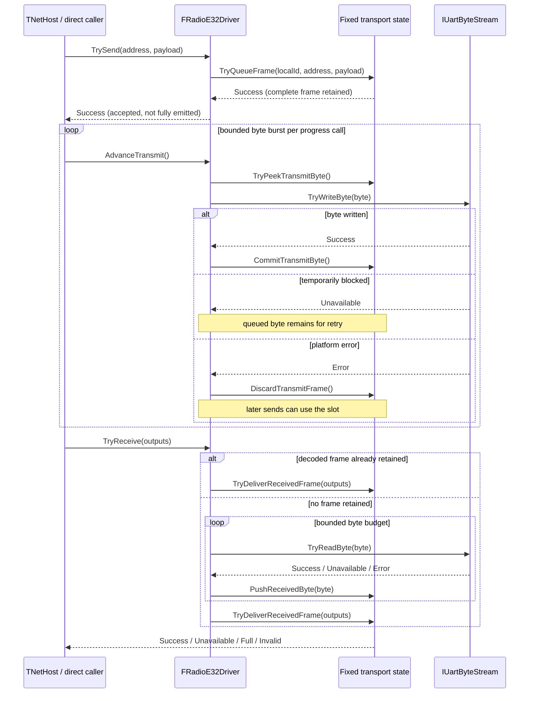

# RadioE32 Optional Package and UART Byte-Stream Boundary

## Metadata

- **Type:** Redesign / refactor
- **Priority:** High
- **Estimated effort:** Large (multi-day)
- **Risk:** Medium-high; public facades stay compatible, but ESP32 transmit progress changes
- **Concept:** [`.claude/concepts/e32-optional-transport-package.md`](../concepts/e32-optional-transport-package.md)
- **Implementation status:** Completed 2026-07-28 with the owner-approved
  constrained hardware closure documented in Tasks 11.24–11.25
- **Approval status:** Approved 2026-07-28

## 0. TL;DR

Move the duplicated, SDK-free E32 framing and queueing behavior out of
`PlatformEsp32` and `PlatformPico` into an optional `Modules/RadioE32` package.
Add one deliberately small `IUartByteStream` interface to `Core`; ESP-IDF and
Pico SDK modules implement it and retain all UART configuration, ownership, and
lifecycle code. Preserve the existing ESP32 and Pico E32 public driver names and
include paths as compatibility facades.

The resulting dependency direction is:

```text
Core <- Net <- RadioE32 <- PlatformPico
  ^                  ^
  |                  |
  +---- PlatformEsp32 facade (only when its E32 header is consumed)
```

## 1. Objective

### 1.1 Problem

MicroWorld currently implements the same E32 transport policy twice:

- `FEsp32E32LoraDriver` owns validation, frame encoding, receive decoding, and
  bounded pumping in `PlatformEsp32`.
- `FPicoE32LoraDriver` delegates most of the same policy to
  `Detail::FE32LoraTransportState` in `PlatformPico`.

The SDK calls differ, but the E32 protocol behavior does not. Keeping that
behavior in both platform packages makes fixes and contract changes easy to
apply unevenly.

### 1.2 Desired outcomes

- One portable `FRadioE32Driver` owns E32 validation, framing, transmit
  backpressure, receive pumping, and retained-frame delivery.
- `IUartByteStream` exposes only non-blocking byte transfer; it does not become a
  universal hardware abstraction layer.
- ESP-IDF and Pico SDK UART lifecycle and pin/baud configuration remain at their
  platform edges.
- Existing `FEsp32E32LoraDriver` and `FPicoE32LoraDriver` source APIs remain
  available at their current include paths.
- Applications that do not use E32 do not need to add `RadioE32`.
- Host tests exercise the shared public driver contract once, with small
  platform-specific lifecycle tests left at each platform edge.

### 1.3 Non-goals

- Runtime plugin loading, reflection, device discovery, or a registry.
- A broad UART API for baud, pins, buffering, DMA, interrupts, flow control, or
  open/close policy.
- Moving `Net/E32Lora.h`; its address encoding is part of the `FNetAddress`
  contract and moving it would create a `Net`/`RadioE32` dependency cycle.
- Refactoring `FEsp32UartDriver`, wired UART framing, or other UART devices in
  this change.
- Adding E32 configuration-mode support for M0/M1/AUX pins.
- Renaming released CMake targets, PlatformIO package identities, public driver
  classes, or existing public include paths.

## 2. Existing Context and Impact Radius

### 2.1 Current ownership

| Concern | Current owner | Planned owner |
| --- | --- | --- |
| `INetDriver`, frame codec, E32 address shape | `Net` | Unchanged |
| E32 fixed transmit slot and retained receive frame | `PlatformPico` | `RadioE32` |
| ESP32 E32 validation/codec/pump policy | `PlatformEsp32` | `RadioE32` |
| ESP-IDF UART install/configure/read/write/delete | `PlatformEsp32` | Unchanged platform package |
| Pico UART validation/configure/read/write/deinit | `PlatformPico` | Unchanged platform package |
| Cross-platform UART byte seam | None | `Core` |

### 2.2 Consumers verified

| Consumer | Current use | Required change |
| --- | --- | --- |
| `examples/17-TwoBoardLora` | Calls ESP32 E32 driver directly | Add `RadioE32`; call `AdvanceTransmit()` every loop |
| `examples/26-MessagingOverLora` | Uses E32 through `TNetHost` | Add `RadioE32`; behavior stays automatic |
| ESP32 platform compile probe | Includes the E32 facade | Add `RadioE32` only to that profile |
| Pico LoRa interop image | Uses `FPicoE32LoraDriver` | Rebuild; public call sites stay unchanged |
| `TNetHost` / `TNetManager` | Calls `AdvanceTransmit()` after send draining | No code change |
| Non-LoRa ESP32 examples | Use other `PlatformEsp32` features | No `RadioE32` dependency |

### 2.3 Contract change requiring care

`FEsp32E32LoraDriver::TrySend(Success)` currently means ESP-IDF accepted the
whole encoded frame in one write. After convergence, it will mean the driver
accepted the complete frame into its fixed slot; `AdvanceTransmit()` performs
bounded byte progress. This already matches `INetDriver`, `TNetHost`, and the
Pico driver, but direct ESP32 callers must advance the driver.

No other repository consumer directly drives the ESP32 E32 facade.

### 2.4 Repository constraints

- C++17, no RTTI, no exceptions, strict warnings.
- Fixed-capacity storage; no steady-state heap allocation.
- Caller outputs remain unchanged on every non-`Success` receive result.
- One pending transmit frame and one retained decoded receive frame.
- Each `AdvanceTransmit()` attempts at most one encoded frame's fixed byte
  capacity and stops earlier on backpressure or error.
- Each `TryReceive()` reads at most
  `2 * (E32MaxPayloadBytes + FrameOverheadBytes)` bytes.
- Hardware headers remain confined to platform source/private implementation
  files.
- Every new maintained directory receives an `AGENTS.md`.

## 3. Options Considered

| Option | Benefits | Costs / reason rejected |
| --- | --- | --- |
| **A. `Core::IUartByteStream` + optional `RadioE32`** | Removes duplicated policy, allows host tests, keeps SDK code at edges, immediately serves both platforms | Adds one narrow interface and one package |
| B. Put `IUartByteStream` in `Net` | Fewer new conceptual locations | Makes a networking package own generic device I/O and prevents reuse by non-network UART devices |
| C. Add `RadioE32` but keep separate platform callbacks | Avoids a Core interface | Recreates nearly identical callback/platform interfaces per device and does not establish a reusable byte seam |
| D. Add a general `Hardware` or `HAL` module | Central place for future device APIs | Speculative, much wider than the proven E32 need, and conflicts with YAGNI |
| E. Leave both drivers platform-specific | No migration risk | Preserves the current duplication and divergent ESP32/Pico send semantics |

## 4. Selected Design

Select Option A.

The abstraction is justified by an immediate use, not only future extension:
the same portable E32 driver must operate over two SDK UART implementations.
The interface stays byte-oriented because that is the smallest common
non-blocking contract required by the existing Pico behavior and it makes work
per tick explicit.

### 4.1 Core UART contract

Add `Modules/Core/include/MicroWorld/IO/UartByteStream.h`:

```cpp
enum class EUartByteStreamResult : std::uint8_t
{
	Success,
	Unavailable,
	Error
};

class IUartByteStream
{
public:
	virtual ~IUartByteStream() noexcept;

	virtual EUartByteStreamResult TryWriteByte(std::uint8_t InByte) noexcept = 0;
	virtual EUartByteStreamResult TryReadByte(std::uint8_t& OutByte) noexcept = 0;

protected:
	IUartByteStream() noexcept = default;
};
```

Contract details:

- `Unavailable` means no byte can move now and is normal backpressure.
- `Error` means the platform operation failed.
- `TryReadByte` changes `OutByte` only on `Success`.
- The interface does not open, close, configure, flush, allocate, or expose
  buffering capacity.

### 4.2 Portable E32 driver

Add `Modules/RadioE32/include/MicroWorld/RadioE32/RadioE32Driver.h`:

```cpp
class FRadioE32Driver final : public INetDriver
{
public:
	explicit FRadioE32Driver(IUartByteStream& InByteStream) noexcept;

	ENetResult Initialize(std::uint8_t InLocalNodeId) noexcept;
	ENetResult TrySend(
		const FNetAddress& InTo,
		TSpan<const std::uint8_t> InPacket) noexcept override;
	ENetResult TryReceive(
		FNetAddress& OutFrom,
		TSpan<std::uint8_t> InDestination,
		FNetReceiveResult& OutResult) noexcept override;
	std::size_t MaxPacketBytes() const noexcept override;
	void AdvanceTransmit() noexcept override;
	bool IsInitialized() const noexcept;

private:
	IUartByteStream& ByteStream;
	Detail::FE32LoraTransportState TransportState{};
	std::uint8_t LocalNodeIdValue{0};
	bool bInitialized{false};
};
```

Behavior:

- Construction is inert.
- `Initialize()` is single-shot and performs no I/O.
- `TrySend()` validates and atomically queues one encoded frame.
- `AdvanceTransmit()` pumps at most one encoded frame's fixed byte capacity,
  committing each byte only after `Success`. `Unavailable` retains the current
  byte for retry. `Error` aborts the queued frame so one failed SDK operation
  cannot leave every later send permanently `Full`; like other datagram
  transports, acceptance does not guarantee physical delivery.
- `TryReceive()` first delivers an already held frame, then performs a bounded
  byte pump. `Unavailable` ends the pump; `Error` returns `Invalid` without
  changing caller outputs.
- Invalid spans, invalid E32 address shapes, and oversize packets return
  `Invalid`.
- A too-small destination returns `Full` and retains the decoded frame.

### 4.3 Platform adapters and compatibility facades

`PlatformEsp32` adds an unsupported
`Detail::FEsp32UartByteStream`, implemented with ESP-IDF in its source file.
`FEsp32E32LoraDriver` becomes a header-defined facade containing:

```cpp
Detail::FEsp32UartByteStream ByteStream{};
FRadioE32Driver RadioDriver{ByteStream};
```

Keeping this facade header-defined is intentional: PlatformIO will only require
`RadioE32` when a consumer includes the E32 header. Non-LoRa
`PlatformEsp32` builds still compile without the optional package.

`PlatformPico` adds an unsupported `Detail::FPicoUartByteStream`, backed by a renamed generic
`Detail::IPicoUartPlatform`. `FPicoE32LoraDriver` remains a compiled facade
containing:

```cpp
Detail::FPicoUartByteStream ByteStream;
FRadioE32Driver RadioDriver;
```

The old `Detail::IPicoE32LoraPlatform` and
`Detail::FE32LoraTransportState` include paths and
`Detail::GetPicoE32LoraPlatform()` function remain forwarding compatibility
surfaces. PlatformPico is currently an E32-only package, so its CMake target may
publicly link `MicroWorld::RadioE32` without expanding unrelated Pico features.

## 5. Architecture

### 5.1 Component view



### 5.2 Send and receive sequence



### 5.3 UE5 architecture checklist

| Concern | Applies | Decision |
| --- | --- | --- |
| UObject / GC ownership | No | Embedded C++ value/reference ownership only |
| Replication / authority | No | `INetDriver` transport code, not UE replication |
| Game-thread / async lifetime | No | Explicit caller-driven non-blocking progress |
| Blueprint compatibility | No | No UE reflection surface |
| Module dependency direction | Yes | `Core <- Net <- RadioE32 <- platform facades` |
| Serialization compatibility | No | Existing frame wire format stays unchanged |

## 6. Implementation Steps

### Step 1 — Add the Core UART byte seam

**Files**

- Add `Modules/Core/include/MicroWorld/IO/UartByteStream.h`
- Add `Modules/Core/include/MicroWorld/IO/AGENTS.md`
- Add `Modules/Core/src/UartByteStream.cpp`
- Modify `Modules/Core/CMakeLists.txt`

**Structure**

```cpp
// UartByteStream.cpp
IUartByteStream::~IUartByteStream() noexcept = default;
```

Document the output-preservation and backpressure contract in the public
declarations. Add only the destructor translation unit to
`MICROWORLD_CORE_SOURCES`; do not add configuration methods or platform types.

### Step 2 — Scaffold the optional RadioE32 package

**Files**

- Add `Modules/RadioE32/CMakeLists.txt`
- Add `Modules/RadioE32/library.json`
- Add `Modules/RadioE32/README.md`
- Add `Modules/RadioE32/AGENTS.md`
- Add guides under `include/`, `include/MicroWorld/`,
  `include/MicroWorld/RadioE32/`, `include/MicroWorld/RadioE32/Detail/`,
  `src/`, and `tests/`

**Structure**

```cmake
project(MicroWorldRadioE32 VERSION 0.3.0 LANGUAGES CXX)

add_library(microworld_radio_e32 STATIC
    src/E32LoraTransportState.cpp
    src/RadioE32Driver.cpp
)
add_library(MicroWorld::RadioE32 ALIAS microworld_radio_e32)
target_link_libraries(microworld_radio_e32
    PUBLIC MicroWorld::Core MicroWorld::Net
)
```

Mirror the repository's standalone sibling guards, strict warnings, C++17,
no-exception/no-RTTI flags, and test option conventions. The PlatformIO package
is framework/platform-neutral and has no SDK dependency.

### Step 3 — Move the fixed E32 transport state

**Files**

- Add
  `Modules/RadioE32/include/MicroWorld/RadioE32/Detail/E32LoraTransportState.h`
- Add `Modules/RadioE32/src/E32LoraTransportState.cpp`
- Replace
  `Modules/PlatformPico/include/MicroWorld/PlatformPico/Detail/E32LoraTransportState.h`
  with a forwarding include
- Remove `Modules/PlatformPico/src/E32LoraTransportState.cpp`

**Structure**

```cpp
// Compatibility header
#pragma once
#include <MicroWorld/RadioE32/Detail/E32LoraTransportState.h>
```

Keep `MicroWorld::Detail::FE32LoraTransportState` and its behavior unchanged
during the move. Do not combine the move with algorithmic changes.

### Step 4 — Implement the portable public driver

**Files**

- Add
  `Modules/RadioE32/include/MicroWorld/RadioE32/RadioE32Driver.h`
- Add `Modules/RadioE32/src/RadioE32Driver.cpp`
- Modify
  `Modules/RadioE32/include/MicroWorld/RadioE32/Detail/E32LoraTransportState.h`
  and its source to add an explicit transmit-slot discard command

**Structure**

```cpp
void FRadioE32Driver::AdvanceTransmit() noexcept
{
	if (!bInitialized)
	{
		return;
	}

	for (std::size_t Attempt = 0; Attempt < TransmitProgressByteCap; ++Attempt)
	{
		std::uint8_t Byte = 0;
		if (!TransportState.TryPeekTransmitByte(Byte))
		{
			return;
		}

		const EUartByteStreamResult Result = ByteStream.TryWriteByte(Byte);
		if (Result == EUartByteStreamResult::Unavailable)
		{
			return;
		}
		if (Result == EUartByteStreamResult::Error)
		{
			TransportState.DiscardTransmitFrame();
			return;
		}
		TransportState.CommitTransmitByte();
	}
}
```

Use a named receive pump constant derived from `E32MaxPayloadBytes` and
`FrameOverheadBytes`, and derive `TransmitProgressByteCap` from the same fixed
encoded-frame capacity. Preserve transactional outputs and the fixed wire
format.

### Step 5 — Move protocol tests to RadioE32

**Files**

- Add `Modules/RadioE32/tests/RadioE32DriverTests.cpp`
- Modify `Modules/RadioE32/CMakeLists.txt`
- Remove `Modules/PlatformPico/tests/E32LoraTransportStateTests.cpp`

**Structure**

```cpp
class FFakeUartByteStream final : public IUartByteStream
{
public:
	EUartByteStreamResult TryWriteByte(std::uint8_t InByte) noexcept override;
	EUartByteStreamResult TryReadByte(std::uint8_t& OutByte) noexcept override;

	// Fixed arrays and explicit read/write result controls; no heap.
};
```

Test through `FRadioE32Driver`, not its private state. Cover:

- closed and double initialization;
- valid, empty, maximum, malformed, and oversize sends;
- one-frame backpressure and bounded burst progress;
- blocked writes retaining the current byte;
- hard write errors discarding the queued frame so a later send is accepted;
- valid receive and no-data receive;
- null and too-small destinations preserving outputs/held frames;
- corrupt-frame resynchronization;
- bounded receive pumping;
- two portable drivers exchanging an encoded frame.

### Step 6 — Add the ESP-IDF UART byte-stream adapter

**Files**

- Add
  `Modules/PlatformEsp32/include/MicroWorld/PlatformEsp32/Detail/Esp32UartByteStream.h`
- Add `Modules/PlatformEsp32/src/Esp32UartByteStream.cpp`
- Rename `Modules/PlatformEsp32/src/E32UartPlatformImplementation.h` to
  `Modules/PlatformEsp32/src/UartPlatformImplementation.h`
- Modify `Modules/PlatformEsp32/src/Esp32UartDriver.cpp` to use the renamed
  private helper

**Structure**

```cpp
class FEsp32UartByteStream final : public IUartByteStream
{
public:
	bool Open(const FEsp32UartByteStreamConfig& InConfig) noexcept;
	void Close() noexcept;
	bool IsOpen() const noexcept;
	EUartByteStreamResult TryWriteByte(std::uint8_t InByte) noexcept override;
	EUartByteStreamResult TryReadByte(std::uint8_t& OutByte) noexcept override;
};
```

The internal config uses plain integers. ESP-IDF types and functions remain in
the source/private helper. `Open(false)` means configuration or SDK setup
failed; the E32 facade exposes the existing `IsOpen()` contract. Preserve
exclusive UART ownership and 8N1 behavior. Do not publish the concrete stream
as a supported API until another real device requires direct composition.

### Step 7 — Convert the ESP32 E32 driver to an optional facade

**Files**

- Modify
  `Modules/PlatformEsp32/include/MicroWorld/PlatformEsp32/Esp32E32LoraDriver.h`
- Remove `Modules/PlatformEsp32/src/Esp32E32LoraDriver.cpp`
- Modify `Modules/PlatformEsp32/library.json`

**Structure**

```cpp
class FEsp32E32LoraDriver final : public INetDriver
{
public:
	explicit FEsp32E32LoraDriver(
		const FEsp32E32LoraConfig& InConfig) noexcept;

	ENetResult TrySend(...) noexcept override
	{
		return RadioDriver.TrySend(...);
	}

	void AdvanceTransmit() noexcept override
	{
		RadioDriver.AdvanceTransmit();
	}

private:
	Detail::FEsp32UartByteStream ByteStream{};
	FRadioE32Driver RadioDriver{ByteStream};
};
```

Keep the existing class, config, constructor behavior, `TrySend`, `TryReceive`,
`MaxPacketBytes`, and `IsOpen` surface. Update documentation so `Success` means
queued acceptance and explicitly requires progress for direct callers.

### Step 8 — Add the Pico UART byte-stream adapter

**Files**

- Add
  `Modules/PlatformPico/include/MicroWorld/PlatformPico/Detail/PicoUartByteStream.h`
- Add
  `Modules/PlatformPico/include/MicroWorld/PlatformPico/Detail/PicoUartPlatform.h`
- Add `Modules/PlatformPico/src/PicoUartByteStream.cpp`
- Rename/rework `Modules/PlatformPico/src/PicoE32LoraPlatform.cpp` as the generic
  Pico UART backend
- Replace
  `Modules/PlatformPico/include/MicroWorld/PlatformPico/Detail/PicoE32LoraPlatform.h`
  with a compatibility include and alias

**Structure**

```cpp
namespace MicroWorld::Detail
{
using IPicoE32LoraPlatform = IPicoUartPlatform;

inline IPicoE32LoraPlatform& GetPicoE32LoraPlatform() noexcept
{
	return GetPicoUartPlatform();
}
}

class FPicoUartByteStream final : public IUartByteStream
{
public:
	FPicoUartByteStream() noexcept;
	explicit FPicoUartByteStream(Detail::IPicoUartPlatform& InPlatform) noexcept;
	bool Open(const FPicoUartConfig& InConfig) noexcept;
	void Close() noexcept;
	// IUartByteStream implementation...
};
```

Move only generic UART lifecycle and byte operations. Keep SDK headers and
hardware calls in the platform source. Keep the concrete stream under `Detail`
until a second public platform consumer proves that API is needed. Keep a
compile probe for both the legacy type name and
`GetPicoE32LoraPlatform()` forwarding function.

### Step 9 — Convert the Pico E32 driver to a facade

**Files**

- Modify
  `Modules/PlatformPico/include/MicroWorld/PlatformPico/PicoE32LoraDriver.h`
- Modify `Modules/PlatformPico/src/PicoE32LoraDriver.cpp`
- Modify `Modules/PlatformPico/tests/PicoE32LoraDriverTests.cpp`
- Modify `Modules/PlatformPico/CMakeLists.txt`

**Structure**

```cpp
ENetResult FPicoE32LoraDriver::Initialize(
	const FPicoE32LoraConfig& InConfig) noexcept
{
	if (ByteStream.IsOpen())
	{
		return ENetResult::Unavailable;
	}
	if (!ByteStream.Open(ToUartConfig(InConfig)))
	{
		return ENetResult::Invalid;
	}

	const ENetResult DriverResult =
		RadioDriver.Initialize(InConfig.LocalNodeId);
	if (DriverResult != ENetResult::Success)
	{
		ByteStream.Close();
	}
	return DriverResult;
}
```

Preserve both constructors, `Initialize`, destructor ownership, driver methods,
and `IsOpen`. Retain platform tests for invalid UART configuration, exact baud,
double open, close-on-destruction, and delegation; protocol behavior belongs to
RadioE32 tests.

Before either the production facade or its SDK-free tests are declared,
PlatformPico standalone configuration must compose the new sibling explicitly:

```cmake
if(NOT TARGET MicroWorld::RadioE32)
    set(MICROWORLD_RADIO_E32_BUILD_TESTS OFF)
    add_subdirectory(
        "${CMAKE_CURRENT_SOURCE_DIR}/../RadioE32"
        "${CMAKE_CURRENT_BINARY_DIR}/RadioE32"
    )
endif()
```

Link both the production target and facade tests to
`MicroWorld::RadioE32`. This prevents standalone PlatformPico configuration
from depending on the root superbuild's ordering.

### Step 10 — Wire package dependencies and boundary checks

**Files**

- Modify root `CMakeLists.txt`
- Modify `tools/CheckDependencyBoundaries.py`
- Modify checker self-test fixtures in the same file

**Structure**

```cmake
if(NOT TARGET MicroWorld::RadioE32)
    add_subdirectory(Modules/RadioE32)
endif()
```

Place `RadioE32` after `Net` and before the SDK-free `PlatformPico` test
configuration. Add the allowed dependency set:

```python
"RadioE32": {"Core", "Net"},
```

Add self-tests that accept `RadioE32 -> Core/Net` and reject
`RadioE32 -> Platform*`. Platform packages remain intentionally outside this
portable-package checker.

### Step 11 — Update PlatformIO and direct consumers

**Files**

- Modify `examples/17-TwoBoardLora/platformio.ini`
- Modify `examples/17-TwoBoardLora/src/main.cpp`
- Modify `examples/26-MessagingOverLora/platformio.ini`
- Modify `Modules/Core/tests/consumer/platformio.ini`
- Modify `Modules/Core/tests/consumer/src/PlatformEsp32Main.cpp` so the base
  platform probe contains no E32 include
- Add
  `Modules/Core/tests/consumer/src/PlatformEsp32RadioE32Main.cpp`

**Structure**

```ini
symlink://../../Modules/RadioE32
```

Split the consumer configuration into:

- `esp32-s3-platform`, which builds PlatformEsp32 without `RadioE32` and proves
  optionality; and
- `esp32-s3-radio-e32`, which adds `RadioE32`, includes the compatibility
  facade, and calls `AdvanceTransmit()` in a compile-only path.

Add the dependency only to LoRa environments and the radio-specific consumer
profile. In example 17:

```cpp
Driver.AdvanceTransmit();
```

Run it every loop regardless of whether a new packet was accepted. Example 26
needs no call because `TNetHost` already advances the driver.

### Step 12 — Update durable architecture and module documentation

**Files**

- Modify root `README.md`
- Modify root `AGENTS.md`
- Modify `Modules/AGENTS.md`
- Modify `Modules/Net/README.md` and scoped `AGENTS.md` files that assign E32
  transport ownership
- Modify `Modules/PlatformEsp32/README.md` and scoped `AGENTS.md` files
- Modify `Modules/PlatformPico/README.md` and scoped `AGENTS.md` files
- Modify `docs/Porting.md`
- Modify `docs/UE5ConceptMap.md`
- Modify `docs/RADIO_TRANSPORTS_ROADMAP.md`
- Modify `examples/README.md`
- Modify the example 17, example 26, and Pico interop READMEs

**Structure**

```text
Core <- Net <- RadioE32
Core, RadioE32 <- PlatformEsp32 E32 facade
Core, RadioE32 <- PlatformPico E32 facade
```

State clearly that this is a narrow byte seam, not a universal HAL. Update
hardware-evidence sections only after the named firmware is actually run; do not
convert planned checks into claims.

### Step 13 — Format, build, test, and perform hardware regression

Run the verification matrix in section 10. Fix warnings and format violations
before declaring the migration complete. Hardware verification is mandatory
before claiming E32 runtime parity because ESP32 transmit scheduling changes.

### 6.1 File-change summary

| Change type | Approximate count | Notes |
| --- | ---: | --- |
| New production headers/sources | 9 | Core seam, RadioE32, two platform streams |
| Moved/forwarded compatibility files | 4 | Pico state/platform paths |
| Modified driver/build/config files | 12 | Facades, CMake, PlatformIO, checker |
| New/modified tests | 3–4 | Shared public-driver suite plus Pico lifecycle |
| Guides/docs | 20+ | New folder guides and ownership updates |
| Deleted production/test files | 3 | Duplicated ESP driver source, old Pico state source/test |

### 6.2 Dependency order

1. Core UART interface.
2. RadioE32 package, state, driver, and tests.
3. ESP32 and Pico UART adapters.
4. Compatibility facades.
5. Build profiles and dependency checker.
6. Documentation and verification.

## 7. Test Strategy

### 7.1 Test layers

| Layer | What it proves | Test location |
| --- | --- | --- |
| RadioE32 host tests | Shared observable protocol/queue behavior | `Modules/RadioE32/tests` |
| PlatformPico host tests | UART validation, ownership, lifecycle, facade delegation | `Modules/PlatformPico/tests` |
| Native superbuild | Dependency/link compatibility and all portable tests | Root CMake/CTest |
| ESP32 compile probes | Optional PlatformIO dependency and SDK adapter compilation | Consumer + examples 17/26 |
| Pico firmware build | Pico SDK adapter and compatibility facade compilation | Pico interop consumer |
| Two-board hardware | Actual UART/E32 byte progress and wire compatibility | Example checkpoints |

### 7.2 Required behavioral pairs

- Initialized send succeeds; pre-initialized send is unavailable.
- Valid one-byte E32 address succeeds; wrong address shape is invalid.
- Empty and maximum payloads succeed; oversize payload is invalid.
- Free transmit slot accepts; occupied slot is full.
- Writable stream drains within the fixed cap; blocked stream retains the byte.
- An always-writable maximum frame drains in one progress call; a synthetic
  over-cap stream never receives more than the fixed attempt budget.
- Hard write error aborts the current frame; the next valid send is accepted.
- Complete frame delivers; no complete frame is unavailable.
- Sufficient destination succeeds; small destination is full and retryable.
- Valid frame decodes; corrupt frame is discarded and the next valid frame
  resynchronizes.
- Successful receive changes outputs; every non-success receive preserves them.

### 7.3 Test-design constraints

- Exercise public behavior through `FRadioE32Driver`.
- Use fixed-capacity fakes with real Act steps.
- Avoid sleeps, wall clocks, SDK calls, static mutable state, and implementation
  peeking.
- Keep platform tests focused on platform policy; do not duplicate portable
  codec cases.

## 8. Risks and Pitfalls

| Risk | Concrete failure | Mitigation |
| --- | --- | --- |
| ESP32 direct callers omit progress | Frames queue but never leave UART | Update example 17, docs, and compile probe; hardware-run both roles |
| One-byte-per-loop progress throttles frames | A maximum frame takes 640–1280 ms at current 10–20 ms loop pacing | Drain a fixed frame-capacity burst per call; host-test the cap and hardware-test maximum payloads |
| PlatformIO treats RadioE32 as mandatory | Non-LoRa builds fail dependency resolution | Keep ESP32 facade implementation in its header and add RadioE32 only to LoRa profiles |
| Interface grows into a HAL | Core gains SDK/device policy | Freeze byte-only methods; explicitly exclude configuration/lifecycle |
| Moved Pico details break includes | Existing tests/consumers fail to compile | Keep forwarding headers and type alias |
| Hard write error follows a partial frame | Remote decoder temporarily holds a truncated candidate | Abort the local slot; the existing magic/length/CRC decoder resynchronizes on the next frame |
| Receive errors mutate caller outputs | Violates `INetDriver` transaction contract | Deliver through retained state only after a complete valid frame |
| Platform tests duplicate shared tests | Maintenance duplication returns | Test protocol only in RadioE32; test lifecycle only per platform |
| Documentation overclaims hardware | Stale or false verification record | Update evidence only after actual board runs |

## 9. Rollback Strategy

The implementation should be committed in dependency-ordered units. Before the
final facade switch, rollback is deleting the new unused package and Core seam.
After the switch:

1. Restore the original ESP32 and Pico E32 driver/state files from the prior
   commit.
2. Remove `RadioE32` dependencies from CMake and PlatformIO profiles.
3. Remove `IUartByteStream` only after confirming no other consumer adopted it.
4. Rebuild the original examples and Pico interop target.

The frame wire format and public driver names do not change, so no deployed
packet/data migration is required.

## 10. Verification

### 10.1 Portable and host gates

```powershell
cmake -S Modules/RadioE32 -B build-radio-e32
cmake --build build-radio-e32 --config Release
ctest --test-dir build-radio-e32 -C Release --output-on-failure

cmake -S Modules/PlatformPico -B build-platform-pico
cmake --build build-platform-pico --config Release
ctest --test-dir build-platform-pico -C Release --output-on-failure

cmake -S . -B build
cmake --build build --config Release
ctest --test-dir build -C Release --output-on-failure
```

### 10.2 Explicit checker reproduction

```powershell
python tools/CheckDependencyBoundaries.py --self-test
python tools/CheckFolderAgents.py --self-test
python tools/CheckFolderAgents.py --root Modules
python tools/CheckClassDocumentation.py --self-test
python tools/CheckClassDocumentation.py --root . --require-doxygen
python tools/CheckFormatting.py
```

### 10.3 Firmware compile gates

```powershell
pio run -d Modules/Core/tests/consumer -e esp32-s3-platform
pio run -d Modules/Core/tests/consumer -e esp32-s3-radio-e32
pio run -d examples/17-TwoBoardLora
pio run -d examples/26-MessagingOverLora
```

Build the existing Pico LoRa interop image with its documented Pico SDK command
and confirm `MicroWorld::PlatformPico` resolves `MicroWorld::RadioE32`.

### 10.4 Hardware gates

- Flash both roles of example 17 and verify bidirectional volley checkpoints.
- Flash both roles of example 26 and verify message delivery checkpoints.
- Flash the ESP32/Pico interop pair and verify both directions at empty, typical,
  and maximum payload sizes.
- Verify a maximum frame reaches the peer within the existing one-second volley
  period so loop pacing has not become the transport bottleneck.
- Record exact commands, boards, wiring, and observed checkpoints in the
  existing example READMEs.

### 10.5 Completion criteria

- Shared protocol behavior exists only in `RadioE32`.
- `PlatformEsp32` and `PlatformPico` contain only SDK UART ownership/adaptation
  plus compatibility facades.
- Non-LoRa ESP32 builds do not list or resolve `RadioE32`.
- All portable, checker, and firmware compile gates passed.
- The observed ESP32/Pico hardware gate passed for empty, typical, and maximum
  payloads in both directions.
- The post-refactor two-ESP32 example-17 and example-26 reruns were unavailable
  because the second ESP32 has no E32 LoRa module; the owner waived those
  reruns, and they are not recorded as passed gates.
- No project-owned MicroWorld warning, format failure, unbounded work, heap
  allocation, or public include/class regression remains. External ESP-IDF
  header warnings under `-Wpedantic` were observed during PlatformIO builds.

## 11. Task Breakdown

- [x] **11.1** Add and document `IUartByteStream` and its result enum in Core.
- [x] **11.2** Add the Core source entry and `IO/AGENTS.md`.
- [x] **11.3** Scaffold `Modules/RadioE32` metadata, build, README, and guides.
- [x] **11.4** Move `FE32LoraTransportState` into RadioE32 without behavior change.
- [x] **11.5** Add the old Pico state forwarding header.
- [x] **11.6** Implement `FRadioE32Driver`.
- [x] **11.7** Add RadioE32 public behavioral tests.
- [x] **11.8** Remove the superseded Pico state source and internal-state tests.
- [x] **11.9** Implement internal `Detail::FEsp32UartByteStream`.
- [x] **11.10** Convert `FEsp32E32LoraDriver` into the optional compatibility facade.
- [x] **11.11** Implement generic Pico UART backend and internal `Detail::FPicoUartByteStream`.
- [x] **11.12** Add and compile-probe Pico compatibility headers, alias, and getter.
- [x] **11.13** Convert `FPicoE32LoraDriver` into the compatibility facade.
- [x] **11.14** Narrow PlatformPico tests to lifecycle/configuration/delegation.
- [x] **11.15** Add RadioE32 to the root superbuild and PlatformPico dependency.
- [x] **11.16** Extend dependency-boundary rules and self-tests.
- [x] **11.17** Split optional/radio ESP32 consumer probes and update LoRa dependencies.
- [x] **11.18** Add direct ESP32 transmit progress to example 17.
- [x] **11.19** Update module ownership, porting, concept-map, and roadmap docs.
- [x] **11.20** Run standalone RadioE32 and PlatformPico builds/tests.
- [x] **11.21** Run root build, CTest, documentation, dependency, and format gates.
- [x] **11.22** Build ESP32 example 17, example 26, and platform consumer profiles.
- [x] **11.23** Build the Pico interop firmware.
- [x] **11.24** Close the hardware-regression gate with observed ESP32/Pico
  evidence and owner-approved waivers.

  Done 2026-07-28 — the current ESP32 and Pico facades exchanged empty,
  typical, and maximum payloads in both directions. The post-refactor
  two-ESP32 example-17 volley and example-26 messaging reruns were not
  performed because the second ESP32 has no E32 LoRa module. The owner
  accepted those two unavailable reruns as waivers; they are not recorded as
  passes.

- [x] **11.25** Record only observed hardware evidence and close the roadmap items.

  Done 2026-07-28 — `examples/17-TwoBoardLora/README.md` is the sole detailed
  owner of the cross-platform payload evidence. The roadmap and example-26
  README point to that record and distinguish the two owner-approved waivers
  from passed hardware checks.

## 12. Plan History

- **2026-07-27 — v1:** Initial comprehensive plan based on the approved
  `RadioE32` concept, verified repository consumers, and current build/test
  contracts.
- **2026-07-27 — v2:** Sceptic review added standalone PlatformPico composition,
  explicit non-LoRa optionality probes, legacy Pico getter compatibility,
  bounded burst progress, and hard-error transmit recovery; concrete UART
  adapters moved under `Detail`.
- **2026-07-28 — v3:** Implementation completed. The owner accepted the
  bidirectional ESP32/Pico empty, typical, and maximum payload regression as
  closure evidence and waived the unavailable post-refactor two-ESP32
  example-17 and example-26 reruns because the second ESP32 has no E32 module.
