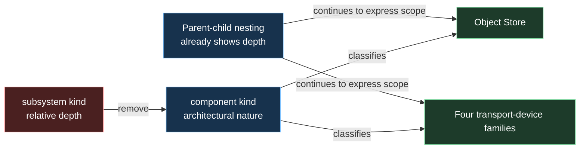

# Architecture Change Plan: Replace the LikeC4 Subsystem Kind

| Field | Value |
|---|---|
| **Created** | 2026-07-31 |
| **Status** | Complete |
| **Change Type** | Refactor |
| **Author** | Codex |
| **Target Module** | `docs/architecture` |
| **Priority** | Low |
| **Estimated Scope** | S (hours) |
| **P4 CL / Branch** | N/A |

---

## 0 · TL;DR

**What the user sees:** Five C3 elements use the subtitle prefix
`[subsystem: ...]`, although their parent-child placement already shows that
they sit inside a larger system.

**Why it happens:** The model has separate `subsystem` and `component` kinds
whose boundary is subjective size. The former classifies depth rather than
architectural nature.

**What the fix does:** Delete the `subsystem` kind, reclassify its five elements
as `component`, explicitly prevent Object Store from inheriting the component
icon, and align the architecture guide. Element identities, relationships,
descriptions, tags, metadata, views, rendered styling, and runtime code remain
unchanged.

---

## 1 · 🎯 Objective & Motivation

### 1.1 Problem Statement

The `subsystem` kind duplicates information already expressed by nesting and
creates an unclear size boundary with `component`. The model should use one
honest C3 implementation kind for these in-process architectural parts.

### 1.2 Success Criteria

- [x] `specification.c4` declares `component` but not `subsystem`.
- [x] Object Store and all four transport-device families use `component`.
- [x] Their rendered subtitles use the `[component: ...]` convention.
- [x] `docs/architecture/AGENTS.md` describes the revised taxonomy consistently.
- [x] Object Store explicitly unsets the inherited component icon, preserving
      its current rendered storage-only styling.
- [x] Element ids, relationships, descriptions, tags, metadata, rendered
      styles, and view definitions are unchanged.
- [x] `likec4 validate docs/architecture` passes.

### 1.3 Out of Scope

- Introducing `container`, `transport`, or another replacement kind.
- Renaming element titles or implementation classes.
- Changing model structure, relationships, view membership, layout, or visible
  styling.
- Exporting PNGs or changing production C++.
- Rewriting completed historical plans.
- Editing the personal `likec4-modelling` skill outside this repository.
- Staging, unstaging, committing, or rewriting unrelated working-tree changes.

---

## 2 · 🔍 Context & Current State Analysis

### 2.1 Affected Systems Map

| System / File | Role in Change | Ownership |
|---|---|---|
| `specification.c4` | Kind definitions and component convention | Architecture model |
| `model.c4` | Five live `subsystem` elements and subtitles | Architecture model |
| `AGENTS.md` | Durable taxonomy and subtitle guidance | Architecture documentation |
| `views.c4` | Read-only consumer using scoped `include *` | Architecture views |

### 2.2 Existing Code Audit

```text
docs/architecture/
├── specification.c4  # subsystem and component kinds
├── model.c4          # five subsystem instances
└── AGENTS.md         # subsystem rationale and examples
```

- Current architecture pattern: custom LikeC4 kinds with
  `[<kind>: <short detail>]` subtitles.
- Known tech debt: `subsystem` expresses relative depth and overlaps
  `component`.
- Test coverage: parser and reference validation through `likec4 validate`.
- Repository scan: five live model instances, no view predicate or relationship
  depends on `subsystem`.
- Style audit: `component` supplies `icon-component.svg`; the four transport
  families override it, but Object Store must use `icon none` to preserve its
  current storage-only appearance.
- Working-tree audit: `model.c4` and `AGENTS.md` already contain staged changes
  from separate work. Implementation must merge only the planned taxonomy hunks
  and preserve that baseline.

### 2.3 UE5-Specific Constraints Checklist

| Constraint | Relevant? | Notes |
|---|---|---|
| Reflection system (UPROPERTY/UFUNCTION) | No | Documentation-only change |
| Garbage Collection considerations | No | No runtime code |
| Blueprint exposure needed | No | No UE runtime |
| Replication / Multiplayer | No | No networking behavior |
| Gameplay Ability System (GAS) | No | Not applicable |
| Enhanced Input System | No | Not applicable |
| World Subsystems | No | LikeC4 terminology only |
| Async / Latent actions | No | No execution path |
| Soft/Hard object references | No | No assets |
| Data Assets / Data Tables | No | No data migration |
| Plugins / Module boundaries | No | No dependency change |
| Editor tooling / Details panel | No | No editor code |

### 2.4 Risks & Constraints

- A broad text replacement could rewrite historical rationale or unrelated
  terminology; edit only the audited live convention.
- Deleting the kind before updating all model instances causes expected
  validation failures; validate only after the coordinated edits.
- Reclassification changes inherited properties as well as the kind name;
  Object Store needs an explicit icon override.
- Two target files overlap pre-existing staged work; whole-file replacement,
  checkout, reset, or broad formatting would destroy user changes.
- The personal `likec4-modelling` skill still names `subsystem`; that external
  consistency issue is deliberately outside repository scope.

---

## 3 · 🤔 Options Considered

| # | Approach | Pros | Cons | Complexity | Verdict |
|---|---|---|---|---|---|
| 1 | Unify on `component` | Standard C4 meaning; removes fuzzy size boundary | Broader category | Low | ✅ Selected |
| 2 | Rename to `container` | Sounds larger than component | Falsely implies a runtime boundary | Low | ❌ Rejected |
| 3 | Split Object Store and transport kinds | More domain-specific labels | Adds taxonomy with no current filtering need | Medium | ❌ Rejected |

---

## 4 · ✅ Selected Approach

**Option:** Unify on `component` | **Complexity:** Low

Remove the `subsystem` declaration and reclassify its five existing elements as
`component`. Here, `component` means an in-process grouping of related
implementation functionality behind a clear boundary, included at C3 because
its responsibility or relationships matter; it is neither a declared interface
nor an identity-bearing entity. Preserve every architectural relationship and
visible field except the rendered kind prefix, explicitly unset Object Store's
inherited icon, and update the repository guide.

### Key Design Decisions

| Decision | Rationale |
|---|---|
| Use `component` for all five elements | They are in-process groups of related functionality |
| Apply one classifier | All five group implementation behavior behind a boundary and matter at C3 |
| Let nesting express depth | Avoids encoding one fact twice |
| Preserve ids and relationships | The architecture is unchanged; only classification changes |
| Set Object Store `icon none` | Prevents the component kind's icon from changing its appearance |
| Keep `container` rejected | It would claim an application/data-store runtime boundary |

### Assumptions & Prerequisites

- **Assumes:** The five audited instances are the complete live usage set.
- **Requires:** The existing `component` kind and subtitle convention remain.
- **Requires:** `icon none` continues to be LikeC4's supported inherited-icon
  override.
- **Requires:** Re-read the current target hunks immediately before editing,
  because `model.c4` and `AGENTS.md` are already changing in another workstream.
- **Constraint:** No production source, view structure, relationship, or style
  change beyond the appearance-preserving icon override may enter this
  refactor.

---

## 5 · 🏗️ Architecture

### 5.1 Component Diagram



### 5.2 Sequence Diagram

```mermaid
sequenceDiagram
    participant Implementer
    participant Spec as specification.c4
    participant Model as model.c4
    participant Guide as AGENTS.md
    participant Validator as LikeC4 Validator

    Implementer->>Spec: Remove subsystem; clarify component
    Implementer->>Model: Reclassify five elements and subtitles
    Implementer->>Guide: Align taxonomy and examples
    Implementer->>Validator: validate docs/architecture
    Validator-->>Implementer: Parse and references pass
```

**Alternative / Error Paths:**

- If validation reports an unknown kind, search for a missed live
  `subsystem` instance and update only that instance.
- If the diff changes ids, relationships, styles, or view definitions, revert
  that hunk before validation.

### 5.3 Components Summary

| Component | Responsibility |
|---|---|
| `specification.c4` | Defines the reduced element-kind vocabulary |
| `model.c4` | Applies `component` to the five approved elements |
| `AGENTS.md` | Keeps the durable modelling convention discoverable |

### 5.4 Interfaces

- Element ids remain unchanged, so view selectors and relationship endpoints
  retain their contract.
- Technology strings change only from `[subsystem: ...]` to
  `[component: ...]`.
- Object Store adds `icon none` so the new kind does not add
  `icon-component.svg`; the four transport families retain their explicit icons.
- `views.c4` uses scoped `include *` and has no kind predicate, so view
  membership is unchanged.
- No runtime interface or C++ signature changes.

---

## 6 · 📝 Implementation Steps

### Step 1: Remove the Relative Kind

**File:** `docs/architecture/specification.c4` | modify

```likec4
// In-process grouping of related implementation functionality behind a clear
// boundary. Used at C3 when its responsibility or relationships matter. Never
// a generic manager.
element component {
    style {
        shape component
        icon ./icon-component.svg
    }
}
```

#### Implementer Context
> - Delete the complete `element subsystem` declaration.
> - Rewrite the component comment without a size comparison.
> - Preserve the existing component style and icon exactly.
> - Do not add a replacement kind.

---

### Step 2: Reclassify the Five Elements

**File:** `docs/architecture/model.c4` | modify

```likec4
objectStore = component 'Object Store' {
    technology '[component: FObjectStore, generation-checked handles]'
    style {
        shape storage
        icon none
    }
}

wifiDevice = component 'Wi-Fi Device' {
    #optional
    technology '[component: UDP datagrams]'
}
```

Apply the same kind and subtitle-prefix change to `bluetoothDevice`,
`loraDevice`, and `wiredDevice`.

#### Implementer Context
> - Change only the element kind and matching subtitle prefix.
> - Add `icon none` only to Object Store so it does not inherit
>   `icon-component.svg`.
> - Preserve tags before technology fields.
> - Preserve titles, descriptions, all existing style properties, explicit
>   transport icons, metadata, and ids.
> - Do not alter relationships or view definitions.
> - This file already has staged user changes; patch only the five audited
>   element blocks and never replace or reformat the whole file.

---

### Step 3: Align the Durable Architecture Guide

**File:** `docs/architecture/AGENTS.md` | modify

```text
The C3 Transport elements are components titled Wi-Fi Device, LoRa Device, and
so on. Their subtitle prefix distinguishes them from physical device elements.
```

#### Implementer Context
> - Update active taxonomy statements and subtitle examples to `component`.
> - Reframe the interface rationale so it distinguishes interfaces from
>   components, not from the deleted kind.
> - Keep rejected alternatives only where they preserve useful decision history.
> - Do not rewrite unrelated architecture decisions.
> - This file already has staged user changes; patch only the audited taxonomy
>   paragraphs and preserve every unrelated hunk.

---

### Implementation Summary

| # | Step | Files | Est. Time | Depends On | Status |
|---|---|---|---|---|---|
| 1 | Remove `subsystem` definition | `specification.c4` | 10m | — | ✅ |
| 2 | Reclassify five elements | `model.c4` | 15m | 1 | ✅ |
| 3 | Align guide conventions | `AGENTS.md` | 15m | 1, 2 | ✅ |
| 4 | Validate and inspect diff | — | 10m | 1–3 | ✅ |

### File Change Map

```text
docs/architecture/
├── ~ specification.c4
├── ~ model.c4
└── ~ AGENTS.md
```

Legend: `+` new · `~` modified · `-` deleted

### Module / Plugin Dependencies

| Dependency Module | Why Needed | Already Referenced? |
|---|---|---|
| None | Documentation-only refactor | Yes |

---

## 7 · 🧪 Test Strategy

### Existing Tests (Validation)

| Test Suite / Filter | File | Purpose |
|---|---|---|
| `likec4 validate docs/architecture` | Architecture project | Validates syntax and references |

### New Tests (Creation)

| Test Name | Code Under Test | Why | Scenario | Expectation | Type |
|---|---|---|---|---|---|
| None | N/A | No runtime behavior changes | N/A | N/A | N/A |

### Test Quality Gates

- [x] Validation exercises the modified LikeC4 specification and model.
- [x] A focused search proves no live kind or subtitle use remains.
- [x] The final diff proves ids, relationships, views, and rendered styles are
      unchanged except for the appearance-preserving `icon none` source line.
- [x] No C++ test is added for a documentation-only change.

### Performance Budget

| Metric | Acceptable Threshold | How to Measure |
|---|---|---|
| N/A | No runtime impact | Diff inspection |

---

## 8 · ⚠️ Pitfalls

- **Blind replacement.** Historical discussion may name `subsystem`; update live
  rules and examples without erasing useful rationale.
- **Partial taxonomy migration.** The kind and every rendered subtitle prefix
  must change together before validation.
- **Accidental architecture change.** Do not modify element ids, edges, view
  selectors, descriptions, tags, metadata, or any existing style property.
- **Inherited icon regression.** Reclassifying Object Store without `icon none`
  adds the component glyph to a storage-shaped element.
- **Dirty-target overwrite.** `model.c4` and `AGENTS.md` already have staged
  changes; broad edits or file-level rollback would lose unrelated work.
- **Unrequested rendering.** Validation is the gate; do not export PNGs.

---

## 9 · 🔄 Rollback Plan

- [ ] Git revert the implementation commit if the classification proves less
      clear.
- [ ] Before a commit exists, reverse only the exact taxonomy hunks; never
      restore either dirty target file wholesale.
- [ ] Asset rollback needed: No.
- [ ] Data migration reversal: No.
- [ ] Config revert: No.

---

## 10 · ✅ Verification

- [x] `rg -n "element subsystem|= subsystem|'\\[subsystem:" docs/architecture/specification.c4 docs/architecture/model.c4`
      returns no matches.
- [x] `rg -n "\\[subsystem:" docs/architecture/AGENTS.md` returns no active
      subtitle examples.
- [x] `rg -n -C 4 "objectStore = component|icon none" docs/architecture/model.c4`
      confirms Object Store prevents inherited icon rendering.
- [x] `likec4 validate docs/architecture` passes.
- [x] `python tools/CheckFolderAgents.py --root docs` passes, as required by
      `docs/architecture/AGENTS.md`.
- [x] `git diff --check -- docs/architecture/specification.c4 docs/architecture/model.c4 docs/architecture/AGENTS.md`
      passes.
- [x] Compare the post-edit target hunks with the pre-edit staged/unstaged
      baseline; only the planned taxonomy and `icon none` lines are new.
- [x] Diff inspection confirms all element ids, relationships, descriptions,
      tags, metadata, rendered styles, and views are unchanged, with
      `icon none` as the only new style source line.

---

## 11 · 🤖 Task Breakdown (for Implementation LLM)

| # | Task | File | Action | Ref | Done When |
|---|---|---|---|---|---|
| 1 | Remove `subsystem` and clarify `component` | `docs/architecture/specification.c4` | Modify | Step 1 | One implementation kind remains with unchanged style |
| 2 | Reclassify all five elements and preserve styling | `docs/architecture/model.c4` | Modify | Step 2 | Five elements use `component`; Object Store unsets the inherited icon |
| 3 | Align taxonomy and subtitle guidance | `docs/architecture/AGENTS.md` | Modify | Step 3 | Active guidance consistently uses `component` |
| 4 | Run focused occurrence checks | — | Verify | §10 | No live kind or subtitle occurrence remains |
| 5 | Validate the LikeC4 project | — | Verify | §10 | Validator exits successfully |
| 6 | Inspect formatting and baseline-relative scope | — | Verify | §10 | Diff checks pass and pre-existing target-file changes remain intact |

### Execution Rules

> - Complete one task at a time and inspect the touched range after each edit.
> - Read every current instance of the changed field before editing.
> - Capture the staged and unstaged target-file baseline before editing; do not
>   stage, unstage, reset, or restore files.
> - Validate after the three coordinated file edits, not between kind deletion
>   and instance migration.
> - Stop and report any change required outside the three planned repository
>   files.
> - Do not invent a new kind, alter architecture, or export diagrams.

---

## 12 - Plan History

| # | Date | Reviewer | Changes Made |
|---|---|---|---|
| 1 | 2026-07-31 | Codex | Created from the approved `component` concept |
| 2 | 2026-07-31 | Sceptic Critic | Added one classifier, inherited-icon protection, view-consumer evidence, and scoped checks |
| 3 | 2026-07-31 | Sceptic Critic | Final verdict PROCEED with zero critical concerns |
| 4 | 2026-07-31 | Owner | Approved the implementation plan |
| 5 | 2026-07-31 | Implementer | Started implementation and added the architecture guide's required folder-agent verification gate |
| 6 | 2026-07-31 | Implementer | Completed the taxonomy refactor; validation, folder-agent, diff, principle, and consumer-impact checks passed |
