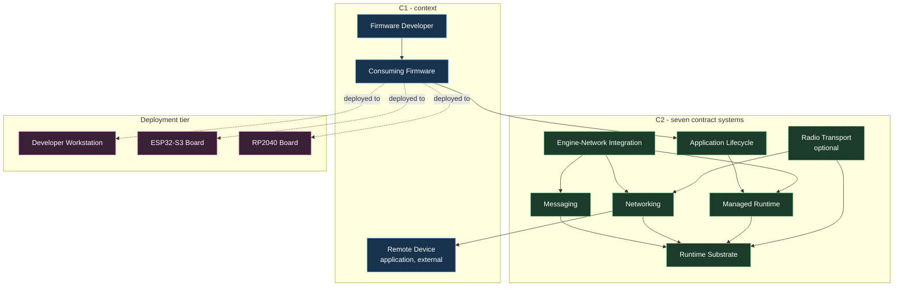
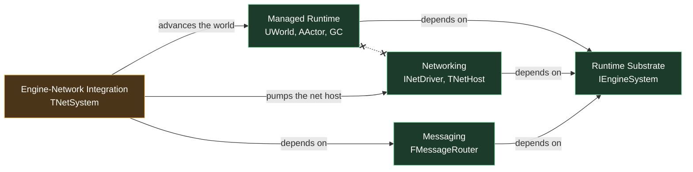
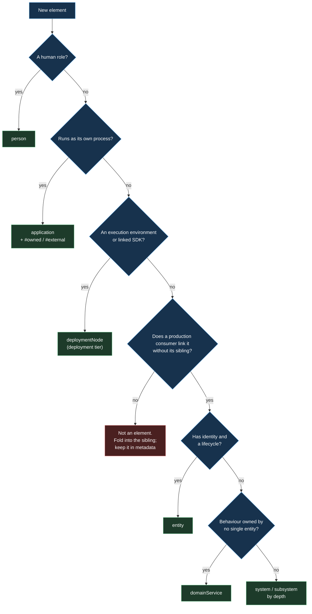

# LikeC4 Model Rebuild — Contract-Defined Systems

## Metadata

- **Type:** Redesign / refactor (documentation model, no production code)
- **Priority:** Medium
- **Estimated effort:** Medium (1–2 days)
- **Risk:** Low; `docs/architecture/` has no build or runtime consumers
- **Concept:** [`.claude/concepts/likec4-model-rebuild.md`](../concepts/likec4-model-rebuild.md)
- **Tooling verified:** likec4 `1.59.2` (deployment views available)
- **Implementation status:** Implemented 2026-07-30. `likec4 validate` clean,
  7 views exported and inspected. Deviations recorded in §12 v3.
- **Approval status:** Implemented at owner's direction without a separate
  plan-approval round

> **Template note.** The plan-writer skill points at
> `~/.claude/templates/UE5_CPP_Plan_Template.md`, which does not exist on this
> machine. This plan mirrors the section structure of
> `.claude/plans/e32-optional-transport-package.md`. Step bodies carry **LikeC4
> DSL** blocks instead of C++ blocks, because the deliverable is a `.c4` model.

## 0. TL;DR

`docs/architecture/model.c4` is the CMake link graph with nicer labels. Rebuild it
so element kind tracks a real architectural distinction:

- Delete the `externalService` kind. It splits on **ownership** while `application`
  splits on **deployability** — orthogonal axes across two kinds is what made
  classification feel arbitrary. Ownership becomes the `#external` tag.
- Collapse the 11 module-shaped systems into **7 contract-defined systems**,
  selected by one falsifiable test (§2.2). Modules stay in
  `metadata { implementation }`; there is no `module` kind.
- Move Host OS / ESP-IDF / Pico SDK out of the logical tier entirely. They are
  statically linked libraries and execution environments, so they become
  `deploymentNode`s.
- Go to C3 **only** inside Managed Runtime and Networking, where a contributor
  would otherwise guess wrong.

```text
C1  product boundary        MicroWorld + Consuming Firmware + Remote Device
C2  7 contract systems      responsibility, not build target
C3  two systems only        Managed Runtime, Networking
D   deployment tier         Dev PC / ESP32-S3 board / RP2040 board
```

## 1. Objective

### 1.1 Problem

`model.c4` documents the build system, not the architecture:

- All 11 systems are 1:1 renames of `Modules/` directories, which
  `docs/architecture/AGENTS.md` explicitly forbids: "a `system` is a cohesive
  responsibility with a public contract, not automatically a directory or build
  target." `metadata { implementation 'Modules/Core' }` on every element is the
  tell.
- Double naming adds nothing: `'Runtime Foundation'` + `technology 'system: Core'`.
  Two names per element, neither more informative than `ls Modules/`.
- Descriptions are vacuous, and `esp32Platform` and `picoPlatform` carry the
  **identical** description `'Connects MicroWorld to the board.'`
  ([model.c4:126](../../docs/architecture/model.c4:126),
  [model.c4:135](../../docs/architecture/model.c4:135)), so the rendered diagram
  cannot distinguish them.
- 15 of 18 relationships are `dependsOn`. `commands`, `queries`, `publishes`,
  `replicates`, `subsystem`, `entity`, and `domainService` are declared in
  `specification.c4` and never used.
- The repository's central invariant — Engine and Net never see each other, and
  Integration is the only place they meet — appears **only as an absent edge**. A
  reader must notice a missing line to learn the rule.
- `microworld.esp32Platform -[uses]-> esp32Services`
  ([model.c4:146](../../docs/architecture/model.c4:146)) draws an arrow to an
  external box for what is a function call in the same address space. The arrow
  asserts something false.

### 1.2 Desired outcomes

- Element kind answers exactly one question, and ownership is a tag.
- Every C2 element is defensible by contract: you can name what it promises and
  who depends on it, and it would survive being repackaged.
- The Engine↔Net separation is **visible**, not inferred from absence.
- No arrow crosses a boundary that does not exist at runtime.
- The module dependency graph survives as one narrow view, since
  `tools/CheckDependencyBoundaries.py` already machine-verifies it.
- `likec4 validate` passes and every exported view is visually inspected.

### 1.3 Non-goals

- Changing any production code, header, or build file. This plan touches
  `docs/architecture/` only.
- Inventing behavioral relationships. `commands` / `queries` / `publishes` /
  `replicates` are used only where a header or source line proves the interaction.
- Modelling client/server split, prediction, or replication — MicroWorld has no
  authority model to document yet.
- Modelling generic utilities (containers, memory, spans, delegates, result codes).
  Generic utilities are not architecture.
- A `module` element kind. Settled: modules are a build fact, carried in metadata.
- Retiring `tools/CheckDependencyBoundaries.py` or changing its rules.

## 2. Existing Context and Impact Radius

### 2.1 Element-kind reassignment

| Current element | Current kind | New home | Why |
| --- | --- | --- | --- |
| Firmware Developer | `person` | unchanged | correct already |
| Consuming Firmware | `application` | unchanged | genuine separate runtime |
| Remote Peer | `externalService` | `application` + `#external` | separate process we do not own |
| Host OS Services | `externalService` | `deploymentNode` | execution environment, not a service |
| ESP32 SDK Services | `externalService` | `deploymentNode` | ESP-IDF links into our binary |
| Pico SDK Services | `externalService` | `deploymentNode` | Pico SDK links into our binary |

### 2.2 Module-to-system remap

`system` count drops 11 → 7. Modules move to `metadata { implementation }`.

**The one merge test — independent linkability.** *Does a real production consumer
link one module without wanting the other?* If no, they are one system. If yes, they
are two. This is the build-target merge test from the dialogue, stated so it can be
falsified by a `target_link_libraries` line rather than by taste.

| New C2 system | Absorbs modules | Test result | Contract evidence |
| --- | --- | --- | --- |
| Runtime Substrate | `Core` | — | `MicroWorld/Time.h`, `Tickable.h`, `TickFunction.h`, `Timer.h`, `Log.h`, `Lifecycle.h`, `EngineSystem.h`, `IO/UartByteStream.h` |
| Managed Runtime | `Object` + `Engine` | **merge** — nothing links `Object` without wanting `Engine` | `Object/ObjectStore.h`, `GarbageCollector.h`, `ObjectHandle.h`, `ClassDescriptor.h`; `Engine/World.h`, `Actor.h`, `ActorComponent.h`, `EngineHost.h`, `DeferredActorSpawn.h` |
| Messaging | `Messaging` | — | `Messaging/Message.h`, `MessageRouter.h`, `MessageChannelBinding.h`, `ReliableChannel.h` |
| Networking | `Net` | **keep separate** from `RadioE32` — see below | `Net/NetDriver.h`, `NetHost.h`, `FrameCodec.h`, `NetProtocol.h`, `NetAddress.h`, `E32Lora.h` |
| Radio Transport | `RadioE32` | **keep separate** — UDP-only firmware links `Net` and deliberately omits `RadioE32` | `RadioE32/RadioE32Driver.h`, `Core/IO/UartByteStream.h` |
| Application Lifecycle | `Application` | — | `Application/Application.h` |
| Engine–Network Integration | `Integration` | — | `Integration/NetSystem.h` |

**Object + Engine: the test says merge.** In production only
[Modules/Engine/CMakeLists.txt:38](../../Modules/Engine/CMakeLists.txt:38) links
`MicroWorld::Object`. The one other hit,
`Modules/Core/tests/consumer/CMakeLists.txt:127`, is a profile-map compile probe,
not an architectural consumer. No consumer wants managed identity without the
runtime that uses it, so the split is a compile-unit convenience.

**Net + RadioE32: the test says keep them apart, and an earlier draft of this plan
got it wrong.** `Modules/RadioE32/AGENTS.md` states the package is "an optional
transport, not a universal HAL," and commit `b2f0c5f` existed specifically to make
it independently buildable and droppable —
`Modules/Core/tests/consumer/platformio.ini` carries an `esp32-s3-platform` profile
that builds `PlatformEsp32` *without* `RadioE32` to prove exactly that. Merging
them would force every UDP-only firmware to carry E32 framing, which is an
architectural change. Therefore Radio Transport is the 7th system, not a C3 driver.

This also answers the "single consumer today" objection symmetrically: `Object` has
one consumer and **nothing links it independently**; `RadioE32` has one consumer and
**is deliberately linked independently**. Linkability, not consumer count, decides.

**Platform packages.** `PlatformHost`, `PlatformEsp32`, `PlatformPico` are
independently linkable, so the test makes them distinct — but they are the
non-portable edge, and this model represents that edge in two purpose-built places
rather than as C2 peers: as `INetDriver` implementations at C3 of Networking, and as
the deployment tier of §4.5. Each names its module in metadata, so nothing is lost.

**Why Core stays one element.** It is a utility library, but two things in it are
load-bearing contracts — `IEngineSystem` (the reason Messaging and Net extend the
engine without depending on it) and `IUartByteStream` (the reason Radio Transport is
portable). Those are surfaced by the seam **view**, not by extra elements.

### 2.3 Consumers verified

| Consumer | Current use | Required change |
| --- | --- | --- |
| `docs/architecture/views.c4` | 3 views over 11 flat systems | Rewrite; all element ids change |
| `docs/architecture/AGENTS.md` | states the folder rules | Update the vocabulary and depth rules |
| `tools/CheckFolderAgents.py --root docs` | requires an `AGENTS.md` per dir | Passes; no new subdirectories added |
| `tools/CheckDependencyBoundaries.py` | verifies the **module** graph | **No change.** It checks `Modules/`, not the model |
| `CLAUDE.md` module table + graph | says "Nine packages", omits `RadioE32` | Stale independently of this plan — see §6 Step 6 |
| Production code / CMake / PlatformIO | none reference the model | No change |

`docs/architecture/` has **no build consumer**: `likec4` is invoked manually and
there is no `package.json` or `likec4.config.*` in the repository.

### 2.4 Repository constraints

- Every maintained directory keeps an `AGENTS.md` (`CheckFolderAgents.py`).
- `autoLayout TopBottom`; any exception needs a rendered comparison and explicit
  approval (`docs/architecture/AGENTS.md`).
- Every `dependsOn` names its source evidence in `metadata { evidence }`.
- Every element keeps a `technology` subtitle and a short responsibility
  description — but the description must now **distinguish** the element.
- Generated previews go under `build/`, never beside the model source.
- Portable dependencies point inward; SDK access stays at the platform edges.

## 3. Options Considered

| Option | Benefits | Costs / reason rejected |
| --- | --- | --- |
| **A. Contract-defined systems + `#external` tag + deployment tier** | Kind answers one question; removes the false SDK arrows; makes the Engine↔Net seam visible; keeps the module graph as a view | Element ids all change, so `views.c4` is rewritten |
| B. Keep 11 systems, only swap `externalService` → `application` | Smallest diff | Leaves the actual defect — the model still documents the build system — and makes ESP-IDF an "application", which the spec forbids for libraries |
| C. Add a `module` kind alongside `system` | Makes the build graph first-class | Two kinds for one box; a merged pair of modules would change the diagram without changing the architecture. Rejected in dialogue |
| D. Make the firmware the container and demote `product` to a tag | Most honest about a library that never runs | Owner uses `product` as the first level (C1). Rejected by decision |
| E. Model C3 for every system | Uniform depth | Messaging and Application Lifecycle hold no surprises; uniform depth is cost without readership |
| F. Option A **minus** the deployment tier | Avoids the plan's only unprecedented syntax; the false SDK arrows still disappear, with the SDK named in each C3 driver's `technology` subtitle | Loses the "one core, three environments" statement, which is the fact the current model most conspicuously fails to make |

Select **Option A**, with **Option F as the named fallback**.

The deployment tier is priced separately on purpose: §8 ranks its syntax risk first,
and `docs/architecture/` has no CI — there is no workflow file and no `package.json`
or lockfile anywhere in the repository referencing `likec4`, so "Tooling verified:
1.59.2" is a statement about one machine at one moment and nothing enforces it
later. Step 3 is therefore a **single revertible commit**: if `likec4 validate`
rejects it, drop to Option F and the rest of the plan still stands.

## 4. Selected Design

### 4.1 Specification changes

Delete `externalService`. Add ownership tags and the deployment node kind.

```likec4
specification {
    // Human role interacting with the product.
    element person { style { shape person } }

    // Complete deliverable and ownership boundary. The first level (C1).
    element product { style { shape rectangle } }

    // Independently executable or deployable runtime.
    // A plugin, library or module is not an application.
    element application { style { shape component } }

    // Major cohesive logical responsibility with a defined public contract.
    // NOT a folder, build target or module. If merging two build targets would
    // not change the architecture, they were never two systems.
    element system { style { shape rectangle } }

    element subsystem { style { shape component } }
    element entity { style { shape rectangle } }
    element domainService { style { shape component } }

    // Execution environment or deployment target.
    // Statically linked SDKs live here, not in the logical tier.
    deploymentNode environment { style { shape rectangle } }

    // Ownership, not deployability. Deployability is the element kind.
    tag external
    tag owned

    // Which contract a C3 element realises.
    tag contract
    tag implementation

    // Consumers link this system only when they need it.
    tag optional

    relationship uses { title 'uses' }
    relationship dependsOn { title 'depends on' }
    relationship commands { title 'sends commands to' }
    relationship queries { title 'queries' }
    relationship publishes { title 'publishes to'; line dotted }
    relationship replicates { title 'replicates state to'; line dotted; color indigo }
}
```

`client`, `server`, `authoritative`, and `predicted` are **deleted**. §1.3 makes
"no client/server or replication modelling" a non-goal, so keeping the vocabulary
for the goal just disowned is speculative complexity — the exact thing §3.0 of the
repository's principles forbids. They are three lines to re-add the day an
authority model actually exists. `externalService` and those four tags are the only
vocabulary removed.

### 4.2 Ownership is a tag, deployability is the kind

This is the change that answers the original question. The two axes stop competing:

| | `#owned` | `#external` |
| --- | --- | --- |
| **`application`** (runs as its own process) | — *(MicroWorld ships no executable)* | Consuming Firmware, Remote Device |
| **`system`** (a responsibility) | the 7 C2 systems | — |

### 4.3 C2 — seven contract-defined systems

```likec4
microworld = product 'MicroWorld' {
    technology 'product: C++17 static library framework'
    description 'Embedded runtime for device applications.'

    substrate = system 'Runtime Substrate' {
        technology 'system: time, ticking, logging, extension seams'
        description 'Sequences work and exposes plug-in seams.'
        metadata {
            implementation 'Modules/Core'
            contract 'Time.h, TickFunction.h, Timer.h, Log.h, EngineSystem.h, IO/UartByteStream.h'
        }
    }

    managedRuntime = system 'Managed Runtime' {
        technology 'system: worlds, actors, handles, collection'
        description 'Owns object identity and actor lifetime.'
        metadata {
            implementation 'Modules/Object + Modules/Engine'
            contract 'IEngine, UWorld, AActor, UActorComponent, ObjectStore'
        }
    }

    messaging = system 'Messaging' {
        technology 'system: typed routing over channels'
        description 'Delivers typed messages between actors.'
        style { shape queue }
        metadata {
            implementation 'Modules/Messaging'
            contract 'FMessageRouter, channel bindings, reliable channel'
        }
    }

    networking = system 'Networking' {
        technology 'system: framed bytes over a swappable driver'
        description 'Moves framed bytes between devices.'
        metadata {
            implementation 'Modules/Net'
            contract 'INetDriver, TNetHost, frame codec, protocol'
        }
    }

    radioTransport = system 'Radio Transport' {
        technology 'system: E32 LoRa driver over a UART byte seam'
        description 'Carries frames over long-range radio.'
        #optional
        metadata {
            implementation 'Modules/RadioE32'
            contract 'FRadioE32Driver realising INetDriver over IUartByteStream'
            optionality 'Modules/Core/tests/consumer/platformio.ini:158 builds PlatformEsp32 without RadioE32'
        }
    }

    lifecycle = system 'Application Lifecycle' {
        technology 'system: composition root and frame loop'
        description 'Starts, drives and stops one engine.'
        metadata {
            implementation 'Modules/Application'
            contract 'FApplication, Run frame loop'
        }
    }

    engineNetSeam = system 'Engine-Network Integration' {
        technology 'system: the only Engine-to-Net joint'
        description 'Joins the runtime to a transport.'
        metadata {
            implementation 'Modules/Integration'
            contract 'TNetSystem'
        }
    }
}
```

Every description now **distinguishes** its element — the defect where ESP32 and
Pico read identically cannot recur, because both are gone from this tier.

### 4.4 C3 — only where a contributor would guess wrong

**Managed Runtime.** The spawn barrier and generation-checked handles are the two
things a new contributor reliably gets wrong.

```likec4
managedRuntime = system 'Managed Runtime' {
    engineFrontDoor = subsystem 'Engine Front Door' {
        technology 'subsystem: IEngine / TEngine<TTraits>'
        description 'Narrow interface the application holds.'
        metadata { implementation 'Modules/Engine/include/MicroWorld/Engine/EngineHost.h' }
    }
    world = entity 'World' {
        technology 'entity: UWorld'
        description 'Owns registered and spawned actors.'
        metadata { implementation 'Modules/Engine/include/MicroWorld/Engine/World.h' }
    }
    actor = entity 'Actor' {
        technology 'entity: AActor'
        description 'Ticking participant with a lifecycle.'
        metadata { implementation 'Modules/Engine/include/MicroWorld/Engine/Actor.h' }
    }
    component = entity 'Actor Component' {
        technology 'entity: UActorComponent'
        description 'Reusable behaviour attached to an actor.'
        metadata { implementation 'Modules/Engine/include/MicroWorld/Engine/ActorComponent.h' }
    }
    spawnBarrier = domainService 'Deferred Spawn Barrier' {
        technology 'domainService: FDeferredActorSpawn queue'
        description 'Constructs actors only at safe points.'
        metadata { implementation 'Modules/Engine/include/MicroWorld/Engine/DeferredActorSpawn.h' }
    }
    objectStore = subsystem 'Object Store' {
        technology 'subsystem: FObjectStore + generation-checked handles'
        description 'Resolves handles and detects stale ones.'
        style { shape storage }
        metadata { implementation 'Modules/Object/include/MicroWorld/Object/ObjectStore.h' }
    }
    collector = domainService 'Garbage Collector' {
        technology 'domainService: FGarbageCollector'
        description 'Reclaims unreachable managed objects.'
        metadata { implementation 'Modules/Object/include/MicroWorld/Object/GarbageCollector.h' }
    }
}
```

**Networking.** The driver seam is the point of the package, and it is where the
platform edges actually live. Radio Transport is **not** here — it is a C2 system
(§2.2) and reaches this tier only through the `driverContract` relationship.

```likec4
networking = system 'Networking' {
    driverContract = subsystem 'Net Driver Contract' {
        technology 'subsystem: INetDriver'
        description 'Send, receive and advance one transport.'
        #contract
        metadata { implementation 'Modules/Net/include/MicroWorld/Net/NetDriver.h' }
    }
    netHost = subsystem 'Net Host' {
        technology 'subsystem: TNetHost'
        description 'Drives one driver per frame.'
        metadata { implementation 'Modules/Net/include/MicroWorld/Net/NetHost.h' }
    }
    frameCodec = domainService 'Frame Codec' {
        technology 'domainService: magic, length and CRC framing'
        description 'Frames and resynchronises byte streams.'
        metadata { implementation 'Modules/Net/include/MicroWorld/Net/FrameCodec.h' }
    }
    hostUdpDriver = subsystem 'Host UDP Driver' {
        technology 'subsystem: FHostUdpDriver over OS sockets'
        description 'Carries frames over desktop UDP.'
        #implementation
        metadata { implementation 'Modules/PlatformHost/src/HostUdpDriver.cpp' }
    }
    esp32UdpDriver = subsystem 'ESP32 UDP Driver' {
        technology 'subsystem: lwIP UDP driver'
        description 'Carries frames over device Wi-Fi.'
        #implementation
        metadata { implementation 'Modules/PlatformEsp32' }
    }
}
```

**C3 carries dependencies too, not just structure.** The C2 merge collapses
`Object -> Core` and `Engine -> Object` into one `managedRuntime -> substrate` edge;
without re-deriving them at C3 the plan would reproduce, one tier in, the same
"real relationships blur into one edge" defect §1.1 complains about. So:

```likec4
microworld.managedRuntime.objectStore -[dependsOn]-> microworld.substrate {
    metadata { evidence 'Modules/Object/CMakeLists.txt:38 -> MicroWorld::Core' }
}
microworld.managedRuntime.engineFrontDoor -[dependsOn]-> microworld.managedRuntime.objectStore {
    metadata { evidence 'Modules/Engine/CMakeLists.txt:38 -> MicroWorld::Object' }
}
microworld.radioTransport -[dependsOn]-> microworld.networking.driverContract 'realises' {
    metadata { evidence 'Modules/RadioE32/CMakeLists.txt:48 -> MicroWorld::Net' }
}
```

### 4.5 Deployment tier — where the SDKs belong

The three SDK boxes stop being logical elements. `uses` arrows to them disappear.

```likec4
deployment {
    devPc = environment 'Developer Workstation' {
        technology 'environment: Windows / Linux host'
        description 'Runs host tests and the two-node demo.'
        hostApp = instanceOf consumer
    }

    esp32Board = environment 'ESP32-S3 Board' {
        technology 'environment: ESP-IDF, FreeRTOS, lwIP'
        description 'Runs device firmware with Wi-Fi and radio.'
        esp32App = instanceOf consumer
    }

    picoBoard = environment 'RP2040 Board' {
        technology 'environment: Pico SDK'
        description 'Runs device firmware with radio only.'
        picoApp = instanceOf consumer
    }

    esp32Board.esp32App -[uses]-> picoBoard.picoApp 'E32 radio link' {
        metadata {
            evidence 'examples/17-TwoBoardLora; Modules/RadioE32 hardware record'
        }
    }
}
```

The SDK names survive as the environment `technology` subtitle — the information
is kept, the false arrow is not.

### 4.6 Making the Engine↔Net invariant visible

Today the rule is an absent edge. Give it a dedicated view plus one explicit
relationship, so the reader is told rather than left to infer:

```likec4
microworld.engineNetSeam -[uses]-> microworld.managedRuntime 'advances the world each frame' {
    metadata {
        evidence 'Modules/Integration/include/MicroWorld/Integration/NetSystem.h'
    }
}

microworld.engineNetSeam -[uses]-> microworld.networking 'pumps the net host each frame' {
    metadata {
        evidence 'Modules/Integration/include/MicroWorld/Integration/NetSystem.h'
    }
}

microworld.engineNetSeam -[dependsOn]-> microworld.messaging {
    metadata {
        evidence 'Modules/Integration/CMakeLists.txt:48 -> MicroWorld::Messaging'
    }
}
```

The Messaging edge is **not optional decoration**: the committed model already
carries it ([model.c4:191](../../docs/architecture/model.c4:191)), and an earlier
draft of this plan omitted it — which would have made the rebuilt model less
accurate than the one it replaces, on precisely the axis §1.2 promises to fix.
Task 11.8 and check §7.2 now guard against that class of loss directly.

Paired with the `extensionSeam` view (§4.7), which includes exactly Managed
Runtime, Networking, Engine–Network Integration, and Runtime Substrate — so the
absence of a Managed-Runtime↔Networking edge is the visible subject of a diagram
rather than a gap in a crowded one.

### 4.7 Views

| View | Subject | Elements |
| --- | --- | --- |
| `index` | C1 context | developer, consuming firmware, Remote Device, MicroWorld |
| `systems` | C2 | MicroWorld + its 7 systems |
| `extensionSeam` | the invariant | Managed Runtime, Networking, Integration, Substrate |
| `managedRuntime` | C3 | the 7 elements of §4.4 |
| `networking` | C3 | the 6 elements of §4.4 |
| `deployment` | deployment tier | 3 environments + firmware instances |
| `moduleGraph` | build reality | the 11 modules, kept deliberately narrow |

`moduleGraph` is the honest home for the old content: it is a build view, labelled
as one, and `tools/CheckDependencyBoundaries.py` already proves it.

## 5. Architecture

### 5.1 Tier structure after the rebuild



### 5.2 The invariant the model must show



The crossed link is the subject: Managed Runtime and Networking never reference
each other, and `IEngineSystem` in the Substrate is what lets Networking extend a
frame loop it cannot see.

### 5.3 Kind-selection decision procedure



This is the procedure that resolves the original `externalService` question, and it
belongs in `docs/architecture/AGENTS.md` so it survives this plan.

### 5.4 LikeC4 modelling checklist

| Concern | Applies | Decision |
| --- | --- | --- |
| Element kind per axis | Yes | Kind = deployability; tag = ownership |
| Folder-to-element mapping | No | Modules live in `metadata implementation` only |
| Behavioral relationships | Partly | Only `uses`/`dependsOn` plus the two evidenced Integration edges |
| Client / server / authority | No | No authority model exists to document |
| Deployment modelling | Yes | Three `environment` nodes with firmware instances |
| Layout | Yes | `autoLayout TopBottom` everywhere; no exceptions requested |
| Machine verification | Yes | `likec4 validate` + `CheckFolderAgents.py` |

## 6. Implementation Steps

### Step 1 — Rewrite `specification.c4`

**Files**

- Modify `docs/architecture/specification.c4`

**Structure**

```likec4
// removed:
- element externalService { style { shape component } }
- tag client
- tag server
- tag authoritative
- tag predicted

// added:
+ deploymentNode environment { style { shape rectangle } }
+ tag external
+ tag owned
+ tag contract
+ tag implementation
+ tag optional
```

Keep every comment block that defines a kind's meaning — those comments are the
reason the vocabulary is usable. Rewrite the `system` comment to carry the
independent-linkability test from §2.2.

#### Implementer Context

> Do **not** delete the relationship kinds. `commands`, `queries`, `publishes`, and
> `replicates` are semantics for edges this model will add as evidence appears; the
> four *tags* go because §1.3 disowns the authority modelling they exist for, and a
> tag carries no semantics on its own. `externalService` is the only *kind* removed.
>
> After this step `likec4 validate` will fail until Step 2 lands, because `model.c4`
> still references the deleted kind — that is expected, so do not "fix" it here.

### Step 2 — Rewrite `model.c4` logical tier

**Files**

- Modify `docs/architecture/model.c4`

**Structure**

```likec4
remoteDevice = application 'Remote Device' {
    technology 'application: peer firmware node'
    description 'Exchanges framed messages over a link.'
    #external
}

consumer = application 'Consuming Firmware' {
    technology 'application: device firmware executable'
    description 'Composes and drives one MicroWorld engine.'
    #external
}
```

Then the seven systems of §4.3 and the C3 children of §4.4. Delete `hostServices`,
`esp32Services`, `picoServices`, and every `-[uses]->` edge that targeted them.

Rebuild the `dependsOn` set against the new element ids, preserving one
`metadata { evidence }` line per edge:

```likec4
microworld.managedRuntime -[dependsOn]-> microworld.substrate {
    metadata { evidence 'Modules/Object/CMakeLists.txt -> MicroWorld::Core' }
}
microworld.networking -[dependsOn]-> microworld.substrate {
    metadata { evidence 'Modules/Net/CMakeLists.txt:41 -> MicroWorld::Core' }
}
microworld.networking -[uses]-> remoteDevice 'exchanges bounded frames with' {
    metadata { evidence 'Modules/Net/include/MicroWorld/Net/NetHost.h' }
}
```

#### Implementer Context

> **Work from the old edge list, not from memory.** The committed `model.c4` carries
> 15 `dependsOn` edges. Enumerate them first, map each to its new id, and only then
> write the new set. An earlier draft of this plan lost
> `Integration -> Messaging` by rebuilding the list from the diagram instead — the
> exact failure §1.2 promises to fix.
>
> Only one merge collapses edges: `Object -> Core` and `Engine -> Object` both
> become `managedRuntime -> substrate`. Keep **both** original evidence strings on
> the surviving edge rather than dropping one, and re-derive the pair at C3 per §4.4.
>
> `RadioE32 -> Core` and `RadioE32 -> Net` survive as real system edges, because
> Radio Transport is a C2 system (§2.2). Do not fold them into Networking.
>
> Do **not** add a `substrate -> anything` edge. Core has no dependencies, and that
> is a fact worth preserving.

### Step 3 — Add the deployment tier

**Files**

- Modify `docs/architecture/model.c4`

**Structure**

Append the `deployment { ... }` block from §4.5 after the logical `model { ... }`
block. `instanceOf consumer` is what ties the tiers together.

#### Implementer Context

> `deployment` is a **top-level block**, a sibling of `model` and `views` — not
> nested inside `model`. Verify with `likec4 validate` immediately; this is the
> only genuinely new LikeC4 syntax in the plan, and 1.59.2 is confirmed to support
> it. If validation rejects `deploymentNode environment`, fall back to declaring
> the nodes with the built-in `node` kind rather than inventing a logical element.

### Step 4 — Rewrite `views.c4`

**Files**

- Modify `docs/architecture/views.c4`

**Structure**

```likec4
view extensionSeam {
    title 'MicroWorld - Engine and Net never meet'
    description 'Integration is the only element that references both.'
    include microworld.managedRuntime
    include microworld.networking
    include microworld.engineNetSeam
    include microworld.substrate
    autoLayout TopBottom
}

view moduleGraph {
    title 'MicroWorld - Build Module Graph'
    description 'Build reality, verified by tools/CheckDependencyBoundaries.py.'
    include microworld.*
    autoLayout TopBottom
}
```

Add the seven views of §4.7. Every view keeps a `description` stating what the
reader should take away — the current file has one on `index` only.

#### Implementer Context

> Views must not invent elements or dependencies (folder `AGENTS.md`). If a view
> needs a box that does not exist in `model.c4`, that is a signal the model is
> wrong, not the view. `moduleGraph` shows the systems that survived — it is not a
> reconstruction of the deleted 11-module layout.

### Step 5 — Update `docs/architecture/AGENTS.md`

**Files**

- Modify `docs/architecture/AGENTS.md`

**Structure**

```text
## Choosing an element kind
<the §5.3 decision procedure, as prose + the merge test>

## Depth
C2 is contract-defined systems. Go to C3 only where a contributor would
otherwise guess wrong: currently Managed Runtime and Networking.

## Ownership
Kind = deployability. Ownership is #owned / #external. There is no
externalService kind and no module kind.
```

Replace the "Give every element a `technology` subtitle" rule with the stronger
one this plan enforces: **a description must distinguish its element from every
sibling.** Keep the verification block, adding the new view names.

#### Implementer Context

> The identical-description defect (§1.1) happened because the old rule
> constrained length but not information. State the distinguishability rule
> explicitly or it recurs.

### Step 6 — Correct the stale module facts in `CLAUDE.md`

**Files**

- Modify `CLAUDE.md`

**Structure**

```text
- "Nine packages" -> the actual count
- add RadioE32 to the dependency graph and the module table
- RadioE32 | Core, Net | portable E32 framing, queueing, driver
- add one cross-reference line under the table:
  "The architecture model in docs/architecture/ groups these packages into
   contract-defined systems; the two counts are deliberately different."
```

#### Implementer Context

> This is in scope because §1.1 blames the model for documenting the build system,
> and the build-system prose is itself wrong: `CLAUDE.md` says "Nine packages", its
> ASCII graph draws seven, its table lists ten, and `Modules/RadioE32` (commit
> `b2f0c5f`) appears in none of them. Fix the count and add the row; change nothing
> else about that file.
>
> The cross-reference line matters more than it looks. After this plan there are two
> authoritative counts — *N packages* here and *7 systems* in the model — under
> different rules. `CLAUDE.md` already proves an unlinked count drifts three ways
> inside one file, so the line exists to stop a future reader "fixing" one to match
> the other.

### Step 7 — Validate, export, inspect

**Files**

- No file changes; produces `build/likec4-architecture-preview/`

Run the §10 matrix. Open every exported PNG. A view that needs a layout exception
requires a rendered before/after comparison and explicit owner approval.

### 6.1 File-change summary

| Change type | Count | Notes |
| --- | ---: | --- |
| Rewritten model files | 3 | `specification.c4`, `model.c4`, `views.c4` |
| Updated guides | 2 | `docs/architecture/AGENTS.md`, root `CLAUDE.md` |
| Deleted vocabulary | 1 kind + 4 tags | `externalService`; `client`/`server`/`authoritative`/`predicted` |
| Logical elements | 11 → 7 at C2, +12 at C3 | plus 3 deployment nodes |
| Views | 3 → 7 | |
| Production code touched | 0 | |

### 6.2 Dependency order

1. `specification.c4` (vocabulary must exist before use).
2. `model.c4` logical tier.
3. `model.c4` deployment tier.
4. `views.c4`.
5. Guides (`AGENTS.md`, `CLAUDE.md`).
6. Validate, export, visually inspect.

## 7. Test Strategy

There is no unit-test layer for a documentation model. The equivalents:

### 7.1 Verification layers

| Layer | What it proves | Command / method |
| --- | --- | --- |
| Parse + reference check | No dangling ids, no undeclared kinds or tags | `likec4 validate docs/architecture` |
| Folder guides | Every maintained directory has an `AGENTS.md` | `python tools/CheckFolderAgents.py --root docs` |
| Module boundaries unaffected | The production graph still holds | `python tools/CheckDependencyBoundaries.py --self-test` |
| Rendered legibility | Views are readable at `autoLayout TopBottom` | Export PNG, open every file |
| Evidence audit | Every `dependsOn` cites a line that exists | Manual: grep each `evidence` string |

### 7.2 Required checks

- **Edge conservation.** Every one of the 15 `dependsOn` edges in the committed
  `model.c4` maps to an edge in the new model, or its removal is justified in
  writing. Method: list the old `(source, target, evidence)` triples, list the new
  ones, and diff. Only the `Object -> Core` / `Engine -> Object` pair may collapse,
  and only into `managedRuntime -> substrate`.
- Every `metadata { evidence }` string resolves to a real file, and where it names
  a line, that line still contains the claimed target.
- No element description is byte-identical to a sibling's — the §1.1 defect.
- No `uses` edge targets a statically linked SDK.
- `Managed Runtime` and `Networking` have **no** edge between them in any view.
- Every C3 element names its `implementation` header.
- The 7 C2 systems each name a `contract`.
- `Radio Transport` carries `#optional` and its `optionality` metadata, so its
  build-time droppability is visible to `likec4 validate`, not just to prose.

### 7.3 Constraints

- No layout exception without a rendered comparison and owner approval.
- Exports go to `build/`, never beside the source.
- Do not add a behavioral relationship without a header or source line proving it.

## 8. Risks and Pitfalls

| Risk | Concrete failure | Mitigation |
| --- | --- | --- |
| `deployment` syntax differs in 1.59.2 | `likec4 validate` rejects Step 3 | Validate immediately after Step 3; fallback to the built-in `node` kind (Step 3 context) |
| Merging Object+Engine hides a real seam | A reader cannot see that GC is independent of actors | C3 `managedRuntime` view exposes Object Store and Collector separately |
| An edge is lost in the id rewrite | The rebuilt model is *less* accurate than the one it replaces | §7.2 edge-conservation diff against the committed 15 `dependsOn` edges; caught exactly this in review (Integration→Messaging) |
| Radio Transport's optionality is invisible | The model flattens the distinction commit `b2f0c5f` was built to create | `#optional` tag + `optionality` metadata citing the profile that builds without it |
| Platform modules lose visibility | Contributors cannot find where SDK code lives | They appear as C3 drivers **and** as deployment environments, each naming its module in metadata |
| Evidence strings rot | Model claims a CMake line that moved | §7.2 evidence audit; prefer file-level over line-level evidence where the file is stable |
| 7 views is more surface to maintain | Views drift from the model | Views hold presentation only; a view needing a new box means the model is wrong |
| Deleting `externalService` orphans future use | A genuine third-party service appears later | It becomes `application #external`, or a `deploymentNode` if it is infrastructure — §5.3 covers it |
| Scope creep into production code | A "small" header rename rides along | Step list touches 5 files; production code is an explicit non-goal |

## 9. Rollback Strategy

`docs/architecture/` has no build or runtime consumer, so rollback is a revert:

1. `git -C . checkout -- docs/architecture CLAUDE.md`
2. Delete `build/likec4-architecture-preview/`.

No migration, no dependents, no deployed artefact. The current model is committed,
so nothing is unrecoverable.

## 10. Verification

### 10.1 Model gates

```powershell
likec4 validate docs/architecture
```

```powershell
likec4 export png --flat -o build/likec4-architecture-preview docs/architecture
```

### 10.2 Repository gates

```powershell
python tools/CheckFolderAgents.py --self-test
```

```powershell
python tools/CheckFolderAgents.py --root docs
```

```powershell
python tools/CheckDependencyBoundaries.py --self-test
```

### 10.3 Visual inspection

Open all seven exported PNGs and confirm, per view: no overlapping edges that
obscure a label, no element whose description matches a sibling, and — for
`extensionSeam` — that the absent Managed-Runtime↔Networking edge reads as
deliberate.

### 10.4 Completion criteria

- `externalService` appears nowhere in `docs/architecture/`.
- C2 has exactly 7 systems; no element id is a bare module rename.
- Every one of the committed 15 `dependsOn` edges is accounted for — mapped or
  justified in writing. In particular `Integration -> Messaging` survives.
- `Radio Transport` is a C2 system carrying `#optional`, not a C3 driver.
- Host OS, ESP-IDF, and Pico SDK appear only in the deployment tier.
- `likec4 validate` is clean and all seven views exported and were inspected.
- Every `dependsOn` carries evidence that resolves.
- `CLAUDE.md` names `RadioE32`, its package count is correct, and it cross-references
  the model's different count.
- No production code, header, CMake, or PlatformIO file changed.

## 11. Task Breakdown

- [ ] **11.0** Enumerate the committed edge set first: write the 15 `dependsOn` and
      6 `uses` triples from the current `model.c4` to a scratch list. Done when the
      list exists — every later task diffs against it. **Do this before editing.**
- [ ] **11.1** Remove `externalService` and the `client`/`server`/`authoritative`/
      `predicted` tags from `specification.c4`; add the `environment` deployment
      node kind and the `external`/`owned`/`contract`/`implementation`/`optional`
      tags. Done when every surviving kind keeps its explanatory comment and no
      relationship kind was touched.
- [ ] **11.2** Rewrite the `system` comment in `specification.c4` to carry the
      independent-linkability test. Done when the comment states that a system is
      one when no production consumer links its parts separately.
- [ ] **11.3** Replace `remotePeer` with `remoteDevice = application ... #external`
      and tag `consumer` `#external`. Done when no `externalService` reference
      remains in `model.c4`.
- [ ] **11.4** Delete `hostServices`, `esp32Services`, `picoServices` and their
      three `uses` edges. Done when no logical element names an SDK.
- [ ] **11.5** Replace the 11 module-shaped systems with the 7 contract systems of
      §4.3, each with `implementation` and `contract` metadata. Done when every
      description distinguishes its element.
- [ ] **11.6** Give `Radio Transport` the `#optional` tag and its `optionality`
      metadata citing `Modules/Core/tests/consumer/platformio.ini:158`. Done when
      build-time droppability is readable from the model alone.
- [ ] **11.7** Add the 7 Managed Runtime C3 elements of §4.4. Done when each names
      its implementation header.
- [ ] **11.8** Add the 5 Networking C3 elements of §4.4, tagged `#contract` /
      `#implementation`. Done when both platform UDP drivers appear here and Radio
      Transport does **not**.
- [ ] **11.9** Rebuild the `dependsOn` set against new ids and **diff it against the
      11.0 list**. Done when every old edge is mapped or its removal is written
      down, `Integration -> Messaging` is present, and `substrate` has no outgoing
      dependency.
- [ ] **11.10** Add the three C3 dependency edges of §4.4 (`objectStore ->
      substrate`, `engineFrontDoor -> objectStore`, `radioTransport ->
      driverContract`). Done when the collapsed C2 pair is re-derived at C3.
- [ ] **11.11** Add the two evidenced `engineNetSeam` `uses` edges. Done when
      Integration is the only element referencing both Managed Runtime and
      Networking.
- [ ] **11.12** Add the top-level `deployment` block with three environments and
      `instanceOf consumer`, as **one revertible commit**. Done when
      `likec4 validate` passes — or, if it rejects the syntax, when the commit is
      reverted and Option F (§3) is recorded as the chosen path.
- [ ] **11.13** Rewrite `views.c4` with the seven views of §4.7, each carrying a
      `description`. Done when `moduleGraph` is labelled a build view.
- [ ] **11.14** Update `docs/architecture/AGENTS.md` with the kind-selection
      procedure, the depth rule, and the description-distinguishability rule. Done
      when the old subtitle-format rule is replaced, not merely appended to.
- [ ] **11.15** Fix the `CLAUDE.md` package count, add the `RadioE32` row and graph
      edge, and add the model cross-reference line. Done when the prose count, the
      ASCII graph, and the table agree.
- [ ] **11.16** Run the §10.1–10.2 gates. Done when all are clean.
- [ ] **11.17** Export and visually inspect all seven views; record any layout
      exception request with a before/after comparison. Done when every PNG has
      been opened.
- [ ] **11.18** Run the §7.2 checks, including the edge-conservation diff. Done when
      every `evidence` string resolves and no old edge is silently missing.

## 12. Plan History

- **2026-07-30 — v1:** Written from the approved concept after dialogue settled:
  `externalService` deleted (orthogonal-axes argument), `product` retained as C1,
  no `module` kind (build-target merge test), C2 = contract-defined systems, C3
  only in Managed Runtime and Networking, SDKs to the deployment tier.
- **2026-07-30 — v2:** Sceptic review, three corrections that changed the design:
  - **C2 is 7 systems, not 6.** v1 used two different merge tests — identity for
    Object+Engine, contract/implementation for Net+RadioE32 — which let it reach
    the "~5–6" figure quoted in dialogue. Restated as one falsifiable test
    (independent linkability, §2.2); applied honestly it keeps `RadioE32` separate,
    since `Modules/Core/tests/consumer/platformio.ini:158` builds `PlatformEsp32`
    without it and `Modules/RadioE32/AGENTS.md:16` calls it optional. Radio
    Transport becomes the 7th system with an `#optional` tag.
  - **`Integration -> Messaging` was missing.** v1 rebuilt the edge list from the
    diagram rather than the committed model, dropping an edge the current
    `model.c4:191` carries. Added, plus task 11.0 (enumerate first) and a §7.2
    edge-conservation diff so the class of error is caught, not just the instance.
  - **The deployment tier is now priced separately** as Option F, since §8 ranks it
    the highest risk and `docs/architecture/` has no CI. It ships as one revertible
    commit (11.12).
  - Also: the four unused authority tags are deleted rather than retained (they
    contradicted §1.3), C3 dependency edges are re-derived (§4.4), and `CLAUDE.md`
    gains a cross-reference so the two package/system counts cannot drift silently.
- **2026-07-30 — v3:** Implemented. `likec4 validate` clean, 7 views exported and
  inspected, `CheckFolderAgents.py --root docs` and
  `CheckDependencyBoundaries.py --self-test` pass. Deviations from v2, all forced
  by what the tool and the renderer actually do:
  - **`moduleGraph` view dropped, `radioTransportDetail` added instead.** With
    modules no longer elements, `moduleGraph` would have rendered the same seven
    systems as `systems` — a duplicate view, not a build view. Radio Transport
    earned C3 instead: portable driver versus two platform facades is exactly the
    "contributor would guess wrong" test, so the depth rule in
    `docs/architecture/AGENTS.md` now names three C3 systems, not two.
  - **Three LikeC4 syntax facts learned by failing validation**, now recorded in
    `AGENTS.md`: tags must precede `technology`/`description`/`style`/`metadata`
    in an element body; scoped views need a fully qualified target
    (`of microworld.networking`, not `of networking`); `style element.tagged`
    is not the view-level predicate, so `#optional` styling moved onto the element
    as `style { border dashed }`.
  - **Deployment tier shipped — Option F not needed.** `deploymentNode` and
    `instanceOf` validate on 1.59.2 as planned. But the first export exposed a
    renderer fact the plan had not anticipated: container nodes do not render
    their subtitle, so the SDK names living in each environment's `technology`
    were invisible — the one thing §4.5 promised to preserve. Fixed by naming
    every instance and including children in the view, which puts the SDK on the
    leaf that binds it. `AGENTS.md` now states the container-subtitle rule.
  - **Edge conservation held.** All 15 committed `dependsOn` edges are accounted
    for; only `Object -> Core` / `Engine -> Object` collapsed, and both are
    re-derived at C3. `Integration -> Messaging` is present.
  - Not done: the `#owned` tag is declared and applied to the product only. It has
    no second user yet, so it is one line from being speculative — revisit if a
    second owned application appears.
- **2026-07-30 — v4:** Post-review refinements from the owner's level-by-level
  pass. The plan body above still describes v2's design; these superseded it:
  - **Deployment tier deleted, `device` kind added.** Hardware had two
    representations (a `device` and a `deploymentNode`) asserting one fact twice.
    Six views now, not seven; `environments` is gone.
  - **Subtitle rule adopted** — `<kind>: <what sort of that kind>`, so `system`
    elements carry no subtitle at all. Both ownership tags deleted: inside the
    product boundary is ours, and a tag that is never false discriminates nothing.
  - **Views renamed to carry their level** — `[Cn] <scope>`, nothing after the
    scope. Ids mirror the titles (`c2Systems`, `c3Networking`) so exports sort by
    level. The C1 view keeps the reserved id `index`: LikeC4 auto-generates its own
    index view otherwise, verified by exporting seven views from six declarations.
  - **`extensionSeam` view deleted — five views, one per level per scope.** It held
    five of the seven systems, so it was the C2 view minus two boxes, and the absent
    Managed-Runtime↔Networking edge it existed to highlight is exactly as absent in
    the full view. §4.7 was wrong to give an invariant its own diagram; the claim now
    lives in the `c2Systems` description and on the `engineNetSeam` element, and the
    skill records that a filtered variant of a level is a duplicate, not a view.
  - **General LikeC4 rules moved out of the repo** into the `likec4-modelling`
    skill; `docs/architecture/AGENTS.md` keeps only MicroWorld's decisions.
- **2026-07-30 — v5:** Naming reversal. §2 of this plan treated renaming the modules
  as part of the fix; that was wrong, and the owner rejected the result on sight.
  - **Systems carry the repository's own names again** — `Core`, `Engine`,
    `Messaging`, `Net`, `RadioE32`, `Application`, `Net System`. "Runtime Substrate",
    "Managed Runtime" and "Engine-Network Integration" were invented vocabulary that
    forced a translation on every reader; the last one also named where the code sits
    rather than what it is (`TNetSystem`, an `IEngineSystem`). The merge test governs
    element **boundaries**, not names — conflating the two was the root error.
  - **System subtitles restored** as `system: <module paths>`, which is what makes
    the `Modules/Engine + Modules/Object` merge visible. v4's "leave the subtitle
    empty when no classification exists" left C2 bare between two levels that were
    not; the handle existed all along, buried in non-rendering `metadata`.
  - **Every dependency edge now names what crosses it** — `takes Time, Timer,
    Lifecycle, EngineSystem` rather than `depends on`, each derived from the actual
    `#include` set and cited alongside its `target_link_libraries` line. Twelve
    arrows all reading "depends on" spent the entire edge budget on nothing.
  - Element ids follow the titles (`core`, `engine`, `net`, `netSystem`, `app`), so
    the model text reads against `CLAUDE.md`'s module table directly.
