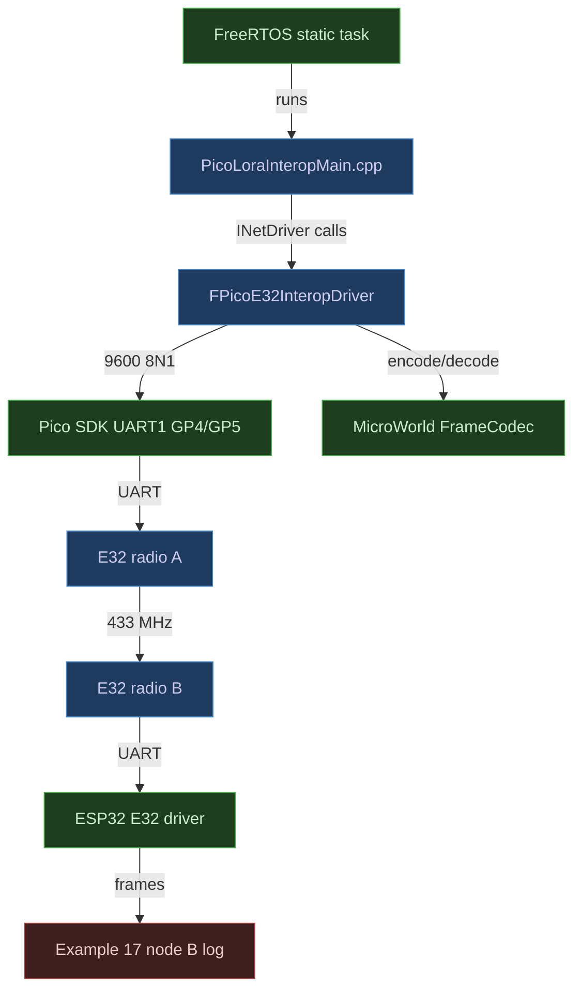
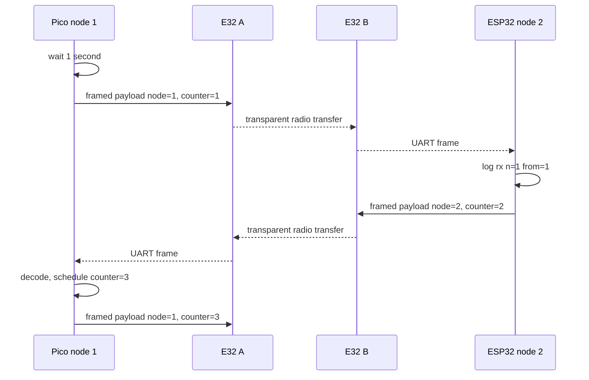

# 🎮 UE5 C++ Change Plan: Pico H + ESP32 E32 LoRa Interoperability

| Field | Value |
|---|---|
| **Created** | 2026-07-26 |
| **Status** | Ready for Approval |
| **Change Type** | New Feature |
| **Author** | Codex |
| **Target Module** | Native Pico downstream consumer |
| **Priority** | High |
| **Estimated Scope** | S (hours) |
| **P4 CL / Branch** | Current Git working tree |

---

## 0 · TL;DR

**What the user sees:** The Pico H and ESP32-S3 are each wired to an
E32-433T20D, but only the ESP32 can currently exchange MicroWorld frames.

**Why it happens:** The Pico firmware has native SDK and FreeRTOS support, but
no UART radio image that uses MicroWorld's portable frame codec.

**What the fix does:** Add one Pico-only interoperability image. Pico node 1
uses UART1 on GP4/GP5, sends the same five-byte counter payload and framed
messages as ESP32 example 17, and exchanges a continuous volley with the
unchanged ESP32 node-B image.

---

## 1 · 🎯 Objective & Motivation

### 1.1 Problem Statement

Prove on physical hardware that MicroWorld's portable Net framing crosses the
native Pico SDK/FreeRTOS boundary and interoperates with the verified ESP32 E32
UART transport. The proof must remain bounded to the current wiring and must
not claim a reusable Pico platform layer before the hardware link succeeds.

### 1.2 Success Criteria

- [ ] `pico.bat build lora` produces ELF, BIN, UF2, and `.elf.map` artifacts.
- [ ] `pico.bat upload lora` accepts only a validated `RPI-RP2` BOOTSEL drive.
- [ ] The image uses Pico UART1, GP4 TX, GP5 RX, 9600 baud, 8N1.
- [ ] Pico links `MicroWorld::Net`, `FreeRTOS-Kernel-Static`, and `hardware_uart`.
- [ ] Pico sends and decodes the same `FrameCodec` format as ESP32 example 17.
- [ ] Pico is node 1 and seeds the five-byte counter volley after one second.
- [ ] ESP32 example 17 node B remains source-identical and builds successfully.
- [ ] A fresh ESP32 node-B boot logs `node=2 open=1`, `rx n=1 from=1`,
  `tx n=2 result=Success`, `rx n=3 from=1`, and
  `tx n=4 result=Success`.
- [ ] The Pico linker map passes the `Core+Net` profile gate.
- [ ] The Pico task retains at least 128 `StackType_t` entries of measured
  high-water headroom during the volley.
- [ ] No FreeRTOS heap provider or `heap_[1-5].c` object is linked.
- [ ] Existing Pico, ESP32, host tests, and repository gates remain green.

### 1.3 Out of Scope

- A production `PlatformPico` package or public Pico `INetDriver`.
- AUX-pin readiness, E32 configuration mode, channel changes, or power changes.
- USB serial output, SWD tooling, OLED output, or new LED policy.
- LoRaWAN, addressed E32 fixed mode, retries, guaranteed delivery, or encryption.
- Pico W, second RP2040 core, dynamic FreeRTOS allocation, or Arduino.
- Modifying the verified ESP32 example 17 runtime source.

---

## 2 · 🔍 Context & Current State Analysis

### 2.1 Affected Systems Map

| System / Class | Role in Change | Ownership |
|---|---|---|
| `FPicoE32InteropDriver` | Consumer-local UART implementation of `INetDriver` | Core consumer fixture |
| `PicoLoraInteropMain.cpp` | FreeRTOS composition root and counter volley | Core consumer fixture |
| `TFrameDecoder<58>` / `EncodeFrame` | Shared wire format | Net |
| `pico-freertos/CMakeLists.txt` | Fourth Pico firmware target | Core consumer fixture |
| `pico.py` / `pico.bat` | `lora` build and upload selector | Core consumer fixture |
| `test_pico.py` | Selector and upload safety coverage | Core consumer fixture |
| ESP32 example 17 node B | Existing radio peer and observable log | Examples |

### 2.2 Existing Code Audit

```text
Modules/Core/tests/consumer/pico-freertos/
├── CMakeLists.txt
├── FreeRTOSConfig.h
├── PicoFreeRtosMain.cpp
├── pico.bat
├── pico.py
└── test_pico.py

Modules/Net/include/MicroWorld/Net/
└── FrameCodec.h

examples/17-TwoBoardLora/
├── platformio.ini
└── src/Main.cpp
```

- The Pico consumer already pins Pico SDK 2.2.0 and FreeRTOS 11.3.0.
- Its build script already generates and safely uploads three UF2 targets.
- Net framing is portable, allocation-free, header-only, and already tested.
- The `Core+Net` linker-map profile requires a physical Net archive object;
  using only the header codec would not prove the Net interface participated.
- ESP32 example 17 sends payload byte 0 as node id and bytes 1–4 as a
  big-endian counter.
- E32 transparent mode broadcasts serial bytes; logical node identity comes
  from the MicroWorld frame and payload.
- ESP32 node B waits until node 1 sends, then alternates replies every second.

### 2.3 UE5-Specific Constraints Checklist

| Constraint | Relevant? | Notes |
|---|---|---|
| Reflection system | No | Not a UE5 repository |
| Garbage Collection | No | Fixed-storage consumer image |
| Blueprint exposure | No | Not applicable |
| Replication / Multiplayer | No | Raw embedded transport proof |
| Gameplay Ability System | No | Not applicable |
| Enhanced Input | No | Not applicable |
| World Subsystems | No | Not applicable |
| Async / Latent actions | Yes | One static FreeRTOS task |
| Soft/Hard references | No | No assets |
| Data Assets / Tables | No | No data assets |
| Plugins / Module boundaries | Yes | `Core <- Net`; SDK remains consumer-only |
| Editor tooling | No | Not applicable |

### 2.4 Risks & Constraints

- Both E32 radios must share frequency, channel, air rate, UART rate, FEC, and
  transparent-mode settings.
- Both antennas must be attached before power and the radios kept separated.
- Pico UART reads must remain non-blocking and each task iteration bounded.
- `FrameReady` must be delivered or cleared before any later `PushByte`.
- The adapter keeps one 64-byte frame in static storage and advances one UART
  byte per task iteration, preserving the `INetDriver` non-blocking contract.
- A successful UF2 copy is not runtime evidence; only the alternating ESP32 log
  establishes the radio exchange.
- Hardware flashing remains separately authorized and requires the ESP32 COM
  port plus Pico BOOTSEL mode.

---

## 3 · 🤔 Options Considered

| # | Approach | Pros | Cons | Complexity | Verdict |
|---|---|---|---|---|---|
| 1 | Consumer-local Pico `INetDriver` using `FrameCodec` | Exercises the real Net seam and archive; no public API | One local adapter | Low | ✅ Selected |
| 2 | Production `PlatformPico` E32 `INetDriver` | Reusable API | Premature before hardware evidence | Medium | ❌ Rejected |
| 3 | Refactor example 17 into a shared cross-platform volley library | Maximum source reuse | Changes verified ESP32 runtime and broadens scope | Medium | ❌ Rejected |

---

## 4 · ✅ Selected Approach

**Option:** Consumer-local Pico `INetDriver` using `FrameCodec` |
**Complexity:** Low

Add one native Pico firmware target beside the existing probe/example/test
images. A private `FPicoE32InteropDriver` owns Pico UART and the frame decoder,
implements the standard Net driver contract, and speaks to unchanged ESP32
example 17 node B. The accepted trade-off is one consumer-only adapter and one
small copy of the example volley payload logic.

### Key Design Decisions

| Decision | Rationale |
|---|---|
| Pico node id 1 | Seeds the existing node-B ESP32 image |
| UART1 GP4/GP5 | Matches wiring and leaves UART0 free |
| 9600 8N1 | Matches E32 factory/default verified setup |
| Consumer-local `INetDriver` | Exact wire compatibility and honest Net archive evidence without public API |
| Static task and driver | Bounded memory; no FreeRTOS heap |
| 128-word high-water assertion | Makes successful sustained traffic evidence of stack margin |
| ESP32 log as evidence | Proves Pico transmit, receive, decode, and reply |
| No ESP32 source changes | Protects hardware-verified behavior |

### Assumptions & Prerequisites

- **Assumes:** Both radios are E32-433T20D and configured identically.
- **Assumes:** M0 and M1 are grounded, AUX is unused, and power is stable.
- **Requires:** Pico GP4 → E32 RXD and GP5 ← E32 TXD.
- **Requires:** ESP32 node B is flashed and its log port is known.
- **Constraint:** Physical upload and monitoring require explicit authorization.

---

## 5 · 🏗️ Architecture

### 5.1 Component Diagram



### 5.2 Sequence Diagram



**Alternative / Error Paths:**

- Invalid CRC or oversize frame → decoder discards and resumes scanning.
- Valid frame with wrong sender, payload size, or payload node id → clear and
  ignore it.
- UART not writable → keep the pending counter for the next task iteration.
- No received bytes → return immediately and delay the task.
- No ESP32 log volley → stop and inspect power, UART crossing, mode pins, radio
  configuration, and channel before changing code.

### 5.3 Components Summary

| Component | Responsibility |
|---|---|
| `FPicoE32InteropDriver` | Configure UART and implement transactional send/receive |
| `PicoLoraInteropMain.cpp` | Own static driver/task and counter volley |
| `TFrameDecoder<58>` | Assemble and validate ESP32-compatible frames |
| `microworld_pico_lora_interop` | Produce the hardware-test image |
| `pico.py` | Map `lora` to target and UF2 safely |
| ESP32 example 17 node B | Observable hardware peer |

### 5.4 Interfaces

- `FPicoE32InteropDriver::TrySend(...)` — validates one-byte addresses and
  accepts one complete encoded frame into the driver's fixed transmit slot.
- `FPicoE32InteropDriver::PumpTransmit()` — advances at most one pending UART
  byte without blocking.
- `FPicoE32InteropDriver::TryReceive(...)` — transactionally returns one frame
  after a bounded UART pump.
- `FPicoE32InteropDriver::MaxPacketBytes()` — reports 58 bytes.
- `void RunLoraInteropTask(void*)` — owns scheduling and reply state.
- `pico.bat build lora` — builds the exact LoRa UF2.
- `pico.bat upload lora [--drive X:]` — builds and safely copies it.

---

## 6 · 📝 Implementation Steps

### Step 1: Add the Pico E32 interoperability composition root

**File:**
`Modules/Core/tests/consumer/pico-freertos/PicoLoraInteropMain.cpp` | new

```cpp
namespace
{
constexpr std::uint8_t LocalNodeId = 1;
constexpr std::uint8_t PeerNodeId = 2;
constexpr std::uint32_t LoraBaudRate = 9600;
constexpr unsigned LoraTxPin = 4;
constexpr unsigned LoraRxPin = 5;
constexpr std::size_t E32MaxPayloadBytes = 58;
constexpr std::size_t VolleyPayloadBytes = 5;
constexpr std::uint64_t VolleyPeriodMilliseconds = 1000;
constexpr std::size_t ReceivePumpByteCap =
    2 * (E32MaxPayloadBytes + MicroWorld::FrameOverheadBytes);
constexpr UBaseType_t MinimumStackHeadroomWords = 128;

class FPicoE32InteropDriver final : public MicroWorld::INetDriver
{
public:
    explicit FPicoE32InteropDriver(std::uint8_t InLocalNodeId) noexcept;
    MicroWorld::ENetResult TrySend(
        const MicroWorld::FNetAddress& InTo,
        MicroWorld::TSpan<const std::uint8_t> InPacket) noexcept override;
    MicroWorld::ENetResult TryReceive(
        MicroWorld::FNetAddress& OutFrom,
        MicroWorld::TSpan<std::uint8_t> InDestination,
        MicroWorld::FNetReceiveResult& OutResult) noexcept override;
    std::size_t MaxPacketBytes() const noexcept override;

private:
    MicroWorld::TFrameDecoder<E32MaxPayloadBytes> Decoder;
    std::uint8_t LocalNodeId;
};

FPicoE32InteropDriver LoraDriver{LocalNodeId};
StaticTask_t LoraTaskControlBlock;
StackType_t LoraTaskStack[512];

MicroWorld::FNetAddress MakeInteropLoraAddress(std::uint8_t NodeId) noexcept;
void RunLoraInteropTask(void*) noexcept;
}

int main()
{
    // Create one static task and start the scheduler.
}
```

#### Implementer Context
> - Include `MicroWorld/Net/FrameCodec.h`, `MicroWorld/Net/NetDriver.h`,
>   FreeRTOS task headers,
>   `hardware/uart.h`, and `pico/time.h`.
> - Use `uart1`, `GPIO_FUNC_UART`, 9600 baud, 8 data bits, 1 stop bit, no parity,
>   and no hardware flow control.
> - Encode byte 0 as local node id and bytes 1–4 as big-endian counter.
> - Accept only source node 2, five payload bytes, and payload node id 2.
> - If the decoder already holds a frame, deliver or clear it before reading.
>   On `FrameReady`, stop pumping immediately; never call `PushByte` again
>   while a frame is held.
> - Pump at most `ReceivePumpByteCap` bytes per task iteration.
> - Keep a pending send until UART accepts it; delay 10 ms every iteration.
> - Preserve all receive outputs on `Unavailable`, `Full`, and `Invalid`.
> - Keep the one-byte LoRa address helper private to this consumer; do not
>   include `PlatformEsp32`.
> - Call `uxTaskGetStackHighWaterMark(nullptr)` after each iteration and assert
>   it is at least `MinimumStackHeadroomWords`.
> - Store driver, task metadata, task stack, and optional diagnostic counters
>   in static storage. Use no heap, logging, GPIO LED, or AUX behavior.
> - Instantiating the adapter through `INetDriver` must pull its out-of-line
>   destructor from `microworld_net`, making `Core+Net` map evidence honest.

---

### Step 2: Add the fourth Pico CMake target

**File:**
`Modules/Core/tests/consumer/pico-freertos/CMakeLists.txt` and
`Modules/Core/tests/consumer/pico-freertos/FreeRTOSConfig.h` | modify

```cmake
set(MICROWORLD_NET_BUILD_TESTS OFF CACHE BOOL "" FORCE)
set(MICROWORLD_NET_BUILD_BENCHMARKS OFF CACHE BOOL "" FORCE)
add_subdirectory(
    "../../../../Net"
    "${CMAKE_CURRENT_BINARY_DIR}/microworld-net"
)

add_executable(
    microworld_pico_lora_interop
    PicoLoraInteropMain.cpp
)
microworld_pico_configure_owned_target(microworld_pico_lora_interop)
target_link_libraries(
    microworld_pico_lora_interop
    PRIVATE MicroWorld::Net hardware_uart
)
pico_add_extra_outputs(microworld_pico_lora_interop)
microworld_pico_add_uf2_output(microworld_pico_lora_interop)
```

#### Implementer Context
> - Add Net only after Core exists; Net must reuse `MicroWorld::Core`.
> - Disable Net host tests and benchmarks before adding its directory.
> - Add the new source to `MICROWORLD_PICO_OWNED_SOURCES` so strict warnings,
>   C++17, no exceptions, and no RTTI apply without reaching vendor sources.
> - Link `hardware_uart` only to the LoRa target.
> - Enable `INCLUDE_uxTaskGetStackHighWaterMark` so the LoRa task can enforce
>   its 128-word runtime margin; dead-code elimination keeps unused targets
>   unchanged.
> - Do not change SDK or FreeRTOS pins, versions, or allocation policy.

---

### Step 3: Add the `lora` build/upload selector

**File:**
`Modules/Core/tests/consumer/pico-freertos/pico.py` | modify

```python
ARTIFACT_TARGETS = {
    # Existing targets remain unchanged.
    "lora": FArtifactTarget(
        "microworld_pico_lora_interop",
        "microworld_pico_lora_interop",
        True,
    ),
}

def print_usage() -> None:
    print("  pico.bat build [probe|example|tests|lora|all]")
    print("  pico.bat upload <probe|example|lora> [--drive X:]")
```

#### Implementer Context
> - Keep selector data in the existing single mapping.
> - `build all` must now require four UF2 files.
> - `upload lora` follows existing BOOTSEL validation unchanged.
> - `tests` remains non-uploadable.
> - Update diagnostics to name all accepted upload selectors.

---

### Step 4: Extend command behavior tests

**File:**
`Modules/Core/tests/consumer/pico-freertos/test_pico.py` | modify

```python
def test_build_lora_targets_only_the_lora_firmware(self) -> None:
    """Proves the LoRa selector requests only its exact CMake target."""

def test_build_all_requires_the_lora_uf2(self) -> None:
    """Proves all fails when the new promised artifact is missing."""

def test_upload_copies_only_the_selected_lora_uf2(self) -> None:
    """Proves lora is uploadable only after BOOTSEL validation."""

def test_upload_lora_rejects_invalid_drive_without_copying(self) -> None:
    """Proves a rejected drive cannot receive the LoRa image."""
```

#### Implementer Context
> - Use isolated temporary directories and mocks; touch only temporary UF2s.
> - Preserve positive/negative pairing: valid `lora` selector succeeds, `tests`
>   remains rejected, missing LoRa artifact makes `all` fail.
> - Assert exact CMake target and exact copied UF2 path.
> - Assert an invalid or missing BOOTSEL drive returns failure and never calls
>   `copyfile`.
> - Do not mock selector validation itself.

---

### Step 5: Document the LoRa target and paired procedure

**Files:**
`Modules/Core/tests/consumer/pico-freertos/AGENTS.md`,
`Modules/Core/tests/consumer/pico-freertos/README.md`,
`Modules/Core/tests/consumer/AGENTS.md`,
`examples/17-TwoBoardLora/AGENTS.md`, and
`examples/17-TwoBoardLora/README.md` | modify

```text
pico.bat build lora
pico.bat upload lora --drive D:
mw flash 17 esp32-s3-node-b COMx
mw log COMx
```

#### Implementer Context
> - Document Pico GP4 TX → E32 RXD and GP5 RX ← E32 TXD.
> - Keep power, common-ground, antenna, M0/M1, and AUX safety explicit.
> - Explain that the ESP32 log is the observable Pico runtime proof.
> - Require a fresh cold-start trace containing `node=2 open=1`,
>   `rx n=1 from=1`, `tx n=2 result=Success`, `rx n=3 from=1`, and
>   `tx n=4 result=Success` before marking hardware verified.
> - Do not change example 17's existing two-ESP hardware evidence.

---

### Implementation Summary

| # | Step | Files | Est. Time | Depends On | Status |
|---|---|---|---|---|---|
| 1 | Add local Pico E32 `INetDriver` image | `PicoLoraInteropMain.cpp` | 60m | — | ☐ |
| 2 | Add CMake target and stack metric | CMake/config | 20m | 1 | ☐ |
| 3 | Add script selector | `pico.py` | 15m | 2 | ☐ |
| 4 | Extend script tests | `test_pico.py` | 20m | 3 | ☐ |
| 5 | Update guides | AGENTS/READMEs | 20m | 1–4 | ☐ |
| 6 | Run compile/static gates | — | 30m | 1–5 | ☐ |
| 7 | Run paired hardware test | — | 20m | 6 | ☐ |

### File Change Map

```text
Modules/Core/tests/consumer/
├── ~ AGENTS.md
└── pico-freertos/
    ├── ~ AGENTS.md
    ├── ~ CMakeLists.txt
    ├── ~ FreeRTOSConfig.h
    ├── + PicoLoraInteropMain.cpp
    ├── ~ README.md
    ├── ~ pico.py
    └── ~ test_pico.py
examples/17-TwoBoardLora/
├── ~ AGENTS.md
└── ~ README.md
```

Legend: `+` new · `~` modified

### Module / Plugin Dependencies

| Dependency Module | Why Needed | Already Referenced? |
|---|---|---|
| MicroWorld Core | FreeRTOS consumer foundation | Yes |
| MicroWorld Net | Portable driver contract and frame encoder/decoder | New to Pico consumer |
| Pico SDK `hardware_uart` | UART1 hardware access | New to LoRa target |
| FreeRTOS-Kernel-Static | Static task scheduling | Yes |

---

## 7 · 🧪 Test Strategy

### Existing Tests (Validation)

| Test Suite / Filter | File | Purpose |
|---|---|---|
| Net FrameCodec tests | `Modules/Net/tests/FrameCodecTests.cpp` | Positive, corrupt, oversize, and resync framing |
| Pico script tests | `pico-freertos/test_pico.py` | Existing selectors and upload safety |
| ESP32 example 17 build | `examples/17-TwoBoardLora` | Preserve verified node A/B images |
| Root CTest | root CMake build | Portable regressions and policy checkers |

### New Tests (Creation)

| Test Name | Code Under Test | Why | Scenario | Expectation | Type |
|---|---|---|---|---|---|
| `test_build_lora_targets_only_the_lora_firmware` | `pico.build` | Exact target safety | `build lora` | Only LoRa CMake target requested | Unit |
| `test_build_all_requires_the_lora_uf2` | `pico.build` | Promised artifact coverage | LoRa UF2 missing | Build returns non-zero | Unit |
| `test_upload_copies_only_the_selected_lora_uf2` | `pico.upload` | Upload correctness | Valid selector/drive | Exactly LoRa UF2 copied | Unit |
| `test_upload_lora_rejects_invalid_drive_without_copying` | `pico.upload` | Upload safety | Invalid BOOTSEL drive | Failure and zero copies | Unit |
| Pico LoRa cross-build | new target | SDK/API compatibility | Native GCC build | ELF/BIN/UF2/map exist | Integration |
| Paired E32 volley | Pico + ESP32 | End-to-end proof | Four alternating counters | ESP log shows 1/2/3/4 sequence | Hardware |

### Test Quality Gates

- [ ] Each script test has an actual command-handler Act step.
- [ ] Positive `lora` cases pair with missing-artifact and invalid-selector checks.
- [ ] Tests assert exact observable target/artifact paths.
- [ ] Temporary filesystem state is isolated per test.
- [ ] Frame corruption and boundary behavior remain owned by existing Net tests.
- [ ] Hardware proof observes both directions, not only Pico transmission.

### Performance Budget

| Metric | Acceptable Threshold | How to Measure |
|---|---|---|
| FreeRTOS dynamic heap | 0 bytes | ELF/map scan |
| Task stack | 512 entries with ≥128-entry runtime headroom | `uxTaskGetStackHighWaterMark` assertion |
| Receive work | ≤128 bytes per iteration | Pump cap |
| UART frame | 11 bytes for volley | Encoder output |
| Volley cadence | 1 second | ESP log timestamps |

---

## 8 · ⚠️ Pitfalls

- **Crossed UART is required.** Pico TX goes to E32 RXD and Pico RX to E32 TXD.
- **Radio settings must match.** UART success does not prove frequency, channel,
  air rate, FEC, or mode agreement.
- **Held decoder frames block input.** Always clear accepted and rejected held
  frames before reading more bytes.
- **Node id exists twice.** Validate both the frame source and payload byte 0.
- **Blocking write is scoped.** The local driver's send call may block for one
  11-byte frame; do not present it as a production non-blocking transport.
- **Node B does not seed.** If Pico never sends counter 1, ESP32 correctly stays
  silent after its open line.
- **No runtime claim from UF2.** Build and copy success are not radio evidence.
- **Do not monitor ESP32 with PlatformIO.** Use `mw log` to avoid USB reset.
- **Do not power without antennas.** Protect both RF output stages.

---

## 9 · 🔄 Rollback Plan

- [ ] Git revert the LoRa interoperability commit.
- [x] Asset rollback needed: No.
- [x] Data migration reversal: No.
- [x] Config revert: Remove the `lora` selector and fourth Pico target.

The existing three Pico targets and ESP32 example 17 remain independent, so
rollback deletes one new source and restores consumer scripts/docs.

---

## 10 · ✅ Verification

- [ ] Format the new C++ source with tracked `clang-format`.
- [ ] Run `py -3 -m unittest .../test_pico.py`.
- [ ] Run `pico.bat build lora` from the repository root.
- [ ] Confirm LoRa ELF, BIN, UF2, and `.elf.map` exist.
- [ ] Run `CheckProfileMap.py --profile Core+Net` on the LoRa map.
- [ ] Confirm the map contains a `microworld_net` archive member, not only
  header-generated frame code.
- [ ] Scan LoRa ELF/map with `arm-none-eabi-nm` and text search for defined or
  unresolved `pvPortMalloc`, `vPortFree`, `malloc`, `_malloc_r`, operator
  `new`/`delete`, and `heap_[1-5].c`.
- [ ] Run `pico.bat build` and confirm all four artifacts.
- [ ] Rebuild existing Pico `probe`, `example`, and `tests` selectors.
- [ ] Build PlatformIO example 17 node A and node B.
- [ ] Compare `examples/17-TwoBoardLora/src/Main.cpp` hash before/after and
  confirm the verified ESP32 runtime source is unchanged.
- [ ] Run root Release build and all CTest tests.
- [ ] Run dependency, formatting, folder-guide, and class-doc checks.
- [ ] Confirm no `PlatformEsp32` include enters the Pico source.
- [ ] Confirm no public MicroWorld API changed.
- [ ] With authorization, flash ESP32 node B and start `mw log`.
- [ ] With authorization, BOOTSEL-upload `pico.bat upload lora`.
- [ ] Cold-start ESP32 node B, then capture exact `node=2 open=1`,
  `rx n=1 from=1`, `tx n=2 result=Success`, `rx n=3 from=1`, and
  `tx n=4 result=Success` lines; continue through at least counter 19 so the
  stack-headroom assertion is exercised over sustained traffic.
- [ ] Update hardware evidence only after the trace is captured.
- [ ] Run the Kernighan/DRY/KISS/YAGNI/CQS/LoD self-scan.

---

## 11 · 🤖 Task Breakdown (for Implementation LLM)

| # | Task | File | Action | Ref | Done When |
|---|---|---|---|---|---|
| 1 | Add local Pico E32 driver/task | `PicoLoraInteropMain.cpp` | Create | Step 1 | `INetDriver` UART/framing volley compiles with bounded state |
| 2 | Add Net, stack metric, and LoRa target | CMake/config | Modify | Step 2 | Fourth target emits outputs and can measure stack margin |
| 3 | Add LoRa selector | `pico.py` | Modify | Step 3 | Build/upload usage and mapping include `lora` |
| 4 | Add selector tests | `test_pico.py` | Modify | Step 4 | Positive and negative behavior passes |
| 5 | Update Pico scoped guide | `pico-freertos/AGENTS.md` | Modify | Step 5 | Target boundary and commands documented |
| 6 | Update Pico README | `pico-freertos/README.md` | Modify | Step 5 | Wiring/build/upload/test procedure documented |
| 7 | Update parent consumer guide | `consumer/AGENTS.md` | Modify | Step 5 | Fourth target is discoverable |
| 8 | Update example guide | `17-TwoBoardLora/AGENTS.md` | Modify | Step 5 | Pico pairing scope protected |
| 9 | Update example README | `17-TwoBoardLora/README.md` | Modify | Step 5 | Paired hardware trace gate documented |
| 10 | Format and build LoRa target | — | Verify | §10 | Strict native build passes |
| 11 | Run script/static gates | — | Verify | §7/§10 | Tests, physical Net archive, and broad heap scans pass |
| 12 | Run Pico/ESP/root regressions | — | Verify | §10 | Existing targets remain green |
| 13 | Flash ESP32 and Pico | — | Hardware | §10 | Both authorized images are installed |
| 14 | Capture sustained exact volley | — | Hardware | §10 | Fresh ESP log reaches counter 19 with exact fields |
| 15 | Review impacts/principles | — | Verify | §10 | No hidden consumers or violations remain |

### Execution Rules

> - **One task at a time.** Read each existing file before modifying it.
> - **Compile after the source/CMake pair**, then after script changes.
> - **Do not change ESP32 runtime source.**
> - **Do not add PlatformPico, AUX/config mode, logging, LED, or retries.**
> - **Stop on a compile/static gate failure** and revise the plan before
>   substituting APIs or allocation policy.
> - **Never flash or monitor hardware without current-session authorization.**

---

## 12 - Plan History

| # | Date | Reviewer | Changes Made |
|---|---|---|---|
| 1 | 2026-07-26 | User | Approved consumer-only Pico node-1 interoperability concept |
| 2 | 2026-07-26 | Codex | Added exact UART, framing, selector, test, and hardware evidence design |
| 3 | 2026-07-26 | Sceptic review | Required local `INetDriver`, held-frame discipline, stack evidence, upload rejection, archive proof, and fresh exact trace |
