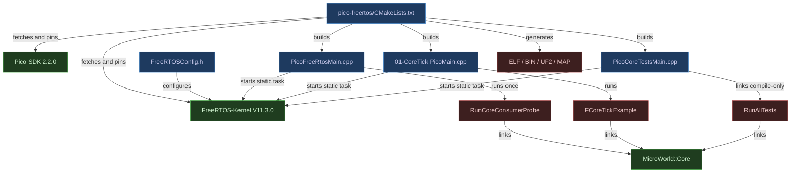
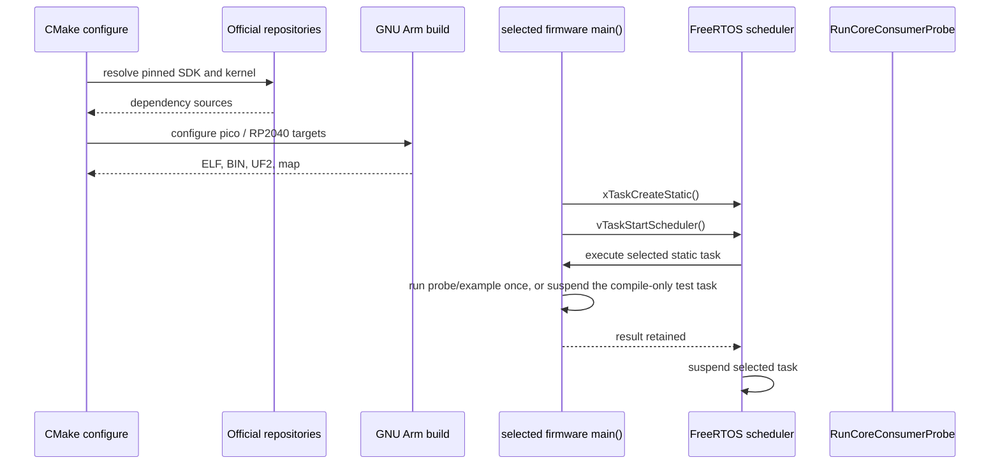

# 🎮 UE5 C++ Change Plan: Raspberry Pi Pico H Native SDK + FreeRTOS Consumer

| Field               | Value |
|---------------------|-------|
| **Created**         | 2026-07-26 |
| **Status**          | Implemented — all non-hardware gates passed |
| **Change Type**     | Redesign |
| **Author**          | Codex |
| **Target Module**   | Core downstream consumer fixture |
| **Priority**        | Medium |
| **Estimated Scope** | M (one day) |
| **P4 CL / Branch**  | Current Git working tree |

---

## 0 · TL;DR

**What the user sees:** The current Raspberry Pi Pico H proof builds through
Arduino Mbed, while MicroWorld's ESP32 targets use the vendor SDK and FreeRTOS
directly.

**Why it happens:** PlatformIO's official RP2040 platform exposes Arduino as its
only framework. The native Raspberry Pi Pico SDK and its supported FreeRTOS port
use CMake instead of PlatformIO framework integration.

**What the fix does:** Replace the Arduino Pico target with a native CMake
consumer using pinned Pico SDK and FreeRTOS-Kernel releases. It builds three
RP2040 artifacts: the public Core probe, the portable `01-CoreTick` example,
and a compile/link image of the existing Core behavioral suite; ESP32 keeps its
PlatformIO/ESP-IDF build unchanged.

---

## 1 · 🎯 Objective & Motivation

### 1.1 Problem Statement

The Pico compile proof currently validates the wrong runtime boundary for the
desired architecture. It must prove that MicroWorld Core compiles and links
through the native RP2040 SDK and FreeRTOS without importing either dependency
into the platform-neutral Core package.

### 1.2 Success Criteria

- [ ] CMake resolves Raspberry Pi Pico SDK `2.2.0`
      (`a1438dff1d38bd9c65dbd693f0e5db4b9ae91779`) and
      FreeRTOS-Kernel `V11.3.0`
      (`9b777ae5c5b8e9e456065a00294d1e5f5f9facf5`) from their official
      repositories.
- [ ] The target uses `PICO_BOARD=pico`, the RP2040 GCC port, and one FreeRTOS
      core.
- [ ] The firmware creates its probe task from static storage and disables
      FreeRTOS dynamic allocation.
- [ ] The FreeRTOS task compiles and links the unchanged
      `RunCoreConsumerProbe()`.
- [ ] The native Pico build also compiles the shared `01-CoreTick` behavior
      behind an RP2040/FreeRTOS composition root.
- [ ] The native Pico build compiles the existing Core behavioral test sources
      behind an RP2040/FreeRTOS compile-link entry point; it does not run those
      stack-heavy tests or claim to run the entire repository suite on device.
- [ ] C++17, strict warnings-as-errors, no exceptions, and no RTTI apply to
      MicroWorld Core and the Pico composition root without changing vendor
      source flags.
- [ ] Each of the probe, `01-CoreTick`, and Core-test targets generates ELF,
      BIN, UF2, and linker-map artifacts; the probe map also feeds the Core
      profile gate.
- [ ] Every firmware ELF/map contains no FreeRTOS dynamic-heap provider or heap
      source.
- [ ] `pico.bat build` configures/builds through shared Python logic and returns
      the native CMake exit status.
- [ ] `pico.bat build [probe|example|tests|all]` selects an exact artifact;
      its default `all` builds all three targets.
- [ ] `pico.bat upload <probe|example>` builds that exact runnable target,
      accepts an optional explicit drive, and copies only its UF2 to one
      validated `RPI-RP2` BOOTSEL volume; it rejects the compile-only test UF2.
- [ ] The scoped and parent consumer `AGENTS.md` files publish the canonical
      build command and point to the Pico README for prerequisites.
- [ ] The Arduino Pico PlatformIO target is removed only after the native build
      and the pre-retirement native, ESP32, and root regression gates pass.
- [ ] Native, ESP32-S3, root build, formatting, and all host tests remain green.

### 1.3 Out of Scope

- Automatically rebooting the board into BOOTSEL or claiming runtime behavior
  after a UF2 copy.
- USB/UART monitoring after upload.
- FreeRTOS SMP or a second RP2040 core.
- USB/UART logging, GPIO, LED, clocks, or peripheral adapters.
- A `PlatformPico` production module.
- Porting ESP32 hardware examples 15–26; their Wi-Fi, UART, I²C, SPI, and LoRa
  dependencies require real Pico platform drivers first.
- Pico W wireless support.
- An unofficial/custom PlatformIO Pico SDK framework.
- Changes to MicroWorld public APIs.

---

## 2 · 🔍 Context & Current State Analysis

### 2.1 Affected Systems Map

| System / Class | Role in Change | Ownership |
|----------------|----------------|-----------|
| Native Pico consumer CMake project | Resolves SDK/RTOS and owns firmware target | Core tests |
| `PicoFreeRtosMain.cpp` | FreeRTOS composition root | Core tests |
| `PicoCoreTestsMain.cpp` | FreeRTOS test composition root | Core tests |
| `FreeRTOSConfig.h` | Single-core/static kernel policy | Core tests |
| `RunCoreConsumerProbe()` | Existing public Core API/link evidence | Core tests |
| `FCoreTickExample` | Shared portable example behavior | `examples/01-CoreTick` |
| `PicoMain.cpp` | Pico/FreeRTOS adapter for `01-CoreTick` | `examples/01-CoreTick` |
| `Main.cpp` | ESP32 adapter for the shared `01-CoreTick` behavior | `examples/01-CoreTick` |
| `platformio.ini` | Removes superseded Arduino Pico environment | Core tests |
| `Modules/Core/library.json` | Removes the Arduino-driven package-wide flag workaround | Core package |
| Consumer and example `AGENTS.md` files | Durable architecture and verification guidance | Core tests / examples |

### 2.2 Existing Code Audit

```text
Modules/Core/tests/consumer/
├── AGENTS.md
├── CMakeLists.txt
├── platformio.ini
└── src/
    ├── AGENTS.md
    ├── CoreConsumerProbe.h
    ├── NativeMain.cpp
    ├── Esp32Main.cpp
    └── PicoMain.cpp
```

- Current architecture pattern: downstream fixtures compose the released CMake
  targets and reuse one public-API probe behind platform entry points.
- Known tech debt: the Arduino Pico proof does not match the ESP32
  vendor-SDK/FreeRTOS boundary.
- Test coverage: host CMake, PlatformIO Native, and ESP-IDF compile consumers
  exist; no native Pico SDK/FreeRTOS consumer exists.
- `examples/01-CoreTick` currently embeds its tick behavior in an ESP32
  `app_main` adapter. Its tiny behavior loop can move into a platform-neutral
  class, letting the ESP32 and Pico composition roots share the same example.
- The existing Core behavioral suite owns six source files plus `TestSupport.h`;
  `TestMain.cpp` supplies host `main()` and must not be linked into Pico.
- Examples 15–26 reach ESP32-only `PlatformEsp32` Wi-Fi/UART/I²C/SPI/LoRa
  boundaries. They are intentionally excluded from this RP2040 baseline.
- Local prerequisites: CMake 4.0.2 and Git 2.53.0 are available. PlatformIO's
  cached GNU Arm toolchain 9.2.1 and Ninja are available for initial
  verification but are not hard-coded into repository files.

### 2.3 UE5-Specific Constraints Checklist

| Constraint | Relevant? | Notes |
|------------|-----------|-------|
| Reflection system (UPROPERTY/UFUNCTION) | No | Not a UE5 repository |
| Garbage Collection considerations | No | Core-only probe |
| Blueprint exposure needed | No | Not applicable |
| Replication / Multiplayer | No | Not applicable |
| Gameplay Ability System (GAS) | No | Not applicable |
| Enhanced Input System | No | Not applicable |
| World Subsystems | No | Not applicable |
| Async / Latent actions | Yes | FreeRTOS task and scheduler lifecycle |
| Soft/Hard object references | No | No assets |
| Data Assets / Data Tables | No | No assets |
| Plugins / Module boundaries | Yes | SDK/RTOS remain consumer-only |
| Editor tooling / Details panel | No | Not applicable |

### 2.4 Risks & Constraints

- First configuration requires network access to clone two pinned dependencies.
- Pico SDK initialization must happen in its documented CMake order.
- The FreeRTOS RP2040 port reads `FREERTOS_CONFIG_FILE_DIRECTORY`; it does not
  consume the newer root project's `freertos_config` interface target.
- The RP2040 port contributes kernel files through `INTERFACE_SOURCES`, so
  firmware target-wide warning flags would also affect vendor sources.
- The current cached GCC 9.2.1 must be tested against Pico SDK 2.2.0 and
  FreeRTOS 11.3.0; if incompatible, use Arm GNU Toolchain `14.2.Rel1`
  (`mingw-w64-x86_64-arm-none-eabi`) and keep warnings strict.
- A compile-only task cannot prove scheduler execution on physical hardware.
- Several Core tests reserve roughly 256 KiB of automatic storage, so the Pico
  test firmware must remain a compile/link artifact and never run the suite.
- Generated dependency trees must stay below the ignored consumer-local
  `build/` directory.

---

## 3 · 🤔 Options Considered

| # | Approach | Pros | Cons | Complexity | Verdict |
|---|----------|------|------|------------|---------|
| 1 | Native CMake with pinned FetchContent dependencies | Official SDK path; reproducible; no repository submodules | Different command from ESP32 PlatformIO | Medium | ✅ Selected |
| 2 | Git submodules for SDK and kernel | Exact revisions; offline after clone | Adds submodule lifecycle and recursive checkout burden | Medium | ❌ Rejected |
| 3 | Community PlatformIO Pico-SDK platform | Keeps `pio run` UX | Unofficial framework integration and maintenance risk | Medium | ❌ Rejected |
| 4 | Keep Arduino Mbed | Already builds | Wrong runtime boundary and no direct FreeRTOS contract | Low | ❌ Rejected |

---

## 4 · ✅ Selected Approach

**Option:** Native CMake with pinned FetchContent dependencies |
**Complexity:** Medium

Add a self-contained `pico-freertos` project below the existing consumer
fixture. It fetches official Pico SDK and FreeRTOS releases into its ignored
build tree, composes `MicroWorld::Core`, and links one statically allocated
single-core FreeRTOS probe task. The prior Arduino target is removed only after
the replacement passes all compile and regression gates.

### Key Design Decisions

| Decision | Rationale |
|----------|-----------|
| Pico SDK `2.2.0` / `a1438dff1d38bd9c65dbd693f0e5db4b9ae91779` | Immutable release revision with RP2040 support |
| FreeRTOS-Kernel `V11.3.0` / `9b777ae5c5b8e9e456065a00294d1e5f5f9facf5` | Immutable release revision containing the maintained RP2040 port |
| CMake `FetchContent` with full commits | Automatic, immutable resolution without submodules |
| One FreeRTOS core | Deterministic minimum matching the approved concept |
| Static allocation only | Matches MicroWorld's bounded-memory policy |
| Reuse `RunCoreConsumerProbe()` | One source of truth for API/link behavior |
| Consumer-local SDK/RTOS dependencies | Core stays platform-neutral |
| Restore Core's pre-Pico `library.json` build block | Prevent the Arduino workaround from changing every PlatformIO consumer |
| Use PlatformIO cache only as a local tool source | Avoids machine paths in committed files |

### Assumptions & Prerequisites

- **Assumes:** Git and CMake can reach GitHub during first configuration.
- **Assumes:** The existing GNU Arm 9.2.1 toolchain can compile the pinned
  releases; compatibility is a verification gate, not an unsupported promise.
- **Requires:** A Ninja executable and GNU Arm toolchain passed through normal
  CMake options or available on `PATH`.
- **Constraint:** The upload command may perform only a validated BOOTSEL UF2
  copy. Running it against hardware and claiming runtime behavior require
  separate explicit authorization.

---

## 5 · 🏗️ Architecture

### 5.1 Component Diagram



### 5.2 Sequence Diagram



**Alternative / Error Paths:**

- If dependency resolution fails → report the exact repository/tag/network
  failure; do not silently fall back to an unpinned branch.
- If GCC 9.2.1 is unsupported → install Arm GNU Toolchain `14.2.Rel1` for
  Windows x86_64/AArch32 bare-metal, reconfigure from an empty build tree, and
  keep strict flags.
- If static task creation fails → `main()` returns a non-zero diagnostic code;
  the scheduler is not started.
- If the scheduler unexpectedly returns → `main()` returns a distinct non-zero
  diagnostic code.

### 5.3 Components Summary

| Component | Responsibility |
|-----------|----------------|
| `CMakeLists.txt` | Own dependency pins, board selection, three targets, and artifacts |
| `pico_sdk_import.cmake` | Official external-project SDK locator/fetch helper |
| `FreeRTOSConfig.h` | Own bounded single-core scheduler configuration |
| `PicoFreeRtosMain.cpp` | Own static task storage and scheduler startup |
| `PicoCoreTestsMain.cpp` | Own inert static test-task storage for compile/link evidence |
| `FCoreTickExample` | Own portable `01-CoreTick` lifecycle/tick behavior |
| `examples/01-CoreTick/src/PicoMain.cpp` | Adapt the portable example to Pico SDK time and FreeRTOS delay |
| `RunCoreConsumerProbe()` | Exercise representative Core public behavior |
| `pico.bat` | Locate Python and forward build/upload arguments |
| `pico.py` | Discover tools, run CMake, validate BOOTSEL, and copy UF2 |
| `test_pico.py` | Verify command construction and safe drive selection |
| `README.md` | Publish repeatable BAT/Python and direct CMake commands |
| `AGENTS.md` | Protect the consumer-only SDK/RTOS boundary |

### 5.4 Interfaces

- `int main()` — creates the static task, starts the scheduler, and returns only
  on setup/scheduler failure.
- `void RunCoreProbeTask(void*)` — runs the shared probe once, retains its
  result, then suspends itself.
- `pico.bat build [probe|example|tests|all]` — defaults to `all`; a selector
  forwards one exact CMake target to Python.
- `pico.bat upload <probe|example> [--drive X:]` — requires a runnable target
  selector, builds it, resolves exactly one validated `RPI-RP2` BOOTSEL volume,
  and copies only that generated UF2. `tests` is explicitly build-only.
- `pico.py` internal functions — keep tool discovery, command construction,
  volume validation, and file copy independently testable.
- `int RunCoreConsumerProbe() noexcept` — unchanged shared public Core probe.
- `FREERTOS_CONFIG_FILE_DIRECTORY` — CMake boundary exposing only the
  consumer's `FreeRTOSConfig.h` to the RP2040 port.

---

## 6 · 📝 Implementation Steps

### Step 1: Add the native Pico consumer boundary guide

**File:** `Modules/Core/tests/consumer/pico-freertos/AGENTS.md` | new

```text
Pico SDK + FreeRTOS -> consumer composition root -> MicroWorld::Core
MicroWorld::Core -X-> Pico SDK / FreeRTOS

Build from the repository root:
Modules\Core\tests\consumer\pico-freertos\pico.bat build

Upload after entering BOOTSEL:
Modules\Core\tests\consumer\pico-freertos\pico.bat upload example [--drive X:]
```

#### Implementer Context
> - Inherit the parent consumer guide.
> - State that this folder is a downstream proof, not a production platform
>   package.
> - Document dependency pins, static allocation, single-core policy, safe
>   BOOTSEL upload boundary, and consumer-local build verification.
> - Add a `Build and upload` section containing the exact repository-root
>   commands above. State that `build` produces probe, example, and test UF2s;
>   list the three focused `build` selectors and require one selector for
>   `upload`, allowing only the runnable `probe` or `example` artifacts. Link
>   `README.md` for prerequisites, artifacts, direct CMake commands, and
>   troubleshooting.
> - Do not claim hardware execution.

---

### Step 2: Add the official Pico SDK import helper

**File:**
`Modules/Core/tests/consumer/pico-freertos/pico_sdk_import.cmake` | new

```cmake
# Exact unmodified copy from pico-sdk 2.2.0:
# external/pico_sdk_import.cmake
```

#### Implementer Context
> - Copy the upstream BSD-3-Clause file byte-for-byte; preserve its license.
> - Do not hand-reimplement SDK discovery.
> - The owning `CMakeLists.txt` pins `PICO_SDK_FETCH_FROM_GIT_TAG` before
>   including this file.

---

### Step 3: Define the bounded FreeRTOS configuration

**File:** `Modules/Core/tests/consumer/pico-freertos/FreeRTOSConfig.h` | new

```cpp
#pragma once

#include <assert.h>
#include <stddef.h>
#include <stdint.h>

#define configUSE_PREEMPTION 1
#define configUSE_TICKLESS_IDLE 0
#define configUSE_IDLE_HOOK 0
#define configUSE_TICK_HOOK 0
#define configTICK_RATE_HZ ((TickType_t)1000)
#define configMAX_PRIORITIES 8
#define configMINIMAL_STACK_SIZE ((configSTACK_DEPTH_TYPE)256)
#define configUSE_16_BIT_TICKS 0
#define configIDLE_SHOULD_YIELD 1

#define configUSE_MUTEXES 1
#define configUSE_RECURSIVE_MUTEXES 1
#define configUSE_APPLICATION_TASK_TAG 0
#define configUSE_COUNTING_SEMAPHORES 0
#define configQUEUE_REGISTRY_SIZE 0
#define configUSE_QUEUE_SETS 0
#define configUSE_TIME_SLICING 1
#define configUSE_NEWLIB_REENTRANT 0
#define configENABLE_BACKWARD_COMPATIBILITY 0
#define configNUM_THREAD_LOCAL_STORAGE_POINTERS 0

#define configSTACK_DEPTH_TYPE uint32_t
#define configMESSAGE_BUFFER_LENGTH_TYPE size_t
#define configSUPPORT_STATIC_ALLOCATION 1
#define configSUPPORT_DYNAMIC_ALLOCATION 0

#define configCHECK_FOR_STACK_OVERFLOW 0
#define configUSE_MALLOC_FAILED_HOOK 0
#define configUSE_DAEMON_TASK_STARTUP_HOOK 0
#define configGENERATE_RUN_TIME_STATS 0
#define configUSE_TRACE_FACILITY 0
#define configUSE_STATS_FORMATTING_FUNCTIONS 0
#define configUSE_CO_ROUTINES 0
#define configMAX_CO_ROUTINE_PRIORITIES 1
#define configUSE_TIMERS 0
#define configUSE_EVENT_GROUPS 0
#define configUSE_STREAM_BUFFERS 0

#define configNUMBER_OF_CORES 1
#define configNUM_CORES configNUMBER_OF_CORES
#define configTICK_CORE 0
#define configRUN_MULTIPLE_PRIORITIES 1
#define configUSE_PASSIVE_IDLE_HOOK 0

#define configSUPPORT_PICO_SYNC_INTEROP 0
#define configSUPPORT_PICO_TIME_INTEROP 0
#define configASSERT(Expression) assert(Expression)

#define INCLUDE_vTaskPrioritySet 0
#define INCLUDE_uxTaskPriorityGet 0
#define INCLUDE_vTaskDelete 0
#define INCLUDE_vTaskSuspend 1
#define INCLUDE_vTaskDelayUntil 0
#define INCLUDE_vTaskDelay 1
#define INCLUDE_xTaskGetSchedulerState 0
#define INCLUDE_xTaskGetCurrentTaskHandle 0
#define INCLUDE_uxTaskGetStackHighWaterMark 0
#define INCLUDE_xTaskGetIdleTaskHandle 0
#define INCLUDE_eTaskGetState 0
#define INCLUDE_xTimerPendFunctionCall 0
#define INCLUDE_xTaskAbortDelay 0
#define INCLUDE_xTaskGetHandle 0
#define INCLUDE_xTaskResumeFromISR 0
#define INCLUDE_xQueueGetMutexHolder 0
```

#### Implementer Context
> - Treat the macro set and values above as the complete policy; add a macro
>   only when the pinned kernel requires it, and document why.
> - Enable only the scheduler/task APIs the probe, example, and inert test task
>   use; `INCLUDE_vTaskDelay` is required by the Pico `01-CoreTick` adapter.
> - Keep tickless idle, software timers, trace, statistics, hooks, and dynamic
>   allocation disabled.
> - Keep Pico sync/time interoperability disabled: this bounded baseline uses
>   direct Pico time and no Pico SDK lock/time bridge.
> - Do not copy the example's 128 KiB heap because dynamic allocation is off.

---

### Step 4: Add the native FreeRTOS composition root

**File:**
`Modules/Core/tests/consumer/pico-freertos/PicoFreeRtosMain.cpp` | new

```cpp
#include "../src/CoreConsumerProbe.h"

#include <FreeRTOS.h>
#include <task.h>

namespace
{

/** Reserves bounded task stack storage for the one-shot Core probe. */
constexpr configSTACK_DEPTH_TYPE CoreProbeTaskStackDepth = 512;

/** Owns the FreeRTOS task metadata for the full firmware lifetime. */
StaticTask_t CoreProbeTaskControlBlock;

/** Owns the statically allocated stack for the full firmware lifetime. */
StackType_t CoreProbeTaskStack[CoreProbeTaskStackDepth];

/** Retains the probe outcome so the linked behavior remains observable. */
volatile int CoreProbeResult = -1;

/** Runs the shared Core probe once, then removes itself from scheduling. */
void RunCoreProbeTask(void*)
{
    CoreProbeResult = RunCoreConsumerProbe();
    vTaskSuspend(nullptr);
}

} // namespace

/** Creates the bounded probe task and transfers control to FreeRTOS. */
int main()
{
    TaskHandle_t ProbeTask = xTaskCreateStatic(
        RunCoreProbeTask,
        "MicroWorldCoreProbe",
        CoreProbeTaskStackDepth,
        nullptr,
        tskIDLE_PRIORITY + 1,
        CoreProbeTaskStack,
        &CoreProbeTaskControlBlock);

    if (ProbeTask == nullptr)
    {
        return 1;
    }

    vTaskStartScheduler();
    return 2;
}
```

#### Implementer Context
> - Include only the existing probe and FreeRTOS task headers.
> - Keep all persistent storage in the anonymous namespace and document why it
>   persists.
> - No `new`, `malloc`, logging, GPIO, USB, or busy loop.
> - Use `xTaskCreateStatic`; dynamic allocation must be impossible by config.
> - Format with the repository's explicit `clang-format` policy.

---

### Step 4a: Split `01-CoreTick` behavior from its ESP32 adapter

**Files:**
`examples/01-CoreTick/src/CoreTickExample.h`,
`examples/01-CoreTick/src/CoreTickExample.cpp`, and
`examples/01-CoreTick/src/Main.cpp`,
`examples/01-CoreTick/src/CMakeLists.txt`, and
`examples/01-CoreTick/tests/CMakeLists.txt`, and
`examples/01-CoreTick/tests/CoreTickExampleTests.cpp` | create/modify

Create `FCoreTickExample`, a small platform-neutral state holder around the
existing `FTickFunction` demonstration. `Begin(now)` initializes the tick
function; `Advance(now)` returns the tick decision plus a completion indicator
after the current five-tick example behavior. Keep time as caller-supplied
`TimePointMilliseconds`, so neither Pico SDK nor ESP32 headers enter the
portable behavior.

Refactor the existing ESP32 `Main.cpp` into a composition root that reads time,
logs the returned decision, delays with the existing ESP32 boundary, and exits
when `FCoreTickExample` reports completion. Preserve its observable ESP32
behavior and move no peripheral logic into the shared class.

The new standalone host test CMake project adds `Modules/Core`, then links an
example test executable from the existing Core `TestMain.cpp`,
`CoreTickExample.cpp`, and `CoreTickExampleTests.cpp`. It reuses the existing
allocation-free `TestSupport.h` registry, calls `enable_testing()`, and
registers one CTest entry. This keeps the behavior test outside Core's
dependency direction while making the extracted example logic executable on
the host.

#### Implementer Context
> - The shared class owns only the prior tick counter and `FTickFunction`.
> - `Main.cpp` remains the ESP-IDF `app_main` adapter; it must not include Pico
>   or FreeRTOS headers directly.
> - Add `CoreTickExample.cpp` to the ESP-IDF `idf_component_register(SRCS ...)`
>   list. That list is the source-of-truth for PlatformIO's ESP-IDF build, so
>   leave `PicoMain.cpp` unlisted instead of adding a PlatformIO source filter.
> - Add a standalone host CTest target for the extracted behavior. Reuse
>   `Modules/Core/tests/TestMain.cpp` and `TestSupport.h`; prove five due ticks
>   produce completion only on the fifth and early polls do not increment the
>   count. This verifies the refactor before either embedded adapter is built.
> - Disable Core's own tests/benchmarks/examples in that standalone test CMake
>   project before adding `Modules/Core`; the one executable must own the
>   example test scope rather than recursively rebuilding the repository.
> - Document the state members and public functions with the repository's
>   Doxygen requirement.
> - Do not add a generic platform abstraction: one local shared class is the
>   smallest boundary for this one example.

---

### Step 4b: Add the Pico example and Core-test composition roots

**Files:**
`examples/01-CoreTick/src/PicoMain.cpp` and
`Modules/Core/tests/consumer/pico-freertos/PicoCoreTestsMain.cpp` | new

`PicoMain.cpp` creates a statically allocated FreeRTOS task. It obtains
monotonic milliseconds from the Pico SDK, invokes `FCoreTickExample`, delays
between iterations with `vTaskDelay(pdMS_TO_TICKS(10))`, retains an integer
completion result, and suspends itself. Its stack is 512 `StackType_t` entries;
it owns no logging, GPIO, USB, or hardware driver policy.

`PicoCoreTestsMain.cpp` creates its own 256-entry statically allocated task
that immediately suspends. It deliberately does not call
`MicroWorld::Tests::RunAllTests()`: several existing test cases allocate about
256 KiB on their task stack, exceeding RP2040 safety margins. It compiles and
links these existing Core test sources with the Pico-specific
`PicoCoreAllocationCounters.cpp` definition,
`LogTests.cpp`, `TickFunctionTests.cpp`, `MemoryTests.cpp`, `DelegateTests.cpp`,
and `TimerManagerTests.cpp`; it deliberately excludes `TestMain.cpp` because
the Pico entry point supplies `main()`.

#### Implementer Context
> - Use separate task-control blocks and stacks for each firmware image; their
>   static lifetime is intentional. Only the probe and example retain a result.
> - Apply owned-source warnings/no-exception/no-RTTI options to both new entry
>   points and to the Core test sources only. Do not apply them to Pico SDK or
>   FreeRTOS vendor source.
> - `PicoCoreAllocationCounters.cpp` supplies the existing test counter symbol
>   without importing the host-only `std::aligned_alloc` overrides. The
>   dynamic-heap proof concerns FreeRTOS heap providers, not libc symbols from
>   compile-only test code.
> - This target proves that Core tests compile and link for Pico. It is not a
>   runnable test firmware and `pico.py upload tests` must reject it before any
>   build, drive discovery, or copy operation.

---

### Step 5: Add the pinned native Pico CMake project

**File:** `Modules/Core/tests/consumer/pico-freertos/CMakeLists.txt` | new

```cmake
cmake_minimum_required(VERSION 3.20)

set(PICO_BOARD pico CACHE STRING "Pico SDK board")
set(PICO_SDK_FETCH_FROM_GIT ON CACHE BOOL "" FORCE)
set(
    PICO_SDK_FETCH_FROM_GIT_TAG
    a1438dff1d38bd9c65dbd693f0e5db4b9ae91779
    CACHE STRING
    "Pico SDK 2.2.0 commit"
    FORCE
)
include(pico_sdk_import.cmake)

project(microworld_pico_freertos_consumer LANGUAGES C CXX ASM)

pico_sdk_init()

set(
    FREERTOS_CONFIG_FILE_DIRECTORY
    "${CMAKE_CURRENT_LIST_DIR}"
    CACHE PATH
    "Directory containing the consumer FreeRTOSConfig.h"
    FORCE
)

include(FetchContent)
FetchContent_Declare(
    freertos_kernel
    GIT_REPOSITORY https://github.com/FreeRTOS/FreeRTOS-Kernel.git
    GIT_TAG 9b777ae5c5b8e9e456065a00294d1e5f5f9facf5
    SOURCE_SUBDIR portable/ThirdParty/GCC/RP2040
)
FetchContent_MakeAvailable(freertos_kernel)

set(MICROWORLD_BUILD_TESTS OFF CACHE BOOL "" FORCE)
add_subdirectory("../../.." "${CMAKE_CURRENT_BINARY_DIR}/microworld")

set(
    MICROWORLD_PICO_CORE_TEST_SOURCES
    PicoCoreAllocationCounters.cpp
    "${CMAKE_CURRENT_LIST_DIR}/../../LogTests.cpp"
    "${CMAKE_CURRENT_LIST_DIR}/../../TickFunctionTests.cpp"
    "${CMAKE_CURRENT_LIST_DIR}/../../MemoryTests.cpp"
    "${CMAKE_CURRENT_LIST_DIR}/../../DelegateTests.cpp"
    "${CMAKE_CURRENT_LIST_DIR}/../../TimerManagerTests.cpp"
)
set(
    MICROWORLD_CORE_TICK_SOURCE_DIRECTORY
    "${CMAKE_CURRENT_LIST_DIR}/../../../../../examples/01-CoreTick/src"
)

function(microworld_pico_configure_owned_target Target)
    target_link_libraries(
        ${Target}
        PRIVATE
            MicroWorld::Core
            FreeRTOS-Kernel-Static
            pico_stdlib
    )
    target_compile_features(${Target} PRIVATE cxx_std_17)
endfunction()

set(MICROWORLD_PICO_OWNED_SOURCES
    PicoFreeRtosMain.cpp
    PicoCoreTestsMain.cpp
    "${MICROWORLD_CORE_TICK_SOURCE_DIRECTORY}/PicoMain.cpp"
    "${MICROWORLD_CORE_TICK_SOURCE_DIRECTORY}/CoreTickExample.cpp"
    ${MICROWORLD_PICO_CORE_TEST_SOURCES}
)
set_source_files_properties(
    ${MICROWORLD_PICO_OWNED_SOURCES}
    PROPERTIES
        COMPILE_OPTIONS
            "-Wall;-Wextra;-Wpedantic;-Werror;-fno-exceptions;-fno-rtti"
)
target_compile_options(microworld PRIVATE -fno-exceptions -fno-rtti)

add_executable(microworld_pico_freertos_consumer PicoFreeRtosMain.cpp)
microworld_pico_configure_owned_target(microworld_pico_freertos_consumer)
microworld_enable_profile_map(
    microworld_pico_freertos_consumer
    "${CMAKE_CURRENT_BINARY_DIR}/microworld_pico_freertos.map"
)
pico_add_extra_outputs(microworld_pico_freertos_consumer)

add_executable(
    microworld_pico_core_tick_example
    "${MICROWORLD_CORE_TICK_SOURCE_DIRECTORY}/PicoMain.cpp"
    "${MICROWORLD_CORE_TICK_SOURCE_DIRECTORY}/CoreTickExample.cpp"
)
microworld_pico_configure_owned_target(microworld_pico_core_tick_example)
microworld_enable_profile_map(
    microworld_pico_core_tick_example
    "${CMAKE_CURRENT_BINARY_DIR}/microworld_pico_core_tick_example.map"
)
pico_add_extra_outputs(microworld_pico_core_tick_example)

add_executable(
    microworld_pico_core_tests
    PicoCoreTestsMain.cpp
    ${MICROWORLD_PICO_CORE_TEST_SOURCES}
)
target_include_directories(
    microworld_pico_core_tests
    PRIVATE "${CMAKE_CURRENT_LIST_DIR}/../.."
)
microworld_pico_configure_owned_target(microworld_pico_core_tests)
microworld_enable_profile_map(
    microworld_pico_core_tests
    "${CMAKE_CURRENT_BINARY_DIR}/microworld_pico_core_tests.map"
)
pico_add_extra_outputs(microworld_pico_core_tests)
```

#### Implementer Context
> - Preserve the documented Pico SDK ordering: import before `project()`,
>   initialize after it.
> - `FetchContent` may write only below the ignored local `build/` tree.
> - Print and verify both resolved `HEAD` revisions during configure; fail when
>   either differs from the full commit above.
> - Set `FREERTOS_CONFIG_FILE_DIRECTORY` before adding the RP2040 port.
> - Build exactly three firmware targets: `microworld_pico_freertos_consumer`,
>   `microworld_pico_core_tick_example`, and `microworld_pico_core_tests`.
> - Apply strict/no-exception/no-RTTI options to all owned Pico entry, example,
>   and test sources, not firmware target options: the port contributes vendor
>   C files through `INTERFACE_SOURCES`.
> - Keep C++17 scoped through `target_compile_features` on MicroWorld-owned
>   targets; do not set directory-global C/C++ language standards.
> - Add only no-exception/no-RTTI options to `microworld`; its CMake target
>   already owns strict warnings and C++17.
> - Link `FreeRTOS-Kernel-Static`, never a heap implementation.
> - Add `pico_add_extra_outputs()` and a deterministic linker map to every
>   firmware target. Run the Core profile check only on the probe map, and scan
>   every target's ELF/map for prohibited FreeRTOS heap providers.
> - If upstream target names differ at the pinned release, verify the official
>   RP2040 port and revise this plan before substituting another target.

---

### Step 6: Add and document BAT/Python build and upload commands

**Files:**
`Modules/Core/tests/consumer/pico-freertos/pico.bat`,
`Modules/Core/tests/consumer/pico-freertos/pico.py`,
`Modules/Core/tests/consumer/pico-freertos/test_pico.py`, and
`Modules/Core/tests/consumer/pico-freertos/README.md` | new

```bat
pico.bat build
pico.bat build probe
pico.bat build example
pico.bat build tests
pico.bat upload example
pico.bat upload probe --drive E:
```

`pico.bat` is a thin dispatcher:

1. Probe `py -3`, then `python`, then PlatformIO's bundled Python with a
   version-only command; require Python 3.9 or newer.
2. Select the first successful interpreter before invoking `pico.py`.
3. Invoke the adjacent `pico.py` exactly once with all original arguments.
4. Return that single Python process exit code unchanged; never retry a failed
   build/upload under another interpreter.

`pico.py` owns the behavior:

| Command | Behavior |
|---------|----------|
| `build` / `build all` | Locate CMake, Git, Ninja, and GNU Arm; configure the consumer-local build tree; build all three firmware targets |
| `build probe` | Build only `microworld_pico_freertos_consumer` and verify its UF2 |
| `build example` | Build only `microworld_pico_core_tick_example` and verify its UF2 |
| `build tests` | Build only `microworld_pico_core_tests` and verify its UF2 |
| `upload <probe|example>` | Build the selected runnable target; validate one BOOTSEL volume; copy only its UF2 |
| `upload <selector> --drive X:` | Validate only the explicit drive before copying; never bypass validation |

Tool discovery checks `PATH` first, then known PlatformIO package locations
under `Path.home()`. It passes resolved paths to CMake without writing
machine-specific paths into repository files.

An upload destination is valid only when all checks pass:

1. The drive-letter root exists.
2. Its Windows volume label is exactly `RPI-RP2`.
3. `INFO_UF2.TXT` exists and contains `Board-ID: RPI-RP2`.
4. Automatic discovery finds exactly one valid drive; zero or multiple matches
   fail without copying.

An explicit `--drive` value must match a drive-letter root such as `E:` or
`E:\`, then normalize both forms to uppercase `E:\` before validation. Reject
relative paths, subdirectories, and UNC/network locations before performing
filesystem access. Read the volume label through the Windows API using only
Python's standard library.

Use `subprocess.run()` with argument lists and explicit working directories;
never build command strings with `shell=True`. Use `shutil.copyfile()` for the
UF2 because the BOOTSEL volume may disconnect immediately after a successful
write; propagate any copy/open failure as a non-zero exit. All destination
validation is read-only, and the UF2 copy is the first write to the drive.

#### Implementer Context
> - Anchor every repository/build/artifact path to `Path(__file__).resolve()`;
>   the commands must work from any current directory.
> - Probe interpreters before dispatch and invoke `pico.py` once; a non-zero
>   script result is final and must never trigger an interpreter fallback.
> - Map `probe`, `example`, and `tests` to their exact CMake target and UF2
>   stem in one table. `all` is valid only for build; upload accepts only
>   `probe` or `example`, rejecting missing, `all`, and `tests` selectors before
>   configuration or drive I/O.
> - `upload` builds its selected target first and stops before drive discovery
>   when the build fails.
> - Normalize drive roots before validation; do not recursively delete
>   directories, perform validation writes, or guess between multiple drives.
> - A completed copy proves transport only; do not claim the firmware booted.
> - Unit-test command construction, tool fallback, `X:`/`X:\` normalization,
>   explicit/automatic drive validation, relative/UNC/zero/multiple/wrong-drive
>   rejection, selector rejection/mapping, build-failure propagation, and the
>   successful selected-UF2 copy path using temporary directories and mocks.
> - Document the pinned dependencies, prerequisites, artifacts, BOOTSEL steps,
>   direct CMake escape hatch, and exact BAT commands in `README.md`.

---

### Step 7: Gate and snapshot the Arduino Pico baseline

**Files:** no committed file changes | verification/snapshot

Before retirement:

1. Build the native Pico firmware from an empty build tree.
2. Pass the Core profile-map and FreeRTOS dynamic-heap symbol checks.
3. Clean-build PlatformIO `native`, `raspberry-pi-pico`, and `esp32-s3`.
4. Pass the root Release build, CTest suite, formatting, and folder-guide gates.
5. Capture the current `platformio.ini`/`library.json` diff plus the untracked
   `PicoMain.cpp` content in a temporary rollback patch.

#### Implementer Context
> - Do not proceed to Step 8 when any pre-retirement command fails.
> - Git cannot restore the current untracked `PicoMain.cpp`; the rollback patch
>   is mandatory even though its exact source is also preserved in §9.
> - Report the rollback patch path before deleting the Arduino entry point.

---

### Step 8: Retire the Arduino Pico target and its flag workaround

**Files:**
`Modules/Core/tests/consumer/platformio.ini` and
`Modules/Core/tests/consumer/src/PicoMain.cpp` and
`Modules/Core/library.json` | modify/delete/restore

```ini
# Remove [env:raspberry-pi-pico] and the native PicoMain.cpp exclusion.
# Keep native and every ESP32 environment byte-for-byte otherwise.
```

```cpp
// Delete PicoMain.cpp after the native CMake build passes.
```

```json
"build": {
  "includeDir": "include",
  "srcDir": "src",
  "libArchive": true
}
```

#### Implementer Context
> - Perform this step only after every Step 7 gate and snapshot succeeds.
> - Do not remove locally cached PlatformIO packages; they are recoverable tools
>   and may still supply GNU Arm/Ninja on this workstation.
> - Do not modify ESP32 environment definitions.
> - Restore `Modules/Core/library.json` to its pre-Pico build block. The strict
>   flags were introduced to make Arduino Mbed and Core use different language
>   modes; the native CMake consumer now owns its flags without changing every
>   PlatformIO consumer.

---

### Step 9: Update the parent consumer architecture guide

**File:** `Modules/Core/tests/consumer/AGENTS.md` | modify

```text
PlatformIO -> Native / ESP-IDF consumer probes
CMake      -> native Pico SDK + FreeRTOS consumer probe

Canonical Pico build:
Modules\Core\tests\consumer\pico-freertos\pico.bat build
```

#### Implementer Context
> - Add the native Pico consumer to the architecture, concepts, and verification
>   sections.
> - State the pinned dependencies, one-core/static policy, and validated
>   BOOTSEL-copy boundary.
> - State that the default build produces probe/example/tests firmware; include
>   the canonical repository-root command and refer readers to
>   `pico-freertos/AGENTS.md` and `pico-freertos/README.md` for focused builds,
>   probe/example-only upload, prerequisites, artifacts, and troubleshooting.
> - Keep all existing host and ESP32 guidance.

---

### Step 10: Document the cross-target `01-CoreTick` boundary

**Files:** `examples/AGENTS.md`, `examples/README.md`,
`examples/01-CoreTick/AGENTS.md`, and `examples/01-CoreTick/README.md` |
modify

Document that `01-CoreTick` is the sole Pico-capable example in this change:
its portable behavior is shared by the existing ESP32 adapter and the new Pico
composition root. Publish this exact repository-root build command:

```text
Modules\Core\tests\consumer\pico-freertos\pico.bat build example
```

State that examples 15–26 remain ESP32-only because they use `PlatformEsp32`
hardware drivers. The Pico example documentation must describe the build as a
compile artifact only, without claiming physical runtime or monitor support.
The consumer documentation must also state that the Core-test UF2 is
compile/link-only and deliberately cannot be uploaded.

#### Implementer Context
> - Replace the incorrect blanket statement that every example is ESP32-only;
>   do not imply that `01-CoreTick` provides a general `PlatformPico` layer.
> - In the scoped `01-CoreTick` guide, describe the portable behavior and both
>   composition roots, then link the consumer Pico README for toolchain and
>   BOOTSEL upload details.
> - Keep the existing ESP32 build/upload instructions intact.

---

### Implementation Summary

| # | Step | Files | Est. Time | Depends On | Status |
|---|------|-------|-----------|------------|--------|
| 1 | Add scoped guide | `pico-freertos/AGENTS.md` | 10m | — | ☐ |
| 2 | Add SDK import | `pico_sdk_import.cmake` | 5m | — | ☐ |
| 3 | Configure FreeRTOS | `FreeRTOSConfig.h` | 30m | — | ☐ |
| 4 | Add task entry point | `PicoFreeRtosMain.cpp` | 20m | 3 | ☐ |
| 5 | Split CoreTick behavior | `examples/01-CoreTick/src/*` | 35m | — | ☐ |
| 6 | Add Pico example/test roots | `PicoMain.cpp`, `PicoCoreTestsMain.cpp` | 30m | 3, 5 | ☐ |
| 7 | Add three-target native build | `CMakeLists.txt` | 60m | 2, 3, 4, 5, 6 | ☐ |
| 8 | Add BAT/Python build/upload tooling | `pico.bat`, `pico.py`, `test_pico.py`, `README.md` | 55m | 7 | ☐ |
| 9 | Gate and snapshot Arduino baseline | rollback patch | 30–60m | 7, 8 | ☐ |
| 10 | Remove Arduino target/workaround | `platformio.ini`, `PicoMain.cpp`, `library.json` | 10m | 9 passed | ☐ |
| 11 | Update guides | consumer/example `AGENTS.md`, READMEs | 20m | 7, 10 | ☐ |
| 12 | Re-run all verification gates | — | 30–60m | 1–11 | ☐ |

### File Change Map

```text
Modules/Core/tests/consumer/
├── ~ AGENTS.md
├── ~ platformio.ini
├── src/
│   └── - PicoMain.cpp
└── pico-freertos/
    ├── + AGENTS.md
    ├── + CMakeLists.txt
    ├── + FreeRTOSConfig.h
    ├── + PicoCoreTestsMain.cpp
    ├── + PicoFreeRtosMain.cpp
    ├── + README.md
    ├── + pico.bat
    ├── + pico.py
    ├── + test_pico.py
    └── + pico_sdk_import.cmake
Modules/Core/
└── ↺ library.json
examples/
├── ~ AGENTS.md
├── ~ README.md
└── 01-CoreTick/
    ├── ~ AGENTS.md
    ├── ~ README.md
    └── src/
        ├── + CoreTickExample.h
        ├── + CoreTickExample.cpp
        ├── ~ CMakeLists.txt
        ├── ~ Main.cpp
        └── + PicoMain.cpp
    └── tests/
        ├── + CMakeLists.txt
        └── + CoreTickExampleTests.cpp
```

Legend: `+` new · `~` modified · `-` deleted · `↺` restore pre-Pico state

### Module / Plugin Dependencies

| Dependency Module | Why Needed | Already Referenced? |
|-------------------|------------|---------------------|
| MicroWorld Core | Public API/link probe | Yes |
| Pico SDK `2.2.0` | RP2040 startup, linker, and UF2 tooling | No; pinned fetch |
| FreeRTOS-Kernel `V11.3.0` | Native RP2040 scheduler/task port | No; pinned fetch |
| GNU Arm toolchain | Cross compilation | Yes; current PlatformIO cache |
| Ninja | Cross-platform build execution | Yes; current PlatformIO cache |
| Python 3 standard library | Build/upload orchestration and tests | Yes |

---

## 7 · 🧪 Test Strategy

### Existing Tests (Validation)

| Test Suite / Filter | File | Purpose |
|---------------------|------|---------|
| PlatformIO native consumer | `consumer/platformio.ini` | Source-selection and host regression |
| PlatformIO ESP32 Core consumer | `consumer/platformio.ini` | ESP-IDF regression |
| Root CTest suite | Root/module CMake tests | Portable behavior and repository checkers |
| Formatting checker | `tools/CheckFormatting.py` | Tracked C/C++ style |
| Folder guide checker | `tools/CheckFolderAgents.py` | New directory has required architecture guide |

### New Tests (Creation)

| Test Name | Code Under Test | Why | Scenario | Expectation | Type |
|-----------|----------------|-----|----------|-------------|------|
| Native Pico configure | Dependency pins and CMake composition | Proves reproducible resolution | Empty consumer-local build tree | Pinned SDK/kernel configure with exit 0 | Integration |
| Native Pico firmware build | FreeRTOS root + Core | Proves cross-toolchain compatibility | Build `microworld_pico_freertos_consumer` | ELF/BIN/UF2/map exist with exit 0 | Compile integration |
| Pico CoreTick build | Shared portable example | Proves an actual example crosses the Pico boundary | Build `microworld_pico_core_tick_example` | Example ELF/BIN/UF2 exist with exit 0 | Compile integration |
| CoreTick host behavior | `FCoreTickExample` | Protects the five-tick refactor | Run standalone example CTest | Early polls do not count; completion occurs at due tick five | Unit |
| Pico Core-test build | Existing Core behavioral sources | Proves the behavior suite compiles/links on RP2040 | Build `microworld_pico_core_tests` | Test ELF/BIN/UF2 exist; inert task never calls `RunAllTests()` | Compile integration |
| Core profile-map check | Linked firmware map | Prevents header-only false positive | Scan generated map for Core profile | Positive Core archive evidence | Structural |
| Static allocation check | `FreeRTOSConfig.h` and linked target | Enforces bounded RTOS memory | Compile with no heap target | `FreeRTOS-Kernel-Static`; dynamic allocation disabled | Configuration |
| FreeRTOS heap-symbol check | Every firmware ELF and linker map | Proves no RTOS heap provider linked | Scan all three `nm` outputs and maps | No heap source or allocation symbols | Structural |
| Build command tests | `pico.py` | Prevent wrong target or machine/path-specific invocation | Mock tool discovery and subprocesses | `all` and each selector use correct target/UF2, directories, and exit propagation | Unit |
| Upload rejection tests | `pico.py` | Prevent wrong artifact or writes to an ambiguous/wrong drive | Missing/`all`/`tests` selector, zero/multiple/wrong label/board ID, failed build | Non-zero result and no copy | Unit |
| Upload copy test | `pico.py` | Prove the accepted transport path | One selected temporary UF2 and one validated drive | Exactly one `copyfile` call for that selected target | Unit |
| Batch single-dispatch check | `pico.bat` | Prevent duplicate build/upload attempts | Invoke an invalid subcommand | One Python diagnostic and unchanged non-zero exit | Integration |

### Test Quality Gates

- [x] The build has real Act steps that compile and link Core, Pico SDK, and
      FreeRTOS.
- [x] Success is observable through artifacts, exit status, size output, and
      profile-map evidence.
- [x] The shared Core probe avoids a target-only fake.
- [x] `01-CoreTick` reuses its portable behavior on ESP32 and Pico instead of
      maintaining two example loops.
- [x] The Pico test target uses the existing Core test sources rather than a
      Pico-only imitation of their behavior, while remaining compile-only to
      avoid unsafe device stack use.
- [x] Script tests exercise behavior through public command handlers with
      subprocess/filesystem boundaries mocked.
- [x] Pico runtime pairs remain out of scope for the compile-only firmware
      gate; the host CoreTick test supplies the positive/early-poll behavior
      pair for the extracted example.
- [x] Physical upload and hardware execution are deliberately untested and not
      claimed without a separate explicit run request.

### Performance Budget

| Metric | Acceptable Threshold | How to Measure |
|--------|----------------------|----------------|
| FreeRTOS dynamic heap | 0 bytes linked | Static target plus ELF/map symbol scan |
| Probe task stack | 512 `StackType_t` entries | Compile-time array |
| Example task stack | 512 `StackType_t` entries | Compile-time array |
| Core-test task stack | 256 `StackType_t` entries | Inert compile/link-only task; it never runs Core tests |
| Firmware RAM/flash | Record only; no baseline yet | GNU Arm size output |

---

## 8 · ⚠️ Pitfalls

- **Global warning flags.** Applying `-Werror` to Pico SDK or FreeRTOS can turn
  upstream warnings into MicroWorld failures; scope flags to owned targets.
- **CMake ordering.** Pico SDK import must precede `project()`, while
  `pico_sdk_init()` follows it.
- **Wrong FreeRTOS target.** Linking `FreeRTOS-Kernel-Heap4` silently permits
  dynamic allocation; link `FreeRTOS-Kernel-Static`.
- **Wrong config mechanism.** The RP2040 port uses
  `FREERTOS_CONFIG_FILE_DIRECTORY`, unlike the FreeRTOS root CMake project,
  which expects a `freertos_config` interface target.
- **Leaked project warnings.** RP2040 kernel files arrive through
  `INTERFACE_SOURCES`; firmware target-wide flags would affect vendor code.
  Scope strict flags to all owned Pico entry/example/test sources.
- **Wrong ESP-IDF source set.** `idf_component_register(SRCS ...)` owns the
  ESP32 source list under PlatformIO's ESP-IDF framework. Add
  `CoreTickExample.cpp` there and leave `PicoMain.cpp` unlisted; a PlatformIO
  source filter is neither necessary nor the source-of-truth.
- **Unsafe test execution.** Some Core tests allocate about 256 KiB of automatic
  storage. The RP2040 test target must only compile/link them and must reject
  upload; execute the extracted CoreTick behavior through its host CTest.
- **False test heap failure.** `CoreAllocationCounters.cpp` intentionally
  supplies test-harness allocation hooks. Scan only FreeRTOS heap providers and
  heap source objects when proving static RTOS allocation.
- **Accidental SMP.** The RP2040 port defaults toward two-core support in common
  examples; set `configNUMBER_OF_CORES=1` explicitly.
- **Machine-specific paths.** Use CMake arguments for local tool locations;
  never commit `C:\Users\...` paths.
- **Batch quoting.** Forward arguments with `%*` and quote the adjacent Python
  path so spaces in the checkout or user profile do not corrupt invocation.
- **Wrong removable drive.** Require both the `RPI-RP2` volume label and
  matching `INFO_UF2.TXT`; zero or multiple matches are hard failures.
- **Expected disconnect.** A Pico normally unmounts after the UF2 is written;
  use a plain file copy and do not require a post-copy existence check.
- **False runtime claim.** A UF2 proves compilation and linkage, not that the
  scheduler ran on the connected board.
- **False platform claim.** Compiling `01-CoreTick` does not make its ESP32
  Wi-Fi/UART/I²C/SPI/LoRa examples portable; keep 15–26 outside this baseline.
- **Early Arduino removal.** Keep the known-good target until the native
  replacement produces all expected artifacts.
- **Lingering manifest workaround.** Leaving the Pico-driven `library.json`
  flags would change every PlatformIO consumer after Arduino is gone; restore
  the pre-Pico manifest once the native replacement passes.

---

## 9 · 🔄 Rollback Plan

- [ ] Git revert the native consumer files and fixture documentation changes.
- [x] Asset rollback needed: No.
- [x] Data migration reversal: No.
- [x] Config revert: Restore the Arduino Pico environment and `PicoMain.cpp`.

The Step 7 patch is the primary rollback artifact. The current untracked source
is also preserved here because Git cannot recover it:

```cpp
#include "CoreConsumerProbe.h"

namespace
{

/** Retains the compile probe outcome so optimization cannot erase representative public calls. */
volatile int PicoConsumerProbeResult = -1;

} // namespace

/** Proves the Pico Arduino toolchain can link the exact public Core primitives. */
extern "C" void setup()
{
	PicoConsumerProbeResult = RunCoreConsumerProbe();
}

/** Leaves runtime behavior outside this compile-only consumer probe. */
extern "C" void loop() {}
```

The rollback patch must also preserve these exact tracked-file additions:

```ini
# The existing PlatformIO native environment adds:
-<PicoMain.cpp>

[env:raspberry-pi-pico]
platform = platformio/raspberrypi@1.20.0
board = pico
framework = arduino
lib_deps = ${microworld_core.lib_deps}
lib_ldf_mode = ${microworld_core.lib_ldf_mode}
build_src_flags =
    -std=gnu++17
    -Wall
    -Wextra
    -Wpedantic
    -Werror
    -fno-exceptions
    -fno-rtti
build_src_filter =
    -<*Main.cpp>
    +<PicoMain.cpp>
```

```json
"unflags": "-std=gnu++14",
"flags": [
  "-std=gnu++17",
  "-Wall",
  "-Wextra",
  "-Wpedantic",
  "-Werror",
  "-fno-exceptions",
  "-fno-rtti"
]
```

Fetched SDK/kernel directories are ignored build artifacts and may be deleted
after their resolved absolute path is verified as consumer-local.

---

## 10 · ✅ Verification

- [ ] Confirm Pico SDK resolves to
      `a1438dff1d38bd9c65dbd693f0e5db4b9ae91779`.
- [ ] Confirm FreeRTOS-Kernel resolves to
      `9b777ae5c5b8e9e456065a00294d1e5f5f9facf5`.
- [ ] Confirm GNU Arm compiler identity/version is cached GCC 9.2.1 or the
      approved Arm GNU Toolchain 14.2.Rel1 fallback.
- [ ] Build from an empty `pico-freertos/build/` directory.
- [ ] Confirm `microworld_pico_freertos_consumer.elf` exists.
- [ ] Confirm `microworld_pico_freertos_consumer.bin` exists.
- [ ] Confirm `microworld_pico_freertos_consumer.uf2` exists.
- [ ] Confirm `microworld_pico_freertos_consumer.elf.map` exists.
- [ ] Confirm `microworld_pico_core_tick_example.elf`, `.bin`, `.uf2`, and
      `.elf.map` exist.
- [ ] Confirm `microworld_pico_core_tests.elf`, `.bin`, `.uf2`, and `.elf.map`
      exist.
- [ ] Run `CheckProfileMap.py` against the Core profile map.
- [ ] Run `arm-none-eabi-nm --defined-only` on every firmware ELF and confirm no
      `pvPortMalloc`, `vPortFree`, `xPortGetFreeHeapSize`,
      `xPortGetMinimumEverFreeHeapSize`, or `ucHeap` definition exists.
- [ ] Confirm every linker map contains no `heap_[1-5].c` object.
- [ ] Inspect verbose commands: C++17/no-exception/no-RTTI/strict flags apply
      only to MicroWorld-owned targets.
- [ ] Run `python -m unittest
      Modules/Core/tests/consumer/pico-freertos/test_pico.py`.
- [ ] Run `pico.bat build` from outside the script directory and confirm all
      three expected ELF/BIN/UF2/map artifact sets exist.
- [ ] Run each focused build selector and confirm the matching CMake target is
      the only target requested: `build probe`, `build example`, and
      `build tests`.
- [ ] Run `pico.bat invalid-command` and confirm one Python invocation,
      one diagnostic, and unchanged non-zero exit status.
- [ ] Confirm `pico.bat upload` rejects a missing, `all`, or `tests` selector,
      and that selected-target rejection/copy behavior passes unit tests; do
      not run a physical upload command without explicit authorization.
- [ ] Before Step 8, clean-build PlatformIO `native`, `raspberry-pi-pico`, and
      `esp32-s3`, then pass the root build/CTest/format/folder-guide gates.
- [ ] Before Step 8, create and report the rollback patch containing tracked
      diffs plus the untracked `PicoMain.cpp`.
- [ ] Confirm `Modules/Core/library.json` matches its pre-Pico build block.
- [ ] Format the new C++/header files with tracked `clang-format`.
- [ ] After Step 8, rebuild the native Pico firmware from an empty build tree.
- [ ] Clean-build PlatformIO `native`.
- [ ] Clean-build PlatformIO `esp32-s3`.
- [ ] Run the standalone `01-CoreTick` host CTest, then clean-build the existing
      ESP32 example after adding its shared behavior source to ESP-IDF.
- [ ] Run `cmake --build build --config Release`.
- [ ] Run `ctest --test-dir build -C Release --output-on-failure`.
- [ ] Run `python tools/CheckFormatting.py`.
- [ ] Run `python tools/CheckFolderAgents.py --root Modules`.
- [ ] Run `git diff --check`.
- [ ] Verify impact: Core public APIs remain unchanged; the ESP32 `01-CoreTick`
      output behavior is preserved; no higher-module source or ESP32-only
      hardware example is changed.
- [ ] Report Kernighan, DRY, KISS, YAGNI, CQS, and LoD self-scan.

---

## 11 · 🤖 Task Breakdown (for Implementation LLM)

| # | Task | File | Action | Ref | Done When |
|---|------|------|--------|-----|-----------|
| 1 | Add Pico consumer guide | `pico-freertos/AGENTS.md` | Create | Step 1 | Boundaries and exact build/upload commands are explicit |
| 2 | Add official SDK import | `pico_sdk_import.cmake` | Create | Step 2 | File matches Pico SDK 2.2.0 upstream |
| 3 | Add bounded kernel config | `FreeRTOSConfig.h` | Create | Step 3 | Single-core/static config is complete |
| 4 | Add static probe task | `PicoFreeRtosMain.cpp` | Create | Step 4 | Task runs shared probe and suspends |
| 5 | Extract CoreTick behavior | `CoreTickExample.h/.cpp`, `Main.cpp` | Create/Modify | Step 4a | ESP32 adapter preserves behavior through shared class |
| 6 | Test and isolate CoreTick sources | `src/CMakeLists.txt`, `tests/*` | Create/Modify | Step 4a | Host test preserves five-tick behavior; ESP-IDF leaves Pico entry unlisted |
| 7 | Add Pico CoreTick root | `examples/01-CoreTick/src/PicoMain.cpp` | Create | Step 4b | Static task drives the shared example and suspends |
| 8 | Add Pico Core-test root | `PicoCoreTestsMain.cpp` | Create | Step 4b | Inert static task links test sources without executing them |
| 9 | Add three-target native build | `pico-freertos/CMakeLists.txt` | Create | Step 5 | Empty-tree configure resolves both pins and three targets |
| 10 | Build probe/example/tests | — | Verify | §10 | All target-specific ELF/BIN/UF2 artifacts exist |
| 11 | Check Core map | Probe ELF/map | Verify | §10 | Core archive evidence passes checker |
| 12 | Check FreeRTOS heap symbols | All three ELFs/maps | Verify | §10 | No RTOS heap provider/source is linked |
| 13 | Add BAT dispatcher | `pico.bat` | Create | Step 6 | Python fallback and exit-code forwarding work |
| 14 | Add selector-aware Python commands | `pico.py` | Create | Step 6 | Exact target/UF2 mapping and safe copy commands are complete |
| 15 | Add script behavior tests | `test_pico.py` | Create | Step 6 | Positive and rejection paths pass |
| 16 | Document command details | `pico-freertos/README.md` | Create | Step 6 | BAT commands, targets, BOOTSEL flow, and CMake escape hatch are complete |
| 17 | Gate current consumers | — | Verify | Step 7 | Native, Arduino Pico, ESP32, and root gates pass |
| 18 | Snapshot rollback | temporary patch | Create | Step 7 | Tracked diffs and untracked source are recoverable |
| 19 | Remove Arduino environment | `consumer/platformio.ini` | Modify | Step 8 | Pico env/exclusion gone; other envs unchanged |
| 20 | Delete Arduino entry point | `consumer/src/PicoMain.cpp` | Delete | Step 8 | No Arduino Pico composition root remains |
| 21 | Restore Core manifest | `Modules/Core/library.json` | Restore | Step 8 | Package build block matches pre-Pico state |
| 22 | Update consumer guide | `consumer/AGENTS.md` | Modify | Step 9 | Native Pico architecture and commands are documented |
| 23 | Update example documentation | `examples/*AGENTS.md`, `examples/*README.md` | Modify | Step 10 | Pico scope and ESP32-only hardware scope are accurate |
| 24 | Re-run native/ESP32 regressions | — | Verify | §10 | Three native targets and ESP32 CoreTick build exit 0 |
| 25 | Re-run repository gates | — | Verify | §10 | Root build, CTest, formatting, and guides pass |
| 26 | Review impact/principles | — | Verify | §10 | Consumers and any violations are reported |

### Execution Rules

> - **One task at a time.** Complete and verify each row before moving on.
> - **Read before write.** Re-read each existing file before modifying it.
> - **Gate before retirement.** Do not remove Arduino files until Step 7's full
>   native/Arduino/ESP32/root gates pass and the rollback patch exists.
> - **If a dependency or target contract differs:** stop and revise this plan;
>   do not substitute branches, heap targets, or community ports.
> - **No scope creep.** Do not add hardware I/O, SMP, production platform
>   modules, automatic BOOTSEL entry, or monitor behavior.

---

## 12 · Implementation Verification Record

Completed on 2026-07-26. The native CMake consumer resolved and verified Pico
SDK `a1438dff1d38bd9c65dbd693f0e5db4b9ae91779` and FreeRTOS-Kernel
`9b777ae5c5b8e9e456065a00294d1e5f5f9facf5` using PlatformIO's cached GNU Arm
9.2.1 host toolchain. `pico.bat build` produced these three artifact sets:

```text
microworld_pico_freertos_consumer.elf/.bin/.uf2/.elf.map
microworld_pico_core_tick_example.elf/.bin/.uf2/.elf.map
microworld_pico_core_tests.elf/.bin/.uf2/.elf.map
```

The native build uses `PICO_NO_PICOTOOL` because Pico SDK 2.2.0's optional host
`picotool` cannot build with this Windows machine's Visual Studio Clang/STL
pair. A discovered PlatformIO `elf2uf2` executable converts the officially
linked Pico SDK ELF to UF2; no Arduino framework or community Pico SDK platform
is used. The static FreeRTOS config has dynamic allocation, timers, event
groups, stream buffers, and Pico SDK time/sync interoperability disabled.

Verification passed:

- `pico.bat build`, `build probe`, `build example`, and `build tests`.
- Three Core profile-map checks; all `nm` FreeRTOS dynamic-heap symbol scans and
  all `heap_[1-5].c` map scans were clean.
- `py -3 -m unittest .../test_pico.py` — 6 tests passed.
- Standalone CoreTick CTest — 1 test passed.
- PlatformIO consumer native and ESP32-S3 builds, the pre-retirement Arduino
  Pico baseline, and the ESP32-S3 CoreTick example build.
- Root Release build plus CTest — 17/17 passed; formatting, folder-guide,
  class-documentation, dependency-boundary, and Core profile-map checks passed.
- `pico.bat invalid-command` rejected with exit code 2. No upload command was
  run against hardware.

Core's public API did not change. The ESP32 CoreTick trace retains its five
500 ms due ticks and completion line through `FCoreTickExample`; the Pico
adapter supplies monotonic time without logging or peripheral drivers.

## 13 - Plan History

| # | Date | Reviewer | Changes Made |
|---|------|----------|--------------|
| 1 | 2026-07-26 | Codex | Initial plan from approved native Pico SDK/FreeRTOS concept |
| 2 | 2026-07-26 | Sceptic Critic | Required restoring the Arduino-driven Core manifest flags so ESP32 consumers remain unchanged |
| 3 | 2026-07-26 | Sceptic Critic | Required immutable commits, complete config, scoped standards, heap-symbol proof, and reversible pre-retirement gates |
| 4 | 2026-07-26 | User | Approved BAT + Python build/upload automation instead of PowerShell |
| 5 | 2026-07-26 | Sceptic Critic | Required pre-probed single Python dispatch, canonical drive roots, and read-only validation before UF2 copy |
| 6 | 2026-07-26 | User | Required durable Pico build instructions in AGENTS.md or CLAUDE.md |
| 7 | 2026-07-26 | User | Approved the bounded Pico baseline: native probe, shared `01-CoreTick`, and existing Core behavioral tests; ESP32 hardware examples remain out of scope |
| 8 | 2026-07-26 | Sceptic Critic | Required inert/non-uploadable Pico test firmware, ESP-IDF-owned source selection, host CoreTick behavior coverage, and all-target heap scans; revised plan passed |
| 9 | 2026-07-26 | Codex | Implementation discovery: disabled unused Pico interop, used a Pico-specific compile-only test counter, and converted UF2 with cached `elf2uf2` because optional host `picotool` cannot build with this machine's Visual Studio Clang/STL pair |
