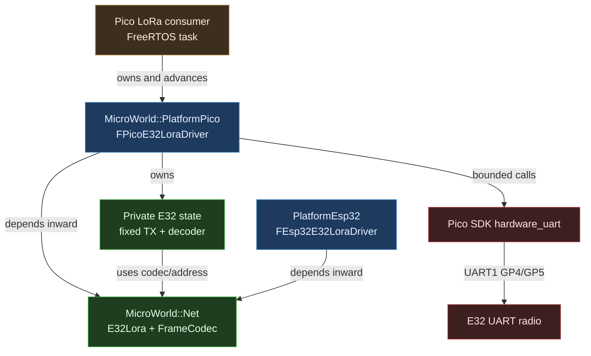
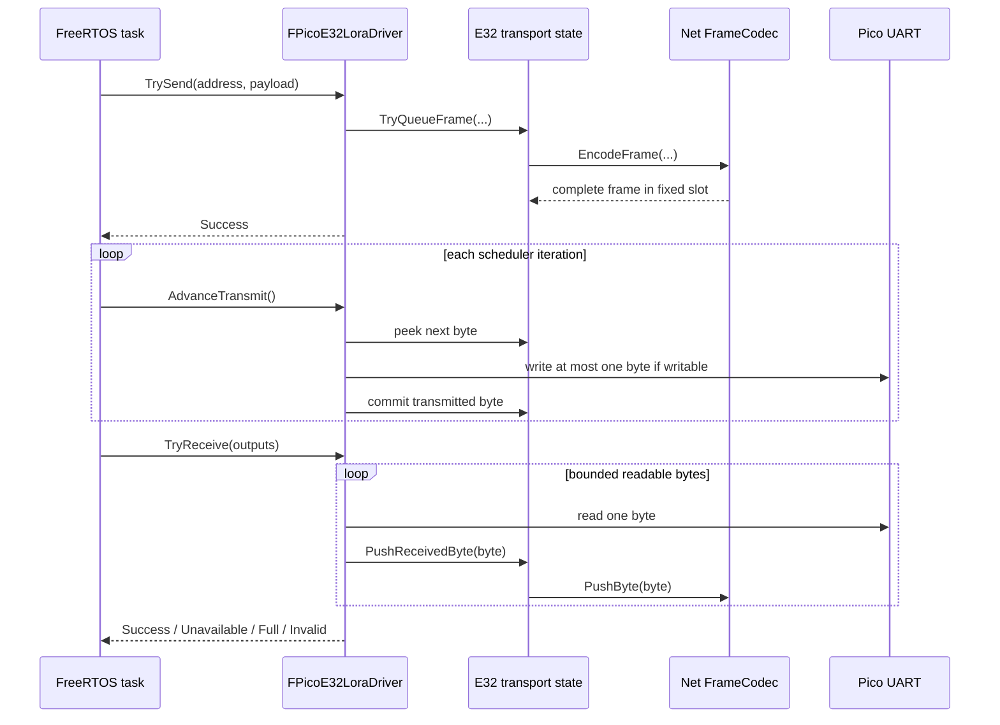

# UE5 C++ Change Plan: PlatformPico E32 LoRa Driver

| Field | Value |
|---|---|
| **Created** | 2026-07-26 |
| **Status** | Complete |
| **Change Type** | New Feature |
| **Author** | Codex |
| **Target Module** | PlatformPico, Net, PlatformEsp32 |
| **Priority** | High |
| **Estimated Scope** | M (days) |
| **P4 CL / Branch** | Current Git branch |

---

## 0 · TL;DR

**What the user sees:** A Pico application can include and link a supported
MicroWorld E32 LoRa driver instead of copying the hardware-tested driver into
each firmware image.

**Why it happens:** The first Pico driver was intentionally built inside the
interoperability executable so the UART behavior could be proven before a
public package and API were committed.

**What the fix does:** A new native Pico SDK `PlatformPico` package owns the
UART driver. Net owns the shared E32 wire identity, the old ESP32 include
continues to work, and the existing Pico firmware becomes a small composition
root. FreeRTOS, IRQ/DMA transmission, and generic hardware abstraction remain
out of scope.

---

## 1 · 🎯 Objective & Motivation

### 1.1 Problem Statement

The Pico E32 driver has passed a real Pico-to-ESP32 counter volley, but it is
consumer-local. Copying it would duplicate the address encoding, frame bound,
UART validation, and non-blocking transmit state. The proven implementation
must become one reusable platform edge without pulling Pico SDK or FreeRTOS
types into portable modules.

### 1.2 Success Criteria

- [x] `MicroWorld::PlatformPico` exposes `FPicoE32LoraDriver` through a
      platform-neutral public header, with no hardware access before explicit
      initialization from `main`.
- [x] The driver remains fixed-capacity, exception-free, RTTI-free, and
      non-blocking; it performs no dynamic allocation.
- [x] `TrySend` transactionally accepts at most one frame and reports `Full`
      until `AdvanceTransmit()` drains that frame.
- [x] `TryReceive` performs bounded UART work and preserves caller outputs on
      every non-`Success` result.
- [x] Host tests exercise frame-slot backpressure, byte-by-byte transmit
      progress, held receive retry, and transactional outputs through the
      package-private E32 state core.
- [x] Shared E32 address helpers and `E32MaxPayloadBytes` have one owner in Net.
- [x] Existing PlatformEsp32 LoRa includes and both ESP32 LoRa examples compile
      without source changes.
- [x] The Pico consumer builds through `pico.bat build lora`; its map proves
      Core and Net profile compliance, requires PlatformPico, and explicitly
      forbids every other known platform archive.
- [x] A newly authorized hardware run repeats the Pico-to-ESP32 counter volley
      after the refactor.

### 1.3 Out of Scope

- Generic Pico GPIO, UART, clock, logging, or board abstraction layers.
- Arduino, PlatformIO framework builds, or vendoring the Pico SDK.
- FreeRTOS APIs inside `PlatformPico`.
- Interrupt-, DMA-, queue-, or multi-frame transmit implementations.
- E32 configuration-mode commands, AUX-pin flow control, addressing modes, or
  radio parameter management.
- A generic UART HAL or reusable fake-hardware framework; the deterministic
  seam remains private and E32-specific.
- Changing ESP32 runtime behavior or the example-17 wire payload.
- RP2350 support; the first package validates RP2040 UART pin mappings only.

---

## 2 · 🔍 Context & Current State Analysis

### 2.1 Affected Systems Map

| System / Class | Role in Change | Ownership |
|---|---|---|
| `E32Lora.h` | Shared address and capacity contract | Net |
| `FEsp32E32LoraDriver` | Existing compatible peer | PlatformEsp32 |
| `FPicoE32LoraDriver` | New reusable UART transport | PlatformPico |
| `FPicoE32LoraTransportState` | Deterministic bounded state | PlatformPico private |
| `PicoLoraInteropMain.cpp` | Composition and hardware proof | Pico consumer |
| `pico.bat` / `pico.py` | Existing build/upload entry point | Pico consumer |
| Example 17 | Unchanged ESP32 hardware peer | Examples |

### 2.2 Existing Code Audit

```text
Modules/
├── Net/
│   ├── include/MicroWorld/Net/FrameCodec.h
│   └── tests/FrameCodecTests.cpp
├── PlatformEsp32/
│   ├── include/MicroWorld/PlatformEsp32/LoraAddress.h
│   ├── include/MicroWorld/PlatformEsp32/Esp32E32LoraDriver.h
│   └── src/Esp32E32LoraDriver.cpp
└── Core/tests/consumer/pico-freertos/
    ├── CMakeLists.txt
    └── PicoLoraInteropMain.cpp
```

- Current architecture pattern: portable Net frame codec plus platform-owned
  `INetDriver` adapters.
- Known tech debt: Pico duplicates the E32 address helper, payload bound, UART
  state machine, and driver class inside one executable.
- Test coverage: Net frame codec has host tests; the promoted package will add
  host tests for its E32-specific deterministic state, while the thin SDK
  wrapper keeps native cross-build, map checks, and hardware evidence.

### 2.3 UE5-Specific Constraints Checklist

| Constraint | Relevant? | Notes |
|---|---|---|
| Reflection system (UPROPERTY/UFUNCTION) | No | Embedded C++17 package |
| Garbage Collection considerations | No | Static/value ownership only |
| Blueprint exposure needed | No | No UE runtime dependency |
| Replication / Multiplayer | No | `INetDriver` byte transport only |
| Gameplay Ability System (GAS) | No | Not present |
| Enhanced Input System | No | Not present |
| World Subsystems | No | Composition root owns lifetime |
| Async / Latent actions | No | Caller-driven bounded polling |
| Soft/Hard object references | No | No assets or UObject references |
| Data Assets / Data Tables | No | Compile-time configuration |
| Plugins / Module boundaries | Yes | Net inward; Pico SDK at platform edge |
| Editor tooling / Details panel | No | Firmware package |

### 2.4 Risks & Constraints

- A 64-byte maximum framed packet cannot be transactionally written into the
  RP2040 UART FIFO, so acceptance and physical transmission are separate phases.
- `TrySend(Success)` means the driver-owned slot accepted the frame; it does not
  mean the final byte has reached the radio.
- Static construction must be inert because the firmware owns the driver for
  its full lifetime and Pico SDK hardware setup is only valid after entry to
  `main`.
- The driver must validate UART index, baud rate, and RP2040 TX/RX pin functions
  before calling Pico SDK functions that may assert on invalid values.
- `uart_init` can clamp the requested baud; initialization must reject a zero
  result or any achieved rate different from the requested rate.
- A static library's private `hardware_uart` dependency must still propagate to
  the final firmware link through CMake's link-only interface.
- Hardware validation requires explicit upload authorization and cannot be
  inferred from compile success.

---

## 3 · 🤔 Options Considered

| # | Approach | Pros | Cons | Complexity | Verdict |
|---|---|---|---|---|---|
| 1 | Fixed-slot polled driver | Proven, bounded, no RTOS dependency | Caller must advance TX | Low | ✅ Selected |
| 2 | IRQ/DMA transmitter | Lower polling overhead | Concurrency and teardown complexity | High | ❌ Rejected |
| 3 | Keep consumer-local driver | No package work | Duplication and no reusable API | Low | ❌ Rejected |

---

## 4 · ✅ Selected Approach

**Option:** Fixed-slot polled driver | **Complexity:** Low

Create a narrow native Pico SDK package that promotes the exact proven
single-frame state machine. Extract only the platform-neutral E32 wire contract
into Net, then keep PlatformEsp32 source compatibility with a forwarding header.
This preserves bounded behavior and avoids inventing a generic Pico HAL.

### Key Design Decisions

| Decision | Rationale |
|---|---|
| `AdvanceTransmit()` is explicit and `void` | Command-only API; bounded one-byte progress |
| One transmit frame slot | Matches proven behavior and makes backpressure visible |
| Private deterministic E32 state core | Tests behavioral guarantees without a generic HAL |
| Construction is inert; `Initialize(config)` opens UART | Avoids SDK calls during static initialization |
| Public header stores integer UART/GPIO identities | Pico SDK types stay private |
| Net owns E32 wire helpers | Both platform packages use one protocol identity |
| ESP32 address header forwards | Existing consumers compile unchanged |
| ESP32 driver keeps including the forwarding header | Example builds compile-probe the legacy path |
| FreeRTOS stays in consumer | Driver can work with any scheduler or main loop |

### Assumptions & Prerequisites

- **Assumes:** Pico SDK 2.2.0 provides `uart_init`, `uart_deinit`,
  `uart_is_readable`, `uart_is_writable`, `uart_getc`, and `uart_putc_raw`.
- **Requires:** The composition root calls `pico_sdk_init()` before adding
  `Modules/PlatformPico`.
- **Requires:** `MicroWorld::Net` is available or can be added from the sibling
  module.
- **Constraint:** Supported UART mappings are RP2040 UART0 TX
  `{0,12,16,28}` / RX `{1,13,17,29}` and UART1 TX `{4,8,20,24}` / RX
  `{5,9,21,25}`.
- **Constraint:** The composition root gives one driver exclusive ownership of
  its UART; duplicate owners and stdio sharing are unsupported.
- **Constraint:** The achieved Pico baud must exactly match the requested rate;
  otherwise initialization deinitializes the UART and returns `Invalid`. This
  deliberately avoids inventing an unverified E32 tolerance.
- **Constraint:** The E32 remains in transparent mode at the configured baud
  rate; destination addresses are validated but not routed on air.

---

## 5 · 🏗️ Architecture

### 5.1 Component Diagram



### 5.2 Sequence Diagram



**Alternative / Error Paths:**

- Invalid UART index, pin mapping, or zero baud → initialization returns
  `Invalid` and the driver stays closed.
- Closed driver → send and receive return `Unavailable`; advancement is a no-op.
- Occupied transmit slot → `TrySend` returns `Full` without changing the slot.
- Oversize or malformed input span → `TrySend` returns `Invalid`.
- Undersized receive destination → `TryReceive` returns `Full` and retains the
  decoded frame for retry.
- Bad frame length or CRC → decoder discards it and continues within the bounded
  receive budget.

### 5.3 Components Summary

| Component | Responsibility |
|---|---|
| `E32Lora.h` | Shared payload bound and one-byte node address encoding |
| `FPicoE32LoraConfig` | Plain configuration with no Pico SDK public types |
| `FPicoE32LoraDriver` | Own UART identity and delegate bounded state |
| `FPicoE32LoraTransportState` | SDK-free state transitions tested on host |
| `PlatformPico/CMakeLists.txt` | Native SDK target and dependency boundary |
| `PicoLoraInteropMain.cpp` | Scheduler, volley policy, and hardware evidence |

### 5.4 Interfaces

- `FPicoE32LoraDriver() noexcept` — performs no SDK calls and leaves the driver
  closed.
- `Initialize(const FPicoE32LoraConfig&) noexcept` — validates and initializes
  one UART; failed configuration leaves it closed.
- `~FPicoE32LoraDriver() noexcept` — deinitializes an opened UART.
- `TrySend(...) override` — transactionally accepts one framed packet.
- `TryReceive(...) override` — performs a bounded receive pump and transactional
  delivery.
- `AdvanceTransmit() noexcept` — advances zero or one queued UART byte.
- `MaxPacketBytes() const noexcept` — returns `E32MaxPayloadBytes`.
- `IsOpen() const noexcept` — reports construction success.
- Private state commands return typed status/events because exception-free
  firmware must report whether a mutation was accepted; pure state inspection
  remains in query methods.

---

## 6 · 📝 Implementation Steps

### Step 1: Add the shared E32 wire contract

**File:** `Modules/Net/include/MicroWorld/Net/E32Lora.h` | new

```cpp
namespace MicroWorld
{
constexpr std::size_t E32MaxPayloadBytes = 58;

constexpr FNetAddress MakeLoraAddress(std::uint8_t InNodeId) noexcept;
constexpr bool IsLoraAddress(const FNetAddress& InAddress) noexcept;
constexpr std::uint8_t LoraAddressNodeId(const FNetAddress& InAddress) noexcept;
}
```

#### Implementer Context
> - Move the existing documented helper behavior without semantic changes.
> - Correct the documentation: `IsLoraAddress` recognizes only the one-byte
>   shape and cannot distinguish another driver-relative one-byte encoding.
> - State that `LoraAddressNodeId` requires `IsLoraAddress` first.
> - Document 58 bytes as the shared E32 64-byte transparent-frame capacity
>   minus the six-byte MicroWorld frame overhead.
> - Include only `NetAddress.h`, `<cstddef>`, and `<cstdint>`.
> - Keep the header allocation-free and usable in constant expressions.
> - Do not add E32 hardware configuration or platform types to Net.

---

### Step 2: Add host tests for the shared E32 contract

**File:** `Modules/Net/tests/E32LoraTests.cpp` | new

```cpp
MW_TEST_CASE(E32LoraAddressRoundTripsNodeId)
{
    const FNetAddress Address = MakeLoraAddress(42);
    MW_EXPECT_TRUE(Test, IsLoraAddress(Address), "...");
    MW_EXPECT_EQ(Test, std::uint8_t{42}, LoraAddressNodeId(Address), "...");
}

MW_TEST_CASE(E32LoraAddressRejectsNonOneByteAddress)
{
    FNetAddress Address{};
    Address.Size = 2;
    MW_EXPECT_FALSE(Test, IsLoraAddress(Address), "...");
}
```

#### Implementer Context
> - Use the existing Core `MW_TEST_CASE` harness and observable assertions.
> - Cover node ids `0` and `255`, exact size, and rejection of size `0`/`2`.
> - Assert the payload bound is 58 to lock ESP32/Pico wire compatibility.
> - Do not test implementation details or create platform fakes.

---

### Step 3: Register the Net test file

**File:** `Modules/Net/CMakeLists.txt` | modify

```cmake
set(MICROWORLD_NET_TEST_SOURCES
    # existing sources...
    "${CMAKE_CURRENT_SOURCE_DIR}/tests/E32LoraTests.cpp"
)
```

#### Implementer Context
> - Add exactly one source to the existing test executable.
> - Keep dependency direction unchanged; the test links `MicroWorld::Net`.
> - Preserve strict warnings and allocation counters.

---

### Step 4: Preserve the PlatformEsp32 include path

**File:** `Modules/PlatformEsp32/include/MicroWorld/PlatformEsp32/LoraAddress.h` | modify

```cpp
#pragma once

#include <MicroWorld/Net/E32Lora.h>
```

#### Implementer Context
> - This becomes a compatibility forwarding header, not a second definition.
> - Existing examples may continue including the PlatformEsp32 path.
> - Do not add aliases or wrapper functions that duplicate Net symbols.

---

### Step 5: Consume the shared E32 contract from the ESP32 driver

**File:** `Modules/PlatformEsp32/include/MicroWorld/PlatformEsp32/Esp32E32LoraDriver.h` | modify

```cpp
#include <MicroWorld/PlatformEsp32/LoraAddress.h>

class FEsp32E32LoraDriver final : public INetDriver
{
    TFrameDecoder<E32MaxPayloadBytes> Decoder{};
    // Existing API and behavior remain unchanged.
};
```

#### Implementer Context
> - Remove the duplicate `E32MaxPayloadBytes` declaration.
> - Keep the forwarding `LoraAddress.h` include so every ESP32 driver/example
>   build compile-probes the legacy include path and its re-exported symbols.
> - Keep all public names, configuration fields, and runtime behavior stable.
> - Build both ESP32 LoRa examples to prove the compatibility path.

---

### Step 6: Declare the reusable Pico driver

**File:** `Modules/PlatformPico/include/MicroWorld/PlatformPico/PicoE32LoraDriver.h` | new

```cpp
namespace MicroWorld
{
struct FPicoE32LoraConfig
{
    std::uint8_t UartIndex{0};
    unsigned int TxGpio{0};
    unsigned int RxGpio{1};
    std::uint32_t BaudRate{9600};
    std::uint8_t LocalNodeId{0};
};

class FPicoE32LoraDriver final : public INetDriver
{
public:
    FPicoE32LoraDriver() noexcept = default;
    ~FPicoE32LoraDriver() noexcept override;

    FPicoE32LoraDriver(const FPicoE32LoraDriver&) = delete;
    FPicoE32LoraDriver& operator=(const FPicoE32LoraDriver&) = delete;
    FPicoE32LoraDriver(FPicoE32LoraDriver&&) = delete;
    FPicoE32LoraDriver& operator=(FPicoE32LoraDriver&&) = delete;

    ENetResult Initialize(const FPicoE32LoraConfig&) noexcept;
    ENetResult TrySend(const FNetAddress&, TSpan<const std::uint8_t>) noexcept override;
    ENetResult TryReceive(FNetAddress&, TSpan<std::uint8_t>,
                          FNetReceiveResult&) noexcept override;
    std::size_t MaxPacketBytes() const noexcept override;
    void AdvanceTransmit() noexcept;
    bool IsOpen() const noexcept;

private:
    Detail::FE32LoraTransportState TransportState{};
    std::uint8_t UartIndexValue{0};
    std::uint8_t LocalNodeIdValue{0};
    bool bOpen{false};
};
}
```

#### Implementer Context
> - Document every function and persistent state field per repository policy.
> - Keep all Pico SDK types and headers out of the public declaration.
> - Include the `Detail` state header only because fixed-capacity value
>   ownership rules out heap-backed pimpl; its namespace is unsupported API.
> - Default construction must remain inert so a static driver is safe before
>   `main`.
> - Preserve fixed-capacity state and transactional output behavior.
> - Do not expose transmit internals or add speculative queue controls.

---

### Step 7: Declare the deterministic E32 transport state

**File:** `Modules/PlatformPico/include/MicroWorld/PlatformPico/Detail/E32LoraTransportState.h` | new

```cpp
namespace MicroWorld::Detail
{
class FE32LoraTransportState final
{
public:
    ENetResult TryQueueFrame(std::uint8_t InLocalNodeId,
                            const FNetAddress& InTo,
                            TSpan<const std::uint8_t> InPacket) noexcept;
    bool TryPeekTransmitByte(std::uint8_t& OutByte) const noexcept;
    void CommitTransmitByte() noexcept;
    bool HasPendingTransmit() const noexcept;

    EFrameEvent PushReceivedByte(std::uint8_t InByte) noexcept;
    bool HasReceivedFrame() const noexcept;
    ENetResult TryDeliverReceivedFrame(
        FNetAddress& OutFrom,
        TSpan<std::uint8_t> InDestination,
        FNetReceiveResult& OutResult) noexcept;

private:
    TFrameDecoder<E32MaxPayloadBytes> Decoder{};
    std::uint8_t TransmitFrame[E32MaxPayloadBytes + FrameOverheadBytes]{};
    std::size_t TransmitFrameLength{0};
    std::size_t NextTransmitByteIndex{0};
};
}
```

#### Implementer Context
> - This is an unsupported `Detail` seam used by the driver and its host tests.
> - Keep it E32-specific; do not introduce a generic UART/HAL interface.
> - It contains no Pico SDK or FreeRTOS headers and performs no I/O.
> - Typed command results/events are the exception-free acceptance channel;
>   query methods never mutate state.

---

### Step 8: Implement deterministic E32 state transitions

**File:** `Modules/PlatformPico/src/E32LoraTransportState.cpp` | new

```cpp
ENetResult FE32LoraTransportState::TryQueueFrame(
    std::uint8_t InLocalNodeId,
    const FNetAddress& InTo,
    TSpan<const std::uint8_t> InPacket) noexcept
{
    // Validate address shape, span, capacity, and empty slot before EncodeFrame.
}

bool FE32LoraTransportState::TryPeekTransmitByte(
    std::uint8_t& OutByte) const noexcept
{
    // Preserve OutByte and return false when no frame is queued.
}

void FE32LoraTransportState::CommitTransmitByte() noexcept
{
    // Advance one byte; release and reset the slot after the final byte.
}

ENetResult FE32LoraTransportState::TryDeliverReceivedFrame(...) noexcept
{
    // Preserve outputs unless a complete frame fits and is delivered.
}
```

#### Implementer Context
> - Lift the proven local driver's frame-slot and decoder behavior.
> - `TrySend` address meaning is driver-relative: validate `Size == 1`, but do
>   not imply the byte selects a destination in transparent E32 mode.
> - A `Full` receive retains the decoder frame for a larger retry.
> - `FrameReady` must be delivered or held before another byte is pushed.

---

### Step 9: Host-test the deterministic transport state

**File:** `Modules/PlatformPico/tests/E32LoraTransportStateTests.cpp` | new

```cpp
MW_TEST_CASE(PicoE32StateAppliesTransmitBackpressureUntilFinalByte)
{
    FE32LoraTransportState State;
    // Queue one frame, prove second queue is Full, commit every framed byte,
    // then prove a new frame can be accepted.
}

MW_TEST_CASE(PicoE32StateRetainsReceivedFrameForLargerRetry)
{
    FE32LoraTransportState State;
    // Push one encoded frame byte-by-byte, receive into a short destination,
    // prove outputs unchanged, then retry into a fitting destination.
}
```

#### Implementer Context
> - Cover invalid address shape, oversize/null spans, empty-slot peek, exact
>   framed byte order, partial TX, final-byte release, bad-frame resync,
>   held-frame retry, sender address, and transactional output sentinels.
> - Compile the production state source into this host test target.
> - Use no Pico SDK fake; the SDK wrapper remains thin and hardware-tested.
> - Add `tests/AGENTS.md` with Architecture and Concepts sections.

---

### Step 10: Implement Pico UART validation and bounded I/O

**File:** `Modules/PlatformPico/src/PicoE32LoraDriver.cpp` | new

```cpp
namespace
{
uart_inst_t* ResolveUart(std::uint8_t InIndex) noexcept;
bool IsValidTxPin(std::uint8_t InIndex, unsigned int InPin) noexcept;
bool IsValidRxPin(std::uint8_t InIndex, unsigned int InPin) noexcept;
}

ENetResult FPicoE32LoraDriver::Initialize(
    const FPicoE32LoraConfig& InConfig) noexcept
{
    uart_inst_t* const Uart = ResolveUart(InConfig.UartIndex);
    if (bOpen)
    {
        return ENetResult::Unavailable;
    }
    if (Uart == nullptr || InConfig.BaudRate == 0 ||
        !IsValidTxPin(InConfig.UartIndex, InConfig.TxGpio) ||
        !IsValidRxPin(InConfig.UartIndex, InConfig.RxGpio))
    {
        return ENetResult::Invalid;
    }
    const std::uint32_t AchievedBaud = uart_init(Uart, InConfig.BaudRate);
    if (AchievedBaud != InConfig.BaudRate)
    {
        uart_deinit(Uart);
        return ENetResult::Invalid;
    }
    // Configure 8N1, no flow control, FIFO enabled; set bOpen; return Success.
}

void FPicoE32LoraDriver::AdvanceTransmit() noexcept
{
    // No-op unless open, a frame is queued, and UART is writable.
    // Write exactly one byte and release the slot after the final byte.
}
```

#### Implementer Context
> - Start from the hardware-proven local driver, not a clean-room rewrite.
> - Confine `<hardware/uart.h>` and `<pico/stdlib.h>` to this source file.
> - Map index `0`/`1` to `uart0`/`uart1`; reject every other value.
> - Use explicit RP2040 TX/RX pin allowlists before `gpio_set_function`.
> - `Initialize` returns `Unavailable` when already open and `Invalid` for bad
>   configuration; it never partially changes driver state on rejection.
> - Require the SDK's achieved baud to equal the requested baud; exact matching
>   keeps the first supported contract tied to the hardware-proven 9600 rate
>   without inventing an E32 tolerance.
> - Bound receive work to `2 * (E32MaxPayloadBytes + FrameOverheadBytes)`.
> - Preserve held-frame retry semantics when the destination is too small.
> - Log-free discard handling is acceptable on Pico; the decoder already
>   resynchronizes and the driver has no logging dependency.

---

### Step 11: Define native and host-test package targets

**File:** `Modules/PlatformPico/CMakeLists.txt` | new

```cmake
cmake_minimum_required(VERSION 3.20)
project(MicroWorldPlatformPico VERSION 0.3.0 LANGUAGES CXX)

option(MICROWORLD_PLATFORM_PICO_BUILD_DRIVER "Build the native Pico SDK driver" ON)
option(MICROWORLD_PLATFORM_PICO_BUILD_TESTS "Build SDK-free state tests" OFF)

if(NOT TARGET MicroWorld::Net)
    set(MICROWORLD_NET_BUILD_TESTS OFF)
    set(MICROWORLD_NET_BUILD_BENCHMARKS OFF)
    add_subdirectory("../Net" "${CMAKE_CURRENT_BINARY_DIR}/Net")
endif()

set(MICROWORLD_PLATFORM_PICO_STATE_SOURCES
    "${CMAKE_CURRENT_SOURCE_DIR}/src/E32LoraTransportState.cpp")

if(MICROWORLD_PLATFORM_PICO_BUILD_DRIVER)
    if(NOT TARGET hardware_uart)
        message(FATAL_ERROR "PlatformPico driver requires pico_sdk_init() in its parent")
    endif()
    add_library(microworld_platform_pico STATIC
        "${CMAKE_CURRENT_SOURCE_DIR}/src/PicoE32LoraDriver.cpp"
        ${MICROWORLD_PLATFORM_PICO_STATE_SOURCES})
    add_library(MicroWorld::PlatformPico ALIAS microworld_platform_pico)
    target_link_libraries(microworld_platform_pico
        PUBLIC MicroWorld::Net
        PRIVATE hardware_uart pico_stdlib)
endif()

if(MICROWORLD_PLATFORM_PICO_BUILD_TESTS AND BUILD_TESTING)
    add_executable(microworld_platform_pico_state_tests
        "${CMAKE_CURRENT_SOURCE_DIR}/../Core/tests/TestMain.cpp"
        ${MICROWORLD_PLATFORM_PICO_STATE_SOURCES}
        "${CMAKE_CURRENT_SOURCE_DIR}/tests/E32LoraTransportStateTests.cpp")
    target_include_directories(microworld_platform_pico_state_tests PRIVATE
        "${CMAKE_CURRENT_SOURCE_DIR}/../Core/tests")
    target_link_libraries(microworld_platform_pico_state_tests
        PRIVATE MicroWorld::Net)
    add_test(NAME microworld_platform_pico_state_tests
        COMMAND microworld_platform_pico_state_tests)
endif()
```

#### Implementer Context
> - Require an initialized parent Pico SDK; do not fetch SDK dependencies here.
> - Add public build-interface include directories and C++17.
> - Apply the repository's MSVC/GNU strict warning, exception, and RTTI gates
>   to both native production and host test targets.
> - Host mode compiles only deterministic state and tests; it never creates
>   `MicroWorld::PlatformPico` or includes Pico SDK headers.

---

### Step 12: Wire state tests into the host superbuild

**File:** `CMakeLists.txt` | modify

```cmake
set(MICROWORLD_PLATFORM_PICO_BUILD_DRIVER OFF)
set(MICROWORLD_PLATFORM_PICO_BUILD_TESTS ON)
add_subdirectory(Modules/PlatformPico)
```

#### Implementer Context
> - Add PlatformPico after Net so host mode reuses `MicroWorld::Net`.
> - The root builds only the SDK-free state tests, never the Pico driver.
> - Update the root comment to distinguish host-tested state from the native
>   production target.

---

### Step 13: Add package metadata and scoped architecture guides

**Files:** `Modules/PlatformPico/library.json` and each PlatformPico `AGENTS.md` | new

```cpp
// Package contract:
// PlatformPico -> Net -> Core
// Public API contains no Pico SDK or FreeRTOS types.
// Runtime claims require a Pico hardware checkpoint.
```

#### Implementer Context
> - Set package/project version to `0.3.0`.
> - Describe native Pico SDK support; metadata must not imply Arduino support.
> - Add complete Architecture and Concepts sections in package, `include`,
>   `include/MicroWorld`, `include/MicroWorld/PlatformPico`, `Detail`, `src`,
>   and `tests`.
> - State that FreeRTOS and SDK fetching belong to the composition root.

---

### Step 14: Link the package into the Pico consumer

**File:** `Modules/Core/tests/consumer/pico-freertos/CMakeLists.txt` | modify

```cmake
add_subdirectory(
    "../../../../PlatformPico"
    "${CMAKE_CURRENT_BINARY_DIR}/microworld-platform-pico")

target_link_libraries(microworld_pico_lora_interop
    PRIVATE MicroWorld::PlatformPico)
```

#### Implementer Context
> - Add PlatformPico only after `pico_sdk_init()` and Net availability.
> - Give the LoRa target Core, FreeRTOS, and PlatformPico only; remove its
>   direct `MicroWorld::Net`, `hardware_uart`, and `pico_stdlib` edges so the
>   final link proves PlatformPico's transitive/link-only dependencies.
> - Keep `PICO_CXX_DISABLE_ALLOCATION_OVERRIDES=1` and all existing outputs.
> - Add the PlatformPico source to the consumer-owned strict compile gate only
>   if target-level package options do not already cover it; avoid duplication.

---

### Step 15: Reduce the Pico image to composition and volley policy

**File:** `Modules/Core/tests/consumer/pico-freertos/PicoLoraInteropMain.cpp` | modify

```cpp
constexpr FPicoE32LoraConfig LoraConfig{
    1,  // UART1
    4,  // GP4 TX
    5,  // GP5 RX
    9600,
    LocalNodeId,
};

FPicoE32LoraDriver LoraDriver;

void RunLoraInteropTask(void*)
{
    for (;;)
    {
        LoraDriver.AdvanceTransmit();
        // Existing receive, volley, stack-margin, and delay policy.
    }
}

int main()
{
    if (LoraDriver.Initialize(LoraConfig) != ENetResult::Success)
    {
        return 1;
    }
    // Create the existing static task and start the scheduler.
}
```

#### Implementer Context
> - Remove the local driver, local address helper, duplicated payload bound,
>   decoder, UART includes, and transport implementation.
> - Retain only node identities, counter payload policy, task scheduling, and
>   stack assertion.
> - Use `MakeLoraAddress`, `LoraAddressNodeId`, and `E32MaxPayloadBytes` from Net.
> - Keep the proven GP4/GP5, 9600 8N1 behavior unchanged.
> - Document that `TrySend(Success)` means slot acceptance and the destination
>   byte is shape-checked but ignored by transparent-mode E32 transmission.

---

### Step 16: Update durable architecture and build documentation

**Files:** root `AGENTS.md`, root `CLAUDE.md`, Pico consumer guides, and example 17 evidence | modify

```cpp
// Documentation truth:
// PlatformPico is a non-portable native Pico SDK edge.
// The lora image consumes the reusable driver.
// Existing hardware evidence remains verbatim as the pre-promotion proof.
// A separate post-refactor checkpoint is appended only after an authorized run.
```

#### Implementer Context
> - Add PlatformPico to repository structure and non-portable-edge descriptions.
> - Replace “consumer-local driver” wording in Pico README/AGENTS.
> - Document `AdvanceTransmit()` and `TrySend` acceptance semantics.
> - Preserve the existing trace verbatim; do not rewrite it into new evidence.
> - A fresh checkpoint records the promotion commit, exact build/upload
>   commands, UF2 SHA-256, board/radio configuration, and complete alternating
>   `node`/`from`/`result=Success` trace.

---

### Implementation Summary

| # | Step | Files | Est. Time | Depends On | Status |
|---|---|---|---|---|---|
| 1 | Shared E32 contract | Net header | 20m | — | ✅ |
| 2 | Shared contract tests | Net test | 30m | 1 | ✅ |
| 3 | Test registration | Net CMake | 10m | 2 | ✅ |
| 4–5 | ESP32 compatibility | 2 headers | 20m | 1 | ✅ |
| 6–10 | PlatformPico API/state/driver | 5 files | 4h | 1 | ✅ |
| 11–12 | Native and host-test integration | 2 CMake files | 1h | 6–10 | ✅ |
| 13 | Package metadata/guides | 8 files | 45m | 6–12 | ✅ |
| 14–15 | Consumer migration | CMake, source | 1h | 6–12 | ✅ |
| 16 | Durable docs | 4+ files | 30m | 13–15 | ✅ |
| 17 | Verification | builds/tests/hardware | 1–2h | all | ✅ |

### File Change Map

```text
Modules/
├── Net/
│   ├── include/MicroWorld/Net/
│   │   └── + E32Lora.h
│   ├── tests/
│   │   └── + E32LoraTests.cpp
│   └── ~ CMakeLists.txt
├── PlatformEsp32/
│   └── include/MicroWorld/PlatformEsp32/
│       ├── ~ LoraAddress.h
│       └── ~ Esp32E32LoraDriver.h
├── PlatformPico/
│   ├── + CMakeLists.txt
│   ├── + library.json
│   ├── + AGENTS.md
│   ├── include/
│   │   ├── + AGENTS.md
│   │   └── MicroWorld/
│   │       ├── + AGENTS.md
│   │       └── PlatformPico/
│   │           ├── + AGENTS.md
│   │           ├── + PicoE32LoraDriver.h
│   │           └── Detail/
│   │               ├── + AGENTS.md
│   │               └── + E32LoraTransportState.h
│   ├── src/
│   │   ├── + AGENTS.md
│   │   ├── + E32LoraTransportState.cpp
│   │   └── + PicoE32LoraDriver.cpp
│   └── tests/
│       ├── + AGENTS.md
│       └── + E32LoraTransportStateTests.cpp
└── Core/tests/consumer/pico-freertos/
    ├── ~ CMakeLists.txt
    ├── ~ PicoLoraInteropMain.cpp
    ├── ~ AGENTS.md
    └── ~ README.md
~ AGENTS.md
~ CLAUDE.md
~ CMakeLists.txt
~ examples/17-TwoBoardLora/README.md (only after fresh hardware evidence)
```

Legend: `+` new · `~` modified · `-` deleted

### Module / Plugin Dependencies

| Dependency Module | Why Needed | Already Referenced? |
|---|---|---|
| Core | Span/test foundations through Net | Yes, transitive |
| Net | `INetDriver`, frame codec, E32 contract | Yes, package public edge |
| Pico SDK `hardware_uart` | RP2040 UART access | Yes, moves into package |
| Pico SDK `pico_stdlib` | GPIO function routing | Yes, moves into package |
| FreeRTOS static kernel | Consumer task scheduling only | Yes, not PlatformPico |

---

## 7 · 🧪 Test Strategy

### Existing Tests (Validation)

| Test Suite / Filter | File | Purpose |
|---|---|---|
| Net host tests | `Modules/Net/tests/*.cpp` | Portable framing and allocation behavior |
| Pico script tests | `test_pico.py` | Selector, artifact, and upload safety |
| Pico four-image build | `pico.bat build` | Native SDK compile/link integration |
| ESP32 example 17 builds | `examples/17-TwoBoardLora` | Address compatibility and driver compile |
| ESP32 example 26 builds | `examples/26-MessagingOverLora` | Higher-layer LoRa compatibility |

### New Tests (Creation)

| Test Name | Code Under Test | Why | Scenario | Expectation | Type |
|---|---|---|---|---|---|
| `E32LoraAddressRoundTripsNodeId` | address helpers | Shared identity | node 42 | size 1, value 42 | Unit |
| `E32LoraAddressPreservesBoundaryIds` | address helpers | Edge values | 0 and 255 | exact round trip | Unit |
| `E32LoraAddressRejectsWrongSizes` | `IsLoraAddress` | Prevent type confusion | size 0 and 2 | false | Unit |
| `E32LoraPayloadBoundMatchesWireContract` | capacity constant | Cross-platform match | compile/run | value 58 | Unit |
| `PicoE32StateRejectsInvalidSendWithoutMutation` | private state | Transactional rejection | bad address/span/size | slot remains empty | Unit |
| `PicoE32StateAppliesTransmitBackpressureUntilFinalByte` | private state | Slot contract | partial byte commits | `Full` until final byte | Unit |
| `PicoE32StateRetainsReceivedFrameForLargerRetry` | private state | Held-frame contract | short then fitting buffer | retry succeeds unchanged | Unit |
| `PicoE32StatePreservesOutputsWhenUnavailable` | private state | Transactional outputs | no complete frame | sentinels unchanged | Unit |
| Pico package cross-build | full driver | Real SDK API contract | native build | warning-free ELF/UF2 | Integration |
| Pico/ESP32 volley | full transport | Runtime regression | two radios | counters alternate | Hardware |

### Test Quality Gates

- [ ] Every test has a real Act step that exercises production code.
- [ ] Every test asserts observable behavior, not implementation details.
- [ ] Tests do not create expensive fixtures they do not use.
- [ ] Positive/negative pairs exist for address recognition.
- [ ] Edge cases: node ids 0/255, address sizes 0/1/2, maximum payload constant.
- [ ] `arm-none-eabi-nm -u -C` reports no malloc/calloc/realloc/free,
      `operator new`, `operator delete`, `pvPortMalloc`, or `vPortFree`
      dependency; the full symbol scan allows only the consumer's deliberate
      nonallocating delete stubs.
- [ ] The map contains no `heap_[1-5].c` and explicitly requires
      `libmicroworld_platform_pico.a`.

### Performance Budget

| Metric | Acceptable Threshold | How to Measure |
|---|---|---|
| TX work per advance | ≤1 UART byte | Source review and hardware behavior |
| RX work per call | ≤128 bytes | Constant and source review |
| TX storage | 64 bytes | Map/source inspection |
| Dynamic allocation | 0 steady-state | ELF symbol scan |
| LoRa task stack headroom | ≥128 words | Existing runtime assertion |

---

## 8 · ⚠️ Pitfalls

- **Do not equate acceptance with delivery.** `TrySend(Success)` reserves the
  frame slot; callers must continue invoking `AdvanceTransmit()` until the next
  send is accepted.
- **Do not expose Pico SDK types.** `uart_inst_t*` in the public header would
  leak the SDK across the package boundary and complicate consumers.
- **Validate before SDK calls.** Invalid UART indices or GPIO functions can
  trigger SDK assertions instead of returning a recoverable result.
- **Validate achieved baud.** A nonzero request can still be clamped by the SDK;
  reject any achieved rate that differs from the requested rate.
- **Do not initialize hardware globally.** The driver constructor is inert;
  the Pico consumer owns its instance in `main`, initializes it explicitly,
  and passes it to the static task.
- **Do not share a UART.** The package has no global ownership registry; the
  composition root must avoid another driver or stdio using the same UART.
- **Keep held receive frames.** A `Full` destination must not discard the
  decoded packet; the caller can retry with a larger buffer.
- **Do not overstate address identity.** `IsLoraAddress` proves only a one-byte
  shape; the active driver supplies its E32 meaning, and transparent mode
  ignores the destination on air.
- **Do not build the native driver in the host superbuild.** Root CMake enables
  only the SDK-free deterministic state tests.
- **Do not leak strict flags into SDK sources.** Apply package flags only to
  MicroWorld-owned source files; the Pico SDK contributes interface sources to
  consuming targets.
- **Do not claim hardware success from an old trace.** Preserve it verbatim,
  then append commit- and UF2-hash-bound evidence only after authorization.

---

## 9 · 🔄 Rollback Plan

- [ ] Git revert the promotion commit and optional evidence commit while
      retaining proof commit `1f1e3d0`.
- [ ] Asset rollback needed: No — source and documentation only.
- [ ] Data migration reversal: No — no persistent data.
- [ ] Config revert: No — consumer CMake can return to the local driver from
      commit `1f1e3d0`.

---

## 10 · ✅ Verification

- [x] Configure and build standalone Net; run `microworld_net_tests`.
- [x] Run root host `ctest`; report unrelated pre-existing failures separately.
- [x] Run `py -3 -m unittest
      Modules\Core\tests\consumer\pico-freertos\test_pico.py`.
- [x] Run `pico.bat build` for probe, example, tests, and lora.
- [x] Validate lora map with `CheckProfileMap.py --profile Core+Net` plus
      `--require libmicroworld_platform_pico.a`, and explicitly forbid the
      PlatformHost and PlatformEsp32 archive markers.
- [x] Confirm the LoRa executable gets Net/UART through PlatformPico while the
      firmware composition root retains ownership of the complete `pico_stdlib`
      runtime.
- [x] Run demangled defined/undefined ELF symbol scans for
      malloc/calloc/realloc/free, new/delete, `pvPortMalloc`, and `vPortFree`;
      allow only the deliberate nonallocating delete stubs, and reject every
      `heap_[1-5].c` map entry.
- [x] Build both environments in `examples/17-TwoBoardLora`.
- [x] Build both environments in `examples/26-MessagingOverLora`.
- [x] Verify `git diff --exit-code 1f1e3d0 -- examples/17-TwoBoardLora/src
      examples/26-MessagingOverLora/src` so compatibility required no source
      edits.
- [x] Run dependency, folder-guide, class-documentation, and formatting gates.
- [x] Verify impact radius: PlatformEsp32 consumers compile unchanged; Pico
      consumer is the only new PlatformPico consumer.
- [x] Commit the promotion, rebuild from that commit, and record the LoRa UF2
      SHA-256.
- [x] After explicit authorization, upload that UF2 and capture a fresh complete
      ESP32 trace proving counters alternate with exact `node`, `from`, and
      `result=Success` fields.
- [x] Append the promotion commit, commands, UF2 hash, wiring/configuration, and
      trace in a separate evidence commit.

---

## 11 · 🤖 Task Breakdown (for Implementation LLM)

| # | Task | File | Action | Ref | Done When |
|---|---|---|---|---|---|
| 1 | Create shared E32 contract | `Modules/Net/include/MicroWorld/Net/E32Lora.h` | Create | Step 1 | Helpers and capacity have one portable owner |
| 2 | Add E32 contract tests | `Modules/Net/tests/E32LoraTests.cpp` | Create | Step 2 | Four observable cases compile |
| 3 | Register E32 tests | `Modules/Net/CMakeLists.txt` | Modify | Step 3 | Net test target includes new source |
| 4 | Forward old address include | `Modules/PlatformEsp32/.../LoraAddress.h` | Modify | Step 4 | Header contains only Net forwarding include |
| 5 | Remove ESP32 duplicate constant | `Modules/PlatformEsp32/.../Esp32E32LoraDriver.h` | Modify | Step 5 | Existing driver uses Net contract |
| 6 | Create Pico public API | `Modules/PlatformPico/.../PicoE32LoraDriver.h` | Create | Step 6 | Config and driver are fully documented |
| 7 | Declare private E32 state | `.../Detail/E32LoraTransportState.h` | Create | Step 7 | SDK-free state contract is documented |
| 8 | Implement private E32 state | `Modules/PlatformPico/src/E32LoraTransportState.cpp` | Create | Step 8 | Deterministic transitions compile |
| 9 | Test private E32 state | `Modules/PlatformPico/tests/E32LoraTransportStateTests.cpp` | Create | Step 9 | Backpressure/retry/transaction cases pass |
| 10 | Implement Pico SDK wrapper | `Modules/PlatformPico/src/PicoE32LoraDriver.cpp` | Create | Step 10 | Thin validated UART wrapper compiles |
| 11 | Create package targets | `Modules/PlatformPico/CMakeLists.txt` | Create | Step 11 | Native driver and host state modes configure |
| 12 | Register host state tests | `CMakeLists.txt` | Modify | Step 12 | Root ctest includes SDK-free Pico state tests |
| 13 | Add package metadata | `Modules/PlatformPico/library.json` | Create | Step 13 | Version and native SDK identity are correct |
| 14 | Add package guide | `Modules/PlatformPico/AGENTS.md` | Create | Step 13 | Architecture and concepts documented |
| 15 | Add include guide | `Modules/PlatformPico/include/AGENTS.md` | Create | Step 13 | Public-boundary rules documented |
| 16 | Add namespace guide | `Modules/PlatformPico/include/MicroWorld/AGENTS.md` | Create | Step 13 | Namespace ownership documented |
| 17 | Add API guide | `.../PlatformPico/AGENTS.md` | Create | Step 13 | Driver contract documented |
| 18 | Add detail guide | `.../PlatformPico/Detail/AGENTS.md` | Create | Step 13 | Unsupported deterministic seam documented |
| 19 | Add source guide | `Modules/PlatformPico/src/AGENTS.md` | Create | Step 13 | SDK confinement documented |
| 20 | Add test guide | `Modules/PlatformPico/tests/AGENTS.md` | Create | Step 13 | Host-test ownership documented |
| 21 | Link consumer package | `.../pico-freertos/CMakeLists.txt` | Modify | Step 14 | LoRa links only PlatformPico/Core/FreeRTOS |
| 22 | Replace local driver | `.../pico-freertos/PicoLoraInteropMain.cpp` | Modify | Step 15 | File owns only task/volley policy |
| 23 | Update consumer guide | `.../pico-freertos/AGENTS.md` | Modify | Step 16 | Reusable package boundary is current |
| 24 | Update consumer README | `.../pico-freertos/README.md` | Modify | Step 16 | Build and driver semantics are current |
| 25 | Update repository guide | `AGENTS.md` | Modify | Step 16 | PlatformPico appears as a non-portable edge |
| 26 | Update architecture guide | `CLAUDE.md` | Modify | Step 16 | PlatformPico responsibility is listed |
| 27 | Run software gates | — | Verify | §10 | All affected builds/tests/checkers pass |
| 28 | Run principle/impact scan | all changed files | Review | §10 | Violations fixed/reported; consumers verified |
| 29 | Commit promotion | Git | Commit | §10 | Scoped code/docs commit exists |
| 30 | Request hardware authorization | — | Verify | §10 | User explicitly authorizes upload |
| 31 | Repeat hardware volley | `examples/17-TwoBoardLora/README.md` | Verify/Modify | §10 | Commit/hash-bound fresh evidence recorded |
| 32 | Commit evidence | Git | Commit | §10 | Separate evidence commit preserves provenance |

### Execution Rules

> - **One task at a time.** Complete and verify each row before moving on.
> - **Read before write.** Read each existing file fully before modifying it.
> - **Compile incrementally.** Run Net tests after tasks 1–5, state tests after
>   tasks 7–12, then Pico build after tasks 21–22.
> - **If a task fails:** stop the dependent sequence, report the exact error,
>   and diagnose before changing the plan.
> - **Do not invent.** Keep the package limited to the approved E32 transport.
> - **Preserve user files.** Do not stage unrelated untracked concepts,
>   settings, or `.zcode/`.

---

## 12 - Plan History

| # | Date | Reviewer | Changes Made |
|---|---|---|
| 1 | 2026-07-26 | User | Approved the narrow PlatformPico E32 concept |
| 2 | 2026-07-26 | Codex | Added API, compatibility, verification, and rollback detail |
| 3 | 2026-07-26 | Sceptic Critic | Required inert initialization, deterministic state tests, stronger link/allocation gates, and evidence provenance |
| 4 | 2026-07-26 | Codex | Added an E32-specific private state seam and rejected a generic HAL to preserve KISS/YAGNI |
| 5 | 2026-07-27 | User | Approved the detailed plan and selected Path C implementation |
