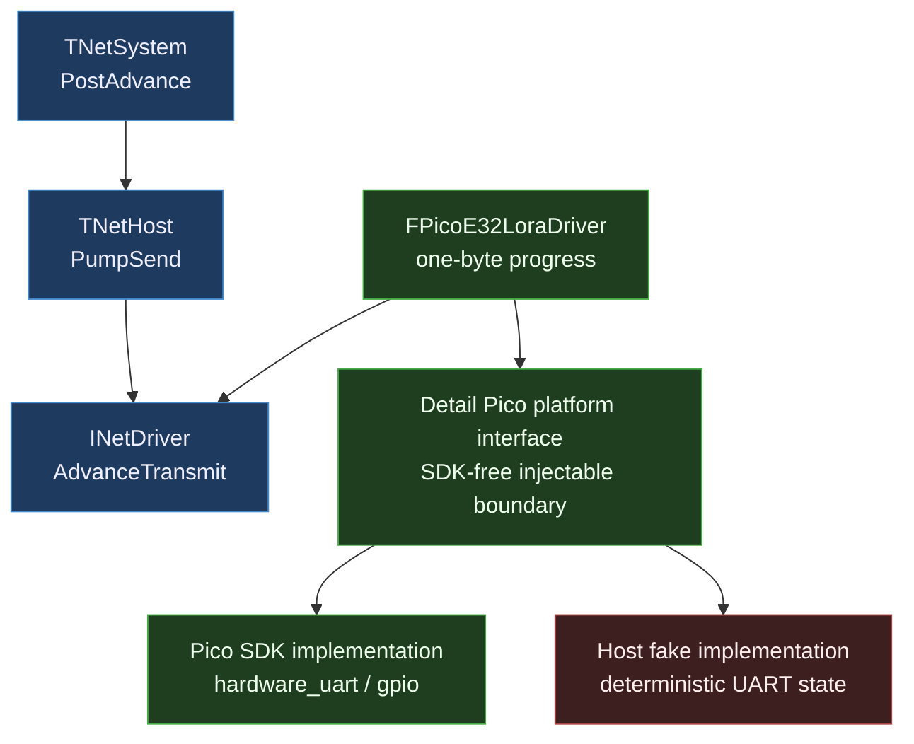
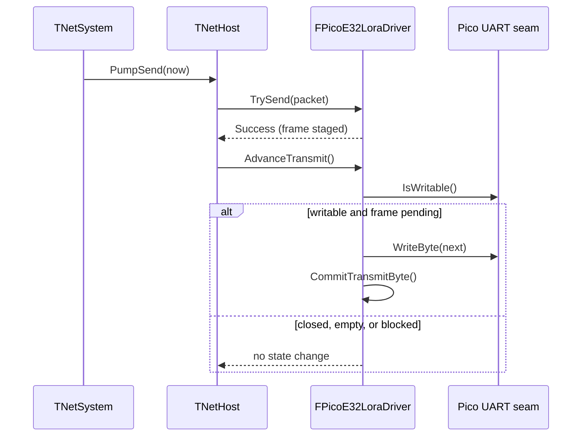

# 🎮 UE5 C++ Change Plan: PlatformPico Review Fixes

| Field | Value |
|---|---|
| **Created** | 2026-07-27 |
| **Status** | In Progress |
| **Change Type** | Modification |
| **Author** | Codex |
| **Target Module** | Net, Integration, PlatformPico |
| **Priority** | High |
| **Estimated Scope** | M (1–2 days) |
| **P4 CL / Branch** | `main` |

---

## 0 · TL;DR

**What the user sees:** The proven Pico LoRa example works, but the reusable
driver cannot transmit when it is owned only through MicroWorld's normal
`INetDriver`/`TNetSystem` path. PlatformPico also cannot configure standalone
with the documented command, and its metadata claims unsupported PlatformIO
framework compatibility.

**Why it happens:** Pico transmission is staged and requires a concrete-only
progress call that the generic network lifecycle cannot see. The package also
uses firmware-child build defaults when configured as a host package, while
the SDK wrapper and one transactional test lack enough automated coverage.

**What the fix does:** Add one bounded default-no-op driver progress command,
invoke it once per host send pump, isolate Pico SDK calls behind an injectable
SDK-free seam, and cover that seam with per-test fakes. Correct CMake defaults and metadata, and
strengthen the occupied-slot test. Arduino support remains out of scope.

---

## 1 · 🎯 Objective & Motivation

### 1.1 Problem Statement

Close the five findings from the Standard review without changing the proven
wire format, E32 payload bound, UART pins, FreeRTOS ownership, or one-byte
transmit progress bound.

### 1.2 Success Criteria

- [ ] `TNetSystem` advances each live non-standalone driver's transmit state exactly once during
      each outbound lifecycle pump.
- [ ] Existing drivers require no overrides because the new hook defaults to a
      no-op.
- [ ] `FPicoE32LoraDriver` sends at most one queued UART byte per hook call.
- [ ] `cmake -S Modules/PlatformPico -B build-platform-pico` configures, builds,
      and tests without a Pico SDK.
- [ ] Firmware composition still builds PlatformPico with the real Pico SDK.
- [ ] Host tests cover Pico initialization, rollback, transmit gating, bounded
      receive pumping, and open-only cleanup.
- [ ] The occupied-slot test proves a rejected second frame cannot overwrite
      the first.
- [ ] PlatformIO metadata no longer claims Arduino or all-framework support.

### 1.3 Out of Scope

- Arduino support.
- Changing the E32 wire frame or transparent-mode addressing.
- Interrupt, DMA, multi-byte burst, or background-task transmission.
- Refactoring ESP32 drivers onto the new private Pico SDK seam.
- Adding a blocking or multi-pump shutdown flush. `TNetHost::Stop()` remains a
  best-effort logical enqueue; callers that require physical drain must keep
  pumping before destroying the driver.
- Changing FreeRTOS scheduling or the proven Pico/ESP32 wiring.

---

## 2 · 🔍 Context & Current State Analysis

### 2.1 Affected Systems Map

| System / Class | Role in Change | Ownership |
|---|---|---|
| `INetDriver` | Adds bounded transport progress command | Net |
| `TNetHost` | Calls progress once per outbound pump | Net |
| `FPacketDropDriver` | Forwards lifecycle to its wrapped driver | Net |
| `TNetSystem` | Existing lifecycle consumer of `TNetHost` | Integration |
| `FPicoE32LoraDriver` | Implements one-byte UART progress | PlatformPico |
| Pico platform interface | Injects real or fake UART/GPIO operations | PlatformPico Detail |
| PlatformPico CMake/manifest | Selects correct host/firmware surfaces | PlatformPico |

### 2.2 Existing Code Audit

```text
Modules/
├── Net/
│   ├── include/MicroWorld/Net/NetDriver.h
│   ├── include/MicroWorld/Net/NetHost.h
│   └── tests/
├── Integration/
│   └── tests/NetSystemTests.cpp
└── PlatformPico/
    ├── include/MicroWorld/PlatformPico/PicoE32LoraDriver.h
    ├── src/PicoE32LoraDriver.cpp
    ├── tests/E32LoraTransportStateTests.cpp
    ├── CMakeLists.txt
    └── library.json
```

- Current architecture pattern: portable interface with platform-specific leaf
  drivers and caller-owned lifecycle.
- Known issue: `TrySend(Success)` removes the logical host packet after staging,
  but only concrete `AdvanceTransmit()` writes the physical bytes.
- Existing coverage: deterministic E32 state, Net helpers, full Pico/ESP32
  hardware volley, and generic lifecycle ordering.
- Missing coverage: Pico SDK call orchestration and overwrite-detecting
  backpressure data.

### 2.3 UE5-Specific Constraints Checklist

| Constraint | Relevant? | Notes |
|---|---|---|
| Reflection system | No | Embedded C++17 |
| Garbage Collection | No | Fixed-value storage |
| Blueprint exposure | No | No UE runtime |
| Replication / Multiplayer | No | MicroWorld Net is not UE replication |
| Gameplay Ability System | No | Not applicable |
| Enhanced Input | No | Not applicable |
| World Subsystems | No | `IEngineSystem` lifecycle is relevant, UE subsystem is not |
| Async / Latent actions | No | Caller-polled, single-task driver |
| Soft/Hard object references | No | No assets |
| Data Assets / Data Tables | No | No data-driven config |
| Plugins / Module boundaries | Yes | Net must remain platform-neutral |
| Editor tooling | No | No editor |

### 2.4 Risks & Constraints

- The progress hook must be a command (`void`) and remain bounded.
- A default implementation is required to avoid changing every existing driver.
- The host must call the hook once, not once per FIFO entry, and driver
  decorators must forward it.
- Real Pico SDK types must remain outside public headers.
- Host fakes must use fixture-owned context and not depend on shared mutable
  selection state.
- `library.json` cannot honestly name an official native Pico SDK framework:
  PlatformIO's Raspberry Pi platform currently exposes Arduino only. The
  manifest will use an empty framework compatibility list and strict mode while
  CMake remains the supported production build.

---

## 3 · 🤔 Options Considered

| # | Approach | Pros | Cons | Complexity | Verdict |
|---|---|---|---|---|---|
| 1 | Default-no-op `INetDriver::AdvanceTransmit()` called once by `TNetHost` | Generic, bounded, preserves existing drivers and CQS | Adds one virtual call per send pump | Low | ✅ Selected |
| 2 | Make `TryReceive()` also advance transmit | No interface change | Hidden send side effect, stalls without receive pumps, violates CQS | Low | ❌ Rejected |
| 3 | Special-case Pico in each composition root | Smallest immediate diff | Concrete coupling spreads and `TNetSystem` remains incomplete | Medium | ❌ Rejected |

---

## 4 · ✅ Selected Approach

**Option:** Generic bounded transport progress | **Complexity:** Low

`INetDriver` gains a default-no-op `AdvanceTransmit()` command. `TNetHost`
retains the same driver reference already supplied to its manager and invokes
the command exactly once after draining the logical outbound FIFO. Pico
overrides it with the existing one-byte behavior; autonomous drivers inherit
the no-op.

The SDK wrapper is split into driver policy and a private Pico implementation.
Host tests inject a fixture-owned `Detail` platform object; firmware binds the
same policy to the process-lifetime real Pico implementation.

### Key Design Decisions

| Decision | Rationale |
|---|---|
| Hook lives on `INetDriver` | Transport progress is a driver lifecycle concern |
| Hook returns `void` | It is a bounded command with no caller recovery result |
| Host invokes after FIFO drain | A newly accepted frame can emit one byte in the same pump |
| Default hook is no-op | Existing autonomous drivers remain source-compatible |
| SDK-free interface lives in `Detail` | Per-instance fakes avoid shared mutable state; vendor types remain private |
| Empty manifest framework list | No official PlatformIO native-Pico framework exists to claim |

### Assumptions & Prerequisites

- **Assumes:** `TNetSystem::PostAdvance` calls each live host's `PumpSend` once.
- **Requires:** Existing Pico SDK and FreeRTOS package pins remain unchanged.
- **Constraint:** Each `AdvanceTransmit()` call performs at most one UART byte.
- **Constraint:** Direct driver consumers still call the generic hook explicitly.

---

## 5 · 🏗️ Architecture

### 5.1 Component Diagram



### 5.2 Sequence Diagram



**Alternative / Error Paths:**

- Invalid Pico config → no SDK open call and driver stays closed.
- Achieved baud mismatch → close the opened UART and stay closed.
- UART not writable → retain the same byte for the next hook.
- Receive byte budget exhausted → return `Unavailable` with outputs unchanged.

### 5.3 Components Summary

| Component | Responsibility |
|---|---|
| `INetDriver::AdvanceTransmit` | One bounded driver-owned outbound progress command |
| `TNetHost::PumpSend` | Logical sends followed by exactly one transport advance |
| `FPicoE32LoraDriver` | Pico E32 policy and fixed transport state |
| Detail Pico platform interface | Per-instance real/fake UART and GPIO operations |
| Driver tests | Verify SDK orchestration without hardware |

### 5.4 Interfaces

- `virtual void AdvanceTransmit() noexcept` — default autonomous-driver no-op.
- `FPicoE32LoraDriver::AdvanceTransmit() override` — emits zero or one byte.
- `IPicoE32LoraPlatform::OpenUart(...)` — returns achieved baud, zero on failure.
- `IPicoE32LoraPlatform::CloseUart(...)` — releases one opened UART.
- Interface read/write readiness functions — perform one bounded operation.

---

## 6 · 📝 Implementation Steps

### Step 1: Add the generic progress contract
**File:** `Modules/Net/include/MicroWorld/Net/NetDriver.h` | modify

```cpp
class INetDriver
{
public:
    virtual void AdvanceTransmit() noexcept {}
    virtual ENetResult TrySend(...) noexcept = 0;
    virtual ENetResult TryReceive(...) noexcept = 0;
};
```

#### Implementer Context
> - Document that one call is bounded and autonomous drivers inherit no-op.
> - Keep the method a `void` command and do not add time or retry policy.
> - Preserve all existing pure-virtual send/receive contracts.

### Step 2: Pump driver progress exactly once
**File:** `Modules/Net/include/MicroWorld/Net/NetHost.h` | modify

```cpp
explicit TNetHost(INetDriver& InDriver) noexcept
    : Driver(InDriver), OutboundManager(InDriver, OutboundStorage) {}

ENetResult PumpSend(TimePointMilliseconds InNowMilliseconds) noexcept
{
    // existing standalone guard and logical sends
    DrainOutbound();
    Driver.AdvanceTransmit();
    return ENetResult::Success;
}

INetDriver& Driver;
```

#### Implementer Context
> - Call after `DrainOutbound` so a newly staged frame can progress immediately.
> - Call once per non-standalone pump, never inside the FIFO loop.
> - Document the reference as externally owned and lifetime-matched to the host.

### Step 3: Verify lifecycle forwarding and ordering
**File:** `Modules/Integration/tests/NetSystemTests.cpp` | modify

```cpp
struct FDriverPumpRecord
{
    std::size_t AdvanceCount{0};
    std::uint32_t FirstAdvanceOrder{0};
};

void AdvanceTransmit() noexcept override
{
    ++Record.AdvanceCount;
    if (Record.FirstAdvanceOrder == 0)
    {
        Record.FirstAdvanceOrder = Sequence.Next();
    }
}
```

#### Implementer Context
> - Extend the existing recording driver; do not create another fixture.
> - Assert one advance per driver per `PostAdvance`.
> - Assert reverse driver order remains intact and each advance follows that
>   driver's send attempt.
> - Add focused coverage for an idle outbound queue and a driver returning
>   `Full`: both must still receive exactly one transmit advance.

### Step 4: Forward progress through driver decorators
**Files:** `Modules/Net/include/MicroWorld/Net/PacketDropDriver.h`,
`Modules/Net/tests/PacketDropDriverTests.cpp` | modify

```cpp
void AdvanceTransmit() noexcept override
{
    InnerDriver.AdvanceTransmit();
}
```

#### Implementer Context
> - A decorator must preserve lifecycle commands as well as send/receive calls.
> - Extend the existing recording inner driver and assert exactly one forwarded
>   call; do not create a second fixture.
> - Forward unconditionally because the inner driver may own an already staged
>   frame even when the decorator has no new logical packet.

### Step 5: Declare the injectable Pico platform interface
**File:** `Modules/PlatformPico/include/MicroWorld/PlatformPico/Detail/PicoE32LoraPlatform.h` | new

```cpp
namespace MicroWorld::Detail
{
class IPicoE32LoraPlatform
{
public:
    virtual std::uint32_t OpenUart(
        std::uint8_t InIndex,
        unsigned int InTxGpio,
        unsigned int InRxGpio,
        std::uint32_t InBaudRate) noexcept = 0;
    virtual void CloseUart(std::uint8_t InIndex) noexcept = 0;
    virtual bool IsUartWritable(std::uint8_t InIndex) noexcept = 0;
    virtual void WriteUartByte(std::uint8_t InIndex, std::uint8_t InByte) noexcept = 0;
    virtual bool TryReadUartByte(std::uint8_t InIndex, std::uint8_t& OutByte) noexcept = 0;
    virtual ~IPicoE32LoraPlatform() noexcept = default;
};

IPicoE32LoraPlatform& GetPicoE32LoraPlatform() noexcept;
}
```

#### Implementer Context
> - Keep Pico SDK types out of this declaration.
> - Every function performs one bounded operation; no buffering or policy.
> - Document output preservation for failed reads.
> - The injected platform must outlive its driver; the default getter returns a
>   stateless process-lifetime real implementation.

### Step 6: Implement the real Pico SDK seam
**File:** `Modules/PlatformPico/src/PicoE32LoraPlatform.cpp` | new

```cpp
std::uint32_t FPicoE32LoraPlatform::OpenUart(...) noexcept
{
    uart_inst_t* const Uart = ResolveUart(InIndex);
    const std::uint32_t AchievedBaudRate = uart_init(Uart, InBaudRate);
    // configure GPIO, 8N1, no flow control, FIFO
    return AchievedBaudRate;
}

FPicoE32LoraDriver::FPicoE32LoraDriver() noexcept
    : FPicoE32LoraDriver(Detail::GetPicoE32LoraPlatform()) {}
```

#### Implementer Context
> - Move all `hardware/gpio.h` and `hardware/uart.h` includes here.
> - Preserve the current UART0/UART1 resolution and SDK call order.
> - Driver validation guarantees the index before seam calls.
> - Define the default driver constructor here so host tests can compile the
>   injected driver policy without linking the real Pico implementation.

### Step 7: Implement the generic hook and injection constructor on Pico
**File:** `Modules/PlatformPico/include/MicroWorld/PlatformPico/PicoE32LoraDriver.h` | modify

```cpp
class FPicoE32LoraDriver final : public INetDriver
{
public:
    FPicoE32LoraDriver() noexcept;
    explicit FPicoE32LoraDriver(Detail::IPicoE32LoraPlatform& InPlatform) noexcept;
    void AdvanceTransmit() noexcept override;

private:
    Detail::IPicoE32LoraPlatform& Platform;
};
```

#### Implementer Context
> - Keep the existing `AdvanceTransmit` name and mark it as the generic override.
> - Document zero-or-one-byte behavior and closed/blocked no-op cases.
> - Update all in-repository callers.
> - The explicit constructor is an unsupported `Detail` injection seam; its
>   platform object must outlive the driver.

### Step 8: Route Pico policy through the injected platform
**File:** `Modules/PlatformPico/src/PicoE32LoraDriver.cpp` | modify

```cpp
ENetResult FPicoE32LoraDriver::Initialize(const FPicoE32LoraConfig& InConfig) noexcept
{
    // validate index, pins, and nonzero baud
    const std::uint32_t Achieved =
        Platform.OpenUart(...);
    if (Achieved != InConfig.BaudRate)
    {
        Platform.CloseUart(InConfig.UartIndex);
        return ENetResult::Invalid;
    }
    // publish open state
}

FPicoE32LoraDriver::FPicoE32LoraDriver(
    Detail::IPicoE32LoraPlatform& InPlatform) noexcept
    : Platform(InPlatform) {}
```

#### Implementer Context
> - Preserve validation-before-mutation and exact-baud policy.
> - Commit a transmit byte only after the seam writes it.
> - The receive loop retains `ReceivePumpByteCap`.
> - Destructor closes only a successfully opened driver.

### Step 9: Cover Pico SDK orchestration
**File:** `Modules/PlatformPico/tests/PicoE32LoraDriverTests.cpp` | new

```cpp
MW_TEST_CASE(PicoE32DriverWritableAdvanceCommitsExactlyOneByte)
{
    FPicoE32LoraPlatformFake Platform;
    FPicoE32LoraDriver Driver{Platform};
    // initialize, queue frame, advance once
    // assert exactly one byte written and the slot remains occupied
}
```

#### Implementer Context
> - Give each test its own stack-owned fake platform instance.
> - Declare the fake before the driver so the injected reference stays valid.
> - Cover invalid config, baud rollback, successful setup, writable/not-writable
>   transmit, bounded receive, transactional output, and destructor cleanup.
> - Assert behavior, not the private transport buffer layout.

### Step 10: Strengthen transactional state tests
**File:** `Modules/PlatformPico/tests/E32LoraTransportStateTests.cpp` | modify

```cpp
const std::uint8_t RejectedPayload[] = {0xA1, 0xB2};
const ENetResult FullResult =
    State.TryQueueFrame(LocalNodeId, Destination, MakeSpan(RejectedPayload));
// drain and assert bytes still match the original encoded frame
```

#### Implementer Context
> - Use distinct accepted and rejected frames.
> - Peek twice before one commit and assert the same byte.
> - Add null receive, empty payload, maximum payload, and held-frame input cases
>   only where they close review gaps without duplicating codec tests.

### Step 11: Select correct host and firmware build surfaces
**File:** `Modules/PlatformPico/CMakeLists.txt` | modify

```cmake
if(CMAKE_CURRENT_SOURCE_DIR STREQUAL CMAKE_SOURCE_DIR)
    set(MICROWORLD_PLATFORM_PICO_DEFAULT_DRIVER OFF)
    set(MICROWORLD_PLATFORM_PICO_DEFAULT_TESTS ON)
else()
    set(MICROWORLD_PLATFORM_PICO_DEFAULT_DRIVER ON)
    set(MICROWORLD_PLATFORM_PICO_DEFAULT_TESTS OFF)
endif()
```

#### Implementer Context
> - Production target compiles both driver policy and real platform seam.
> - Host test target compiles driver policy but not the real platform seam.
> - Preserve root overrides and Pico consumer `CACHE ... FORCE` settings.

### Step 12: Correct PlatformIO compatibility metadata
**File:** `Modules/PlatformPico/library.json` | modify

```json
{
  "description": "MicroWorld PlatformPico: CMake-only native Pico SDK E32 LoRa UART INetDriver for RP2040",
  "frameworks": [],
  "platforms": "raspberrypi",
  "build": {
    "libCompatMode": "strict"
  }
}
```

#### Implementer Context
> - Keep package name and version frozen at 0.3.0.
> - Empty frameworks deliberately means no supported PlatformIO framework.
> - Validate the manifest with PlatformIO package tooling.

### Step 13: Confirm the direct Pico firmware consumer uses the generic hook
**File:** `Modules/Core/tests/consumer/pico-freertos/PicoLoraInteropMain.cpp` | verify

```cpp
for (;;)
{
    LoraDriver.AdvanceTransmit();
    // existing receive/send volley
}
```

#### Implementer Context
> - This direct consumer does not use `TNetHost`, so it still invokes the generic
>   hook explicitly once per task loop.
> - Preserve all hardware-proven timing, pins, task storage, and logging.

### Step 14: Update durable boundary documentation
**Files:** Net and PlatformPico scoped `AGENTS.md` files plus Pico README | modify

```cpp
// Durable contract to document:
// - generic hosts call AdvanceTransmit once per outbound pump
// - direct consumers call it explicitly
// - only PicoE32LoraPlatform.cpp includes Pico SDK hardware headers
```

#### Implementer Context
> - Update `Modules/Net/AGENTS.md`,
>   `Modules/Net/include/MicroWorld/Net/AGENTS.md`,
>   `Modules/PlatformPico/AGENTS.md`,
>   `Modules/PlatformPico/include/MicroWorld/PlatformPico/AGENTS.md`,
>   `Modules/PlatformPico/include/MicroWorld/PlatformPico/Detail/AGENTS.md`,
>   `Modules/PlatformPico/src/AGENTS.md`, and the Pico consumer README.
> - Do not rewrite the completed historical promotion plan.

### Implementation Summary

| # | Step | Files | Est. Time | Depends On | Status |
|---|---|---|---|---|---|
| 1–4 | Generic lifecycle, decorator, and tests | 5 | 3h | — | ☐ |
| 5–8 | Pico injected platform and driver | 4 | 3h | 1 | ☐ |
| 9–10 | Pico host tests | 2 | 3h | 5–8 | ☐ |
| 11–13 | Build, metadata, consumer verification | 2 | 2h | 5–10 | ☐ |
| 14 | Durable documentation | 7 | 1h | 1–13 | ☐ |

### File Change Map

```text
Modules/
├── Net/
│   ├── ~ include/MicroWorld/Net/NetDriver.h
│   ├── ~ include/MicroWorld/Net/NetHost.h
│   ├── ~ include/MicroWorld/Net/PacketDropDriver.h
│   ├── ~ tests/PacketDropDriverTests.cpp
│   └── ~ AGENTS.md and include guide
├── Integration/tests/
│   └── ~ NetSystemTests.cpp
├── PlatformPico/
│   ├── ~ CMakeLists.txt
│   ├── ~ library.json
│   ├── ~ include/.../PicoE32LoraDriver.h
│   ├── + include/.../Detail/PicoE32LoraPlatform.h
│   ├── src/
│   │   ├── + PicoE32LoraPlatform.cpp
│   │   └── ~ PicoE32LoraDriver.cpp
│   └── tests/
│       ├── + PicoE32LoraDriverTests.cpp
│       └── ~ E32LoraTransportStateTests.cpp
└── Core/tests/consumer/pico-freertos/
    └── ~ README.md
```

Legend: `+` new · `~` modified

### Module / Plugin Dependencies

| Dependency Module | Why Needed | Already Referenced? |
|---|---|---|
| Core | Existing Net base dependency | Yes |
| Net | PlatformPico driver contract and framing | Yes |
| Pico `hardware_gpio` | Real UART pin routing | Yes |
| Pico `hardware_uart` | Real UART I/O | Yes |

---

## 7 · 🧪 Test Strategy

### Existing Tests (Validation)

| Test Suite / Filter | File | Purpose |
|---|---|---|
| `microworld_net_tests` | `Modules/Net/tests/*` | Interface and host regressions |
| `microworld_integration_tests` | `Modules/Integration/tests/*` | Lifecycle pump ordering |
| `microworld_platform_pico_state_tests` | `Modules/PlatformPico/tests/*` | State and wrapper behavior |
| Pico `core`, `example`, `lora` builds | Pico consumer | Firmware compile/link |

### New Tests (Creation)

| Test Name | Code Under Test | Scenario | Expectation | Type |
|---|---|---|---|---|
| `NetSystem...AdvancesEachDriverOnce` | Generic hook | One `PostAdvance` | Once each, reverse order | Integration |
| `NetSystem...AdvancesIdleAndFullDriver` | Generic hook | Empty queue and `Full` send | Once per pump in both cases | Integration |
| `PacketDropDriverForwardsAdvanceTransmit` | Decorator | Inner driver has staged work | Exactly one forwarded call | Unit |
| `PicoE32DriverRejectsInvalidConfig` | `Initialize` | Bad index/pins/zero baud | No open call, closed | Unit |
| `PicoE32DriverRollsBackBaudMismatch` | `Initialize` | Inexact achieved baud | Close once, closed | Unit |
| `PicoE32DriverConfiguresValidUart` | `Initialize` | Valid config | 8N1 seam open, open state | Unit |
| `PicoE32DriverWritableAdvance...` | Progress hook | Writable queued frame | Exactly one byte committed | Unit |
| `PicoE32DriverBlockedAdvance...` | Progress hook | UART blocked | No write, same byte retained | Unit |
| `PicoE32DriverBoundsReceivePump` | `TryReceive` | More than byte cap available | Fixed read-call ceiling | Unit |
| `PicoE32DriverClosesOnlyOpenUart` | Destructor | Failed and successful init | Cleanup only for success | Unit |
| `PicoE32StateFullPreservesOriginalFrame` | State queue | Distinct second frame | `Full`, original drains | Unit |
| State edge cases | State send/receive | Empty/max/null/held input | Contract preserved | Unit |

### Test Quality Gates

- [ ] Every test has a real Act step.
- [ ] Every test asserts observable behavior.
- [ ] Every test owns its fake platform state by value.
- [ ] Positive and negative initialization/transmit pairs exist.
- [ ] No sleep, real clock, heap, or hardware dependency.
- [ ] Existing hardware evidence remains unchanged.
- [ ] `Stop()` is documented and tested as non-flushing; no test implies that
      one bounded call can synchronously drain a staged frame.

### Performance Budget

| Metric | Acceptable Threshold | How to Measure |
|---|---|---|
| Transmit work | ≤1 UART byte per hook call | Fake write count |
| Receive work | ≤`ReceivePumpByteCap` reads per call | Fake read count |
| Steady-state allocation | 0 | Existing allocation gates/build profile |
| Added driver storage | One platform-reference pointer | `sizeof`/map comparison |

---

## 8 · ⚠️ Pitfalls

- **Do not call progress inside the FIFO loop.** That makes work depend on queue
  depth and can emit more than one byte per host pump.
- **Do not make the hook pure virtual.** Existing autonomous drivers should
  remain source-compatible and inherit the no-op.
- **Do not share fake selection state.** Each test injects its own stack-owned
  `IPicoE32LoraPlatform`; no active-global pointer or reset convention.
- **Do not expose vendor types through `Detail`.** The injectable interface is
  public only as an unsupported SDK-free seam; Pico headers remain in `src`.
- **Do not treat slot acceptance as physical delivery.** `TrySend(Success)`
  still transfers ownership into the driver; progress happens afterward.
- **Do not claim a nonexistent PlatformIO Pico SDK framework.** The supported
  production path remains native Pico SDK CMake through the existing scripts.
- **Do not promise a synchronous shutdown flush.** One bounded progress call
  cannot guarantee draining a UART frame; `Stop()` remains non-blocking and
  non-flushing.

---

## 9 · 🔄 Rollback Plan

- [ ] Git revert the implementation commit.
- [ ] Asset rollback needed: No.
- [ ] Data migration reversal: No.
- [ ] Config revert: restore prior CMake defaults and manifest fields.
- [ ] Hardware rollback: prior proven UF2 remains reproducible from commit
      `2714284`.

---

## 10 · ✅ Verification

- [ ] Standalone Net configure/build/test passes.
- [ ] Standalone PlatformPico configure/build/test passes with no SDK.
- [ ] Root superbuild compiles affected Net/Integration/PlatformPico host tests.
- [ ] Pico scripts build `core`, `example`, and `lora`.
- [ ] Upload the rebuilt LoRa UF2 and repeat the Pico/ESP32 volley checkpoint;
      moving the real SDK wrapper requires fresh hardware evidence.
- [ ] `python tools/CheckDependencyBoundaries.py --self-test` passes.
- [ ] `python tools/CheckFolderAgents.py --root Modules` passes.
- [ ] `python tools/CheckClassDocumentation.py --root . --require-doxygen`
      passes.
- [ ] `python tools/CheckFormatting.py` passes.
- [ ] PlatformIO manifest validation/package pack passes.
- [ ] A temporary strict Raspberry Pi/Arduino PlatformIO project rejects
      PlatformPico as framework-incompatible.
- [ ] No new warnings, exceptions, RTTI, allocation, or vendor-header leakage.

---

## 11 · 🤖 Task Breakdown (for Implementation LLM)

| # | Task | File | Action | Ref | Done When |
|---|---|---|---|---|---|
| 1 | Add default bounded progress command | `NetDriver.h` | Modify | Step 1 | Existing drivers still compile |
| 2 | Invoke progress once per host send pump | `NetHost.h` | Modify | Step 2 | Hook is outside FIFO loop |
| 3 | Extend lifecycle recording test | `NetSystemTests.cpp` | Modify | Step 3 | Count and order assertions pass |
| 4 | Forward progress through decorator | `PacketDropDriver.h` | Modify | Step 4 | Inner driver receives the hook |
| 5 | Test decorator forwarding | `PacketDropDriverTests.cpp` | Modify | Step 4 | Exactly one call observed |
| 6 | Declare injectable SDK-free platform | `PicoE32LoraPlatform.h` | Create | Step 5 | No SDK types leak |
| 7 | Implement real Pico platform | `PicoE32LoraPlatform.cpp` | Create | Step 6 | SDK calls match prior order |
| 8 | Add injected constructor and override | `PicoE32LoraDriver.h` | Modify | Step 7 | Per-instance fake can bind |
| 9 | Route driver through platform | `PicoE32LoraDriver.cpp` | Modify | Step 8 | No SDK includes remain |
| 10 | Add wrapper behavioral tests | `PicoE32LoraDriverTests.cpp` | Create | Step 9 | All wrapper branches covered |
| 11 | Strengthen state tests | `E32LoraTransportStateTests.cpp` | Modify | Step 10 | Distinct-frame preservation proven |
| 12 | Fix package build modes | `PlatformPico/CMakeLists.txt` | Modify | Step 11 | Standalone and firmware modes configure |
| 13 | Correct manifest compatibility | `PlatformPico/library.json` | Modify | Step 12 | Strict Arduino project rejects it |
| 14 | Confirm direct consumer call | `PicoLoraInteropMain.cpp` | Verify | Step 13 | Generic hook is already called |
| 15 | Update durable guides | scoped guides/README | Modify | Step 14 | Contracts match code |
| 16 | Run host verification | — | Verify | §10 | Affected suites pass |
| 17 | Run Pico build verification | — | Verify | §10 | Three firmware targets pass |
| 18 | Repeat hardware volley | — | Verify | §10 | Pico/ESP32 exchange succeeds |
| 19 | Run repository gates | — | Verify | §10 | Checkers and formatting pass |

### Execution Rules

> - One task at a time; read each file before writing.
> - Compile after each logical group: Net lifecycle, Pico seam, tests/build.
> - Stop on a failing task and report the exact error before changing direction.
> - Do not add Arduino, DMA, interrupts, or unrelated refactors.
> - Run the principle and impact scans after every changed file.

---

## 12 - Plan History

| # | Date | Reviewer | Changes Made |
|---|---|---|---|
| 1 | 2026-07-27 | Codex | Initial plan from approved five-finding concept |
| 2 | 2026-07-27 | Sceptic Critic | Added decorator forwarding, per-instance platform injection, strict metadata rejection, explicit shutdown semantics, and mandatory hardware recheck |
