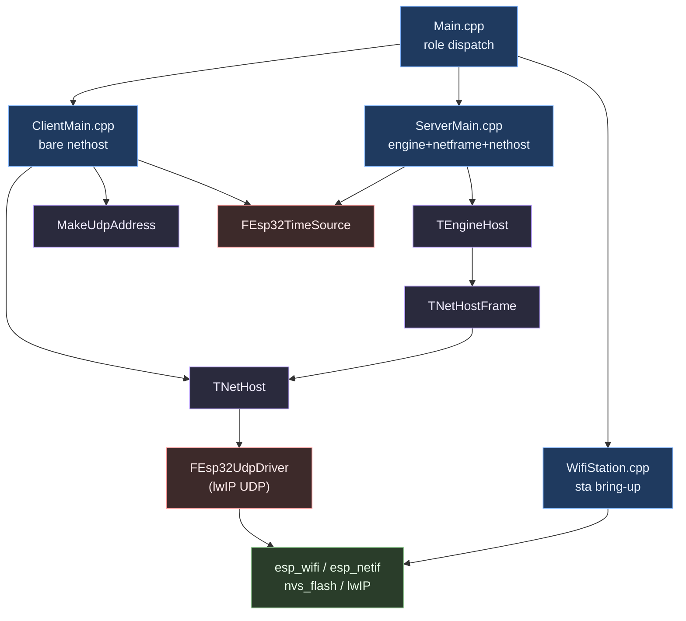
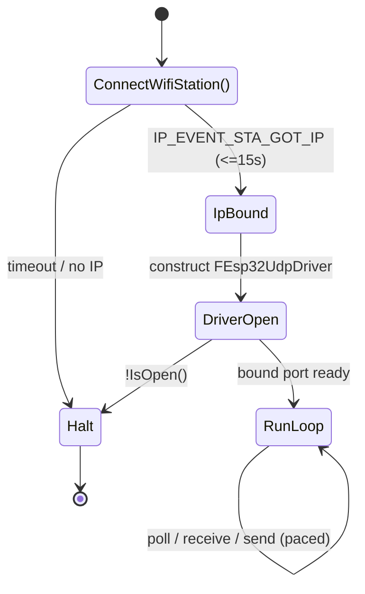
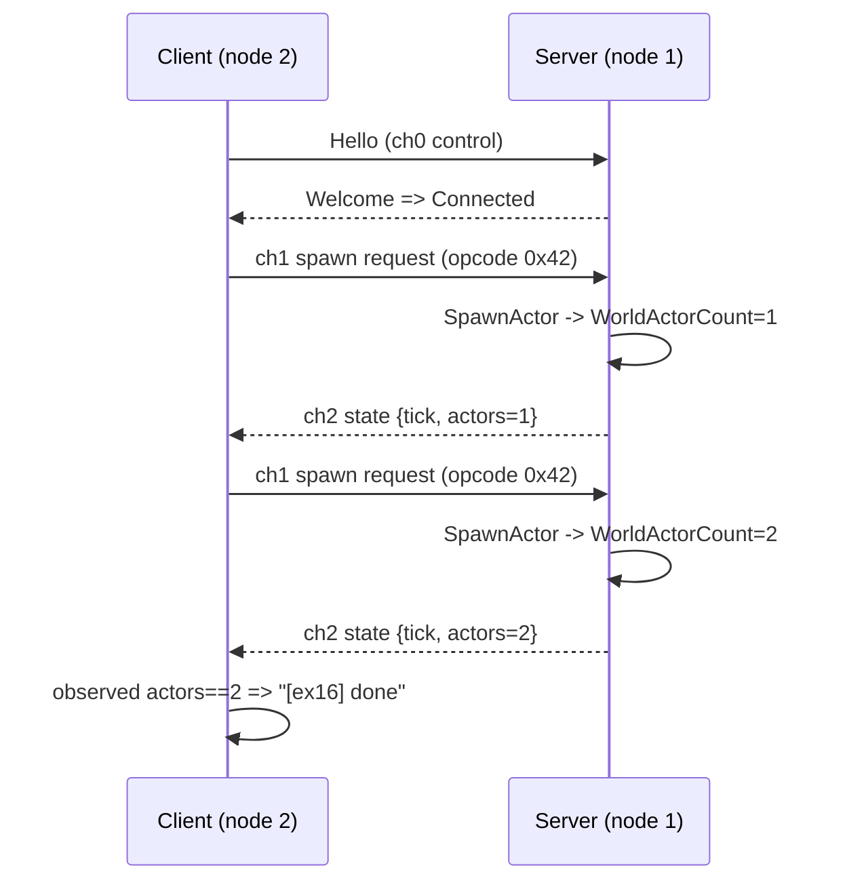

# Plan — WiFi UDP Coverage (examples 15 & 16)

**Slug:** `wifi-udp-coverage` · **Concept:** [.claude/concepts/wifi-udp-coverage.md](.claude/concepts/wifi-udp-coverage.md)
**Date:** 2026-07-23 · **Roadmap:** `docs/EXAMPLES_ROADMAP.md` Phase 6 (task 6.1 = ex15), Phase 7 (task 7.1 = ex16)

---

## 1. Overview / Goal

Give MicroWorld its first on-hardware WiFi coverage by building two standalone example
projects and (later, human-gated) verifying them on real ESP32-S3 boards:

- **`15-UdpEcho`** — one board joins WiFi and echoes UDP datagrams to a PC, driving the
  raw `FEsp32UdpDriver` directly. Proves WiFi association + `TrySend`/`TryReceive`/
  `PollReadable` on silicon, and **closes the one documented driver unknown**: the
  oversize-datagram (`> UdpMaxPacketBytes`) receive path.
- **`16-TwoBoardUdp`** — two boards run the full networked engine over WiFi UDP: a
  dedicated-server `TEngineHost` bound to `TNetHost` via `TNetHostFrame`, and a bare
  `TNetHost` client. Port of the proven host `TwoNodeDemo`; the WiFi twin of example 19.

**Definition of done:** both examples compile clean under `pio run` `[SUCCESS]`, root
`ctest` count unchanged, class-doc convention satisfied; then each example's
`Hardware-verified` box is checked after its §1.2 checkpoint with a captured trace pasted
into its README.

---

## 2. Requirements & Scope

### In scope

- New `examples/15-UdpEcho/` and `examples/16-TwoBoardUdp/` projects (scaffold per §3).
- Net-new WiFi station glue (`WifiStation.h/.cpp`) duplicated in each example (§2.4 allows).
- Committed `NetworkConfig.example.h` template per example; real `NetworkConfig.h` stays
  git-ignored (`examples/*/src/NetworkConfig.h` is already in `.gitignore`).
- A `tools/EchoClient.py` for example 15 (plain echo **and** an oversize send).
- Catalog/status updates in `examples/README.md`; checkbox + evidence lines in
  `docs/EXAMPLES_ROADMAP.md`; evidence rows in `PROGRESS.md`; a `CHANGELOG.md` entry.

### Out of scope

- `17-TwoBoardLora` (radio, not WiFi — separate transport).
- Examples `02`–`14` (the unbuilt ladder rungs) — this is an authorized out-of-order build.
- **Any change under `Modules/`** — READ-ONLY. A driver defect surfaced on hardware is a
  `⛔ BLOCKED` finding to report, never an in-example library patch (roadmap rule 7).

### Constraints (standing)

| Constraint | Rule |
| --- | --- |
| Write access | `examples/`, `docs/decisions/`, `PROGRESS.md`, `CHANGELOG.md`, `examples/README.md`, EXAMPLES_ROADMAP checkbox/evidence only |
| Hardware | Human-gated: no `-t upload` / `device monitor` without explicit per-example authorization that turn |
| Format | `clang-format --style=file:clang-format -i <touched .h/.cpp>` (config file has NO leading dot) |
| Commit | One per task, conventional style, checkbox/evidence/PROGRESS in the SAME commit; trailer `Co-Authored-By: Claude Opus 4.8 <noreply@anthropic.com>` |
| Names | No metaphor/jargon identifiers |

---

## 3. Affected Components & File Inventory

All paths are **new files** unless marked *(edit)*.

### Example 15 — `examples/15-UdpEcho/`

```text
platformio.ini                 single env, WiFi CMake variant (§3.3 + credentials note)
CMakeLists.txt                 verbatim §3.4
AGENTS.md                      architecture/concepts/verification (§3.7 tail)
README.md                      §3.7 sections; "not yet verified" line until checkpoint
tools/EchoClient.py            PC UDP client: plain echo + oversize (>1200 B) send
src/CMakeLists.txt             idf_component_register SRCS + WiFi PRIV_REQUIRES (§3.5)
src/NetworkConfig.example.h    committed template (kWifiSsid/Password, kServerPort)
src/WifiStation.h              ConnectWifiStation contract (§3.8)
src/WifiStation.cpp            standard station bring-up
src/Main.cpp                   echo loop over raw FEsp32UdpDriver
```

### Example 16 — `examples/16-TwoBoardUdp/`

```text
platformio.ini                 two role envs (server/client), §3.3 role diff
CMakeLists.txt                 verbatim §3.4
AGENTS.md                      architecture/concepts/verification
README.md                      §3.7 sections; "not yet verified" line until checkpoint
src/CMakeLists.txt             SRCS Main/ServerMain/ClientMain/WifiStation + WiFi PRIV_REQUIRES
src/NetworkConfig.example.h    committed template (+ kServerIpv4 for the client build)
src/WifiStation.h              same contract as ex15 (duplicated, §2.4)
src/WifiStation.cpp            same bring-up (duplicated)
src/UdpMessagingShared.h       protocol consts + config builders (ports ex19's Ex19 header)
src/Main.cpp                   role dispatch on -DMICROWORLD_EXAMPLE_SERVER
src/ServerMain.cpp             WiFi + TEngineHost + TNetHostFrame + TNetHost (DedicatedServer)
src/ClientMain.cpp             WiFi + bare TNetHost (Client)
```

### Shared doc edits *(edit)*

```text
examples/README.md             catalog status: 15, 16 → Built / Hardware-verified
docs/EXAMPLES_ROADMAP.md       task 6.1 & 7.1 Built + Hardware-verified boxes + evidence
PROGRESS.md                    evidence rows for ex15 and ex16
CHANGELOG.md                   one entry: WiFi UDP examples added
```

---

## 4. Architecture & Data Flow

**Layering is identical to the wired examples** — the example composes portable MicroWorld
types over the verified ESP32 platform adapter; only the driver and the pre-driver network
bring-up differ from example 19.

- **Example 15** talks to the driver directly: no `TNetHost`, no engine. `WifiStation`
  brings up `nvs`/`netif`/`event-loop`/`wifi-sta` and blocks until an IP is bound; then the
  driver binds `kServerPort` and the loop echoes each received datagram back to its sender.
- **Example 16** is the full stack: `WifiStation` first, then the *exact* example-19
  composition with `FEsp32UdpDriver` in place of `FEsp32UartDriver` and a `MakeUdpAddress`
  server address in place of `MakeUartAddress`. Server prints its IP so the human can put it
  in the client's `NetworkConfig.h`.

**Critical ordering invariant (both examples):**
`nvs_flash_init` → `esp_netif_init` → `esp_event_loop_create_default` → WiFi-sta bring-up →
IP bound → **only now** construct any `FEsp32UdpDriver`. Constructing the driver first
asserts inside lwIP ("Invalid mbox"). All composition objects are `static`.

---

## 5. Diagrams

### 5.1 Component / dependency (example 16, the fuller one)



### 5.2 Boot & bring-up ordering (both examples)



### 5.3 Example 16 message exchange (ported from TwoNodeDemo / example 19)



---

## 6. Implementation Steps

### Step A — Example 15 scaffold + WiFi glue

Copy the §3.1 layout. `platformio.ini` is the **single-env** §3.3 (one `[env:esp32-s3]`).
`src/CMakeLists.txt` uses the WiFi variant:

```cmake
idf_component_register(
    SRCS "Main.cpp" "WifiStation.cpp"
    PRIV_REQUIRES nvs_flash esp_wifi esp_netif esp_event
)
# ...the same target_compile_options block as example 19 (Wall/Wextra/Wpedantic/Werror,
#    -Wno-error=pedantic, -Wno-deprecated-declarations, -fno-exceptions, -fno-rtti)
```

`WifiStation.h` — the §3.8 contract verbatim:

```cpp
#pragma once

/** Joins the configured WiFi as a station and blocks until an IPv4 address is
 * bound or ~15 s elapse. Returns true only when the interface has an address;
 * prints "[<tag>] wifi ip=<a.b.c.d>" on success. Call once, before any
 * FEsp32UdpDriver is constructed. */
bool ConnectWifiStation(const char* ExampleTag) noexcept;
```

`WifiStation.cpp` — implement the standard station sequence **exactly as written in
EXAMPLES_ROADMAP §3.8** (do not paraphrase it into code; the roadmap is the source of
truth): `nvs_flash_init` (erase+retry on `ESP_ERR_NVS_NO_FREE_PAGES`/`NEW_VERSION`) →
`esp_netif_init` → `esp_event_loop_create_default` → `esp_netif_create_default_wifi_sta` →
`esp_wifi_init` → register `WIFI_EVENT`/`IP_EVENT` handlers →
`esp_wifi_set_mode(WIFI_MODE_STA)` → `esp_wifi_set_config` with `kWifiSsid`/`kWifiPassword`
→ `esp_wifi_start` → wait on an event group for `IP_EVENT_STA_GOT_IP` with a 15 s timeout;
print the bound IP.

`src/NetworkConfig.example.h` — committed template (§3.8), student copies to
`NetworkConfig.h`:

```cpp
#pragma once
#include <cstdint>
/** WiFi network the board joins; copy to NetworkConfig.h and fill in. */
constexpr const char* kWifiSsid = "YOUR_SSID";
/** WiFi password; NetworkConfig.h is git-ignored so the real value never lands in git. */
constexpr const char* kWifiPassword = "YOUR_PASSWORD";
/** UDP port the board binds and the PC client targets. */
constexpr std::uint16_t kServerPort = 40404;
```

#### Implementer Context
> `WifiStation.cpp` is vendor glue, not MicroWorld — no `F`/`T`/`E` prefixes required on
> its internals, but document every function and every persistent (static/file-scope)
> variable with a *why* comment (convention-enforced; the class-doc checker is
> Modules-scoped). Keep the event-group handle and the retry counter as documented
> file-scope statics. Do NOT print the password. Include `NetworkConfig.h` (not the
> template) from `WifiStation.cpp`/`Main.cpp`; the build fails helpfully if the student
> forgot to copy it — that is intended.

### Step B — Example 15 echo loop + oversize probe

```cpp
extern "C" void app_main(void)
{
    if (!ConnectWifiStation("ex15")) { std::printf("[ex15] wifi failed; halting\n"); return; }
    static MicroWorld::FEsp32UdpDriver Driver(kServerPort);
    std::printf("[ex15] listening port=%u open=%d\n", (unsigned)Driver.BoundPort(), Driver.IsOpen() ? 1 : 0);
    if (!Driver.IsOpen()) { std::printf("[ex15] socket failed; halting\n"); return; }

    static std::uint8_t RxBuffer[MicroWorld::FEsp32UdpDriver::UdpMaxPacketBytes];
    for (;;)
    {
        if (Driver.PollReadable(250))
        {
            MicroWorld::FNetAddress From{};
            MicroWorld::FNetReceiveResult Rx{};
            const MicroWorld::ENetResult Result =
                Driver.TryReceive(From, {RxBuffer, sizeof(RxBuffer)}, Rx);
            if (Result == MicroWorld::ENetResult::Success)
            {
                std::printf("[ex15] rx bytes=%u from_port=%u\n",
                    (unsigned)Rx.BytesReceived, (unsigned)MicroWorld::UdpAddressPort(From));
                const MicroWorld::ENetResult Sent =
                    Driver.TrySend(From, {RxBuffer, Rx.BytesReceived});
                std::printf("[ex15] echo result=%d\n", (int)Sent);
            }
            else if (Result == MicroWorld::ENetResult::Full)
            {
                // OVERSIZE OBSERVATION: head datagram exceeds the 1200-byte buffer.
                std::printf("[ex15] rx oversize: datagram larger than buffer (result=Full)\n");
            }
        }
        vTaskDelay(pdMS_TO_TICKS(10));
    }
}
```

`tools/EchoClient.py` — sends a normal line, prints the echo, then sends a >1200-byte
payload to probe the oversize path. **It compares echoed length to sent length** so a
*silently truncated* echo is caught, not mistaken for success:

```python
"""Echo + oversize probe. Usage: EchoClient.py <board-ip> [port]."""
import socket, sys
ip = sys.argv[1]; port = int(sys.argv[2]) if len(sys.argv) > 2 else 40404
s = socket.socket(socket.AF_INET, socket.SOCK_DGRAM); s.settimeout(5.0)

msg = b"hello microworld"
s.sendto(msg, (ip, port))
echo, _ = s.recvfrom(2048)
print(f"echo: {len(echo)}B {'OK' if echo == msg else 'MISMATCH'}")

big = b"X" * 1500                            # > UdpMaxPacketBytes (1200)
s.sendto(big, (ip, port))
try:
    got, _ = s.recvfrom(4096)
    verdict = "FULL-ECHO" if len(got) == len(big) else f"TRUNCATED {len(got)}/{len(big)}B"
    print(f"oversize: echoed {len(got)}B -> {verdict}")
except socket.timeout:
    print("oversize: no echo (board reported Full and dropped/wedged)")
```

#### Implementer Context
> `FNetReceiveResult`'s byte-count field is `BytesReceived` (verified in `NetResult.h`).
> **The oversize outcome is NOT bimodal — it hinges on a buffer-size coincidence.**
> `RxBuffer` is `UdpMaxPacketBytes` (1200), which equals the driver's internal
> `PeekScratchBytes`. The peek only reports the *true* datagram length when `MSG_TRUNC` is
> compiled in; otherwise it reports the copied length, capped at 1200. So on this build the
> 1500-byte send can produce **three** distinct observations, and the example must let
> hardware tell us which:
> - `MSG_TRUNC` present → peek sees 1500 > 1200 → `TryReceive` returns `Full`, no echo (PC
>   times out); the datagram *stays queued* and may wedge every later poll.
> - `MSG_TRUNC` absent → peek caps at 1200, never `> Capacity` → returns `Success` with
>   `BytesReceived=1200` → board echoes a **silently truncated** 1200 B (PC prints
>   `TRUNCATED 1200/1500B`).
> - anything else → capture verbatim.
>
> Record whichever occurs in the README + PROGRESS — do NOT patch the driver (Modules/ is
> read-only). The example stays safe regardless: it never indexes past `Rx.BytesReceived`.

### Step C — Example 16 scaffold + shared protocol header

`platformio.ini` = the **two-role** pattern from example 19 (verbatim structure; only the
folder name differs). `src/CMakeLists.txt`:

```cmake
idf_component_register(
    SRCS "Main.cpp" "ServerMain.cpp" "ClientMain.cpp" "WifiStation.cpp"
    PRIV_REQUIRES nvs_flash esp_wifi esp_netif esp_event
)
# ...same target_compile_options block as example 19...
```

`src/UdpMessagingShared.h` — ports example 19's `Ex19` header to UDP (namespace `Ex16`):

```cpp
namespace Ex16
{
constexpr std::uint8_t  ServerNodeId = 1;      // stamps server frames
constexpr std::uint8_t  ClientNodeId = 2;      // stamps client frames
constexpr std::uint8_t  InputEventChannel = 1; // client -> server spawn request
constexpr std::uint8_t  StateBroadcastChannel = 2; // server -> peers world state
constexpr std::uint8_t  SpawnRequestOpcode = 0x42;
constexpr int           MaxSpawns = 2;
constexpr std::uint8_t  ProtocolVersion = 1;
constexpr MicroWorld::FTypeId DemoSpawnedActorTypeId{0x00080001u};
constexpr unsigned      PollPacingMilliseconds = 20;

/** Session config; heartbeats keep the peer alive between explicit sends. */
inline MicroWorld::FNetHostConfig MakeHostConfig() noexcept
{
    MicroWorld::FNetHostConfig Config{};
    Config.HeartbeatIntervalMilliseconds = 1000;
    Config.PeerTimeoutMilliseconds = 5000;
    Config.ProtocolVersion = ProtocolVersion;
    return Config;
}
} // namespace Ex16
```

#### Implementer Context
> Node ids are cosmetic over UDP (unlike UART, the UDP address carries identity), but keep
> them so the trace matches example 19 and the frame codec has a stable source id. The
> server address the client greets comes from `NetworkConfig.h`'s `kServerIpv4[4]` +
> `kServerPort` via `MakeUdpAddress(kServerIpv4[0..3], kServerPort)`. The `TNetHost` packet
> capacity was `120` for UART (small MTU); UDP allows up to `UdpMaxPacketBytes`, but keep
> the payloads tiny (2-byte state, 1-byte request) so `TNetHost<_, 256>` is ample — match
> the TwoNodeDemo's `256`.

### Step D — Example 16 server & client roles

`ServerMain.cpp` = example 19's `RunServer()` with three changes: (1) `ConnectWifiStation`
first and print `[ex16] server ip=<...>`; (2) construct `FEsp32UdpDriver Driver(kServerPort)`
instead of the UART driver; (3) the `TNetHost` `MaxPacketBytes` template arg is `256` (not
ex19's `120`), per Step C. Everything else from `FServerNet`/`FServerEngine` down is identical.

`ClientMain.cpp` = example 19's `RunClient()` with the same two changes and the server
address built from `MakeUdpAddress`:

```cpp
void RunClient() noexcept
{
    if (!ConnectWifiStation("ex16")) { std::printf("[ex16] wifi failed; halting\n"); return; }
    static FEsp32UdpDriver Driver(0); // ephemeral local port
    std::printf("[ex16] client open=%d\n", Driver.IsOpen() ? 1 : 0);
    if (!Driver.IsOpen()) { std::printf("[ex16] socket failed; halting\n"); return; }
    static FClientNet ClientNet{Driver};
    // ...install ch2 handler exactly as ex19...
    FNetHostConfig Config = Ex16::MakeHostConfig();
    Config.ServerAddress = MakeUdpAddress(kServerIpv4[0], kServerIpv4[1], kServerIpv4[2], kServerIpv4[3], kServerPort);
    // ...Configure(Client)/Start/loop identical to ex19...
}
```

#### Implementer Context
> The server binds `kServerPort` (fixed) so the client can address it; the client binds `0`
> (ephemeral) — it only needs to reach the server, and `TNetHost` learns the client's
> address from its Hello. Keep the trace tags `[ex16]` and the exact line wording of
> example 19 (`client connected`, `client rx state tick=<n> actors=<n>`, `done`) so the
> two examples read as twins. `kServerIpv4` is only consumed by the client build, but it
> lives in the shared `NetworkConfig.example.h` (the server build simply ignores it).

### Step E — READMEs, AGENTS, catalog, Build Verify

Fill each README per §3.7 (Feature / What it does / APIs / Hardware / Build / Flash and
observe / Expected output / Verified output / Image size). Until the §1.2 checkpoint, the
Verified-output section carries the literal line
*"Status: compiled for ESP32-S3; not yet verified on hardware."* Add each example's
`AGENTS.md`. Update the `examples/README.md` catalog status column.

Run Build Verify (§1.1) for each example:

```bash
clang-format --style=file:clang-format -i <touched .h/.cpp>
pio run -d examples/15-UdpEcho
pio run -d examples/16-TwoBoardUdp
cmake --build build --config Release && ctest --test-dir build -C Release --output-on-failure
```

---

## 7. Test / Verification Strategy

| Layer | What it verifies | How |
| --- | --- | --- |
| Compile (both) | Every WiFi/UDP symbol resolves; role builds link | `pio run -d examples/NN` ends `[SUCCESS]`; both role envs build for 16 |
| Repo gate | Example sources pass the repo-wide format check | root `ctest` count unchanged (format check covers tracked `.h/.cpp`) |
| Doc convention | Every function + persistent var documented | manual §2.1 review (checker is Modules-scoped) |
| HW ex15 (gated) | WiFi assoc + driver send/receive + **oversize path** | flash board, run `EchoClient.py`; capture board trace + client echo; record real oversize behavior |
| HW ex16 (gated) | Full stack over WiFi: connect → 2 spawns → actors=2 | flash both roles (server IP → client `NetworkConfig.h`), capture client trace |

**Warnings are defects** except the accepted vendor `#include_next`/`-Wpedantic`
downgrades. No new root `ctest` tests are added (examples are consumer projects, not
module tests) — the coverage is the compile gate + the hardware capture.

---

## 8. Pitfalls

- **Driver before netif → lwIP assert.** Constructing `FEsp32UdpDriver` before WiFi/netif
  bring-up asserts "Invalid mbox". `ConnectWifiStation` must return true first. *(The
  netif/event-loop half of the ordering is confirmed in `PlatformEsp32Main.cpp`; the
  `nvs_flash_init` + WiFi-association half is new to this codebase — first proven here.)*
- **Local (stack) composition → main-task stack overflow.** All composition objects
  `static`; the 3,584-byte main task stack cannot hold them.
- **Missing `NetworkConfig.h`.** Git-ignored; a fresh checkout has only the template. The
  `#include "NetworkConfig.h"` fails helpfully — document the copy step in the README.
- **Oversize datagram may wedge the ex15 queue.** When `MSG_TRUNC` is present, `TryReceive`
  returns `Full` and *keeps* the datagram queued; a single oversize packet can make every
  later poll re-report `Full`. Record whatever hardware does — do not patch the driver.
- **The same wedge threatens ex16's server on a shared LAN.** The server socket binds
  `INADDR_ANY:kServerPort`, reachable by any device on the WiFi. `TNetHost`'s inbound drain
  treats `Full` exactly like `Unavailable` — silently — so one stray datagram >
  `MaxPacketBytes` (256) from network noise, a misconfigured device, or a mis-aimed
  `EchoClient.py` oversize probe can permanently head-of-line-block the server with no error
  surfaced. Mitigation is procedural, not code (Modules/ is read-only): keep the oversize
  probe pointed only at the ex15 board, and if the ex16 client trace silently stalls with no
  server-side progress, reboot the server (see §10 T11 recovery note).
- **ESP32-S3 is 2.4 GHz only.** A 5 GHz-only SSID never associates; `ConnectWifiStation`
  times out and the example halts cleanly.
- **Server IP is dynamic.** The client needs the server's DHCP IP in `NetworkConfig.h`;
  server prints `[ex16] server ip=<...>` at boot for the human to copy. Two-step flash.
- **`FNetReceiveResult` field names** — read the real header; don't assume `BytesReceived`.
- **One-sided capture.** Only the CH343 board's console is readable on this rig; ex16
  captures the client side (as ex19 did). Not a defect — a rig fact to state in the README.

---

## 9. Constraints Checklist

| Item | Applies? | Note |
| --- | --- | --- |
| Replication / `HasAuthority` | No | no UE replication in MicroWorld |
| Async / threads | No | single-threaded paced loop; FreeRTOS idle via `vTaskDelay` |
| GC safety (`UPROPERTY`) | No | MicroWorld object store, not UE UObject GC; budget `{1,4,8}` proven |
| Blueprint exposure | No | embedded C++ only |
| New module deps | No | examples consume `Modules/` via `symlink://`, unchanged |
| Heap allocation | No (MW) | WiFi/lwIP vendor SDK allocates internally — its business, not the example's |
| Read-only `Modules/` | Yes | any driver defect = `⛔ BLOCKED`, reported not patched |
| Secrets in git | Guarded | real `NetworkConfig.h` git-ignored; only the template commits |

---

## 10. Rollout / Hardware Checkpoint Plan

1. **Build ex15** → compile-verify → **commit** (Built box checked, "not yet verified" line).
2. **Build ex16** → compile-verify → **commit** (Built box checked).
3. *(request authorization)* **HW ex15**: human copies `NetworkConfig.h`, authorizes flash;
   I flash, run `EchoClient.py`, capture → fill Verified output, check Hardware box, evidence
   + PROGRESS → **commit**.
4. *(request authorization)* **HW ex16**: flash server, read its IP into client
   `NetworkConfig.h`, flash client, capture client trace → fill Verified output, check box,
   evidence + PROGRESS + CHANGELOG → **commit**.
   - **Recovery note:** if the client trace silently stalls (connects but no `rx state`
     progress) with no server-side error, a stray oversize datagram may have wedged the
     server socket (§8) — reboot the server board and re-observe. Do not aim the ex15
     oversize probe at the ex16 server.

Steps 1–2 need no hardware. Steps 3–4 are each independently human-gated.

---

## 11. Task Breakdown

Atomic, in order. `[HW]` = human-gated, do not start without explicit authorization.

| # | Task | Files | Done when |
| --- | --- | --- | --- |
| T1 | ex15 scaffold | `15-UdpEcho/{platformio.ini,CMakeLists.txt,src/CMakeLists.txt}` | single-env WiFi build config present |
| T2 | ex15 WiFi glue + config template | `src/{WifiStation.h,WifiStation.cpp,NetworkConfig.example.h}` | contract §3.8 implemented; no password printed |
| T3 | ex15 echo loop + PC client | `src/Main.cpp`, `tools/EchoClient.py` | echo + oversize probe; safe on `Full` |
| T4 | ex15 docs + Build Verify | `README.md`, `AGENTS.md`, `examples/README.md` *(edit)* | `pio run` `[SUCCESS]`; ctest unchanged; **commit** |
| T5 | ex16 scaffold + shared header | `16-TwoBoardUdp/{platformio.ini,CMakeLists.txt,src/CMakeLists.txt,src/UdpMessagingShared.h}` | two role envs; `Ex16` consts present |
| T6 | ex16 WiFi glue + config template | `src/{WifiStation.h,WifiStation.cpp,NetworkConfig.example.h}` | duplicated glue + `kServerIpv4` in template |
| T7 | ex16 server role | `src/ServerMain.cpp` | ex19 RunServer ported to WiFi/UDP; prints server ip |
| T8 | ex16 client role + dispatch | `src/{ClientMain.cpp,Main.cpp}` | ex19 RunClient ported; `MakeUdpAddress` server addr |
| T9 | ex16 docs + Build Verify | `README.md`, `AGENTS.md`, `examples/README.md` *(edit)* | both role builds `[SUCCESS]`; ctest unchanged; **commit** |
| T10 `[HW]` | ex15 hardware checkpoint | `README.md`, `EXAMPLES_ROADMAP.md`, `PROGRESS.md` *(edit)* | captured echo + oversize behavior recorded; boxes/evidence; **commit** |
| T11 `[HW]` | ex16 hardware checkpoint | `README.md`, `EXAMPLES_ROADMAP.md`, `PROGRESS.md`, `CHANGELOG.md` *(edit)* | client trace shows actors=2; boxes/evidence; **commit** |

**Commit points:** after T4, T9, T10, T11 (four commits). T1–T3 and T5–T8 are staged within
their example's build commit.
