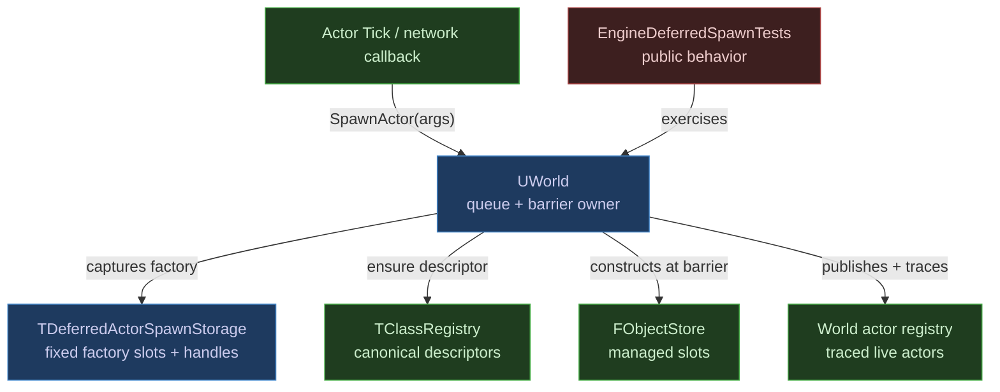
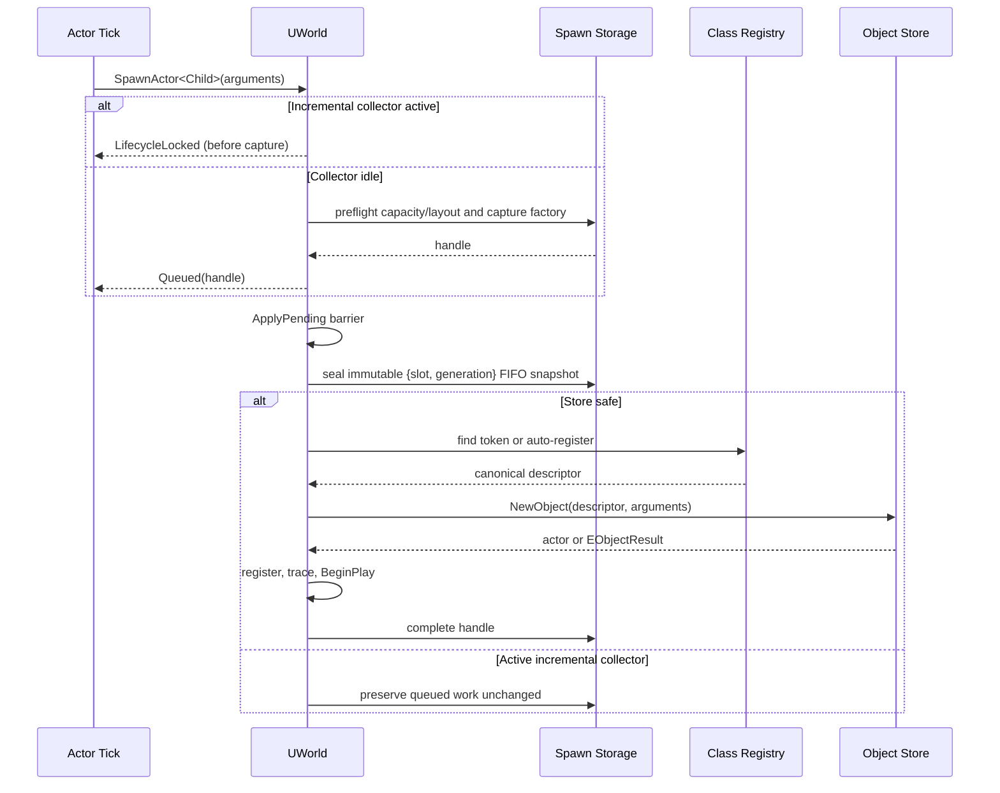

# Deferred World-Owned Actor Spawning

| Field | Value |
|---|---|
| **Created** | 2026-07-25 |
| **Status** | Approved for implementation-path selection |
| **Change Type** | Redesign + new feature |
| **Author** | Codex |
| **Target Module** | Object + Engine |
| **Priority** | High |
| **Estimated Scope** | L (multi-file, bounded runtime API) |
| **P4 CL / Branch** | N/A |

---

## 0 · TL;DR

**What the user sees:** `World->SpawnActor<TActor>(...)` may be called from an actor's `Tick`, a network callback, or other ordinary gameplay code. The actor does not exist at the call site; it becomes a world-owned actor at the next safe world barrier.

**Why it happens:** managed-object construction is unsafe during dispatch and incremental collection. The object store also accepts only the class registry's canonical descriptor, so a local descriptor cannot directly construct an actor.

**What the fix does:** the world receives bounded request storage and a registry-registration view. It queues a type-erased, inline factory immediately, then resolves the canonical descriptor, constructs, registers, traces, and begins the actor only at a safe barrier. No heap allocation, RTTI, or global mutable state is introduced.

---

## 1 · Objective & Motivation

### 1.1 Problem Statement

`UWorld::SpawnActor(TObjectPtr<AActor>)` currently queues only an actor the caller has already constructed. Constructing that actor from `Tick` is rejected by `FObjectStore`, so gameplay code cannot safely request a new actor in one world-owned call. The new API must keep the actor in the world while preserving the object store's descriptor-identity and mutation-lock invariants.

### 1.2 Success Criteria

- [ ] `UWorld::SpawnActor<TActor>(Arguments...)` accepts a bounded request from a running actor callback without constructing an actor there.
- [ ] At a safe `ApplyPending` barrier, the request auto-registers a direct `AActor` subclass (or reuses its manually registered descriptor), constructs it in the same store, and makes the world trace and begin it.
- [ ] The request returns a generation-checked handle whose status reports `Queued`, `Spawned`, `Failed`, `Released`, or `Stale`; a spawned handle resolves to the world-owned actor while it remains live.
- [ ] A full request queue, oversized/misaligned factory, invalid world lifecycle, registry capacity failure, and store construction failure are explicit and leave no partial actor or leaked factory.
- [ ] Queued factories trace supported captured `TObjectPtr` arguments, and publish-pending slots trace their retained actors, so collection cannot reclaim either before world ownership; an active incremental collection rejects a new request before it captures arguments.
- [ ] Existing preconstructed `SpawnActor(TObjectPtr<AActor>)`, destroy ordering, and direct `UWorld`/`TInlineWorld` consumers retain their present contracts.

### 1.3 Out of Scope

- Deferred component creation, runtime component add/remove, replication, networking policy, threads, or a platform scheduler.
- Immediate typed actor pointers from the deferred call; callers use the completion handle after a barrier.
- Cancellation, callbacks-on-completion, and persistence of completion history after the bounded handle slot is reused.
- Automatic support for user-defined deeper descriptor hierarchies; those types remain manually registered and are reused by type token.
- Changing the existing object-store rule that active incremental collection blocks managed construction and dispatch.

---

## 2 · Context & Current State Analysis

### 2.1 Affected Systems Map

| System / Class | Role in Change | Ownership |
|---|---|---|
| `TClassRegistry` | Assigns canonical automatic descriptors and local IDs | Application composition root |
| `FClassRegistryRegistrationView` | Narrow mutable capability borrowed by World | Registry owner outlives World |
| `TDeferredActorSpawnStorage` | Fixed request slots and inline factory bytes | `TEngine` or direct caller |
| `UWorld` | Public queue API, barrier execution, actor tracing | Managed store object |
| `FObjectStore` | Performs final placement construction only | `TEngine` or direct caller |
| `TEngine` | Supplies registry and request storage to its single World | Default composition root |
| `EngineDeferredSpawnTests` | Exercises only public engine contracts | Isolated test host |

### 2.2 Existing Code Audit

```text
Modules/
├── Object/
│   ├── include/MicroWorld/Object/ClassDescriptor.h  # registry owns copied descriptors
│   ├── include/MicroWorld/Object/ObjectStore.h      # canonical identity validation
│   └── tests/ObjectStoreTests.cpp                   # registry/store behavior
└── Engine/
    ├── include/MicroWorld/Engine/EngineStorage.h    # caller-owned actor storage
    ├── include/MicroWorld/Engine/EngineHost.h       # default composition root
    ├── include/MicroWorld/Engine/World.h            # actor queue public contract
    ├── src/World.cpp                                # safe barrier and GC tracing
    └── tests/EngineSpawnDestroyTests.cpp             # existing queued actor behavior
```

- Current architecture pattern: a non-template `UWorld` borrows one move-only fixed actor registry reference; `TEngine` owns the registry, store, collector, timers, and that storage.
- Current hard gate: `FObjectStore::ValidateConstruction` accepts only the exact descriptor address stored in the registry.
- Existing behavior: preconstructed actors queue in `FWorldActorRegistry` and are registered/begun at `ApplyPending`; pending actors are traced by `UWorld::VisitReferences`.
- Test coverage: Object store and registry behavior tests; Engine lifecycle/spawn/destroy/host tests, all through public contracts.

### 2.3 UE5-Specific Constraints Checklist

| Constraint | Relevant? | Notes |
|---|---:|---|
| Reflection / Blueprint | No | Portable C++17 library; no Unreal reflection layer. |
| Garbage collection | Yes | MicroWorld incremental collector must see queued `TObjectPtr` arguments. |
| Replication / multiplayer | No | No network or replication dependency enters Engine. |
| Async / latent actions | No | Deferred means one synchronous frame barrier, not a thread/task. |
| Plugins / module boundaries | Yes | Object remains below Engine; Core delegate contract is not widened. |
| Heap allocation | Yes | All request state and factory captures remain caller-sized inline storage. |

### 2.4 Risks & Constraints

- Factory captures must be nothrow constructible, movable, invocable, and destructible, and must fit the caller-selected inline byte budget.
- A factory capture may retain a managed pointer until the barrier; it must participate in `UWorld::VisitReferences` or collection can invalidate it.
- Class IDs are only registry-local. Pointer truncation is forbidden; the registry must allocate an unused non-zero ID in bounded work.
- Direct `UWorld` and `TInlineWorld` construction currently supply no registration or deferred-factory storage. Their existing APIs stay valid; generic deferred spawning reports `Unconfigured` unless the caller supplies both capabilities.
- An active collector still blocks object creation. Deferred work remains queued until a later safe barrier; it must not be discarded or partially run.

---

## 3 · Options Considered

| # | Approach | Pros | Cons | Complexity | Verdict |
|---:|---|---|---|---|---|
| 1 | Bounded deferred factory queue on `UWorld` | Safe from callbacks; desired `World->SpawnActor`; actor becomes world-owned | Asynchronous result and fixed capture budget | High | ✅ Selected |
| 2 | Immediate construction with `LifecycleLocked` failure | Smallest patch | Gameplay code accidentally fails in normal actor callbacks | Low | ❌ Rejected |
| 3 | Put `SpawnActor<T>` on `TEngine` | Easy registry access | Wrong public ownership/call shape; does not solve callback construction | Medium | ❌ Rejected |
| 4 | Require callers to preconstruct actors | Preserves existing implementation | Caller cannot safely construct during callbacks; defeats ergonomic goal | Low | ❌ Rejected |

---

## 4 · Selected Approach

**Option:** Bounded deferred factory queue on `UWorld` | **Complexity:** High

`UWorld` remains the public actor owner. A template call performs only preflight and in-place factory capture; the factory stores the exact actor type and constructor values in fixed caller-owned storage. An active incremental collection rejects a new request before it captures any values. At `ApplyPending` entry, World seals an immutable FIFO snapshot before any destroy or `BeginPlay` dispatch; after preserving existing destroy/preconstructed-spawn behavior, it executes only that snapshot. Successful actors join the same traced world registry as existing spawned actors.

### Key Design Decisions

| Decision | Rationale |
|---|---|
| World receives borrowed registry-write and factory-storage capabilities | Keeps storage/lifetime at the composition root while preserving `World->SpawnActor`. |
| Registry allocates local automatic `FTypeId` values | Avoids lossy pointer-to-`uint32_t` IDs and works independently per engine instance. |
| Request factory is Engine-specific erasure, not `Core::TDelegate` | `UWorld` needs runtime-configured inline capacity from traits; Core delegates require a compile-time capacity and should not absorb Engine construction policy. |
| Queue capacity equals `MaxActors` | At most that many actors can join one world; no speculative extra queue budget. |
| FIFO request execution; terminal slots are reused deterministically | Preserves order and bounds completion history without an unbounded result cache. |
| `FActorSpawnHandle` is `{index, generation}` | Matches established timer/message-handle semantics and prevents ABA after slot reuse. |
| Managed capture traits trace direct `TObjectPtr` values | Prevents collection from reclaiming supported captured references while request factories are queued. |
| Active collection rejects before argument capture | There is no write barrier for an object captured after World was traced; rejecting prevents an unmarked capture from being collected. |
| A `Spawned` slot stays pinned until its actor leaves World | A live actor can never be confused with a later request reusing the same slot. |
| No cancellation in v1 | Avoids ambiguous ownership of move-only constructor data; later demand can justify it. |

### Assumptions & Prerequisites

- **Assumes:** every deferred actor constructor is `noexcept`, as `FObjectStore::NewObject` already requires.
- **Requires:** the direct composition root keeps registry, spawn storage, object store, and world alive in that order; `TEngine` supplies this automatically.
- **Constraint:** a direct subclass of `AActor` can auto-register. A type with an explicit deeper descriptor parent must be registered manually before the request; the automatic path reuses that descriptor by type token.

---

## 5 · Architecture

### 5.1 Component Diagram



### 5.2 Sequence Diagram



**Alternative / Error Paths:**

- Factory queue full, factory too large, or invalid lifecycle → request is rejected before any constructor argument moves.
- Class capacity/layout/store failure → request becomes terminal `Failed`; factory is destroyed and no actor is published.
- A spawned actor leaves World → its handle becomes `Released`; a later reuse advances the generation and the older handle queries as `Stale`.

### 5.3 Components Summary

| Component | Responsibility |
|---|---|
| `FClassRegistryRegistrationView` | Borrowed `Find` and automatic-registration operations over a fixed registry. |
| `TDeferredActorSpawnStorage` | Owns fixed factory bytes, internal construction/publish state, separate FIFO lanes, immutable barrier tickets, and generations. |
| `FActorSpawnHandle` / status | Lets callers observe bounded asynchronous completion without exposing queue storage. |
| `UWorld::SpawnActor<T>` | Validates and queues a factory; never constructs during the caller callback. |
| `UWorld::ApplyPending` | Executes ready factories, then gives successful actors normal world lifecycle ownership. |

### 5.4 Interfaces

```cpp
enum class EActorSpawnRequestResult : std::uint8_t
{
    Queued,
    CapacityExceeded,
    LifecycleLocked,
    Unconfigured,
    FactoryTooLarge,
    FactoryAlignmentUnsupported,
};

struct FActorSpawnHandle final
{
    std::uint16_t Index{InvalidIndex};
    std::uint32_t Generation{0};
    constexpr bool IsValid() const noexcept;
};

struct FActorSpawnRequest final
{
    EActorSpawnRequestResult Result{EActorSpawnRequestResult::CapacityExceeded};
    FActorSpawnHandle Handle{};
};

struct FActorSpawnStatus final
{
    EActorSpawnState State{EActorSpawnState::Stale};
    // Object construction result only; BeginPlay errors remain ApplyPending runtime results.
    EObjectResult CompletionResult{EObjectResult::StaleHandle};
    TObjectPtr<AActor> Actor{};
};

template<typename TActor, typename... TArguments>
[[nodiscard]] FActorSpawnRequest UWorld::SpawnActor(TArguments&&... InArguments) noexcept;

[[nodiscard]] FActorSpawnStatus UWorld::GetSpawnStatus(FActorSpawnHandle InHandle) const noexcept;
```

---

## 6 · Implementation Steps

### Step 1: Add canonical automatic registration to Object
**File:** `Modules/Object/include/MicroWorld/Object/ClassDescriptor.h` | modify

```cpp
template<std::size_t MaxClasses>
class TClassRegistry final
{
public:
    const FClassDescriptor* FindByTypeToken(const void* InTypeToken) const noexcept;
    EObjectResult RegisterAutomatic(FClassDescriptor InCandidate, const FClassDescriptor*& OutDescriptor) noexcept;

private:
    FTypeId AllocateAutomaticTypeId() noexcept;
    FTypeId NextAutomaticTypeId{FirstAutomaticTypeId};
};
```

#### Implementer Context
> - `Register` remains the explicit primitive and keeps current behavior unchanged.
> - `RegisterAutomatic` accepts `TypeId == 0`, first reuses an existing matching `TypeToken`, then validates the canonical parent chain, finds an unused non-zero ID in at most `MaxClasses` probes, copies the descriptor, and returns the registry-owned address.
> - Start from a named automatic-ID range but always probe `Find`, because manual IDs may occupy it. Never derive IDs from a pointer address.
> - Keep descriptor addresses stable: do not move the array or expose mutable entries.

### Step 2: Expose a narrow mutable registry capability
**File:** `Modules/Object/include/MicroWorld/Object/ObjectStore.h` | modify

```cpp
class FClassRegistryRegistrationView final
{
public:
    const FClassDescriptor* Find(FTypeId InTypeId) const noexcept;
    EObjectResult RegisterAutomatic(FClassDescriptor InCandidate, const FClassDescriptor*& OutDescriptor) noexcept;
};

template<std::size_t MaxClasses>
FClassRegistryRegistrationView MakeClassRegistryRegistrationView(TClassRegistry<MaxClasses>& InRegistry) noexcept;

class FObjectStore
{
public:
    // A narrow query used by World to reject unsafe factory captures during an incremental collection.
    [[nodiscard]] bool IsCollectionActive() const noexcept;
};
```

#### Implementer Context
> - Mirror `FClassRegistryView`: erase capacity behind a non-owning context plus function pointers.
> - The view is for World construction only; `FObjectStore` retains its existing lookup-only view and identity validation.
> - An empty view returns `UnknownClass` and null output without mutation.
> - `IsCollectionActive` exposes only collector activity, not the broader dispatch lock: actor callbacks are dispatch-locked but must still be able to queue a deferred request. This preflight runs before a request reserves a slot or moves any argument.

### Step 3: Add bounded deferred-spawn value types and storage
**File:** `Modules/Engine/include/MicroWorld/Engine/DeferredActorSpawn.h` | new

```cpp
struct FActorSpawnHandle final { /* index + generation */ };
enum class EActorSpawnState : std::uint8_t { Queued, Spawned, Failed, Released, Stale };
enum class EActorSpawnRequestResult : std::uint8_t { Queued, CapacityExceeded, LifecycleLocked, Unconfigured, FactoryTooLarge, FactoryAlignmentUnsupported };
struct FActorSpawnRequest final { EActorSpawnRequestResult Result; FActorSpawnHandle Handle; };
struct FActorSpawnStatus final { EActorSpawnState State; EObjectResult CompletionResult; TObjectPtr<AActor> Actor; };

template<std::size_t MaxRequests, std::size_t InlineFactoryBytes>
class TDeferredActorSpawnStorage final { /* slot state, raw factory bytes, retained actor, queued/publish FIFOs, barrier tickets */ };
```

#### Implementer Context
> - This header owns Engine-specific type erasure: erased invoke, destroy, and reference-visit operations plus `std::max_align_t` inline bytes. Do not modify Core `TDelegate`; its fixed compile-time storage contract is correct for delegates but cannot be selected through non-template `UWorld`.
> - Internal states are `Queued`, `ConstructedPendingPublish`, `Spawned`, `Failed`, `Released`, free, or retired. Public status maps `ConstructedPendingPublish` to `Queued`. That state retains the newly constructed `TObjectPtr<AActor>`, destroys its factory exactly once, and is not reusable until Phase 2 publishes it or resolves failure.
> - `Spawned` is pinned and cannot be reused until `UWorld` removes that actor; `Failed` and `Released` are terminal/reusable. Advance or retire the generation before publishing the next handle.
> - The generic factory uses decayed constructor values and `std::tuple`; validate slot availability, factory size, and alignment before constructing/moving any argument.
> - Maintain separate FIFO lanes for `Queued` factories and `ConstructedPendingPublish` actors. At each barrier entry, seal fixed caller-owned `{slot, generation}` tickets for both lanes. Phase 1 invokes only the queued-factory tickets. Phase 2 publishes prior pending actors first, then newly constructed actors; if its guard cannot be acquired, every un-published actor remains in the publish-pending FIFO for the next barrier. Verify both ticket values before acting, so a terminal-slot reuse or reentrant request can never enter the current barrier.
> - Provide traits that visit direct `TObjectPtr<T>` capture values. The default trait has no references; custom capture wrappers with managed references must explicitly specialize the trait.

### Step 4: Wire deferred storage into Engine caller-owned storage
**File:** `Modules/Engine/include/MicroWorld/Engine/EngineStorage.h` | modify

```cpp
template<std::size_t MaxActors, std::size_t InlineFactoryBytes>
class TDeferredActorSpawnRegistry final
{
public:
    FDeferredActorSpawnStorageReference MakeReference() & noexcept;
};
```

#### Implementer Context
> - Follow `FWorldActorRegistry` ownership rules: one move-only reference, no copy/move after it escapes, and a deleted rvalue `MakeReference`.
> - Keep actor pointers, existing pending-spawn pointers, and pending-destroy pointers untouched; this is additional caller-owned storage for constructor factories and completion status.
> - `MaxActors` bounds deferred requests; terminal slots are deterministic recyclable history, not a second live-actor capacity. A bounded `ReleaseActor` scan matches a removed actor's object handle and releases only its pinned spawn slot.

### Step 5: Define World’s deferred public contract and template queue entry
**File:** `Modules/Engine/include/MicroWorld/Engine/World.h` | modify

```cpp
class UWorld : public UObject
{
public:
    UWorld(FWorldActorRegistryReference InActors) noexcept;
    UWorld(FWorldActorRegistryReference InActors, FDeferredActorSpawnStorageReference InSpawns,
           FClassRegistryRegistrationView InClasses) noexcept;

    template<typename TActor, typename... TArguments>
    [[nodiscard]] FActorSpawnRequest SpawnActor(TArguments&&... InArguments) noexcept;

    [[nodiscard]] FActorSpawnStatus GetSpawnStatus(FActorSpawnHandle InHandle) const noexcept;
private:
    EActorSpawnRequestResult CheckDeferredSpawnRequest() const noexcept;
    void VisitDeferredSpawnReferences(FReferenceCollector& InCollector) noexcept;
};
```

#### Implementer Context
> - Keep the existing `SpawnActor(TObjectPtr<AActor>)` overload source-compatible; overload resolution distinguishes the typed factory path.
> - The one-argument constructor leaves deferred capabilities empty so existing manual worlds and `TInlineWorld` compile unchanged; generic calls return `Unconfigured` rather than dereference invalid storage.
> - Require `TActor` to derive from `AActor` and be nothrow constructible. Build the direct-actor descriptor only during barrier execution, with canonical `AActor` parent from the registration view.
> - Queue preflight checks World lifecycle, valid capabilities, active collection, live-plus-manual-pending-plus-deferred capacity, factory layout, and a reusable terminal slot before moving input values. It intentionally does not reject `IsMutationLocked()`: actor callbacks run under the dispatch lock and are the supported deferred-spawn caller.

### Step 6: Execute factories only at the World barrier
**File:** `Modules/Engine/src/World.cpp` | modify

```cpp
ERuntimeResult UWorld::ApplyPending(TimePointMilliseconds InNowMilliseconds) noexcept
{
    // Preserve existing destroy and preconstructed-spawn ordering.
    // Seal queued-factory and publish-pending ticket snapshots before any destroy or BeginPlay dispatch.
    // Phase 1: construct only queued-factory tickets without a dispatch guard.
    // Phase 2: use a fresh dispatch guard to publish prior pending actors, then this barrier's new actors.
    // Complete each request as Spawned or Failed; callback-spawned work waits for the next barrier.
}

void UWorld::VisitReferences(FReferenceCollector& InCollector) noexcept
{
    // Existing live and preconstructed pending actors.
    VisitDeferredSpawnReferences(InCollector);
}
```

#### Implementer Context
> - Seal immutable `{slot, generation}` snapshots for the queued-factory and publish-pending FIFO lanes at the start of `ApplyPending`, before any destroy or preconstructed/deferred `BeginPlay` dispatch. Existing destroys still execute before all spawn kinds after that seal; existing preconstructed pending spawns retain their behavior and tests.
> - Admit no new factory while `FObjectStore::IsCollectionActive()` is true: it is rejected before capture. If an already queued request encounters an externally started collector at the barrier, preserve it untouched; do not invoke or destroy its factory.
> - Use two explicit deferred phases. **Phase 1 has no `FObjectStoreDispatchGuard`:** each queued-factory ticket resolves/registers its descriptor and calls `Store.NewObject`, because construction rejects while `bDispatchLocked`. A successful object is appended to the publish-pending FIFO as `ConstructedPendingPublish` and its factory is destroyed exactly once. **Phase 2 uses a fresh guard:** it publishes the pre-existing publish-pending ticket FIFO first, followed by this barrier's newly constructed actors, through the same world registry path and gives them `BeginPlay`, then changes their handles to `Spawned`. If the guard cannot be acquired, retain every un-published actor in that FIFO and return `LifecycleLocked` for a later barrier. If `BeginPlay` returns an `ERuntimeResult` failure, retain the actor as `Spawned` and fold that error into `ApplyPending`, exactly as existing pending spawns do; `FActorSpawnStatus::CompletionResult` describes object construction only. No factory construction may occur inside that guard.
> - The ticket snapshot, not a mutable request count, defines the current barrier. Requests queued from any destroy or `BeginPlay` callback remain traced and wait for the next barrier, preventing recursive same-barrier factory execution or a terminal-slot-reuse ABA.
> - A failed factory stores the exact `EObjectResult`, destroys its capture exactly once, and publishes no actor. Successful handles retain the actor object handle and stay `Spawned` until `MarkAndUnregisterDoomedActors` removes that actor, then become `Released`; the World’s live registry remains the sole owning/traced edge.
> - Trace queued-factory capture values and every `ConstructedPendingPublish` retained actor before the live/manual-pending actor loops. A publish-guard retry can cross a collection boundary, so its actor needs this temporary World-owned edge until Phase 2 publishes it.

### Step 7: Supply default composition-root capacities and capabilities
**File:** `Modules/Engine/include/MicroWorld/Engine/EngineHost.h` | modify

```cpp
struct FDefaultEngineTraits
{
    static constexpr std::size_t InlineDeferredSpawnFactoryBytes = 64;
};

using FDeferredSpawnStorage = TDeferredActorSpawnRegistry<MaxActors, InlineDeferredSpawnFactoryBytes>;

TObjectPtr<UWorld> CreateWorld() noexcept
{
    return Store.NewObject<UWorld>(*Descriptor, ActorRegistry.MakeReference(), DeferredSpawns.MakeReference(),
                                   MakeClassRegistryRegistrationView(Registry)).Object;
}
```

#### Implementer Context
> - Extend the trait documentation and `TEngine` aliases; every custom traits type used by tests/examples must inherit the default or provide the new byte constant.
> - Declare registry and deferred storage before `Store`, in declaration order. This guarantees registry descriptors and factory storage outlive `FObjectStore` and every World slot it destroys; storage merely being before `WorldRoot` is insufficient.
> - Do not expose the registry itself on `UWorld`; only the narrow view enters its constructor.

### Step 8: Add Object registry-view behavior coverage
**File:** `Modules/Object/tests/ObjectStoreTests.cpp` | modify

```cpp
// RegisterAutomatic returns the registry-owned descriptor.
// A repeated exact TypeToken reuses that descriptor without growing ClassCount.
// Colliding preferred IDs probe safely; full registry leaves output null and state unchanged.
```

#### Implementer Context
> - Use fresh local registries and direct public `TClassRegistry`/registration-view calls only.
> - Assert canonical pointer identity and `ClassCount` as direct postconditions; do not reach into storage.
> - Pair the success case with collision and capacity failures.

### Step 9: Add deferred actor-spawn behavior tests and wire them
**Files:** `Modules/Engine/tests/EngineDeferredSpawnTests.cpp` | new; `Modules/Engine/CMakeLists.txt` | modify

```cpp
MW_TEST_CASE(EngineDeferredSpawnFromActorTickBeginsAtBarrier)
{
    // Arrange a TEngine host and actor whose Tick queues one typed child factory.
    // Act one Host.Tick.
    // Assert queued call succeeds, child begins after parent Tick, handle is Spawned, and World owns it.
}
```

#### Implementer Context
> - Build every case from a fresh `TEngine` with test traits; consume World, handles, and lifecycle through public APIs only.
> - Cover: callback queue + barrier ordering + automatic class registration; construction occurring before the publish/`BeginPlay` guard; constructed-pending-publish status remaining publicly `Queued`; publish-guard retry preserving FIFO ahead of newer requests and retaining the constructed actor through collection; queued-to-spawned status; full queue without moving arguments; factory byte/alignment rejection; active-collector rejection before an argument move; descriptor/store failure as terminal status; `BeginPlay` failure folded into `ApplyPending` while the actor remains `Spawned`; `TObjectPtr` capture retained across a full collection; a spawned handle remaining valid while its actor is live; release-on-destroy; stale handle after terminal-slot reuse; and a `BeginPlay` request waiting for the next barrier.
> - Keep existing `EngineSpawnDestroyTests.cpp` as regression coverage for preconstructed actor behavior; do not rewrite those cases.
> - Add the new source explicitly to `MICROWORLD_ENGINE_TEST_SOURCES` and preserve strict no-exception/no-RTTI compiler settings.

### Step 10: Record evidence and run project gates
**File:** `PROGRESS.md` | modify

```markdown
| Deferred World SpawnActor | `UWorld::SpawnActor<T>` queues bounded factories and publishes actors only at barriers | [actual build/test/checker evidence] |
```

#### Implementer Context
> - Update the live status record in the same change with only commands actually run and exact test counts.
> - Do not claim runtime timing or ESP32 measurements without executing them.

---

### Implementation Summary

| # | Step | Files | Depends On | Status |
|---:|---|---|---|---|
| 1 | Automatic registry registration | `ClassDescriptor.h` | — | ☐ |
| 2 | Registry registration view | `ObjectStore.h` | 1 | ☐ |
| 3 | Deferred factory/handle contract | `DeferredActorSpawn.h` | — | ☐ |
| 4 | Caller-owned request storage | `EngineStorage.h` | 3 | ☐ |
| 5 | World queue API | `World.h` | 2, 3, 4 | ☐ |
| 6 | World barrier execution | `World.cpp` | 5 | ☐ |
| 7 | Engine composition root | `EngineHost.h` | 2, 4, 5 | ☐ |
| 8 | Object behavior tests | `ObjectStoreTests.cpp` | 1, 2 | ☐ |
| 9 | Engine behavior tests | `EngineDeferredSpawnTests.cpp`, `CMakeLists.txt` | 3–7 | ☐ |
| 10 | Evidence record | `PROGRESS.md` | 8, 9 | ☐ |

### File Change Map

```text
Modules/
├── Object/
│   ├── ~ include/MicroWorld/Object/ClassDescriptor.h
│   ├── ~ include/MicroWorld/Object/ObjectStore.h
│   └── ~ tests/ObjectStoreTests.cpp
└── Engine/
    ├── + include/MicroWorld/Engine/DeferredActorSpawn.h
    ├── ~ include/MicroWorld/Engine/EngineStorage.h
    ├── ~ include/MicroWorld/Engine/EngineHost.h
    ├── ~ include/MicroWorld/Engine/World.h
    ├── ~ src/World.cpp
    ├── ~ CMakeLists.txt
    └── + tests/EngineDeferredSpawnTests.cpp
~ PROGRESS.md
```

### Module / Plugin Dependencies

| Dependency Module | Why Needed | Already Referenced? |
|---|---|---:|
| `MicroWorld::Object` | Registry descriptors, object store, handles, collector | Yes |
| `MicroWorld::Core` | Existing indirect dependency only; no delegate API changes | Yes |
| `MicroWorld::Net` | None; Engine production remains Net-free | No |

---

## 7 · Test Strategy

### Existing Tests (Validation)

| Test Suite | File | Purpose |
|---|---|---|
| `microworld_object_tests` | `ObjectStoreTests.cpp` | Descriptor identity, store construction, capacity, stale generations |
| `microworld_engine_tests` | `EngineSpawnDestroyTests.cpp` | Existing preconstructed spawn/destroy barrier behavior |
| `microworld_engine_tests` | `EngineHostTests.cpp` | Composition-root lifecycle and trait behavior |
| Root `ctest` gates | root build | Format, profile map, and dependency boundaries |

### New Tests (Creation)

| Test Name | Code Under Test | Scenario | Expectation | Type |
|---|---|---|---|---|
| `EngineDeferredSpawnFromActorTickBeginsAtBarrier` | `UWorld::SpawnActor<T>` | Parent actor queues child in `Tick` | No child during callback; child begins at barrier and World owns it | Behavior |
| `EngineDeferredSpawnAutoRegistersActorClass` | Registry view + World barrier | Concrete child was never manually registered | Request succeeds and uses canonical registry descriptor | Behavior |
| `EngineDeferredSpawnReportsQueuedThenSpawned` | Spawn handle | Query before and after barrier | Observable state transition and live actor result | Behavior |
| `EngineDeferredSpawnConstructsBeforeDispatchGuard` | Barrier phase split | Deferred factory reaches `Store.NewObject` | Construction succeeds; publishing and `BeginPlay` still run under the guard | Lifecycle |
| `EngineDeferredSpawnDoesNotPublishBeforeWorldOwnership` | Constructed-pending-publish state | Preconstructed actor observes a deferred request between barrier phases | Status remains `Queued`; no actor is exposed before Phase 2 | Lifecycle |
| `EngineDeferredSpawnRetriesPublishPendingBeforeNewFactory` | Publish-pending FIFO | Phase 2 cannot acquire its guard, then a later barrier admits a new request | Retained actor publishes first; no handle or actor is lost | Lifecycle |
| `EngineDeferredSpawnTracesPublishPendingActor` | `VisitReferences` | Guard retry leaves an actor constructed but unpublished across collection | Retained actor survives until its later publish barrier | GC |
| `EngineDeferredSpawnPreservesBeginFailureContract` | Not applicable to the current public contract | `AActor::BeginPlay` is `void`, so an actor hook cannot return a runtime error | No distinct deferred-spawn behavior exists to test; if lifecycle hooks later return `ERuntimeResult`, add this case then | Lifecycle |
| `EngineDeferredSpawnRejectsFullQueueWithoutMovingArguments` | Queue preflight | Actor capacity reached by queued request | Explicit failure; input and world/store state unchanged | Negative |
| `EngineDeferredSpawnRejectsOversizedFactoryWithoutMutation` | Factory preflight | Capture exceeds trait byte budget | Explicit failure; no request or actor | Negative |
| `EngineDeferredSpawnRejectsActiveCollectorWithoutMovingArguments` | Queue preflight | Incremental collection is active | `LifecycleLocked`; input and queue state remain unchanged | GC |
| `EngineDeferredSpawnTracesCapturedObjectPointer` | `VisitReferences` | Queued factory captures direct `TObjectPtr` across collection | Captured object survives until factory executes | GC |
| `EngineDeferredSpawnReportsClassOrStoreFailure` | Completion status | Registry or store cannot construct | Terminal `Failed`, exact `EObjectResult`, no published actor | Negative |
| `EngineDeferredSpawnInvalidatesReusedHandle` | Handle generation | Terminal request slot is reused | Older handle reports `Stale` | Edge |
| `EngineDeferredSpawnPinsLiveHandleUntilActorDestruction` | Handle lifetime | Spawned actor remains in World, then is destroyed | Handle stays `Spawned`, becomes `Released`, then only becomes `Stale` after reuse | Lifecycle |
| `EngineDeferredSpawnFromBeginWaitsForNextBarrier` | Barrier snapshot | Child `BeginPlay` queues another child | Nested request is traced but does not execute in the same barrier | Lifecycle |
| `ObjectRegistryAutomaticRegistrationIsCanonicalAndBounded` | `TClassRegistry` | First/repeated/collision/full registration | Canonical pointer; no duplicate; bounded transactional failure | Object |

### Test Quality Gates

- [ ] Every test has a public API Act step and direct observable postcondition.
- [ ] Positive queue/complete cases have capacity, layout, lifecycle, and construction-failure pairs.
- [ ] Fresh hosts/registries isolate all tests; no static mutable test state.
- [ ] Tests assert behavior and lifecycle order, not private storage layout.
- [ ] Boundary coverage includes zero/one/full capacity, active-collection rejection before capture, pinned live handles, released handles, and stale generations.

### Performance Budget

| Metric | Acceptable Threshold | How to Measure |
|---|---|---|
| Heap allocation | Zero in queue and barrier paths | Existing allocation-counter tests / inspection |
| Queue work | O(`MaxActors`) bounded scan | Code review + behavior capacity tests |
| Factory memory | `MaxActors × InlineDeferredSpawnFactoryBytes` | Compile-time storage layout |

---

## 8 · Pitfalls

- **Do not construct before queue preflight.** Perfect-forwarded rvalues may be move-only component-registry references; capacity/layout checks must happen before they are moved into factory storage.
- **Do not pass a local descriptor to `NewObject`.** Registry identity is an address invariant, not a field-equality check. Always construct with the pointer returned by the registry view.
- **Do not use a global per-type cache.** It would bind the first engine's registry; use exact type-token lookup in each registry.
- **Do reject an active-GC request before capture.** This engine has no write barrier for newly captured references after World tracing; returning `LifecycleLocked` is the safe, observable outcome.
- **Do not forget queued capture tracing.** A factory may outlive the callback that supplied a `TObjectPtr`; `UWorld::VisitReferences` must retain it through collection.
- **Do not reuse a `Spawned` slot.** Pin it until its actor leaves World; only then release it for deterministic reuse and advance/retire generation so stale handles never become valid again.

---

## 9 · Rollback Plan

- [ ] Git revert commit(s): one feature commit reverting Object, Engine, tests, and `PROGRESS.md` together.
- [ ] Asset rollback needed: No — source-only portable C++ change.
- [ ] Data migration reversal: No — no serialized or wire data changes.
- [ ] Config revert: No — trait defaults are source defaults and revert with the feature.

---

## 10 · Verification

- [ ] Configure root superbuild: `cmake -S . -B build`.
- [ ] Build Release warning-clean: `cmake --build build --config Release`.
- [ ] Run all tests: `ctest --test-dir build -C Release --output-on-failure`.
- [ ] Run Object and Engine standalone suites if root failure diagnosis requires isolation.
- [ ] Run `python tools/CheckDependencyBoundaries.py --self-test`.
- [ ] Run `python tools/CheckProfileMap.py --self-test`.
- [ ] Run `python tools/CheckFolderAgents.py --root Modules --exclude build --exclude .pio --exclude __pycache__`.
- [ ] Run `python tools/CheckClassDocumentation.py --root Modules --require-doxygen`.
- [ ] Run `python tools/CheckFormatting.py`.
- [ ] Record only completed verification evidence in `PROGRESS.md`.

---

## 11 · Task Breakdown (for Implementation LLM)

| # | Task | File | Action | Ref | Done When |
|---:|---|---|---|---|---|
| 1 | Add automatic canonical class registration | `ClassDescriptor.h` | Modify | Step 1 | Exact type token is reused or a bounded non-zero ID is assigned. |
| 2 | Add erased registration view | `ObjectStore.h` | Modify | Step 2 | World can find/register without seeing registry capacity. |
| 3 | Add handle, status, factory erasure, and capture traits | `DeferredActorSpawn.h` | Create | Step 3 | Fixed slots can own, invoke, destroy, and trace one factory. |
| 4 | Add caller-owned deferred storage owner/reference | `EngineStorage.h` | Modify | Step 4 | One World receives a valid one-shot reference. |
| 5 | Add World constructor overload, queue API, and status query | `World.h` | Modify | Step 5 | Generic API queues without immediate construction. |
| 6 | Execute/trace deferred requests at barrier | `World.cpp` | Modify | Step 6 | Actors publish only at safe barrier; collector admission and handle release preserve contract. |
| 7 | Wire traits and default `TEngine` World creation | `EngineHost.h` | Modify | Step 7 | `Host.CreateWorld()->SpawnActor<T>` has both capabilities. |
| 8 | Add automatic-registration behavior tests | `ObjectStoreTests.cpp` | Modify | Step 8 | Canonical, collision, and capacity cases pass. |
| 9 | Add deferred-spawn test source to CMake | `CMakeLists.txt` | Modify | Step 9 | New test source builds under strict options. |
| 10 | Implement isolated deferred-spawn behavior tests | `EngineDeferredSpawnTests.cpp` | Create | Step 9 | All planned positive, negative, GC, and stale-handle cases run. |
| 11 | Record completed evidence | `PROGRESS.md` | Modify | Step 10 | Live progress matches actual commands and counts. |
| 12 | Run root quality gates | — | Verify | §10 | Build, tests, checkers, and formatting all pass. |

### Execution Rules

> - One task at a time; compile after every production-file task.
> - Read every target file immediately before modifying it; preserve unrelated user changes.
> - Stop and report any failure rather than changing the plan's architecture silently.
> - Keep Engine production Net-free and all storage caller-owned/fixed-capacity.

---

## 12 · Plan History

| # | Date | Reviewer | Changes Made |
|---:|---|---|---|
| 1 | 2026-07-25 | Owner | Required the public call shape `World->SpawnActor` and confirmed World owns spawned actors. |
| 2 | 2026-07-25 | Owner | Rejected immediate construction failure; approved bounded deferred spawning. |
| 3 | 2026-07-25 | Sceptic review | Rejected unsafe active-GC capture, live-handle reuse, and late storage destruction; plan now rejects before capture, pins live handles, and orders storage before `Store`. |
