# MicroWorld Progress

This is the live status record for MicroWorld. Headers and tests define current
behavior; benchmark records contain measured facts.

## Current state

MicroWorld 0.3.0 delivers the student-facing simplicity refactor on top of the
0.2.0 managed runtime, whose behavior is unchanged. The 0.2.0 runtime — Core
actor-model retirement, runtime spawn/destroy, the `TEngineHost` composition
root with `MW_LOG`, networking with roles, real transports plus platform
adapters, the two-node demo, and measured ESP32-S3 runtime margins — still
holds; the ESP32-S3 margins from Phase 6.2 (tick / GC-slice / net-pump / heap /
stack — see the ESP32-S3 results file) are unaffected, and isolated per-package
margins beyond that representative world remain unmeasured. The 0.3.0 refactor
(`docs/SIMPLICITY_ROADMAP.md`, Phases 0-9; one evidence row per phase below)
makes every identifier state its role, keeps every function to one or two named
steps, has comments explain *why*, and adds a written style contract, two
self-documenting examples, and per-folder `AGENTS.md` coverage. Its one behavior
change is D7 (`FrameCodec::EncodeFrame` returns `Invalid`, not `Full`, for an
oversize payload). Phase 9.3's from-scratch acceptance passed (clean build,
ctest 11/11, all five checkers, both examples byte-identical to baseline) and
the roadmap tracker is fully green — all 10 simplicity phases (0-9) are done.

| Package | State |
| --- | --- |
| Core | 0.3.0 — lifecycle and tick primitives |
| Memory | 0.3.0 — implemented; isolated runtime margins unmeasured |
| Object / GC | 0.3.0 — implemented; GC Advance-slice pause measured on ESP32-S3 (Phase 6.2): mean 25 µs/slice |
| Engine (incl. bounded timers + runtime spawn/destroy + `TEngineHost`) | 0.3.0 — implemented; tick measured on ESP32-S3 (Phase 6.2): mean 73 µs (8 actors/16 components/8 timers) |
| Net (byte I/O + `TNetHost` roles + `FrameCodec`) | 0.3.0 — implemented; no-traffic pump overhead measured on ESP32-S3 (Phase 6.2): mean 47 µs |
| platform-host (host UDP) | 0.3.0 — non-portable adapter; ships the two-node demo |
| platform-esp32 (UDP + E32 LoRa + log sink + time source) | 0.3.0 — non-portable adapter; compile-only except for the Phase 6.2 benchmark run |

## Visual roadmap

[Open the high-resolution PNG](docs/diagrams/microworld-implementation-roadmap.png)
or inspect the
[editable Mermaid source](docs/diagrams/microworld-implementation-roadmap.mmd).

## Done

- Core: deterministic lifecycle/tick scheduling primitives (`FApplication`,
  `FTickFunction`, `FLifecycleGuard`, `FTickable`), typed results, and
  caller-supplied time. The duplicate Core World/Actor/Component/Network model
  was retired in the Phase 1 consolidation so the managed Engine is the sole
  Actor model (see the Engine entry below).
- Memory: explicit resources, fixed storage, ownership helpers, containers,
  and delegates.
- Object: generation-safe handles, descriptors, roots, fixed object storage,
  and bounded incremental collection.
- Engine: managed `UWorld`, `AActor`, and `UActorComponent`; fixed registration
  before play; deterministic lifecycle and tick order; traced downward
  ownership and weak parent links; explicit registration failures.
- Engine timers: bounded `TTimerManager<MaxTimers, InlineCallbackBytes>` with
  caller-supplied time, generation-checked handles local to the issuing
  manager, one-shot and looping scheduling (every other mode rejected
  transactionally), deterministic insertion-order dispatch with single-pass
  post-dispatch compaction that preserves multiple survivors and appends
  reused slots at the logical tail, cancellation, no catch-up bursts, and no
  observable steady-state allocation.
- Net: bounded `FByteWriter`/`FByteReader` over caller-owned `TSpan`, one
  non-blocking `INetDriver` with one bounded `TrySend`/`TryReceive`, one
  caller-storage-backed fixed-capacity `FNetManager<MaxPackets,
  MaxPacketBytes>` over a caller-supplied `FNetPacketStorage` with a
  deterministic outbound FIFO and one direct driver receive, normalized
  `Success`/`Full`/`Invalid`/`Unavailable` results, safe rejection of invalid
  `{nullptr, nonzero}` backing spans, transactional failure semantics, and a
  deterministic `FHostLoopback` driver. Net depends only on Core and Memory.
- Net roles & sessions (Phase 4): `FNetAddress` addressing with `INetDriver` v2
  (`TrySend`/`TryReceive` carrying a peer address) over a multi-endpoint
  `FHostLoopback`; `NetProtocol` wire framing
  (`[Channel][Flags][PayloadBytes LE][Payload]`) with Hello/Welcome/Heartbeat/Bye
  control messages; header-only `TNetHost<MaxPeers, MaxPacketBytes>` delivering the
  dedicated/listen/client/standalone roles over a bounded peer table with
  admission, heartbeats, timeout eviction, and generation-checked `FPeerId`,
  tick-driven with no hidden clock or allocation; and `TEngineHost` composed with
  net through an engine-owned `INetworkFrame` seam that keeps the production engine
  net-free. The portable net layer still depends only on Core and Memory.

## Next

Phase 6.4 final acceptance is the only remaining roadmap line: all packages
build + test on host, ESP32 images compile, the dependency/doc checkers pass,
the two-node demo runs, and the roadmap tracker flips fully green. Phases 6.1
(two-node demo), 6.2 (measured ESP32-S3 runtime margins), and 6.3 (this
documentation release sweep + version bump to 0.2.0) are done. Beyond 6.4, the
active improvement plan is the student-facing simplicity refactor tracked in
`docs/SIMPLICITY_ROADMAP.md` (self-explanatory naming, ≤2-action functions,
why-comments, ceremony reduction; registered 2026-07-22). Phase 5
platform adapters (host UDP, ESP32 UDP, and the E32 LoRa UART transport with
its portable, host-tested `FrameCodec`) are complete and compile-only-verified
except for the Phase 6.2 benchmark run and example 18's wired-UART ping-pong
(2026-07-23, wired roadmap §1.2 — the first real UART frame traffic through the
shared toolkit); no radio or firmware upload beyond those has been exercised.
Hardware execution requires explicit authorization.

## Later

Retries, reliability, authentication, replication, additional boards beyond the
ESP32-S3 target, and richer engine services enter only when a real application
needs them.

## Evidence

| Area | Recorded evidence | Qualification |
| --- | --- | --- |
| Core | 31 behavior cases and 5 CTest checks | Released Core 0.1 evidence |
| Memory | 27 cases, including paired Clang 20 ASan/UBSan | Candidate evidence; target margins unmeasured |
| Object | 26 cases under MSVC Release, strict GCC 16, and paired Clang 20 ASan/UBSan | Candidate evidence; target margins unmeasured |
| Object ESP32 image | 20,172 bytes RAM and 198,877 bytes flash | Compile-only complete-image evidence |
| Minimal Engine | 21 lifecycle/registration/GC cases; four-package dependency check passed across 42 files | Accepted implementation candidate; target runtime margins unmeasured |
| Simple Timers | 34 timer behavior cases including mixed stable compaction and tail reuse; explicit mode allowlist, single-pass Advance compaction, and steady-state zero-allocation dispatch; strict Engine consumer built with exceptions and RTTI disabled exited 0; timer TU compiled clean under strict GCC 16 and Clang 19 warnings | Accepted implementation candidate; target runtime margins unmeasured |
| Engine ESP32 image | 20,332 / 327,680 bytes RAM (6.2%); 208,061 / 4,194,304 bytes flash (5.0%) | Compile-only complete-image evidence; +184 bytes flash from prior timer image |
| Simple Net | 52 byte/loopback/manager behavior cases including invalid-backing-span safety, valid empty `{nullptr, 0}` reader reporting an empty suffix view without pointer arithmetic, host-loopback null-destination-before-empty-queue `Invalid` rejection with sentinel-verified transactional outputs, private caller-owned `FNetPacketStorage` observed only through the matching `FNetManager` specialization, normalized ENetResult semantics, recorded-packet FIFO order with differently sized and valued packets, exact head retention across driver Full/Unavailable/Invalid, recovery sending the retained head before later packets, caller-storage reuse across wraparound, transactional receive failures, and steady-state zero-allocation; strict Core+Memory+Net consumer built with exceptions and RTTI disabled exited 0; Net TU compiled clean under strict GCC 16 and Clang 19 warnings; dependency/profile checkers updated and self-tested | Accepted implementation candidate; target runtime margins unmeasured |
| Net ESP32 image | 20,156 / 327,680 bytes RAM (6.2%); 196,773 / 4,194,304 bytes flash (4.7%) | Corrected-source compile-only complete-image evidence; clean retry passed after an earlier transient GCC 15.2.0 ICE in ESP-IDF vendor code |
| Roadmap Phase 0 baseline (host, 2026-07-20) | Windows MinGW-w64 UCRT g++ 16.1.0 via Ninja: Core 5/5, Memory 1/1, and Object 1/1 CTest suites pass; Engine and Net test executables fail to build (MinGW-UCRT libstdc++ has no `std::aligned_alloc`; one `-Werror=unused-variable`), while all five production libraries compile | Baseline recorded per MICROWORLD_ROADMAP.md task 0.1; root and lib `AGENTS.md` now register the roadmap as plan/tracker (task 0.2). The Engine/Net test-support portability gap is tracked in the roadmap as a downstream blocker for Phases 2 and 4; no fix attempted (baseline is record-only) |
| Roadmap Phase 1 consolidation (host, 2026-07-20) | Retired the duplicate Core actor model (`TWorld`/`TActor`/`FActorComponent`/`FNetwork`); the managed Engine `UWorld`/`AActor`/`UActorComponent` is the sole Actor model. GCC 16.1.0 via Ninja: `host-core` 5/5 and `host-eng` 1/1 CTest pass; the managed `HostLifecycle` example builds under `-fno-exceptions -fno-rtti` and prints its deterministic trace (exit 0); grep for `TWorld<`/`FActorBase`/`MicroWorld::FNetwork` over Core+Engine finds nothing; class-documentation (36 files) and Core dependency-boundary checkers pass; the retirement doc sweep leaves no doc presenting a retired type as current API. Core consumer probes retargeted to primitives and consolidated behind `CoreConsumerProbe.h` | Roadmap Phase 1 complete (tasks 1.1–1.4, per MICROWORLD_ROADMAP.md). Engine test-support `std::aligned_alloc` gap fixed for MinGW; the Net test-support copy remains a Phase 4 blocker. Strict `CheckFolderAgents.py` flags a pre-existing `docs/diagrams` guide gap unrelated to the retirement (roadmap section 6, proposed). ESP32 PlatformIO consumer builds not re-run here (Phase 5 gate) |
| Roadmap Phase 2 runtime spawn & destroy (host, 2026-07-21) | Runtime `UWorld::SpawnActor`/`DestroyActor` (queue-only, validated per the section-5 table) applied at one deferred barrier `ApplyPending(now)` — destroys first (guarded end-cascade, then unguarded component+actor `MarkPendingDestroy` + stable `RemoveAt`), then spawns (register + begin under a fresh guard); `PendingSpawnCount`/`PendingDestroyCount` observers; pending-spawn actors traced by `VisitReferences`; bounded pending storage added to `FWorldActorRegistry`. Ergonomic `TInlineActor<N>`/`TInlineWorld<N>` (base-from-member inline registry). GCC 16.1.0 via Ninja: `host-eng` builds clean under `-Wall -Wextra -Wpedantic -Werror -fno-exceptions -fno-rtti`; CTest 1/1; runner 69 host cases, 0 failures (14 new across spawn/destroy + inline types); `HostLifecycle` example rewritten on inline types runs (exit 0) with the unchanged deterministic trace; `CheckClassDocumentation.py --root lib/microworld-engine` passes (24 files) | Roadmap Phase 2 complete (tasks 2.1–2.4, per MICROWORLD_ROADMAP.md); target runtime margins unmeasured. Resolved item for Phase 3 (roadmap section 6, 2026-07-21, option a): the object-store GC sweep skips pending-destroy slots, so destroyed actors are reclaimed by the store's `ApplyPendingDestroy` barrier, not GC mark/sweep — the section-4 frame order gained an explicit bounded reclamation slice before the GC slice, to be wired into `TEngineHost` in Phase 3.2. ESP32 image not re-measured here (Phase 5 gate) |
| Roadmap Phase 3 composition root & logging (host, 2026-07-21) | Accepted implementation candidate; target runtime margins unmeasured. `MW_LOG` bounded logging facade (`lib/microworld/include/MicroWorld/Log.h` + `src/Log.cpp`, task 3.1). `TEngineHost` composition template wiring class registry, object store, garbage collector, world actor registry, and timer manager behind one canonical per-frame order — timers, world advance, pending spawn/destroy barrier, bounded `Store.ApplyPendingDestroy` reclamation slice, then idle-gated bounded GC slice — with a transactional non-monotonic-time guard (task 3.2). Five `TEngineHost` behavior cases in `lib/microworld-engine/tests/EngineHostTests.cpp` (lifecycle begin/tick/end order; timer-before-tick frame order; bounded GC reclamation of unrooted objects across ticks; transactional non-monotonic-time rejection; idempotent `EndPlay`), wired into `MICROWORLD_ENGINE_TEST_SOURCES`. `HostLifecycle` example rewritten on `TEngineHost` (the `FDeviceWorld`/`TInlineWorld` typedef and hand-rolled store/registry/world composition are gone); canonical lifecycle trace unchanged. Applied the 3.2 gap fix: public `TEngineHost::FindClass(FTypeId)` so user descriptors reference the registry's own parent copies and user types construct through them. GCC 16.1.0 via Ninja: `host-eng` builds clean under `-Wall -Wextra -Wpedantic -Werror -fno-exceptions -fno-rtti`; CTest 1/1; runner 74 host cases, 0 failures (5 new); `microworld_engine_host_lifecycle` prints the unchanged lifecycle trace and exits 0; `CheckClassDocumentation.py --root lib/microworld-engine` passes (24 files). Task 3.4 added `TEngineHost::RegisterClass<T>(FTypeId, const char*)` (derives the parent from `T`'s engine base, builds the descriptor with the shared managed tracer) and `CreateObject<T>(FTypeId, Args&&...)` (folds `FindClass` + `NewObject`; `UnknownClass` + null for an unregistered id), with two new host cases (helper-driven register/construct/lifecycle; unregistered-id rejection) and the `HostLifecycle` example simplified onto them (canonical trace byte-identical; `main()` 46 → 43 lines, register+construct section 18 → 7 lines); runner now 78 host cases, 0 failures (2 new) | Roadmap Phase 3 complete (tasks 3.1–3.4, per MICROWORLD_ROADMAP.md); target runtime margins unmeasured. Resolved item for Phase 3 (roadmap section 6, 2026-07-21, option a): `TEngineHost` exposed `RegisterClass` but no lookup, and the object store validates descriptor identity against the registry's own copy — added the minimal `FindClass` accessor rather than an auto-register-and-construct helper. ESP32 image not re-measured here (Phase 5 gate) |
| Roadmap Phase 4 simple networking with roles (host, 2026-07-21) | Accepted implementation candidate; target runtime margins unmeasured. 4.1 `FNetAddress` (opaque bounded bytes) + `INetDriver` v2 addressed `TrySend`/`TryReceive` + multi-endpoint `FHostLoopback` shared-mailroom loopback. 4.2 `NetProtocol.h` wire framing `[u8 Channel][u8 Flags][u16 PayloadBytes LE][Payload]` with transactional `WriteMessage`/`ReadMessage` and Hello/Welcome/Heartbeat/Bye control messages. 4.3 header-only `TNetHost<MaxPeers, MaxPacketBytes>`: dedicated/listen/client/standalone roles, bounded peer table with Hello→Welcome admission and capacity rejection, heartbeat keepalive, timeout eviction, generation-checked `FPeerId` (stale ids fail after readmission), tick-driven `PumpReceive`/`PumpSend` (no hidden clock), channel-0 control handled internally and channels 1..255 to one bounded `TMulticastDelegate`, no hidden allocation; 18 behavioral cases over `FHostLoopback` including a flood-bounded-pump proof. 4.4 engine↔net composition without an `Engine → Net` dependency (forbidden by `CheckDependencyBoundaries.py`): engine-owned `Engine/NetworkFrame.h` (`INetworkFrame` `TickDispatch`/`TickFlush` mirroring UE5 `UNetDriver`, caller-side `TNetHostFrame<TNet>` adapter), a `TEngineHost` `INetworkFrame&` constructor overload with `Tick` steps 1 and 7 live and the seven-step order documented in `EngineHost.h`, and the concept-proof engine test where a client message spawns an actor in the server world driven only through `Tick`. GCC 16.1.0 via Ninja under `-Wall -Wextra -Wpedantic -Werror -fno-exceptions -fno-rtti`: Net suite `[SUMMARY] 93 tests, 0 failures` (CTest 1/1); Engine suite `[SUMMARY] 80 tests, 0 failures` (CTest 1/1, +2 for the net-composition cases); `CheckClassDocumentation.py` passes (Net 20 files, Engine 26 files); `CheckDependencyBoundaries.py` passes with Engine still net-free (3 packages, 33 files); `clang-format --style=file:clang-format --dry-run --Werror` exit 0 | Roadmap Phase 4 complete (tasks 4.1–4.4, per MICROWORLD_ROADMAP.md); target runtime margins unmeasured. Resolved for 4.4 (roadmap section 6): the engine may not depend on net, so `TNetHost` is bound through an engine-owned `INetworkFrame` seam rather than the literal `TNetHost&` parameter the task text sketched; production `microworld_engine` links no net (net is PRIVATE to the engine test target only). ESP32 image not re-measured here (Phase 5 gate) |
| Roadmap Phase 5 platform adapters — host + ESP32 (host + ESP32 compile-only, 2026-07-21) | Accepted implementation candidates; target runtime margins unmeasured. 5.1 first non-portable platform package `microworld-platform-host` (`FHostTimeSource` steady_clock, `MakeUdpAddress`/`IsUdpAddress`/`UdpAddressPort` 6-byte IPv4+port encoding, refcounted `FWinSockScope`, `FHostUdpDriver final : INetDriver` non-blocking `SOCK_DGRAM` on 127.0.0.1 with a transactional sizing peek so `Full` leaves destination and queue untouched); OS socket headers confined to `src/UdpSocketGlue.h`. 5.2 second non-portable platform package `microworld-platform-esp32` (`FEsp32TimeSource` esp_timer, byte-identical duplicated UDP address encoding, `Esp32LogSink` `ELogLevel`→`ESP_LOG*`, `FEsp32UdpDriver final : INetDriver` non-blocking lwIP with the 5.1 peek fix ported and a `static_assert` tying `PeekScratchBytes` to `UdpMaxPacketBytes`); lwIP/ESP-IDF headers confined to `src/Esp32SocketGlue.h`; the `esp32-s3-platform` env adds `-Wno-error=pedantic` scoped to itself for ESP-IDF's `#include_next` extension. 5.3 E32 LoRa UART transport in two parts: **Part A** portable header-only `Net/FrameCodec.h` (`ComputeCrc16Ccitt` CRC-16/CCITT-FALSE poly 0x1021/init 0xFFFF/no reflection/xorout 0x0000, canonical check 0x29B1 asserted; transactional `EncodeFrame`; bounded `TFrameDecoder<MaxPayloadBytes>` state machine resyncing on bad magic/oversize length/CRC mismatch with the documented truncation non-guarantee; depends only on Core/Memory/std) + 9 host cases; **Part B** `LoraAddress.h` (1-byte broadcast LoRa `FNetAddress`), `Esp32E32LoraDriver.h` (`FEsp32E32LoraDriver final : INetDriver`, `E32MaxPayloadBytes==58`, held-by-value decoder, platform-free public header), `src/Esp32E32LoraDriver.cpp` (validate-then-syscall; bounded one-byte UART receive pump), `src/E32UartGlue.h` (SOLE home of `<driver/uart.h>`; `FUartPort=uart_port_t`; outcome enums; exact UART would-block/drain behavior documented as runtime-UNVERIFIED in the compile-only phase). GCC 16.1.0 via Ninja under `-Wall -Wextra -Wpedantic -Werror -fno-exceptions -fno-rtti`: 5.1 host suite `[SUMMARY] 7 tests, 0 failures`; Net suite at 5.3 `[SUMMARY] 102 tests, 0 failures` (+9 FrameCodec cases, CTest 1/1); `CheckClassDocumentation.py` passes (platform-host 9 files, platform-esp32 11 files, Net 22 files); `CheckDependencyBoundaries.py` passes with platform-host/platform-esp32 excluded by design (5 packages, 52 files); `clang-format --style=file:clang-format --dry-run --Werror` exit 0. Xtensa-ESP-ELF GCC 15.2.0: `esp32-s3-platform` `[SUCCESS]` with **RAM 21,804 / 327,680 bytes (6.7%)** and **Flash 309,921 / 4,194,304 bytes (7.4%)** (the LoRa driver adds +32 bytes RAM / +26,448 bytes flash over the 5.2 UDP-only image) | Roadmap Phase 5 complete (tasks 5.1–5.3, per MICROWORLD_ROADMAP.md); target runtime margins unmeasured (deferred to Phase 6.2). Resolved for 5.3 (roadmap section 6): the framing state machine is a PORTABLE Net class (host-tested off-target) with only the UART glue in the esp32 package; the LoRa addressing model is broadcast (frame carries SrcNodeId only, `To` validated but the wire is broadcast); the length-prefixed resync guarantee and its truncation non-guarantee are documented and tested. No UART traffic, radio, or firmware upload is exercised in this phase |
| Roadmap Phase 6.2 runtime margins (ESP32-S3 hardware, 2026-07-21) | First physical-hardware run, under explicit human flash authorization. `esp32-s3-benchmark` image (release `-Os`; RAM 43,148 B / Flash 313,269 B) on a connected ESP32-S3 @ 160 MHz; representative world 8 actors / 16 components / 8 timers: tick min 62 / mean 73 / max 114 µs (1000 iterations, one full GC cycle per tick); GC Advance-slice min 21 / mean 25 / max 39 µs (budget `{root=1,mark=1,sweep=8}`, 4 slices/cycle over 32 slots); no-traffic net pump mean 47 µs; world-setup heap 580 B; main-task stack 2,476 B free after setup. Two runtime defects were fixed to enable the run, both invisible to the compile-only Part A proof: the harness never initialized the lwIP TCP/IP stack before opening a socket (added `esp_netif_init` + `esp_event_loop_create_default`), and the composition objects were stack locals that overflowed the 3,584 B main task stack (moved to static `.bss`) | Roadmap Phase 6.2 measurement complete, per MICROWORLD_ROADMAP.md §6.2. Net pump is no-traffic polling overhead only; on-the-wire per-datagram cost unmeasured. Timings at 160 MHz; single-run captures, not distributions |
| Simplicity Roadmap Phase 0 baseline (host, 2026-07-22) | Green baseline re-recorded at clean tree `610132e` before the student-facing simplicity refactor. MSVC/VS2022 root superbuild: `cmake --build build --config Release` warning-clean; `ctest --test-dir build -C Release` 11/11 passed (format, dependency-boundary, profile-map gates included); `CheckClassDocumentation.py --require-doxygen` passed (122 files) | Simplicity Roadmap Phase 0 complete (task 0.1, per docs/SIMPLICITY_ROADMAP.md). `CheckFolderAgents.py` fails with exactly 24 missing AGENTS.md as expected — recorded, not fixed (backfilled by task 9.1) |
| Simplicity Roadmap Phase 1 mechanical renames (host, 2026-07-22) | Seven behavior-preserving rename tasks making every identifier state its full role. 1.1 Core (`bScheduleReset`→`bMustResetSchedule`, `CalculateNextDue`→`…Milliseconds`, Lifecycle `State()`→`GetState()`, `MW_LOG_EMIT*` spelled out). 1.2 Memory template params (`T`→`ValueType`, `TArguments`→`ConstructorArgumentTypes`, `TFixedArena` `Bytes`/`Alignment`→`StorageCapacityBytes`/`GuaranteedAlignmentBytes`). 1.3 Object (smart-ptr field `Object`→`TargetHandle`, `SlowDescriptor`/`FastDescriptor`→`AncestryProbe`/`CycleDetectorProbe`, `FObjectStoreStorage` fields, +others). 1.4 Engine registry vocabulary → **Reference** (owner rejected the interim `Lease` as jargon, D11) plus timer/host params (`NowMilliseconds`, `DelayAndPeriodMilliseconds`, `GarbageCollectionBudget`, `SlotSizeBytes`, `InlineTimerCallbackBytes`, `TManagedType`). 1.5 Net class-template prefixes F→T (`TNetManager`, `TNetPacketStorage`, `THostLoopback`, `TLoopbackMailboxes`). 1.6 Net abbreviations expanded (`Src`/`Len`/`Hi`/`Lo`→full words) + two magic literals named (`LocalPeerGeneration`, `ServerPeerSlotIndex`) + accessor `QueuedCountValue()`→`QueuedCount()` + `FByteWriter::Written()` deleted. 1.7 platform headers `…Glue.h`→`…PlatformImplementation.h` (owner rejected both `Glue` and the interim `Seam` as jargon, D9) + `Data`/`Packed`/`Byte` locals. Every task: MSVC Release build warning-clean, ctest 11/11 (format/dependency/profile gates included), `CheckClassDocumentation.py --require-doxygen` 122 files, per-task old-name grep gates 0; one commit per task (`84116d6`, `7cedf55`, `3249f42`, `77502d0`, `9aae8ff`, `837687d`, + this 1.7 commit) | Simplicity Roadmap Phase 1 complete (tasks 1.1–1.7, per docs/SIMPLICITY_ROADMAP.md). Two owner naming overrides of settled D-decisions under the no-jargon rule: `Lease`→`Reference` (D11) and `Glue`/`Seam`→`PlatformImplementation` (D9). PlatformEsp32 files (1.7) verified by re-read only — no host build. `CheckFolderAgents.py` still fails with 24 missing AGENTS.md (expected until task 9.1) |
| Simplicity Roadmap Phase 2 why-comment repairs (host, 2026-07-22) | Five tasks making every comment answer *why*, comment-only except one named-constant extraction. 2.1 Core (`Log.h` `//` facade note → `/** */` contract, provenance dropped, worked `MW_LOG` expansion example corrected to a real level+category — the roadmap's `MW_LOG(Info, …)` named a nonexistent level and omitted the required Category). 2.2 Memory (SharedPtr `ValueOffset` layout + `TSharedControlBlock::bValueDestructionInProgress` self-observer lifecycle; FixedArena first-fit scan loop + `ReadMarker` bit math; StaticVector/Delegate zero-length-array guards). 2.3 Object (`IsChildOf` Floyd cycle guard; `HasValidParentChain` registry-length bound; generation-0 "never published" ternary; `bMutationLocked` save/restore for nested destroy). 2.4 Engine (fixed the `ActorComponent::DispatchAdvance` factual bug; deleted six redundant numbered step-comments in `EngineHost::Tick()` keeping only the GC-skip why; Timer zero-length-array why; documented copy/move blocks in Actor/ActorComponent/World + a distinct `EngineHost` subsystem-ownership why). 2.5 Net+Platform (ten sites: FrameCodec narration delete + decoder-contract run-on tightened; NetHost u32-clamp + u8 generation-wrap whys; host `UdpAddress` "IPv4 loopback"→"IPv4 UDP" fix; consuming-read whys in both UDP drivers; LoRa "held frame"→"just-decoded frame" fix + transactional-`Full` invariant; both `select()` nfds sites; named `OversizeDatagramSentinelBytes` — the one behavior-preserving code change). Every task: MSVC Release warning-clean, ctest 11/11 (format/dependency/profile gates included), `CheckClassDocumentation.py --require-doxygen` 122 files; one commit per task (`84d17c5`, `80ef530`, `ce702a8`, `280e7fc`, + this 2.5 commit) | Simplicity Roadmap Phase 2 complete (tasks 2.1–2.5, per docs/SIMPLICITY_ROADMAP.md). Roadmap/gate conflict resolved at 2.5: a literal two-sentence split of the FrameCodec decoder contract would breach the enforced 3-sentence cap (the checker counts the `@tparam` period, so sentence 1 + `@tparam` already fill two of three slots), so the run-on was tightened to one clearer sentence instead — owner deferred the call. Trivial mid-review fixes (a stray `@tparam` period regression, then the reword) applied via a Haiku subagent per owner direction; every diff still re-reviewed and the full Verify re-run by the lead before commit. PlatformEsp32 files (2.5) verified by re-read only — no host build. `CheckFolderAgents.py` still fails with 24 missing AGENTS.md (expected until task 9.1) |
| Simplicity Roadmap Phase 3 function decomposition (host, 2026-07-22) | Four behavior-preserving tasks splitting long functions into named ≤2-action steps. 3.1 Core `FTickFunction::Advance` → guards + `BeginResetSchedule`/`IsTickDueNow`/`ProduceDueTick`, with additive `FTickDecision::Rejected/NotDue/Ticked` and `FTickConfiguration::EnabledEvery` factories (12/15 test initializers converted). 3.2 Memory `TFixedArena::TryAllocate` → `ValidateAllocationRequest`/`FindAlignedFreeRange`/`CommitAllocation` and `Deallocate` → `LocateOwnedAllocation`/`ValidateExactBlockBoundaries`/`ReleaseMarkedRange`, plus a shared `constexpr AlignSizeUp`. 3.3 Memory `MakeShared` → `Detail::TSharedAllocationLayout` + `ConstructSharedBlock` (offset via `AlignSizeUp`) and `TSharedPtr::Reset` → `DestroyValueInPlace`/`ReclaimControlBlockIfUnreferenced`. 3.4 Memory delegate machinery: grouped the three erased pointers into `FErasedCallableOperations`, extracted `InstallErasedOperations` from `Bind`, `OccupySlot`/`RecordBroadcastOrder` from `Add`, `ValidateLiveHandle`/`RetireSlotAndCompactOrder` from `Remove`, and a RAII `FScopedBroadcastGuard` replacing the manual `bBroadcastActive` clears in `Broadcast`. Every task: MSVC Release warning-clean, ctest 11/11 (format/dependency/profile gates included), `CheckClassDocumentation.py --require-doxygen` 122 files; one commit per task (`071e162`, `cb564b1`, `048f9b5`, + this 3.4 commit); implemented by directly-dispatched Sonnet subagents, each diff re-reviewed and the full Verify re-run by the lead | Simplicity Roadmap Phase 3 complete (tasks 3.1–3.4, per docs/SIMPLICITY_ROADMAP.md). The "≤15 body lines" done-whens read as logical lines: house style (`AllowShortIfStatementsOnASingleLine: Never`) braces every guard, so physical counts run higher while the decomposition intent is fully met; CQS mutate-and-return factories (`ProduceDueTick`, `ConstructSharedBlock`, `OccupySlot`) reproduce original branches verbatim and are reported, not hidden. Tooling discovery at 3.3: the repo clang-format config is named `clang-format` (no leading dot), which plain `clang-format -i` does NOT auto-discover — briefs now pass `-style=file:`; the `microworld_format_check` ctest (#1) is the authoritative gate and passed for every commit, so all Phase 3 files are house-formatted. First tasks of the direct-dispatch Sonnet workflow (GLM human-relay retired). `CheckFolderAgents.py` still fails with 24 missing AGENTS.md (expected until task 9.1) |
| Simplicity Roadmap Phase 4 function decomposition — Object & GC (host, 2026-07-22) | Three behavior-preserving decomposition tasks in the Object/GC modules. 4.1 split `FGarbageCollector::Advance` (the repo's largest function, ~137 body lines) into validate → per-phase dispatch loop → aggregate: `ValidateAdvancePreconditions` + `AdvanceSeedRootsPhase`/`AdvanceMarkPhase`/`AdvanceSweepPhase` + `FinalizeCompletedCycle` + `AccumulateOperations`, replacing the overloaded `CurrentPhase == Idle` mid-loop abort with an explicit `bWorklistOverflowed` flag (and fixing a latent stale-flag bug in the planned scheme by clearing the flag once at `Advance` entry). 4.2 split `FObjectStore::DestroySlot` (→ `ValidateDestroyableSlot`/`RunDestructionCallbacks`/`RecycleOrRetireSlot`/`UpdateOccupancyCounters`) and `NewObject` (→ `PublishObjectIntoSlot`), consolidating the generation rule via a compute/apply CQS split (`NextPublishGeneration` + `RecycleOrRetireSlot`, both anchored on the unchanged `CanAdvanceObjectGeneration`). 4.3 four smaller splits: `RequestCollection`→`ClassifyStartFailure` (one reject path), constructor→`IsStorageDescriptorValid`, `IsChildOf`→`HasAcyclicAncestry`+`AncestryContains`, `ApplyPendingDestroy`→`AdvancePendingScanCursor`. Every task: MSVC Release warning-clean, ctest 11/11 (format/dependency/profile gates included), `CheckClassDocumentation.py --require-doxygen` 122 files; one commit per task (`f7fb71f`, `3dd3fc8`, + this 4.3 commit); implemented by directly-dispatched Sonnet subagents, each diff re-reviewed and the full Verify re-run by the lead | Simplicity Roadmap Phase 4 complete (tasks 4.1–4.3, per docs/SIMPLICITY_ROADMAP.md). Lead correction at 4.1 (§5.1): the planned overflow-flag scheme leaked a stale `true` into the next cycle (set after `ResetCycle` clears it), fixed by clearing the flag once at `Advance` entry after preconditions pass. Several intentional command+query idioms were reproduced verbatim from the originals and reported, not hidden: the `Advance*Phase` progress-bool helpers, the `PublishObjectIntoSlot` slot-factory, `ClassifyStartFailure` (embeds `CollectorTryBegin` for a single reject path), and `AdvancePendingScanCursor` (post-increment cursor). "≤N body lines" done-whens read as logical lines — house style braces every guard, so physical counts run higher while the decomposition intent is met. `CheckFolderAgents.py` still fails with 24 missing AGENTS.md (expected until task 9.1) |
| Simplicity Roadmap Phase 5 function decomposition — Engine (host, 2026-07-22) | Four behavior-preserving decomposition tasks in the Engine module. 5.1 collapsed the four near-identical validate-then-commit ladders (`UWorld::RegisterActor`/`SpawnActor`/`DestroyActor`, `AActor::RegisterComponent`) into per-function `const` checkers (`CheckActorRegistrable`/`CheckSpawnable`/`CheckDestroyable`/`CheckComponentRegistrable`) plus `PublishActor`/`PublishComponent` commit steps, registration order provably intact. 5.2 split `UWorld::ApplyPending` into a ~17-line orchestrator + `EndDoomedActorsUnderGuard`/`MarkAndUnregisterDoomedActors`/`BeginPendingSpawnsUnderGuard`, preserving both guard-fail early-return skip semantics (end-guard fail skips `ClearPendingDestroy`, begin-guard fail skips `ClearPendingSpawn`) and the cross-phase first-error fold. 5.3 split `TTimerManager::Advance` into `SnapshotActiveTimers` (frozen-count snapshot) + `FireAndRescheduleSlot` (one dispatch iteration, `continue`→`return`) with the `bDispatchActive` lock + `CompactInsertionOrder` kept in the parent, and factored `Schedule`'s six slot-field writes into `FTimerSlot::Arm`. 5.4 named the `TEngineHost::Tick` frame steps (`DispatchInboundNetwork`/`AdvanceWorldAndApplyBarrier`/`ReclaimAndCollect`/`FlushOutboundNetwork`; `Timers.Advance` kept inline; the 7-step doc-comment untouched as the frame-order source of truth) and the lifecycle cascades (`UWorld::BeginRegisteredActorsWithRollback`/`EndRegisteredActorsReverse`, `AActor::BeginComponentsWithRollback`). Every task: MSVC Release build warning-clean, ctest 11/11 (format/dependency/profile gates included), `CheckClassDocumentation.py --require-doxygen` 122 files; one commit per task (`281c669`, `86e5d5d`, `91e3f52`, + this 5.4 commit); implemented by directly-dispatched Sonnet subagents, each diff re-reviewed and the full Verify re-run by the lead | Simplicity Roadmap Phase 5 complete (tasks 5.1–5.4, per docs/SIMPLICITY_ROADMAP.md). Intentional command-with-status / command+query idioms reproduced from the originals and reported, not hidden: the `AdvanceWorldAndApplyBarrier`/`*WithRollback`/`*Reverse` result-returning lifecycle commands (5.4) and the `SnapshotActiveTimers` fill-and-return-count (5.3). Justified signature deviations: the 5.2/5.4 helpers take `FObjectStore&`/`UWorld&` (parent validated non-null once); 5.3 `FireAndRescheduleSlot` takes the full `FTimerHandle` for the per-slot generation check. "≤N body lines" done-whens read as logical lines — house style braces every guard, so physical counts run higher while the decomposition intent is met. `CheckFolderAgents.py` still fails with 24 missing AGENTS.md (expected until task 9.1) |
| Simplicity Roadmap Phase 6 function decomposition — Net & Platform (host + ESP32 re-read, 2026-07-23) | Six behavior-preserving decomposition tasks across the Net and platform-adapter packages. 6.1 split `FrameCodec.h` `EncodeFrame`/`PushByte` into named layout + encode/decode helpers (`FrameHeaderBytes` named; big-endian length via `WriteUint16BigEndian`/`ReadUint16BigEndian`). 6.2 split Net `ReadControlMessage` into `ValidateControlPayloadLength` + `DecodeControlFields` and named the little-endian byte-order helpers (D6). 6.3 split the `TNetHost` Stop/PumpReceive/PumpSend/SendTo/HandleHello handlers into named step helpers and hoisted `PumpSlackPackets`. 6.4 unified the FIFO enqueue ladders (`TLoopbackMailboxes::Deliver`/`TNetManager::QueueSend` → `EnqueuePacket`, plus `ValidateDeliverAddress`/`HeadFitsDestination`/`PopHeadInto`) and applied the D7 oversize verdict change (`EncodeFrame` `PayloadSize > 0xFFFF` `Full` → `Invalid`, documented on the `Full` enumerator, with a new allocation-free oversize→`Invalid` test). 6.5 deduplicated the byte-identical UDP address codec into one portable `Net/UdpAddressCodec.h` (adding the owner-approved `MakeUdpAddressFromPackedHostOrder`; both platform `UdpAddress.h` became thin forwarders), split both UDP drivers' `TryReceive` into a file-local `ProbeAndClassify` + shared decode, and extracted `ClassifyPeekError`/`CloseAndReportFailure` in both socket-impl headers. 6.6 split the E32 LoRa driver: the duplicated frame-delivery block became the single private `DeliverFrameToDestination`, the bounded pump became `PumpDecoderForFrame`, and `TrySend` gained `ValidateOutgoingPacket` + file-local `MapUartWriteOutcome`. Every task: MSVC Release build warning-clean, ctest 11/11 (format/dependency/profile gates included), `CheckClassDocumentation.py --require-doxygen` (122 files through 6.4, 123 from 6.5 with the new codec header); one commit per task (`501b3f0`, `fd2ea48`, `db6d901`, `0defc95`, `7611fa0`, + this 6.6 commit); implemented by directly-dispatched Sonnet subagents, each diff re-reviewed and the full Verify re-run by the lead | Simplicity Roadmap Phase 6 complete (tasks 6.1–6.6, per docs/SIMPLICITY_ROADMAP.md). The D7 behavior change (6.4 `EncodeFrame` oversize `Full` → `Invalid`) was confirmed with the owner at the 6.4 checkpoint; the new public name `MakeUdpAddressFromPackedHostOrder` (6.5) was owner-approved before dispatch. Intentional command-with-status idioms (`ProbeAndClassify`, `DeliverFrameToDestination`, `PumpDecoderForFrame`, the named `TNetHost`/codec step helpers) were reproduced from the originals and reported, not hidden; `ProbeAndClassify` is duplicated file-local per driver by design (it wraps each package's private socket `Detail::` types, which cannot cross the platform seam). PlatformEsp32 UDP + E32 LoRa `.cpp`/`.h` (6.5–6.6) verified by lead re-read only — no host build compiles them, though the host `#1 format_check` gate does scan them. `CheckFolderAgents.py` still fails with 24 missing AGENTS.md (expected until task 9.1) |
| Simplicity Roadmap Phase 7 cross-cutting ceremony reduction (host, 2026-07-23) | Three tasks reducing repeated ceremony across Core/Memory/Object/Engine. 7.1 centralized the placement-new / explicit-destructor / `std::launder` ritual into one new `Memory/Containers/RawSlot.h` (`MicroWorld::Detail::ConstructAt`/`DestroyAt`/`LaunderedPointer` with one authoritative launder why-comment), retargeting `TStaticVector`, `TDelegate`, and the smart-pointer factories/deleters (`rg std::launder Modules` now hits only the helper). 7.2 moved `ERuntimeResult` into its own Core `RuntimeResult.h` (D5); `Time.h` re-includes it so every consumer still resolves the enum, and `StaticVector.h` switched to the narrow header so a Memory container no longer pulls the tick/time types. 7.3 labeled the D4 boundaries — a "Collector-only interface" banner + locking-trio map in `ObjectStore.h`, one-line whys on the `EngineRegistryView` reference friends, and mirrored `EObjectResult`/`ERuntimeResult` boundary notes — and, on investigation, removed two `UObject` friend grants (`FGarbageCollector`, `FReferenceCollector`) found unused (only `FObjectStore` and `TraceManagedObjectReferences` touch UObject's protected/private members). Every task: MSVC Release build warning-clean, ctest 11/11 (format/dependency/profile gates included), `CheckClassDocumentation.py --require-doxygen` (124 files after 7.1's RawSlot.h, 125 after 7.2's RuntimeResult.h, 125 through 7.3); one commit per task (`c0f37fc`, `4e5a091`, + this 7.3 commit); implemented by directly-dispatched Sonnet subagents, each diff re-reviewed and the full Verify re-run by the lead | Simplicity Roadmap Phase 7 complete (tasks 7.1–7.3, per docs/SIMPLICITY_ROADMAP.md). 7.1 was the UB-adjacent task: `LaunderedPointer` supplies `void*`/`const void*` overloads, and the `TSharedControlBlock{}`→`ConstructAt<FControlBlock>()` change is state-identical (aggregate with all-defaulted members). Owner decision at 7.3 (§5.1 challenge-first): the two vestigial `UObject` friend grants were removed rather than annotated with a fabricated rationale; the clean compile proves they were unused. Now-unused `<new>` includes remain in the four 7.1-retargeted headers (noted for a later hygiene pass). `CheckFolderAgents.py` still fails with 24 missing AGENTS.md (expected until task 9.1) |
| Simplicity Roadmap Phase 8 student entry points & the style contract (host, 2026-07-23) | Four tasks giving the codebase a written style contract and turning its two example programs into first lessons. 8.1 appended a "Simplicity rules" section to `docs/Style.md` — Rule N (names state their whole role), Rule F (≤2 logical actions per function, guards excepted), Rule W (comments explain *why*) — with a before/after `FTickFunction::Advance` worked example whose "after" block is the verbatim current `TickFunction.cpp` (doc-only, +110/-0). 8.2 made `Modules/Engine/examples/HostLifecycle/Main.cpp` self-documenting: named `SensorCadenceMilliseconds` feeding `FTickConfiguration::EnabledEvery` (behaviour-identical to the old `{true, true, 100}`), inline `/*bCanEverTick*/`-style comments on the actor's `{true, false, 0}` config, `/*ParamName*/` comments on the eight `TEngineHost` template args (D10), named `Gc{Root,Mark,Sweep}OperationsPerTick` GC-budget constants, `Updates`→`TickTimesMilliseconds`, and three lifecycle why-comments. 8.3 restructured `Modules/PlatformHost/examples/TwoNodeDemo/Main.cpp` (the repo's worst first-contact file): `main` dropped from ~110 lines to a 27-line table of contents across 13 named free functions — six phase functions (the driver check is the honest query `BothLoopbackDriversOpen`, not the roadmap's command-shaped `OpenLoopbackDriverPair`, because `FHostUdpDriver` is non-movable and opens in its constructor), the two message-handler bodies behind thin forwarding lambdas, four loop-step functions (one logical-clock increment each), and the `IsSpawnRequestDue` predicate; renamed `FrameStep`→`LogicalClockStepMilliseconds`, `Now`→`LogicalClockMilliseconds`, `OctetA..D`→`LoopbackIpv4Octets[4]`, and added D10 comments to the `TEngineHost`/`TNetHost` aliases. 8.4 doc consistency sweep: three single-token Phase-1 stragglers fixed (`InlineCallbackBytes`→`InlineTimerCallbackBytes` in `docs/UE5ConceptMap.md` + `Modules/Engine/README.md`; `src/*Glue.h`→`src/*PlatformImplementation.h` in `docs/Porting.md`), after which an old-name grep over the swept doc set returns zero (residual hits only in historical files). Every task: MSVC Release build warning-clean, ctest 11/11 (format/dependency/profile gates included), `CheckClassDocumentation.py --require-doxygen` 125 files (Phase 8 added no scanned file); both example transcripts byte-identical to their captured baselines (HostLifecycle 7 lines, TwoNodeDemo 14 lines); one commit per task (`30b26a4`, `8bf1021`, `658eb4e`, + this 8.4 commit); implemented by directly-dispatched subagents (Sonnet for 8.2/8.3, Haiku for the trivial 8.4 doc edits), each diff re-reviewed and the full Verify re-run by the lead | Simplicity Roadmap Phase 8 complete (tasks 8.1–8.4, per docs/SIMPLICITY_ROADMAP.md). Owner checkpoint at 8.3: reviewed the TwoNodeDemo restructure diff and approved it as-is, including the `BothLoopbackDriversOpen` honest-query rename (a deliberate deviation from the roadmap's `OpenLoopbackDriverPair`, forced by the non-movable driver whose constructor does the opening). The 8.3 open-check reorder (moved after object construction) is behaviour-neutral — the extra constructors are driver-independent and `noexcept`, and the failure path is output-free either way. `docs/Style.md` is not gated (outside `Modules`), and its `SrcId`/`CalcNext`/`TickInterval` counter-examples were deliberately left in place (they teach the rejected form). `CheckFolderAgents.py` still fails with 24 missing AGENTS.md (expected until task 9.1) |
| Simplicity Roadmap Phase 9 governance backfill & release (host, 2026-07-23) | Three tasks closing the student-facing simplicity refactor. 9.1 created the 24 missing `AGENTS.md` folder guides (Engine ×9, PlatformEsp32 ×7, PlatformHost ×8), each carrying the house convention (title + `Inherits` + `## Architecture` + `## Concepts` + `## Verification`, folder-specific), taking `CheckFolderAgents.py --root Modules` from a 24-missing failure to passing (63 guides). 9.2 bumped the version 0.2.0 → **0.3.0** (the Phase-1 renames are source-breaking): `Version.h` `{0,2,0}`→`{0,3,0}`, the four Core consumer-probe `Version.Minor` static_asserts 2→3 (the build canary), seven CMake `project(... VERSION ...)` files and six `library.json` fields, a new `## 0.3.0` `CHANGELOG.md` entry (rename tables + the single D7 behavior change + the readability-only internal work), the Core README title/lead, the consumer-probe folder guide, and this file's current-state; the `docs/UE5ConceptMap.md` per-concept version tags were kept at 0.2.0 by owner decision (they record the version each concept first shipped in, not the current release). 9.3 ran the full acceptance from a clean `build-final` (`cmake -S . -B build-final`): configure + Release build clean, `ctest` 11/11, `CheckDependencyBoundaries.py`/`CheckProfileMap.py` self-tests pass, `CheckFormatting.py` 125 files, `CheckFolderAgents.py` 63 guides, `CheckClassDocumentation.py --require-doxygen` 125 files, and both examples byte-identical to their baselines (`HostLifecycle` 7 lines, `TwoNodeDemo` 14 lines, both exit 0); the throwaway `build-final` is untracked and never committed, left for the owner to delete (automated removal was declined by the environment). One commit per task (`d61c2ca`, `855ab51`, + this 9.3 commit); 9.1 and 9.2's code/release-docs by directly-dispatched Sonnet subagents (the two lead-owned trackers by the lead), 9.3 verification and tracker flip all lead | Simplicity Roadmap **complete — all 10 phases (0-9) ✅**, per docs/SIMPLICITY_ROADMAP.md. The refactor is behavior-preserving except the one documented D7 change (`FrameCodec::EncodeFrame` oversize payload → `Invalid`, was `Full`, confirmed with the owner at the 6.4 checkpoint). Owner checkpoints were honored at 6.4 (D7 verdict), 8.3 (TwoNodeDemo restructure diff), 9.2 (version bump + the concept-map-tag decision), and 9.3 (final green flip). The `CheckFolderAgents.py` 24-missing-AGENTS.md gap noted as "expected until task 9.1" throughout Phases 0-8 is now closed. Deferred, out-of-scope cleanups remain: the now-unused `<new>` includes in the four Phase-7 RawSlot.h consumers, and an optional `ByteOrder.h`/CRC-16 consolidation |
| Roadmap Phase 6.3 documentation release sweep + version bump (host, 2026-07-21) | Documentation-only sweep reflecting the shipped 0.2.0 reality, plus the version bump. `Version.h` `0.1.0` → `0.2.0`; package `project(... VERSION ...)` and `library.json` version fields bumped across Core/Memory/Object/Engine/Net/platform-host/platform-esp32; the four Core consumer probes' `Version.Minor` static_asserts moved to 2 so the host-core build still links. Doc updates: Core README title + "Next scope" rewritten around the shipped runtime (Engine, `TEngineHost`, Net roles, platform adapters, two-node demo, measured ESP32-S3 margins); Engine README corrected the "unmeasured margins" claim against the Phase 6.2 results file, added runtime Spawn/Destroy, promoted `TEngineHost` and its 7-step frame order, and fixed the false exclusion; Net README added `TNetHost`/`ENetMode` roles, `FNetAddress`, `FrameCodec`, and a "Real transports" section pointing at the platform adapters; `UE5ConceptMap.md` added Spawn/Destroy, composition-root, networking-roles, framing, and platform-adapter rows and dropped "dynamic spawn/destroy" from the not-shipped list; `Porting.md` rewritten as a one-page three-seam adapter guide (time source / net driver / log sink); `PROGRESS.md` set to 0.2.0 release-ready; `CHANGELOG.md` gained a `## 0.2.0 - 2026-07-21` entry; root `README.md` updated to 0.2.0. Added `lib/microworld/docs/diagrams/AGENTS.md` to close the pre-existing `CheckFolderAgents.py` gap. Verify gate (GCC 16.1.0 via Ninja): `CheckClassDocumentation.py`, `CheckFolderAgents.py`, `CheckDependencyBoundaries.py --self-test` + `--package Core=lib/microworld` pass; `clang-format --dry-run --Werror` on `Version.h` clean; `host-core` CTest 5/5 and `host-eng` CTest 1/1 pass | Roadmap Phase 6.3 complete, per MICROWORLD_ROADMAP.md §6.3. Documentation-only phase; no runtime/feature code changed except the version literal in `Version.h` and the version-tracking static_asserts in the Core consumer probes. During the checker run a pre-existing 4-sentence `FGcProbe` doc comment in the Phase 6.2 benchmark harness (`Esp32BenchmarkMain.cpp`) was trimmed to 3 sentences so `CheckClassDocumentation.py` passes — the only non-6.3 file touched. The 0.1.0 CHANGELOG history entry and the dated `benchmarks/Results/` evidence were left intact. Only Phase 6.4 (final acceptance) remains unchecked |
| Examples Roadmap Phase 0 baseline (host, 2026-07-23) | ESP32 examples plan registered and the shared scaffold started. Root superbuild green at the examples baseline: `cmake --build build --config Release` warning-clean, `ctest --test-dir build -C Release` **11/11** (format/dependency/profile-map gates included). Task 0.1 added `examples/AGENTS.md`, `examples/README.md` (the living catalog, examples 01–17 with a status column + build/flash how-to + hardware list), the §3.9 `.gitignore` block (`**/.pio/`, per-env `sdkconfig.*`, per-site `NetworkConfig.h`), a root `README.md` pointer to the examples plan, and this baseline line | Examples Roadmap Phase 0 in progress (task 0.1, per docs/EXAMPLES_ROADMAP.md). The ctest count **11** is this roadmap's baseline; nothing under `examples/` is git-tracked as C++ yet, so the repo-wide `microworld_format_check` gate is unchanged. No example has been built or flashed |
| Wired Transports Roadmap Phase 0 (host, 2026-07-23) | Wired board-to-board transport plan (`docs/WIRED_TRANSPORTS_ROADMAP.md`) started. Task 0.1 recorded the design as `docs/decisions/0003-wired-transports.md` (ADR 0003): wired UART/I2C/SPI links are new `INetDriver` implementations in `Modules/PlatformEsp32` behind `docs/Porting.md` seam 2 — portable packages unchanged — while peripheral-bus device access is explicitly deferred as a future separate system. Docs-only; superbuild + `ctest` stay green at 11/11 | Wired Transports Roadmap Phase 0 complete (task 0.1, per docs/WIRED_TRANSPORTS_ROADMAP.md). No `PlatformEsp32` code changed yet; the UART driver (Phase 1) is next. Master/slave asymmetry (I2C/SPI) will enter only at the platform edge |
| Wired Transports Roadmap Phase 1 — UART link (host + ESP32 compile-only, 2026-07-23) | Wired point-to-point UART transport complete. Task 1.1 added `FEsp32UartDriver` + `UartAddress.h` (the E32 LoRa driver minus the radio: `UartMaxPayloadBytes = 120`, `BaudRate` 115200, reusing the shared `E32UartPlatformImplementation.h` toolkit and the portable `FrameCodec`; scoped `AGENTS.md` guides updated). Task 1.2 (`18-TwoBoardUart`) ping-pongs a counter directly over the driver; task 1.3 (`19-UartMessaging`) runs example 16's full `TNetHost` client/server + `TEngineHost` message design over the wire with zero WiFi — the payoff demo. Standard Verify §1.1 green throughout: `pio run` `[SUCCESS]` for every example env (warning-clean save the vendor `#include_next` pedantic warnings), root `ctest` 11/11, `CheckClassDocumentation` 128, `CheckFolderAgents` 63. Commits `ae67332` (1.1), `7fd541d` (1.2), plus the 1.3 commit | Wired Transports Roadmap Phase 1 complete (tasks 1.1–1.3, per docs/WIRED_TRANSPORTS_ROADMAP.md); **compile-only** — no UART traffic exercised on hardware. Examples 18 and 19 (and driver task 1.1's runtime claim) await the human-gated §1.2 hardware checkpoints. The UART driver sets the pattern the I2C (Phase 2) and SPI (Phase 3) master/slave driver pairs copy; work paused here for review before Phase 2 |
| Wired Transports Roadmap Phase 2 — I2C link (host + ESP32 compile-only, 2026-07-23) | Wired point-to-point I2C master/slave transport complete. Task 2.1 recorded the design spike as ADR 0003 Appendix A from the installed ESP-IDF 6.0.1 headers (slave pre-queues TX via `i2c_slave_write`, RX only via the `on_receive` ISR callback — no poll API in 6.0.1; master reads are clock-driven so `Unavailable` is decided by the decoder finding no frame; 100 kHz + external ~4.7 kΩ pull-ups; `I2cMaxPayloadBytes = 120`; SDA GPIO 8 / SCL GPIO 9, clear of strapping pins). Task 2.2 added `FEsp32I2cMasterDriver` + `FEsp32I2cSlaveDriver` + `I2cAddress.h` + `src/I2cPlatformImplementation.h`, mirroring the UART driver and reusing the portable `FrameCodec` byte-pump on both sides (master clocks a whole-frame read window; slave drains an ISR-filled `FI2cReceiveInbox`); scoped `AGENTS.md` guides updated. Task 2.3 (`20-TwoBoardI2c`) ping-pongs a counter with the master-clocked asymmetry (master paces send-then-poll-read; slave purely reactive). Standard Verify §1.1 green throughout: `pio run` `[SUCCESS]` for every env (warning-clean save the vendor `#include_next` pedantic warnings; example 20 master RAM 20924 / Flash 218521, slave RAM 21164 / Flash 213101), root `ctest` 11/11, `CheckClassDocumentation` 132, `CheckFolderAgents` 63. Commits `84630b1` (2.1), `b993688` (2.2), plus the 2.3 commit | Wired Transports Roadmap Phase 2 complete (tasks 2.1–2.3, per docs/WIRED_TRANSPORTS_ROADMAP.md); **compile-only** — no I2C traffic exercised on hardware. Example 20 (and driver task 2.2's runtime claim) awaits the human-gated §1.2 hardware checkpoint (needs two external pull-ups). SPI (Phase 3) copies this master/slave pattern next |
| Wired Transports Roadmap Phase 3 — SPI link (host + ESP32 compile-only, 2026-07-23) | Wired point-to-point SPI master/slave transport complete. Task 3.1 recorded the design spike as ADR 0003 Appendix B from the installed ESP-IDF 6.0.1 headers (queue-based slave via `spi_slave_queue_trans`/`spi_slave_get_trans_result`; SPI is full-duplex, so both master ops feed the received window to the decoder — a documented CQS deviation; fixed 128-byte DMA window; `SpiMaxPayloadBytes = 120`; 1 MHz, SPI mode 0, `SPI2_HOST` + `SPI_DMA_CH_AUTO`; MOSI 11 / MISO 13 / SCLK 12 / CS 10). Task 3.2 added `FEsp32SpiMasterDriver` + `FEsp32SpiSlaveDriver` + `SpiAddress.h` + `src/SpiPlatformImplementation.h` (master full-duplex transactions; slave keeps one persistent queued transaction whose descriptor lives in opaque driver storage); scoped `AGENTS.md` guides updated. Task 3.3 (`21-TwoBoardSpi`) is example 20's ping-pong over SPI, only the driver/pins changed. Standard Verify §1.1 green throughout: `pio run` `[SUCCESS]` for every env (warning-clean save the vendor `-Wpedantic` warnings; example 21 master RAM 21712 / Flash 234149, slave RAM 21628 / Flash 220481), root `ctest` 11/11, `CheckClassDocumentation` 136, `CheckFolderAgents` 63. Commits `87ef368` (3.1), `6637a39` (3.2), plus the 3.3 commit | Wired Transports Roadmap Phase 3 complete (tasks 3.1–3.3, per docs/WIRED_TRANSPORTS_ROADMAP.md); **compile-only** — no SPI traffic exercised on hardware. Example 21 (and driver task 3.2's runtime claim) awaits the human-gated §1.2 hardware checkpoint. Only Phase 4 (close-out docs) remains |
| Wired Transports Roadmap Phase 4 — close-out (host, 2026-07-23) | Documentation close-out for the wired plan. `docs/Porting.md` seam 2 now lists all five wired drivers (the UART driver plus the I2C and SPI master/slave pairs, each with its master/slave note and 1-byte address helper) beside the UDP/LoRa references; the root `README.md` module table names the wired UART/I2C/SPI transports; `Modules/PlatformEsp32/library.json` description/keywords gained the wired transports (name/version identity frozen per §2.2); `CHANGELOG.md` gained one Unreleased entry covering the wired UART/I2C/SPI transports and examples 18–21. Standard Verify §1.1 green: superbuild + `ctest` 11/11, `CheckClassDocumentation` 136 files, `CheckFolderAgents` 63, `pio run -d examples/01-CoreTick` `[SUCCESS]` | Wired Transports Roadmap **complete — all phases 0–4 ✅**, per docs/WIRED_TRANSPORTS_ROADMAP.md. Every wired driver and example is **compile-only**; the human-gated §1.2 hardware checkpoints for examples 18–21 (and thus the drivers' runtime claims) remain pending. Peripheral/device-bus access stays out of scope (ADR 0003); the CAN/RS-485 and multi-drop items in §6 are future work when hardware exists |
| Wired Transports Roadmap Phase 1 hardware checkpoint — UART (ESP32-S3 hardware, 2026-07-23) | First wired-UART on-the-wire run, under explicit human flash authorization. Two ESP32-S3 boards, crossover GPIO 17↔18 + common GND, example `18-TwoBoardUart` flashed to both roles; node 1's serial console showed the ping-pong counter climbing unbroken — `tx n=1,3,5,…` each `Success`, `rx n=2,4,6,…` `from=2` — 22 exchanges in ~11 s at the 500 ms cadence, zero stalls or non-`Success`. Runtime-verifies `FEsp32UartDriver` TrySend/TryReceive, the portable `FrameCodec` framing, and the shared `E32UartPlatformImplementation.h` send + one-byte-drain paths over a real wire; the roadmap's task 1.1 and 1.2 Hardware-verified boxes and the toolkit's UNVERIFIED comment wording flip in the same commit | Wired Transports Phase 1 UART checkpoint complete (docs/WIRED_TRANSPORTS_ROADMAP.md §1.2). Only node 1's console was captured — the second board was on its native-USB port, whose UART0 console is not routed to that connector; the climbing `rx … from=2` proves node 2 received and echoed. The short-write would-block branch is unexercised (traffic never saturated the TX FIFO). Examples 19/20/21 checkpoints remain pending |
| Wired Transports Roadmap Phase 2 hardware checkpoint — I2C (ESP32-S3 hardware, 2026-07-23) | First wired-I2C on-the-wire run, under explicit human flash authorization. Two ESP32-S3 boards (SDA GPIO 8↔8, SCL GPIO 9↔9, common GND, two external ~4.7 kΩ pull-ups to 3V3), example `20-TwoBoardI2c`; the slave console showed the master-clocked counter climbing unbroken — `rx n=1,3,5,…` `from=1`, each staged reply `tx n=2,4,6,… Success` — from n=1 to n=39 with zero stalls. Runtime-verifies `FEsp32I2cMasterDriver` transmit/receive, `FEsp32I2cSlaveDriver`'s `on_receive` ISR inbox + staged `i2c_slave_write`, and the portable `FrameCodec` over the bus; the roadmap's task 2.2 and 2.3 Hardware-verified boxes and the toolkit's UNVERIFIED comment wording flip in the same commit | Wired Transports Phase 2 I2C checkpoint complete (docs/WIRED_TRANSPORTS_ROADMAP.md §1.2). Bring-up needs a clean co-start: I2C is open-drain, so resetting one board mid-transaction can latch the bus low until both restart (observed during the remote reset-on-attach capture; cleared by re-flashing both). Only the slave console was captured (the master board's UART0 console is not routed to its native-USB connector). The `i2c_slave_write` partial-write discard branch stays unexercised. Examples 19/21 checkpoints remain pending |
| Wired Transports Roadmap Phase 3 hardware checkpoint — SPI (ESP32-S3 hardware, 2026-07-23) | First wired-SPI on-the-wire run, under explicit human flash authorization. Two ESP32-S3 boards (GND + MOSI GPIO 11 + MISO 13 + SCLK 12 + CS 10, straight through), example `21-TwoBoardSpi`; the master console showed the counter climbing unbroken — `tx n=1,3,5,… Success`, `rx n=2,4,6,… from=2` — from n=1 to n=42 with zero stalls, first try. Runtime-verifies `FEsp32SpiMasterDriver`'s full-duplex transaction (the documented CQS deviation: a send also clocks in and decodes the slave's bytes), `FEsp32SpiSlaveDriver`'s persistent queued descriptor + staged reply, and the portable `FrameCodec` over the 128-byte DMA window; the roadmap's task 3.2 and 3.3 Hardware-verified boxes and the toolkit's UNVERIFIED comment wording flip in the same commit | Wired Transports Phase 3 SPI checkpoint complete (docs/WIRED_TRANSPORTS_ROADMAP.md §1.2). SPI is push-pull, so no bus-latch quirk like I2C — it came up clean on the first capture. Error/timeout branches stayed unexercised (every exchange succeeded). Only the master console was captured (the slave board's UART0 console is not routed to its native-USB connector); `rx from=2` proves the slave received and replied. Example 19 (UART TNetHost messaging) checkpoint remains pending |
| Wired Transports Roadmap example 19 hardware checkpoint — UART messaging (ESP32-S3 hardware, 2026-07-23) | Final wired hardware checkpoint, under explicit human flash authorization. Two ESP32-S3 boards (UART crossover GPIO 17↔18, common GND), example `19-UartMessaging`; the client console showed `client connected` (`TNetHost` Hello/Welcome admission over UART), a channel-1 spawn request, the server's channel-2 `actors=2` broadcast decoded, and `done (observed actor count 2)`. Runtime-verifies the full `TNetHost` + `TEngineHost` message design running over `FEsp32UartDriver` with zero WiFi — the same application protocol as example 16 over UDP. With this, **all four wired examples (18/19/20/21) are hardware-verified.** | Wired Transports example 19 checkpoint complete (docs/WIRED_TRANSPORTS_ROADMAP.md task 1.3). The observed count was already 2 after one visible request because the capture reset only the client and the free-running server retained the actors from the client's earlier connection; co-start both boards for a pristine 0→1→2. Only the client console was captured (the server board's UART0 console is not routed to its native-USB connector). No PlatformEsp32 runtime claim beyond example 18's UART driver — this checkpoint proves the portable message stack over the wire |
| Examples Roadmap example 15 hardware checkpoint — UDP echo over SoftAP (ESP32-S3 hardware, 2026-07-23) | First **WiFi UDP** on-the-wire run for MicroWorld, under explicit human flash authorization, and the first on-hardware use of `FEsp32UdpDriver`. Two ESP32-S3 boards, **no router**: the echo board hosts SoftAP `microworld-ex15` (`wifi ip=192.168.4.1`), the probe board joins it (DHCP `192.168.4.2`) and drives it. Echo console showed a normal 16-byte payload round-tripped through the driver (`rx bytes=16` → `echo result=0`), then the probe's raw ~1300-byte oversize datagram arriving as `rx bytes=1200` Success. Runtime-verifies `FEsp32UdpDriver` TrySend/TryReceive/PollReadable and the SoftAP WiFi bring-up on real silicon. Reworked to a two-board SoftAP demo (commit `7347e43`) then hardware-verified; example 15's Hardware-verified box + evidence flip in this commit. | Examples Roadmap example 15 checkpoint complete (docs/EXAMPLES_ROADMAP.md task 6.1). **Oversize finding:** `MSG_TRUNC` is not exposed on this ESP-IDF 6.0.1/lwIP build, so an oversize UDP receive **silently truncates** to `UdpMaxPacketBytes` (1200) and returns Success — no `Full`, no queue wedge — which resolves the Phase 5.2 runtime-`UNVERIFIED` `MSG_TRUNC` branch in the read-only `Esp32SocketPlatformImplementation.h` (recorded, not patched; a driver-comment update is a separate out-of-scope item). Only the echo board's console was captured (the probe board's UART0 console is not routed to its native-USB connector); the printed `rx` lines prove the probe's datagrams arrived. Example 16 (two-board `TNetHost` over WiFi) checkpoint remains pending |
| Examples Roadmap example 16 hardware checkpoint — two-board UDP over SoftAP (ESP32-S3 hardware, 2026-07-23) | Full networked engine over **WiFi UDP** across two boards, no router, under explicit human flash authorization. The server board hosts SoftAP `microworld-ex16` (`wifi ip=192.168.4.1`) with a `TEngineHost` + `TNetHostFrame` + `TNetHost` DedicatedServer over `FEsp32UdpDriver`; the client board joins (DHCP `192.168.4.2`) and runs a bare `TNetHost` client. The server console showed the client associating (`station join`) then `server spawned actor -> world actor count=1`, `=2`, `done (server spawned 2 actors)` — the client's `TNetHost` Hello/Welcome admission and two channel-1 spawn requests all crossed WiFi UDP and drove the server's engine world. Runtime-verifies the full `TNetHost` + `TEngineHost` message design over WiFi UDP — the WiFi twin of example 19 over UART. **With this, both WiFi examples (15, 16) are hardware-verified.** | Examples Roadmap example 16 checkpoint complete (docs/EXAMPLES_ROADMAP.md task 7.1). Reworked to a server-hosted SoftAP (commit `7347e43`) so no router, credentials, or IP-copy step are needed. Only the server board's console was captured (the client board's UART0 console is not routed to its native-USB connector); the server-side spawns are the stronger proof — they occur only when the remote client's requests actually arrive. Every board-to-board example is now hardware-verified: 15/16 over WiFi UDP, 18–21 over wired UART/I2C/SPI |
| Messaging Roadmap Phase 0 baseline (host, 2026-07-23) | Actor-messaging & engine-first-examples plan (`docs/MESSAGING_ROADMAP.md`) registered and started at clean tree `ff1ced1`. Green baseline: MSVC/VS2022 Release build warning-clean, `ctest -C Release` **11/11** passed, `CheckClassDocumentation.py --require-doxygen` 136 files, `CheckFolderAgents.py` (Modules) 63 guides, all seven existing examples `pio run` green (13/13 envs `[SUCCESS]`; 01 single, 15/16/18/19/20/21 both envs each). Root `AGENTS.md` + `README.md` now register this plan (task 0.2). Commits `9012d05` (0.1), plus the 0.2 commit | Messaging Roadmap Phase 0 complete (tasks 0.1–0.2, per docs/MESSAGING_ROADMAP.md). Baseline ctest count **11** is this plan's baseline; nothing fixed. `.pio/` build artifacts are gitignored, so the example builds leave the tree clean. Phases 1–6 (platform facades, actor messaging, wire/multi-channel/guaranteed delivery, docs) remain |
| Messaging Roadmap Phase 1 — engine-first examples groundwork (host + ESP32 compile-only, 2026-07-23) | Every existing example now builds from MicroWorld headers only (§2.2). Two new PlatformEsp32 facades hide the vendor glue: 1.1 `FEsp32WifiLink` (SoftAP/station bring-up returning `ENetResult`, all `esp_wifi`/`esp_netif`/`nvs`/`event` includes confined to one impl TU) and 1.2 `SleepMilliseconds` (`vTaskDelay`, ≥1 tick). Then the seven examples adopt the shipped log/sleep seams: 1.3 rewrote example 15 single-role over `FEsp32UdpDriver`; 1.4 rewrote example 16 (two-board UDP) keeping its role envs; 1.5 swept 01/18/19/20/21 — `Esp32LogSink` installed at `app_main`, every `std::printf`→`MW_LOG`, `vTaskDelay`→`SleepMilliseconds`, `<cstdio>`/freertos dropped, ex16/ex19 `std::array`→C array. The §1.3 `src/` grep gate reads 0 for all seven; host `ctest` 11/11 throughout; `pio run` green for every example env. Commits `95bd15c` (1.1), `5f712c4` (1.2), `1ba07bd` (1.3), `d8b9749` (1.4), plus the 1.5 commit | Messaging Roadmap Phase 1 complete (tasks 1.1–1.5, per docs/MESSAGING_ROADMAP.md). PlatformEsp32 (1.1/1.2) has no host build — verified by the strict-profile consumer probe (`pio run -e esp32-s3-platform`). The 1.3/1.4/1.5 rewrites changed every example's console-trace shape (printf `[exNN]` → `MW_LOG` sink `I (nnnn) exNN:`), so the prior hardware-verified traces for 15/16/18/19/20/21 were reset to "not yet verified on hardware" — **all six await fresh human-gated hardware re-capture** (the old traces survive in git history). Phases 2–6 (actor messaging, wire/multi-channel/guaranteed delivery, docs) remain |
| Messaging Roadmap Phase 2 — local actor messaging (host + ESP32 compile-only, 2026-07-24) | The engine gained a self-contained local actor-message layer, all header-only. 2.1 `Engine/Message.h`: the §4.3 vocabulary — id/result types, `EMessageResult`, little-endian `EncodeActorMessage`/`DecodeActorMessage` (transactional on every rejection), `FMessageView`, `FMessageHandlerBinding`, `FMessageHandlerHandle`, and the `IEncodedMessageSink`/`IMessageChannel`/`IMessageRouter` interfaces, with `EngineMessageCodecTests.cpp` (8 cases). 2.2 `Engine/MessageRouter.h`: `TMessageRouter<…>` `final : IMessageRouter, INetworkFrame` — registration-order handler table, two ring FIFOs, D5 one-frame local latency via `TickDispatch`/`TickFlush`, copy **and** move deleted, no Net dependency, with `EngineMessageRouterTests.cpp` (12 cases). 2.3 new engine-first example `22-ActorMessages`: a thermometer actor broadcasts a synthetic reading every 500 ms and a display actor logs it then fires one targeted calibrate back (both actors take `IMessageRouter&` by constructor, D9, injected via `CreateObject` arg-forwarding; the router doubles as the `TEngineHost` net frame); grep gate 0, `pio run` [SUCCESS] (Flash 211037 B), catalog row 22 (🟨). Host `ctest` 11/11 throughout (100 engine tests, 0 failures). Commits `20dac81` (2.1), `18a0350` (2.2), plus the 2.3 commit | Messaging Roadmap Phase 2 complete (tasks 2.1–2.3, per docs/MESSAGING_ROADMAP.md). `Message.h`/`MessageRouter.h` are header-only (the `FrameCodec` convention), so `MICROWORLD_ENGINE_PRODUCTION_SOURCES` was untouched; both test files joined `MICROWORLD_ENGINE_TEST_SOURCES`. The router pulls in no Net dependency (`microworld_dependency_boundaries` passes). Example 22 is compile-only — "not yet verified on hardware", awaiting a human-gated capture. Phases 3–6 (wire, multi-channel, guaranteed delivery, docs) remain |
| Messaging Roadmap Phase 3 — messaging over one wire (host + ESP32 compile-only, 2026-07-24) | The same actor messaging now crosses a real link; actors cannot tell. 3.1 `Engine/MessageChannelBinding.h`: header-only `TMessageChannelBinding<TNet>` (`final : IMessageChannel`, `EChannelSendTarget { Server, AllPeers }`), duck-typed on TNet like `TNetHostFrame` so microworld-engine keeps zero Net dependency — the inbound handler uses a generic-lambda (`auto` peer) into `typename TNet::FMessageHandlerBinding`, and the `ENetResult`→`EMessageResult` map lives in a `MapNetSendResult` function template so the transport enum stays a dependent name; one additive `TNetHost::MaxMessageBytes` constant; `EngineMessageChannelTests.cpp` (5 cases over a two-host `THostLoopback`). 3.2 new engine-first two-board example `23-TwoBoardWire` (two role envs): a client `FSwitchActor` drives a server `FLampActor` by targeted send and a server `FDisplayActor` by broadcast heartbeat, over `FEsp32UartDriver` via `TMessageChannelBinding`+`TMessageRouter`, with the engine holding the `TNetHostFrame` and a shared `PumpOneFrame` running the manual D3 order (no `TNetworkFrameSet` until Phase 4.1); catalog row 23 (🟨). Host `ctest` 11/11 throughout (105 engine tests, 0 failures); `CheckDependencyBoundaries --package Engine` confirms the binding adds no Net include. Commits `cb8085f` (3.1), plus the 3.2 commit | Messaging Roadmap Phase 3 complete (tasks 3.1–3.2, per docs/MESSAGING_ROADMAP.md). `MessageChannelBinding.h` is header-only (production sources untouched); `EngineMessageChannelTests.cpp` joined `MICROWORLD_ENGINE_TEST_SOURCES`. Example 23 is compile-only — "not yet verified on hardware", awaiting a human-gated two-console capture. The manual per-side pump order (router `TickFlush` before / `TickDispatch` after each engine tick) is the temporary shape Phase 4.1's `TNetworkFrameSet` retrofits. Phases 4–6 (multi-channel, guaranteed delivery, docs) remain |

No radio (E32 LoRa) transmit has been exercised on the wire; WiFi UDP is now exercised on hardware (example 15's SoftAP echo, 2026-07-23, recorded above — the first `FEsp32UdpDriver` run), alongside the wired UART/I2C/SPI ping-pongs (examples 18/20/21). Before Phase 6.2,
no target upload, runtime timing, stack, heap, or physical-hardware claim had
been recorded for Memory, Object, Engine, or Net; Phase 6.2 records the first
such measurement (see the row above and the ESP32-S3 results file).

- [Core host evidence](Modules/Core/benchmarks/Results/Host.md)
- [Core ESP32 compile evidence](Modules/Core/benchmarks/Results/Esp32S3N16R8.md)
- [Memory host evidence](Modules/Memory/benchmarks/Results/Host.md)
- [Memory ESP32 compile evidence](Modules/Memory/benchmarks/Results/Esp32S3N16R8.md)
- [Object host evidence](Modules/Object/benchmarks/Results/Host.md)
- [Object ESP32 compile evidence](Modules/Object/benchmarks/Results/Esp32S3N16R8.md)
- [Engine host evidence](Modules/Engine/benchmarks/Results/Host.md)
- [Engine ESP32 compile evidence](Modules/Engine/benchmarks/Results/Esp32S3N16R8.md)
- [Net host evidence](Modules/Net/benchmarks/Results/Host.md)
- [Net ESP32 compile evidence](Modules/Net/benchmarks/Results/Esp32S3N16R8.md)
- [Acceptance roadmap](../../.claude/plans/microworld-mini-engine-roadmap.md)
