# MicroWorld Package Layout

MicroWorld ships the portable systems as one package and each non-portable
platform edge as its own. Boundaries are enforced by the dependency gate and by
per-system CMake targets, not by splitting the shipped package — so a small
application still avoids compiling source it does not use.

## Architecture view



[Open the high-resolution PNG](diagrams/microworld-c4-architecture.png) or
inspect the
[editable Mermaid source](diagrams/microworld-c4-architecture.mmd).

| System | CMake target | PlatformIO package |
| --- | --- | --- |
| Core | `MicroWorld::Core` | `MicroWorld` |
| Engine | `MicroWorld::Engine` | `MicroWorld` |
| Messaging | `MicroWorld::Messaging` | `MicroWorld` |
| Transport | `MicroWorld::Transport` | `MicroWorld` |
| Networking | `MicroWorld::Networking` | `MicroWorld` |
| Application | `MicroWorld::Application` | `MicroWorld` |
| Platform/Host | `MicroWorld::PlatformHost` | `MicroWorldPlatformHost` |
| Platform/Esp32 | — (ESP-IDF only) | `MicroWorldPlatformEsp32` |
| Platform/Pico | `MicroWorld::PlatformPico` | `MicroWorldPlatformPico` |

PlatformIO selects a library's source set through its manifest, and one manifest
cannot offer different source sets to different consumers. The portable systems
therefore share a single manifest whose `srcFilter` lists them and excludes
`Platform/`; the three platform edges keep their own manifests because a board
build must not see another board's SDK code.

CMake keeps one target per system, so link granularity survives the single
package: a consumer links `MicroWorld::Transport` without pulling Engine, and
`libArchive` plus static linking means unreferenced objects never reach the
firmware. Two options trim Transport further —
`MICROWORLD_TRANSPORT_RADIO` and `MICROWORLD_TRANSPORT_IP` — so an RP2040 build
omits IP and protocol code entirely.

Dependencies point inward, and `tools/CheckDependencyBoundaries.py` fails
`ctest` on any violation:

```text
Core <- Engine, Messaging, Transport
Core + Messaging + Transport <- Networking
Core + Engine <- Application
```

Transport never sees Engine and Engine never sees Transport; `Networking` is the
only system that composes messaging with a transport, and it does so behind
Core's `IPlaySystem` without naming a world or an actor. CMake links the named
targets; local PlatformIO development uses one `symlink://../../Modules`
dependency plus one per platform edge in use.

## Verification

Package changes require an independent consumer build and a dependency/profile
map check. Exact recorded package, map, and ESP32-S3 compile facts are in the
[Core](../Modules/benchmarks/Core/Results/Esp32S3N16R8.md),
[Memory](../Modules/Memory/benchmarks/Results/Esp32S3N16R8.md), and
[Object](../Modules/benchmarks/Engine/Results/Esp32S3N16R8.md) evidence
records.

Engine behavior is defined by its headers and tests; measured margins are
indexed by [ResourceBudgets.md](ResourceBudgets.md).
